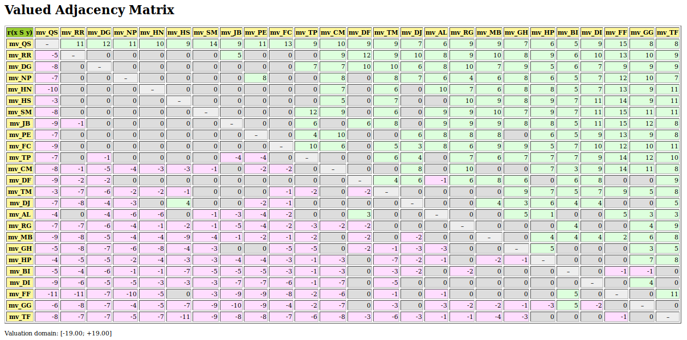
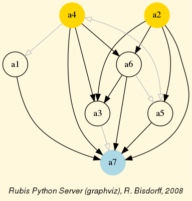

.. raw:: latex

   \begingroup
   \sphinxsetup{%
         verbatimwithframe=false,
         VerbatimColor={named}{OldLace},
         hintBorderColor={named}{LightCoral},
         attentionborder=3pt,
         attentionBorderColor={named}{Crimson},
         attentionBgColor={named}{FloralWhite},
         noteborder=2pt,
         noteBorderColor={named}{Olive},
         cautionborder=3pt,
         cautionBorderColor={named}{Cyan},
         cautionBgColor={named}{LightCyan}}

========================================
Pearls of bipolar-valued epistemic logic
========================================

.. only:: html

   :Author: Raymond Bisdorff, Emeritus Professor, University of Luxembourg
   :Version: Revision: Python 3.7
   :Copyright: R. Bisdorff 2013-2020

.. _Pearls-label:

.. only:: html
	    
   .. contents::
      :depth: 1
      :local:

 
.. highlight:: python
   :linenothreshold: 2

.. highlight:: pycon
   :linenothreshold: 2

.. only:: latex

   .. raw:: latex

      \textbf{\Large{Pearls of Bipolar-valued Epistemic Logic}}
      \vspace{5mm}

.. only:: html

   **Preface**
   
In this part of the **Digraph3** *documentation*, we provide an insight in computational enhancements one may get when working in a *bipolar-valued logical framework*, like easily coping with *missing data* and uncertain criterion *significance weights*, computing valued *ordinal correlations* between bipolar-valued outranking digraphs, solving bipolar-valued Berge kernel equation systems, and testing for stability of outranking statements when facing only ordinal criteria significance weights.

.. _CopingMissing-Data-label:

Coping with missing data and indeterminateness
----------------------------------------------

.. contents::
   :depth: 1
   :local:

In a stubborn keeping with a two-valued logic, where every argument can only be true or false, there is no place for efficiently taking into account missing data or logical indeterminateness. These cases are seen as problematic and, at best are simply ignored. Worst, in modern data science, missing data get often replaced with *fictive* values, potentially falsifying hence all subsequent computations.

In social choice problems like elections, *abstentions* are, however, frequently observed and represent a social expression that may be significant for revealing non represented social preferences.

In marketing studies, interviewees will not always respond to all the submitted questions. Again, such abstentions do sometimes contain nevertheless valid information concerning consumer preferences.

A motivating data set
.....................

Let us consider such a performance tableau gathering a *Movie Magazine* 's rating of some movies that could actually be seen in town [1]_ (see :numref:`graffiti07_1`).

.. code-block:: pycon

   >>> from outrankingDigraphs import *
   >>> t = XMCDA2PerformanceTableau('graffiti07')
   >>> t.showHTMLPerformanceTableau(ndigits=0)

.. Figure:: graffiti07_1.png
   :name: graffiti07_1
   :alt: Ratings of movies
   :width: 600 px
   :align: center

   *Graffiti* magazine's movie ratings from September 2007

15 journalists and movie critics provide here their rating of 25 movies: 5 stars (*masterpiece*), 4 stars (*must be seen*), 3 stars (*excellent*), 2 stars (*good*), 1 star (*could be seen*), -1 star (*I do not like*), -2 (*I hate*), NA (*not seen*).

To aggregate all the critics' rating opinions, the *Graffiti* magazine provides for each movie a global score computed as an *average grade*, just ignoring the *not seen* data. These averages are thus not computed on comparable denominators; some critics do indeed use a more or less extended range of grades. The movies not seen by critic *SJ*, for instance, are favored, as this critic is more severe than others in her grading. Dropping the movies that were not seen by all the critics is here not possible either, as no one of the 25 movies was actually seen by all the critics. Providing any value for the missing data will as well always somehow falsify any global value scoring. What to do ?

A better approach is to rank the movies on the basis of pairwise bipolar-valued  *at least as well rated as* opinions. Under this epistemic argumentation approach, missing data are naturally treated as opinion abstentions and hence do not falsify the logical computations. Such a ranking (see the :ref:`Ranking-Tutorial-label` tutorial) of the 25 movies is provided, for instance, by the **heat map** view shown in :numref:`graffiti07_2`.

>>> t.showHTMLPerformanceHeatmap(Correlations=True,
...                              rankingRule='NetFlows',
...                              ndigits=0)

.. Figure:: graffiti07_2.png
   :name: graffiti07_2
   :alt: Ordered Ratings of movies
   :width: 600 px
   :align: center

   *Graffiti* magazine's ordered movie ratings from September 2007

There is no doubt that movie *mv_QS*, with 6 '*must be seen*' marks, is correctly best-ranked and the movie *mv_TV* is worst-ranked with five '*don't like*' marks.

Modelling pairwise bipolar-valued rating opinions
.................................................

Let us explicitly construct the underlying bipolar-valued outranking digraph and consult in :numref:`graffiti07_45` the pairwise characteristic values we observe between the two best-ranked movies, namely *mv_QS* and *mv_RR*.

.. code-block:: pycon

   >>> g = BipolarOutrankingDigraph(t)
   >>> g.recodeValuation(-19,19) # integer characteristic values
   >>> g.showHTMLPairwiseOutrankings('mv_QS','mv_RR')

.. Figure:: graffiti07_45.png
   :name: graffiti07_45
   :alt: Comparing mv_QS and mv_RR
   :width: 600 px
   :align: center

   Pairwise comparison of the two best-ranked movies

Six out of the fifteen critics have not seen one or the other of these two movies. Notice the higher significance (3) that is granted to two locally renowned movie critics, namely *JH* and *VT*. Their opinion counts for three times the opinion of the other critics. All nine critics that have seen both movies, except critic *MR*, state that *mv_QS* is rated at least as well as *mv_RR* and the balance of positive against negative opinions amounts to +11, a characteristic value which positively validates the outranking situation with a majority of (11/19 + 1.0) / 2.0 = 79%.  

The complete table of pairwise majority margins of global '*at least
as well rated as*' opinions, ranked by the same rule as shown in the
heat map above (see :numref:`graffiti07_2`), may be shown in :numref:`graffiti07_3`. 

.. code-block:: pycon

   >>> ranking = g.computeNetFlowsRanking()
   >>> g.showHTMLRelationTable(actionsList=ranking, ndigits=0,\
   ... tableTitle='Bipolar characteristic values of\
   ... "rated at least as good as" situations')

.. Figure:: graffiti07_3.png
   :name: graffiti07_3
   :alt: Pairwise outranking characteristic values
   :width: 650 px
   :align: center

   Pairwise majority margins of '*at least as well rated as*' rating opinions

Positive characteristic values, validating a global '*at least as well rated as*' opinion are marked in light green (see :numref:`graffiti07_3`). Whereas negative characteristic values, invalidating such a global opinion, are marked in light red. We may by the way notice that the best-ranked movie *mv_QS* is indeed a *Condorcet* winner, i.e. *better rated than all the other movies* by a 65% majority of critics. This majority may be assessed from the average determinateness of the given bipolar-valued outranking digraph *g*.

>>> print( '%.0f%%' % g.computeDeterminateness(InPercents=True) )
65%

Notice also the *indeterminate* situation we observe, for instance, when comparing movie *mv_PE* with movie *mv_NP*.

>>> g.showHTMLPairwiseComparison('mv_PE','mv_NP')

.. Figure:: graffiti07_6.png
   :alt: Comparing mv_PE and mv_NP
   :width: 400 px
   :align: center

   Indeterminate pairwise comparison example

Only eight, out of the fifteen critics, have seen both movies and the positive opinions do neatly balance the negative ones. A global statement that *mv_PE* is '*at least as well rated as*' *mv_NP*  may in this case hence **neither be validated, nor invalidated**; a preferential situation that cannot be modelled with any scoring approach.

It is fair, however, to eventually mention here that the *Graffiti* magazine's average scoring method is actually showing a very similar ranking. Indeed, average scores usually confirm well all evident pairwise comparisons, yet *enforce* comparability for all less evident ones.

Notice finally the ordinal correlation *tau* values in
:numref:`graffiti07_2` 3rd row. How may we compute these ordinal correlation indexes ?

Back to :ref:`Content Table <Pearls-label>`

.. _OrdinalCorrelation-Tutorial-label:
	
Ordinal correlation equals bipolar-valued relational equivalence
----------------------------------------------------------------

.. contents:: 
	:depth: 1
	:local:
			  
Kendall's *tau* index
.....................

*M. G. Kendall* ([KEN-1938p]_) defined his *ordinal correlation index* **tau** for linear orders of dimension *n* as a *balancing* of the number *#C* of correctly oriented pairs against the number *#I* of incorrectly oriented pairs. The total number of irreflexive pairs being *n(n-1)*, in the case of linear orders, *#C* + *#I* = *n(n-1)*.  Hence *tau* = (*#C* / *n(n-1)*) - (*#I* / *n(n-1)*). In case *#I* is zero, *tau* = +1 (all pairs are *equivalently oriented*); inversely, in case *C#* is zero, *tau* = -1 (all pairs are *differently oriented*).

Noticing that (*#C* / *n(n-1)*) = 1 - (*#I* / *n(n-1)*), and recalling that the bipolar-valued negation is operated by changing the sign of the characteristic value, *Kendall*'s original *tau* definition implemented in fact the bipolar-valued **negation** of the **non equivalence** of two linear orders: 

    *tau* = 1 - 2(*#I* / *n(n-1)*) = -[2(*#I* / *n(n-1)*) - 1] = 2(*#C* / *n(n-1)*) - 1,

i.e. the **normalized majority margin** of *equivalently oriented* irreflexive pairs.

Let *R1* and *R2* be two random crisp relations defined on a same set of 5 alternatives. We may compute Kendall's *tau* index as follows.

.. code-block:: pycon
   :linenos:
   :caption: Crisp Relational Equivalence Digraph
   :name: relEqui1

   >>> from digraphs import *
   >>> R1 = RandomDigraph(order=5,Bipolar=True)
   >>> R2 = RandomDigraph(order=5,Bipolar=True)
   >>> E = EquivalenceDigraph(R1,R2)
   >>> E.showRelationTable(ReflexiveTerms=False)
    * ---- Relation Table -----
    r(<=>)|  'a1'	  'a2'	  'a3'	  'a4'	  'a5'	  
    ------|-------------------------------------------
     'a1' |    - 	 -1.00	  1.00	 -1.00	  1.00	 
     'a2' |  -1.00	   - 	 -1.00	  1.00	 -1.00	 
     'a3' |  -1.00	 -1.00	   - 	  1.00	  1.00	 
     'a4' |  -1.00	  1.00	 -1.00	   - 	  1.00	 
     'a5' |  -1.00	  1.00	 -1.00	  1.00	   - 	 
    Valuation domain: [-1.00;1.00]
   >>> E.correlation
    {'correlation': -0.1, 'determination': 1.0}

In the table of the equivalence relation *R1<=>R2* above (see :numref:`relEqui1` Lines 9-13), we observe that the normalized majority margin of equivalent versus non equivalent irreflexive pairs amounts to (9 - 11)/20 = -0.1, i.e. the value of Kendall's *tau* index in this plainly determined crisp case (see :numref:`relEqui1` Line 16).

What happens now with more or less determined and even partially indeterminate relations ? May we proceed in a similar way ?

Bipolar-valued relational equivalence
.....................................

Let us now consider two randomly bipolar-valued digraphs *R1* and *R2* of order five.

.. code-block:: pycon
   :linenos:
   :caption: Two Random Bipolar-valued Digraphs 
   :name: twoRand

   >>> R1 = RandomValuationDigraph(order=5,seed=1)
   >>> R1.showRelationTable(ReflexiveTerms=False)
    * ---- Relation Table -----
     r(R1)|   'a1'	  'a2'	  'a3'	  'a4'	  'a5'	  
    ------|-------------------------------------------
     'a1' |    - 	 -0.66	  0.44	  0.94	 -0.84	 
     'a2' |  -0.36	   - 	 -0.70	  0.26	  0.94	 
     'a3' |   0.14	  0.20	   - 	  0.66	 -0.04	 
     'a4' |  -0.48	 -0.76	  0.24	   - 	 -0.94	 
     'a5' |  -0.02	  0.10	  0.54	  0.94	   - 	 
    Valuation domain: [-1.00;1.00]
   >>> R2 = RandomValuationDigraph(order=5,seed=2)
   >>> R2.showRelationTable(ReflexiveTerms=False)
    * ---- Relation Table -----
     r(R2)|   'a1'	  'a2'	  'a3'	  'a4'	  'a5'	  
    ------|-------------------------------------------
     'a1' |    - 	 -0.86	 -0.78	 -0.80	 -0.08	 
     'a2' |  -0.58	   - 	  0.88	  0.70	 -0.22	 
     'a3' |  -0.36	  0.54	   - 	 -0.46	  0.54	 
     'a4' |  -0.92	  0.48	  0.74	   - 	 -0.60	 
     'a5' |   0.10	  0.62	  0.00	  0.84	   - 	 
    Valuation domain: [-1.00;1.00]

We may notice in the relation tables shown above that 9 pairs, like *(a1,a2)* or *(a3,a2)* for instance, appear equivalently oriented (see :numref:`twoRand` Lines 6 and 17). The :py:class:`digraphs.EquivalenceDigraph` class implements this *relational equivalence* relation between digraphs *R1* and *R2* (see :numref:`twoEqui2`).

.. code-block:: pycon
   :linenos:
   :caption: Bipolar-valued Equivalence Digraph
   :name: twoEqui2

   >>> eq = EquivalenceDigraph(R1,R2)
   >>> eq.showRelationTable(ReflexiveTerms=False)
    * ---- Relation Table -----
    r(<=>)|  'a1'	  'a2'	  'a3'	  'a4'	  'a5'	  
    ------|-------------------------------------------
     'a1' |   - 	 0.66	 -0.44	 -0.80	  0.08	 
     'a2' |  0.36	  - 	 -0.70	  0.26	 -0.22	 
     'a3' | -0.14	 0.20	   - 	 -0.46	 -0.04	 
     'a4' |  0.48	-0.48	  0.24	   - 	  0.60	 
     'a5' | -0.02	 0.10	  0.00	  0.84	   - 	 
    Valuation domain: [-1.00;1.00]

In our bipolar-valued epistemic logic, logical disjunctions and conjunctions are implemented as *max*, respectively *min* operators. Notice also that the logical equivalence *(R1<=>R2)* corresponds to a double implication *(R1 => R2) and (R2 => R1)* and that the implication *(R1 => R2)* is logically equivalent to the disjunction *(not R1 or R2)*.

If *r(x R1 y)* and *r(x R2 y)* denote the bipolar-valued characteristic values of relation *R1*, resp. *R2*, we may hence compute as follows a majority margin *M(R1<=>R2)* between equivalently and not equivalently oriented irreflexive pairs *(x,y)*.

| *M(R1<=>R2)* = sum _ *(x,y)* { \
|                   min [ max( *-r(x R1 y)*, *r(x R2 y)* ), \
|                         max( *-r(x R2 y)*, *r(x R1 y)* ) ] }.

*M(R1<=>R2)* is thus given by the sum of the non reflexive terms of the relation table of *eq*, the relation equivalence digraph computed above.

In the crisp case, *M(R1<=>R2)*  is now normalized with the maximum number of possible irreflexive pairs, namely *n(n-1)*. In a generalized *r*-valued case, the maximal possible equivalence majority margin *M* corresponds to the sum *D* of the **conjoint determinations** of *(x R1 y)* and *(x R2 y)* (see [BIS-2012p]_). 

    *D* = sum _ *(x,y)* min [ abs(*r(x R1 y)*, abs(*r(x R2 y)*) ].

Thus, we obtain in the general *r* -valued case:

    *tau(R1,R2)* =  *M(R1<=>R2)* / *D* .

*tau(R1,R2)* corresponds thus to a classical ordinal correlation index, but restricted to the **conjointly determined parts** of the given relations *R1* and *R2*. In the limit case of two crisp linear orders, *D* equals *n(n-1)*, i.e. the number of irreflexive pairs, and we recover hence *Kendall* 's original *tau* index definition.

It is worthwhile noticing that the ordinal correlation index *tau(R1,R2)* we obtain above corresponds to the ratio of

    * *r(R1<=>R2)* = *M(R1<=>R2)* / *n(n-1)*: The normalized majority margin of the pairwise relational equivalence statements, also called *valued ordinal correlation*, and 
    * *d* = *D* / *n(n-1)*: The normalized determination of the corresponding pairwise relational equivalence statements, in fact the determinateness of the relational equivalence digraph.

We have thus successfully **out-factored** the *determination* effect from the *correlation* effect. With completely determined relations, *tau(R1,R2)* = *r(R1<=>R2)*. By convention, we set the ordinal correlation with a *completely indeterminate* relation, i.e. when *D = 0*, to the *indeterminate* correlation value 0.0. With *uniformly* chosen random *r*-valued relations, the **expected** *tau* index is **0.0**, denoting in fact an **indeterminate** correlation. The corresponding expected normalized determination *d* is about 0.333 (see [BIS-2012p]_).

We may verify these relations with help of the corresponding equivalence digraph *eq* (see :numref:`ordInd1`).

.. code-block:: pycon
   :linenos:
   :caption: Computing the Ordinal Correlation Index from the Equivalence Digraph
   :name: ordInd1

   >>> eq = EquivalenceDigraph(R1,R2)
   >>> M = Decimal('0'); D = Decimal('0')
   >>> n2 = eq.order*(eq.order - 1)
   >>> for x in eq.actions:
   ...     for y in eq.actions:
   ...         M += eq.relation[x][y]
   ...         D += abs(eq.relation[x][y])
   >>> print('r(R1<=>R2) = %+.3f, d = %.3f, tau = %+.3f' % (M/n2,D/n2,M/D))
    r(R1<=>R2) = +0.026, d = 0.356, tau = +0.073  

In general we simply use the :py:func:`digraphs.Digraph.computeOrdinalCorrelation` method which renders a dictionary with a '*correlation*' (*tau*) and a '*determination*' (*d*) attribute. We may recover *r(<=>)* by multiplying *tau* with *d* (see :numref:`ordInd2` Line 4). 

.. code-block:: pycon
   :linenos:
   :caption: Directly Computing the Ordinal Correlation Index
   :name: ordInd2

   >>> corrR1R2 = R1.computeOrdinalCorrelation(R2)
   >>> tau = corrR1R2['correlation']
   >>> d = corrR1R2['determination']
   >>> r = tau * d
   >>> print('tau(R1,R2) = %+.3f, d = %.3f, r(R1<=>R2) = %+.3f' % (tau, d, r))
    tau(R1,R2) = +0.073, d = 0.356, r(R1<=>R2) = +0.026

We provide for convenience a direct :py:meth:`digraphs.showCorrelation` method:

   >>> corrR1R2 = R1.computeOrdinalCorrelation(R2)
   >>> R1.showCorrelation(corrR1R2)
    Correlation indexes:
     Extended Kendall tau       : +0.073
     Epistemic determination    :  0.356
     Bipolar-valued equivalence : +0.026

We may now illustrate the quality of the global ranking of the movies shown with the heat map in :numref:`graffiti07_2`. 

Fitness of ranking heuristics
.............................

We reconsider the bipolar-valued outranking digraph *g* modelling the pairwise global '*at least as well rated as*' relation among the 25 movies seen above (see :numref:`exMoviesBG`).

.. code-block:: pycon
   :linenos:
   :caption: Global Movies Outranking Digraph
   :name: exMoviesBG

   >>> g = BipolarOutrankingDigraph(t,Normalized=True)
    *------- Object instance description ------*
    Instance class   : BipolarOutrankingDigraph
    Instance name    : rel_grafittiPerfTab.xml
    # Actions        : 25
    # Criteria       : 15
    Size             : 390
    Determinateness  : 65%
    Valuation domain : {'min': Decimal('-1.0'),
			'med': Decimal('0.0'),
			'max': Decimal('1.0'),}
   >>> g.computeCoSize()
    188

Out of the 25 x 24 = 600 irreflexive movie pairs, digraph *g* contains 390 positively validated, 188 positively invalidated outranking situations, and 22 *indeterminate* outranking situations (see the zero-valued cells in :numref:`graffiti07_3`).

Let us now compute the normalized majority margin *r(<=>)*  of the equivalence between the marginal critic's pairwise ratings and the global *Net-Flows* ranking shown in the ordered heat map (see :numref:`graffiti07_2`).

.. code-block:: pycon
   :linenos:
   :caption: Marginal Criterion Correlations with global *NetFlows* Ranking
   :name: margCorr

   >>> from linearOrders import NetFlowsOrder
   >>> nf = NetFlowsOrder(g)
   >>> nf.netFlowsRanking
    ['mv_QS', 'mv_RR', 'mv_DG', 'mv_NP', 'mv_HN', 'mv_HS', 'mv_SM',
     'mv_JB', 'mv_PE', 'mv_FC', 'mv_TP', 'mv_CM', 'mv_DF', 'mv_TM',
     'mv_DJ', 'mv_AL', 'mv_RG', 'mv_MB', 'mv_GH', 'mv_HP', 'mv_BI',
     'mv_DI', 'mv_FF', 'mv_GG', 'mv_TF']
   >>> for i,item in enumerate(\
   ... g.computeMarginalVersusGlobalRankingCorrelations(\
   ... nf.netFlowsRanking,ValuedCorrelation=True)): 
   ...    print('r(%s<=>nf) = %+.3f' % (item[1],item[0]) )
    r(JH<=>nf) = +0.500
    r(JPT<=>nf)  = +0.430
    r(AP<=>nf) = +0.323
    r(DR<=>nf) = +0.263
    r(MR<=>nf) = +0.247
    r(VT<=>nf) = +0.227
    r(GS<=>nf) = +0.160
    r(CS<=>nf) = +0.140
    r(SJ<=>nf) = +0.137
    r(RR<=>nf) = +0.133
    r(TD<=>nf) = +0.110
    r(CF<=>nf) = +0.110
    r(SF<=>nf) = +0.103
    r(AS<=>nf) = +0.080
    r(FG<=>nf) = +0.027

In :numref:`margCorr` (see Lines 12-26), we recover above the relational equivalence characteristic values shown in the third row of the table in :numref:`graffiti07_2`. The global *Net-Flows* ranking represents obviously a rather balanced compromise with respect to all movie critics' opinions as there appears no valued negative correlation with anyone of them. The *Net-Flows* ranking apparently takes also correctly in account that the journalist *JH*, a locally renowned movie critic, shows a higher significance weight (see Line 12).

The ordinal correlation between the global *Net-Flows* ranking and the digraph *g* may be furthermore computed as follows: 

.. code-block:: pycon
   :linenos:
   :caption: Correlation between outrankings global *NetFlows* Ranking
   :name: globalCorr

   >>> corrgnf = g.computeOrdinalCorrelatin(nf)
   >>> g.showCorrelation(corrgnf)
    Correlation indexes:
     Extended Kendall tau       : +0.780
     Epistemic determination    :  0.300
     Bipolar-valued equivalence : +0.234

We notice in :numref:`globalCorr` Line 6 that the ordinal correlation *tau(g,nf)* index between the *Net-Flows* ranking *nf* and the determined part of the outranking digraph *g* is quite high (+0.78). Due to the rather high number of missing data, the *r* -valued relational equivalence between the *nf* and the *g* digraph, with a characteristics value of *only* +0.234, may be misleading. Yet, +0.234 still corresponds to an epistemic majority support of nearly 62% of the movie critics' rating opinions.

It would be interesting to compare similarly the correlations one may obtain with other global ranking heuristics, like the *Copeland* or the *Kohler* ranking rule.

Illustrating preference divergences
...................................

The valued relational equivalence index gives us a further measure for studying how **divergent** appear the rating opinions expressed by the movie critics.

.. Figure:: correlationTable.png
   :alt: Pairwise valued correlation of movie critics
   :name: correlationTable
   :width: 600 px
   :align: center

It is remarkable to notice in the criteria correlation matrix (see :numref:`correlationTable`) that, due to the quite numerous missing data, all pairwise valued ordinal correlation indexes *r(x<=>y)* appear to be of low value, except the *diagonal* ones. These reflexive indexes *r(x<=>x)* would trivially all amount to +1.0 in a plainly determined case. Here they indicate a reflexive normalized determination score *d*, i.e. the *proportion* of pairs of movies each critic did evaluate. Critic *JPT* (the editor of the Graffiti magazine), for instance, evaluated all but one (*d* = 24*23/600 = 0.92), whereas critic *FG* evaluated only 10 movies among the 25 in discussion (*d* = 10*9/600 = 0.15).

To get a picture of the actual *divergence of rating opinions* concerning **jointly seen** pairs of movies, we may develop a *Principal Component Analysis* ([2]_) of the corresponding *tau* correlation matrix. The 3D plot of the first 3 principal axes is shown in :numref:`correlationPCA`.

   >>> g.export3DplotOfCriteriaCorrelation(ValuedCorrelation=False)

.. Figure:: correlationPCA.png
   :alt: 3D plot of criteria correlation PCA
   :name: correlationPCA	 
   :width: 400 px
   :align: center

   3D PCA plot of the criteria ordinal correlation matrix
   
The first 3 principal axes support together about 70% of the total inertia. Most *eccentric* and *opposed* in their respective rating opinions appear, on the first principal axis with 27.2% inertia, the conservative daily press against labour and public press. On the second principal axis with 23.7.7% inertia, it is the people press versus the cultural critical press. And, on the third axis with still 19.3% inertia, the written media appear most opposed to the radio media.

Exploring the *better rated*  and the *as well as rated* opinions
.................................................................

In order to furthermore study the quality of a ranking result, it may be interesting to have a separate view on the asymmetric and symmetric parts of the '*at least as well rated as*' opinions (see the tutorial :ref:`Digraphs-Tutorial-label`).

Let us first have a look at the pairwise asymmetric part, namely the '*better rated than*' and '*less well rated than*' opinions of the movie critics. 

   >>> ag = AsymmetricPartialDigraph(g)
   >>> ag.showHTMLRelationTable(actionsList=g.computeNetFlowsRanking(),ndigits=0)

We notice here that the *Net-Flows* ranking rule inverts in fact just three '*less well ranked than*' opinions and four '*better ranked than*' ones. A similar look at the symmetric part, the pairwise '*as well rated as*' opinions, suggests a preordered preference structure in several *equivalently rated* classes.

   >>> sg = SymmetricPartialDigraph(g)
   >>> sg.showHTMLRelationTable(actionsList=g.computeNetFlowsRanking(),ndigits=0)

.. image:: symmetricPart.png
   :alt: symmetric part of graffiti07 digraph
   :width: 600 px
   :align: center

Such a preordering of the movies may, for instance, be computed with the :py:func:`digraphs.Digraph.computeRankingByChoosing` method, where we iteratively extract *dominant kernels* -best remaining choices- and *absorbent kernels* -worst remaining choices- (see the tutorial :ref:`Kernel-Tutorial-label`). We operate therefore on the asymmetric '*better rated than*', i.e. the *codual* ([3]_) of the '*at least as well rated as*' opinions (see :numref:`rankGraf` Line 2).

.. code-block:: pycon
   :linenos:
   :caption: Ranking by choosing the Grafitti movies
   :name: rankGraf

   >>> from transitiveDigraphs import RankingByChoosingDigraph
   >>> rbc = RankingByChoosingDigraph(g,CoDual=True)
   >>> rbc.showRankingByChoosing()
    Ranking by Choosing and Rejecting
     1st Best Choice ['mv_QS']
       2nd Best Choice ['mv_DG', 'mv_FC', 'mv_HN', 'mv_HS', 'mv_NP',
			'mv_PE', 'mv_RR', 'mv_SM']
	 3rd Best Choice ['mv_CM', 'mv_JB', 'mv_TM']
	   4th Best Choice ['mv_AL', 'mv_TP']
	   4th Worst Choice ['mv_AL', 'mv_TP']
	 3rd Worst Choice ['mv_GH', 'mv_MB', 'mv_RG']
       2nd Worst Choice ['mv_DF', 'mv_DJ', 'mv_FF', 'mv_GG']
     1st Worst Choice ['mv_BI', 'mv_DI', 'mv_HP', 'mv_TF']

In the tutorial :ref:`Kernel-Tutorial-label`, we thouroughly discuss the computation of *kernels* in bipolar-valued digraphs. Yet, we do not tackle there the problem of computing the corresponding bipolar-valued **kernel membership** characteristic vectors. This is the topic for the next pearl of bipolar-valued epistemic logic.

Back to :ref:`Content Table <Pearls-label>`

.. _Bipolar-Valued-Kernels-Tutorial-label:

Bipolar-valued kernel membership characteristic vectors
-------------------------------------------------------

.. contents:: 
	:depth: 1
	:local:

*Claude Berge*'s kernel equation systems
........................................

Let *G(X,R)* be a crisp irreflexive digraph defined on a finite set *X* of nodes and where *R* is the corresponding {-1,+1}-valued adjacency matrix. Let *Y* be the {-1,+1}-valued membership characteristic (row) vector of a choice in *X*. When *Y* satisfies the following equation system

     :math:`Y \circ R \; = \; -Y\;,`

where for all *x* in *X*,

     :math:`(Y \circ R)(x) \; = \; \max_{y \in X, x \neq y} \big ( \min(Y(x), R(x,y))\big)\;.`

then *Y* characterises an **initial** *kernel* ([BER-1958p]_).

When transposing now the membership characteristic vector *Y* into a column vector :math:`Y^t`, the following equation system 

     :math:`R \circ Y^t \; = \; -Y^t\;,`

makes :math:`Y^t` similarly characterise a **terminal** *kernel*.

Let us verify this result on a tiny random digraph.

.. code-block:: pycon
   :linenos:

   >>> from digraphs import *
   >>> g = RandomDigraph(order=3,seed=1)
    * ---- Relation Table -----
       R  | 'a1'	'a2'	'a3'	  
    ------|---------------------
     'a1' |  -1	 +1	 -1	 
     'a2' |  -1	 -1	 +1	 
     'a3' |  +1	 +1	 -1	 
    >>> g.showPreKernels()
    *--- Computing preKernels ---*
    Dominant preKernels :
    ['a3']
       independence :  1.0
       dominance    :  1.0
       absorbency   :  -1.0
       covering     :  1.000
    Absorbent preKernels :
    ['a2']
       independence :  1.0
       dominance    :  -1.0
       absorbency   :  1.0
       covered      :  1.000

It is easy to verify that the characteristic vector [-1, -1, +1] satisfies the initial kernel equation system; *a3* gives an *initial* kernel. Similarly, the characteristic vector [-1, +1, -1] verifies indeed the terminal kernel equation system and hence *a2* gives a *terminal* kernel.

We succeeded now in generalizing *Berge*'s kernel equation systems to genuine bipolar-valued digraphs ([BIS-2006_1p]_). The constructive proof, found by M. Pirlot, is based on the following fixpoint equation that may be used for computing bipolar-valued kernel membership vectors,

     :math:`T(Y) \; := \; -(Y \circ R) = Y,`

Solving bipolar-valued kernel equation systems
..............................................

*John von Neumann* showed indeed that, when a digraph *G(X,R)* is **acyclic** with a  **unique initial kernel** *K* characterised by its membership characteristics vector *Yk*, then the following double bipolar-valued fixpoint equation

     :math:`T^2(Y) \; := \; -\big( -(Y \circ R) \circ R) \; = \; Y\;.`

will admit a stable high and a stable low fixpoint solution that converge both to *Yk* ([SCH-1985p]_).

Inspired by this crisp double fixpoint equation, we observed that for a given bipolar-valued digraph *G(X,R)*, each of its dominant or absorbent prekernels *Ki* in *X* determines an induced **partial graph** *G(X,R/Ki)* which is *acyclyc* and admits *Ki* as unique kernel (see [BIS-2006_2p]_).

Following the *von Neumann* fixpoint algorithm, a similar bipolar-valued extended double fixpoint algorithm, applied to *G(X,R/Ki)*, allows to compute hence the associated bipolar-valued kernel characteristic vectors *Yi* in polynomial complexity.

**Algorithm** 

    | *in*  : bipolar-valued digraph *G(X,R)*,
    | *out* : set {*Y1*, *Y2*, .. } of bipolar-valued kernel membership characteristic vectors.
    
    1. enumerate all initial and terminal crisp prekernels *K*, *K2*, ... in the given bipolar-valued digraph (see the ':ref:`Kernel-Tutorial-label`' tutorial);
       
    #. for each crisp initial kernel *Ki*:
    
         a. construct a partially determined subgraph *G(X,R/Ki)* supporting exactly this unique initial kernel *Ki*;
         #. Use the double fixpoint equation *T2* with the partially determined adjacency matrix *R/Ki* for computing a stable low and a stable high fixpoint;
         #. Determine the bipolar-valued *Ki*-membership characteristic vector *Yi* with an epistemic disjunction of the previous low and high fixpoints;

    #. repeat step (2) for each terminal kernel *Kj* by using the double fixpoint equation *T2* with the transpose of the adjacency matrix *R/Kj*.

Time for a practical illustration.

.. code-block:: pycon
   :caption: Random Bipolar-valued Outranking Digraph
   :name: exRandBG

   >>> from outrankingDigraphs import *
   >>> g = RandomBipolarOutrankingDigraph(Normalized=True,seed=5)
   >>> print(g)
    *------- Object instance description ------*
    Instance class      : RandomBipolarOutrankingDigraph
    Instance name       : rel_randomperftab
    # Actions           : 7
    # Criteria          : 7
    Size                : 26
    Determinateness (%) : 67.14
    Valuation domain    : [-1.0;1.0]
    Attributes          : ['name', 'actions', 'criteria', 'evaluation',
			   'relation', 'valuationdomain', 'order',
			   'gamma', 'notGamma']

The random outranking digraph *g*, we consider here in :numref:`exRandBG` for illustration, models the pairwise outranking situations between seven decision alternatives evaluated on seven incommensurable performance criteria. We compute its corresponding bipolar-valued prekernels on the associated codual digraph *gcd*.

.. code-block:: pycon
   :linenos:
   :caption: Strict Prekernels
   :name: strictPrekernels

   >>> gcd = ~(-g) # strict outranking digraph
   >>> gcd
   >>> gcd.showPreKernels()
    *--- Computing prekernels ---*
    Dominant prekernels :
    ['a1', 'a4', 'a2']
       independence :  +0.000
       dominance    :  +0.070
       absorbency   :  -0.488
       covering     :  +0.667
    Absorbent prekernels :
    ['a7', 'a3']
       independence :  +0.000
       dominance    :  -0.744
       absorbency   :  +0.163
       covered      :  +0.800
    *----- statistics -----
    graph name:  converse-dual_rel_randomperftab
    number of solutions
     dominant kernels :  1
     absorbent kernels:  1
    cardinality frequency distributions
    cardinality     :  [0, 1, 2, 3, 4, 5, 6, 7]
    dominant kernel :  [0, 0, 0, 1, 0, 0, 0, 0]
    absorbent kernel:  [0, 0, 1, 0, 0, 0, 0, 0]
    Execution time  : 0.00022 sec.

The codual outranking digraph, modelling a *strict outranking* relation, admits an initial prekernel [*a1*, *a2*, *a4*] and a terminal one [*a3*, *a7*] (see :numref:`strictPrekernels` Line 7 and 13).

Let us compute the *initial* prekernel restricted adjacency table with the :py:func:`digraphs.Digraph.domkernelrestrict` method.
 
.. code-block:: pycon
   :linenos:

   >>> k1Relation = gcd.domkernelrestrict(['a1','a2','a4'])
   >>> gcd.showHTMLRelationTable(
   ...      actionsList=['a1','a2','a4','a3','a5','a6','a7'],
   ...      relation=k1Relation,
   ...      tableTitle='K1 restricted adjacency table')

.. Figure:: k1restricted.png
   :alt: Kernel restricted adjacency table 
   :width: 400 px
   :align: center

   Initial kernel [*a1*, *a2*, *a4*] restricted adjacency table

We first notice that this initial prekernel is indeed only *weakly independent*: The outranking situation between *a4* and *a1* appears *indeterminate*. The corresponding initial prekernel membership characteristic vector may be computed with the :py:func:`digraphs.Digraph.computeKernelVector` method.

.. code-block:: pycon
   :linenos:
   :caption: Fixpoint iterations for initial prekernel ['a1', 'a2', 'a4']
   :name:

   >>> gcd.computeKernelVector(['a1','a2','a4'],Initial=True,Comments=True)
    --> Initial prekernel: {'a1', 'a2', 'a4'}
    initial low vector : [-1.00, -1.00, -1.00, -1.00, -1.00, -1.00, -1.00]
    initial high vector: [+1.00, +1.00, +1.00, +1.00, +1.00, +1.00, +1.00]
    1st low vector     : [ 0.00, +0.21, -0.21,  0.00, -0.44, -0.07, -0.58]
    1st high vector    : [+1.00, +1.00, +1.00, +1.00, +1.00, +1.00, +1.00]
    2nd low vector     : [ 0.00, +0.21, -0.21,  0.00, -0.44, -0.07, -0.58]
    2nd high vector    : [ 0.00, +0.21, -0.21, +0.21, -0.21, -0.05, -0.21]
    3rd low vector     : [ 0.00, +0.21, -0.21, +0.21, -0.21, -0.07, -0.21]
    3rd high vector    : [ 0.00, +0.21, -0.21, +0.21, -0.21, -0.05, -0.21]
    4th low vector     : [ 0.00, +0.21, -0.21, +0.21, -0.21, -0.07, -0.21]
    4th high vector    : [ 0.00, +0.21, -0.21, +0.21, -0.21, -0.07, -0.21]
    # iterations       : 4
    low & high fusion  : [ 0.00, +0.21, -0.21, +0.21, -0.21, -0.07, -0.21]
    Choice vector for initial prekernel: {'a1', 'a2', 'a4'}
    a2: +0.21
    a4: +0.21
    a1:  0.00
    a6: -0.07
    a3: -0.21
    a5: -0.21
    a7: -0.21

We start the fixpoint computation with an empty set characterisation as first low vector and a complete set *X* characterising high vector. After each iteration, the low vector is set to the negation of the previous high vector and the high vector is set to the negation of the previous low vector.

A unique stable prekernel characteristic vector *Y1* is here attained at the fourth iteration with positive members *a2*: +0.21 and *a4*: +0.21 (60.5% criteria significance majority); *a1*: 0.00 being an ambiguous potential member. Alternatives *a3*, *a5*, *a6* and *a7* are all negative members, i.e. positive **non members** of this outranking prekernel.

Let us now compute the restricted adjacency table for the outranked, i.e. the *terminal* prekernel [*a3*, *a7*].
 
.. code-block:: pycon
   :linenos:

   >>> k2Relation = gcd.abskernelrestrict(['a3','a7'])
   >>> gcd.showHTMLRelationTable(
   ...      actionsList=['a3','a7','a1','a2','a4','a5','a6'],
   ...      relation=k2Relation,
   ...      tableTitle='K2 restricted adjacency table')

.. Figure:: k2restricted.png
   :alt: Kernel restricted adjacency table 
   :width: 400 px
   :align: center

   Terminal kernel ['a3','a7'] restricted adjacency table

Again, we notice that this terminal prekernel is indeed only weakly independent. The corresponding bipolar-valued characteristic vector *Y2* may be computed as follows.

.. code-block:: pycon
   :linenos:

   >>> gcd.computeKernelVector(['a3','a7'],Initial=False,Comments=True)
    --> Terminal prekernel: {'a3', 'a7'}
    initial low vector  : [-1.00, -1.00, -1.00, -1.00, -1.00, -1.00, -1.00]
    initial high vector : [+1.00, +1.00, +1.00, +1.00, +1.00, +1.00, +1.00]
    1st low vector      : [-0.16, -0.49,  0.00, -0.58, -0.16, -0.30, +0.49]
    1st high vector     : [+1.00, +1.00, +1.00, +1.00, +1.00, +1.00, +1.00]
    2nd low vector      : [-0.16, -0.49,  0.00, -0.58, -0.16, -0.30, +0.49]
    2nd high vector     : [-0.16, -0.49,  0.00, -0.49, -0.16, -0.26, +0.49]
    3rd low vector      : [-0.16, -0.49,  0.00, -0.49, -0.16, -0.26, +0.49]
    3rd high vector     : [-0.16, -0.49,  0.00, -0.49, -0.16, -0.26, +0.49]
    # iterations        : 3
    high & low fusion   : [-0.16, -0.49,  0.00, -0.49, -0.16, -0.26, +0.49]
    Choice vector for terminal prekernel: {'a3', 'a7'}
    a7: +0.49
    a3:  0.00
    a1: -0.16
    a5: -0.16
    a6: -0.26
    a2: -0.49
    a4: -0.49

A unique stable bipolar-valued high and low fixpoint is attained at the third iteration with *a7* positively confirmed (about 75% criteria significance majority) as member of this terminal prekernel, whereas the membership of *a3* in this prekernel appears indeterminate. All the remaining nodes have *negative* membership characteristic values and are hence positively excluded from this prekernel.

When we reconsider the graphviz drawing of this outranking digraph (see :numref:`bestWorstOrientation` in the tutorial ':ref:`Kernel-Tutorial-label`'),

   The strict outranking digraph oriented by the positive members of its initial and terminal prekernels

it becomes obvious why alternative *a1* is **neither included nor excluded** from the initial prekernel. Same observation is applicable to alternative *a3* which can **neither be included nor excluded** from the terminal prekernel. It may even happen, in case of more indeterminate outranking situations, that no alternative  is positively included or excluded from a weakly independent prekernel; the corresponding bipolar-valued membership characteristic vector being completely indeterminate (see for instance the tutorial ':ref:`Rubis-Tutorial-label`').

To illustrate finally why sometimes we need to operate an *epistemic disjunctive fusion* of **unequal** stable low and high membership characteristics vectors (see Step 2.c.), let us consider, for instance, the following crisp 7-*cycle* graph.

.. code-block:: pycon

   >>> g = CirculantDigraph(order=7,circulants=[-1,1])			     
   >>> g			     
    *------- Digraph instance description ------*
    Instance class      : CirculantDigraph
    Instance name       : c7
    Digraph Order       : 7
    Digraph Size        : 14
    Valuation domain    : [-1.00;1.00]
    Determinateness (%) : 100.00
    Attributes          : ['name', 'order', 'circulants', 'actions',
			   'valuationdomain', 'relation',
			   'gamma', 'notGamma']
		       
Digraph *c7* is a symmetric crisp digraph showing, among others, the maximal independent set {'2','5','7'}, i.e. an initial as well as terminal kernel. We may  compute the corresponding initial kernel characteristic vector.

.. code-block:: pycon
   :linenos:

   >>> g.computeKernelVector(['2','5','7'],Initial=True,Comments=True)
    --> Initial kernel: {'2', '5', '7'}
    initial low vector  : [-1.0, -1.0, -1.0, -1.0, -1.0, -1.0, -1.0]
    initial high vector : [+1.0, +1.0, +1.0, +1.0, +1.0, +1.0, +1.0]
    1 st low vector     : [-1.0,  0.0, -1.0, -1.0,  0.0, -1.0,  0.0]
    1 st high vector    : [+1.0, +1.0, +1.0, +1.0, +1.0, +1.0, +1.0]
    2 nd low vector     : [-1.0,  0.0, -1.0, -1.0,  0.0, -1.0,  0.0]
    2 nd high vector    : [ 0.0, +1.0,  0.0,  0.0, +1.0,  0.0, +1.0]
    stable low vector   : [-1.0,  0.0, -1.0, -1.0,  0.0, -1.0,  0.0]
    stable high vector  : [ 0.0, +1.0,  0.0,  0.0, +1.0,  0.0, +1.0]
    #iterations         : 3
    low & high fusion   : [-1.0, +1.0, -1.0, -1.0, +1.0, -1.0, +1.0]
    Choice vector for initial prekernel: {'2', '5', '7'}
    7: +1.00
    5: +1.00
    2: +1.00
    6: -1.00
    4: -1.00
    3: -1.00
    1: -1.00

Notice that the stable low vector characterises the **negative membership** part, whereas, the stable high vector characterises the **positive membership** part (see Lines 9-10 above). The bipolar **disjunctive fusion** assembles eventually both stable parts into the correct prekernel characteristic vector (Line 12). 

The adjacency matrix of a symmetric digraph staying *unchanged* by the transposition operator, the previous computations, when qualifying the same kernel as a *terminal* instance, will hence produce exactly the same result.

It is worthwhile noticing again the essential computational role, the logical **indeterminate value 0.0** is playing in this double fixpoint algorithm. To implement such kind of algorithms without a logical **neutral term** would be like implementing numerical algorithms without a possible usage of the number 0. Infinitely many trivial *impossibility theorems* and *dubious logical results* come up. 

Back to :ref:`Content Table <Pearls-label>`

.. _Bipolar-Valued-Likelihood-Tutorial-label:

On confident outrankings with uncertain criteria significances
--------------------------------------------------------------

.. contents:: 
	:depth: 1
	:local:

When modelling preferences following the outranking approach, the signs of the majority margins do sharply distribute validation and invalidation of pairwise outranking situations. How can we be confident in the resulting outranking digraph, when we acknowledge the usual imprecise knowledge of criteria significance weights coupled with small majority margins?

To answer this question, one usually requires *qualified* majority margins for confirming outranking situations. But how to choose such a qualifying majority level: two third, three fourth of the significances ?

In this tutorial we propose to link the qualifying significance majority with a required alpha%-confidence level. We model therefore the significance weights as random variables following more or less widespread distributions around an average significance value that corresponds to the given deterministic weight. As the bipolar-valued random credibility of an outranking statement hence results from the simple sum of positive or negative independent random variables, we may apply the Central Limit Theorem (CLT) for computing the *bipolar likelihood* that the expected majority margin will indeed be positive, respectively negative.

Modelling uncertain criteria significances
..........................................

Let us consider the significance weights of a family *F* of *m* criteria to be **independent random variables** *Wj*, distributing the potential significance weights of each criterion *j* = 1, ..., *m* around a mean value *E(Wj)* with variance *V(Wj)*.

Choosing a specific stochastic model of uncertainty is usually application specific. In the limited scope of this tutorial, we will illustrate the consequence of this design decision on the resulting outranking modelling with four slightly different models for taking into account the uncertainty with which we know the numerical significance weights: *uniform*, *triangular*, and two models of *Beta laws*, one more *widespread* and, the other, more *concentrated*.

When considering, for instance, that the potential range of a significance weight is distributed between 0 and two times its mean value, we obtain the following random variates:

      #. A continuous **uniform** distribution on the range 0 to *2E(Wj)*. Thus *Wj* ~ U(0, *2E(Wj)*) and *V(Wj)* = 1/3(*E(Wj)*)^2;

      #. A **symmetric beta** distribution with, for instance,
	 parameters  *alpha* = 2 and *beta* = 2. Thus, *Wi* ~
	 Beta(2,2) * *2E(Wj)* and *V(Wj)* = 1/5(*E(Wj)*)^2.

      #. A **symmetric triangular** distribution on the same range with
	 mode *E(Wj)*. Thus *Wj* ~ Tr(0, *2E(Wj)*, *E(Wj)*) with
	 *V(Wj)* = 1/6(*E(Wj)*)^2;
	 
      #. A **narrower beta** distribution with for instance
	 parameters *alpha* = 4 and *beta* = 4. Thus *Wj* ~ Beta(4,4) *
	 *2E(Wj)* , *V(Wj)* = 1/9(*E(Wj)*)^2.

	 
.. Figure:: weightDistributions.png
   :name: weightDistributions
   :alt: Four models of uncertain significance weights
   :width: 450 px
   :align: center

   Four models of uncertain significance weights

It is worthwhile noticing that these four uncertainty models all admit the same expected value, *E(Wj)*, however, with a respective variance which goes decreasing from 1/3, to 1/9 of the square of *E(W)* (see :numref:`weightDistributions`).

Bipolar-valued likelihood of ''at least as good as " situations
...............................................................

Let *A* = {*x*, *y*, *z*,...} be a finite set of *n* potential decision actions, evaluated on *F* = {1,..., *m*}, a *finite* and *coherent* family of *m* performance criteria. On each criterion *j* in *F*, the decision actions are evaluated on a real performance scale [0; *Mj* ], supporting an upper-closed indifference threshold *indj* and a lower-closed preference threshold *prj* such that 0 <= *indj* < *prj* <= *Mj*. The marginal performance of object *x* on criterion *j* is denoted *xj*. Each criterion *j* is thus characterising a marginal double threshold order :math:`\geq_j` on *A* (see :numref:`rCharacteristic`):

:math:`r(x \geq_j y) \; = \; \begin{cases} +1 \quad \text{if} \quad x_j - y_j \leq ind_j,\\  -1 \quad \text{if} \quad x_j - y_j \leq pr_j,\\ 0 \quad \text{otherwise}. \end{cases}`

Semantics of the marginal bipolar-valued characteristic function:
      * +1 signifies *x* is performing at least as good as *y* on
	criterion *j*,
      * -1 signifies that *x* is not performing at least as good as *y* on
	criterion *j*,	
      * 0 signifies that it is
	unclear whether, on criterion *j*, *x* is performing at least as good as *y*.

.. Figure:: rCharacteristic.png
   :name: rCharacteristic
   :alt: Bipolar-valued outranking characteristic function
   :width: 450 px
   :align: center

   Bipolar-valued outranking characteristic function

Each criterion *j* in *F* contributes the random significance *Wj* of his '*at least as good as*' characteristic :math:`r(x \geq_j y)` to the global characteristic :math:`\tilde{r}(x \geq y)` in the following way:

:math:`\tilde{r}(x \geq y) \; = \; \sum_{j \in F} W_j \times r(x \geq_j y) )`

Thus, :math:`\tilde{r}(x \geq y)` becomes a simple sum of positive or negative independent random variables with known means and variances where :math:`\tilde{r}(x \geq y) \, > \, 0` signifies *x* is globally performing at least as good as *y*, :math:`\tilde{r}(x \geq y) \, < \, 0` signifies that *x* is not globally performing at least as good as *y*, and :math:`\tilde{r}(x \geq y)\,=\,0` signifies that it is unclear whether *x* is globally performing at least as good as *y*.

From the *Central Limit Theorem* (CLT), we know that such a sum of random variables leads, with *m* getting large, to a Gaussian distribution *Y* with

:math:`E(Y ) = \sum_{j \in F} E(W_j) \times r(x \geq_j y)` and

:math:`V(Y) = \sum_{j \in F} V(W_j)\times |r(x \geq_j y)|`.

And the **likelihood of validation**, respectively **invalidation** of an '*at least as good as*' situation, denoted :math:`lh(x \geq y)`,  may hence be assessed by the probability *P(Y>0)* = 1.0 - *P(Y<=0)* that *Y* takes a positive, resp. *P(Y<0)* takes a negative value. In the bipolar-valued case here, we can judiciously make usage of the standard Gaussian **error function** , i.e. the bipolar *2P(Z)* - 1.0 version of the standard Gaussian *P(Z)* probability distribution function:

:math:`lh(x \geq y) \;=\; -\text{erf}\big(\frac{1}{\sqrt{2}}\frac{-E(Y)}{\sqrt{V(Y)}} \big)`

The range of the bipolar-valued :math:`lh(x \geq y)` hence becomes [-1.0;+1.0], and :math:`-lh(x \geq y) \,=\, lh(x \not\geq y)` , i.e. a **negative likelihood** represents the likelihood of the correspondent **negated** '*at least as good as*' situation. A likelihood of +1.0 (resp. -1.0) means the corresponding preferential situation appears **certainly validated** (resp. **invalidated**).

**Example**

Let *x* and *y* be evaluated wrt 7 equisignificant criteria; Four criteria positively support that *x* is *as least as good performing* than *y* and three criteria support that *x* is *not at least as good* performing than *y*. Suppose *E(Wj)* = *w* for *j* = 1,...,7 and *Wj* ~ Tr(0, *2w*, *w*) for *j* = 1,...7. The expected value of the global '*at least as good as*' characteristic value becomes: :math:`E\big(\tilde{r}(x \geq y)\big)\, = \, 4w - 3w = w` with a variance :math:`V\big(\tilde{r}(x \geq y)\big)\,=\, 7\frac{1}{6}w^2`. 

If *w* = 1, :math:`E\big(\tilde{r}(x \geq y)\big)\, = \, 1` and :math:`sd\big(\tilde{r}(x \geq y)\big)\,=\, 1.08`. By the CLT, the bipolar likelihood of the *at least as good* performing situation becomes: :math:`lh(x \geq y)\,=\, 0.66`, which corresponds to a global support of (0.66 + 1.0)/2 = 83% of the criteria significance weights.

A *Monte Carlo* simulation with 10 000 runs empirically confirms the effective convergence to a Gaussian (see :numref:`simulLikelihood` realised with *gretl* [4]_ ).

.. Figure:: simulLikelihood.png
   :name: simulLikelihood
   :alt: Distribution of random outranking characteristic value
   :width: 550 px
   :align: center

   Distribution of 10 000 random outranking characteristic values

Indeed, :math:`\tilde{r}(x \geq y) \leadsto Y = \mathcal{N}(1.03,1.089)`, with an empirical probability of observing a negative majority margin of about 17%.

     
Confidence level of outranking situations
.........................................

Now, following the classical outranking approach (see [BIS-2013p]_ ), we may say, from an epistemic perspective, that decision action *x* **outranks** decision action *y* at *confidence* level *alpha* %, if

   #. an expected majority of criteria validates, at confidence level *alpha* % or higher, a global '*at least as good as*' situation between *x* and *y*, and
      
   #. no considerably less performing is observed on a discordant criterion.

Dually, decision action *x* **does not outrank** decision action *y* at
confidence level *alpha* %, if

   #. an expected majority of criteria at confidence level *alpha* % or higher, invalidates a global '*at least as good as*' situation between *x* and *y*, and
      
   #. no considerably better performing situation is observed on a concordant criterion.

**Time for a coded example**

Let us consider the following random performance tableau.

.. code-block:: pycon
   :linenos:

   >>> from outrankingDigraphs import *
   >>> t = RandomPerformanceTableau(numberOfActions=7,numberOfCriteria=7,seed=100)
   >>> t.showPerformanceTableau(Transposed=True)
    *----  performance tableau -----*
    criteria | weights |   'a1'   'a2'   'a3'   'a4'   'a5'   'a6'   'a7'   
    ---------|------------------------------------------------------------
       'g1'  |     1   |  15.17  44.51  57.87  58.00  24.22  29.10  96.58  
       'g2'  |     1   |  82.29  43.90    NA   35.84  29.12  34.79  62.22  
       'g3'  |     1   |  44.23  19.10  27.73  41.46  22.41  21.52  56.90  
       'g4'  |     1   |  46.37  16.22  21.53  51.16  77.01  39.35  32.06  
       'g5'  |     1   |  47.67  14.81  79.70  67.48    NA   90.72  80.16  
       'g6'  |     1   |  69.62  45.49  22.03  33.83  31.83    NA   48.80  
       'g7'  |     1   |  82.88  41.66  12.82  21.92  75.74  15.45   6.05  

For the corresponding confident outranking digraph, we require a confidence level of *alpha* = 90%. The :py:class:`outrankingDigraphs.ConfidentBipolarOutrankingDigraph` class provides such a construction.

.. code-block:: pycon

   >>> g90 = ConfidentBipolarOutrankingDigraph(t,confidence=90)
   >>> print(g90)
    *------- Object instance description ------*
    Instance class      : ConfidentBipolarOutrankingDigraph
    Instance name       : rel_randomperftab_CLT
    # Actions           : 7
    # Criteria          : 7
    Size                : 15
    Determinateness (%) : 62.07
    Valuation domain    : [-1.00;1.00]
    Attributes          : ['name', 'bipolarConfidenceLevel',
			   'distribution', 'betaParameter', 'actions',
			   'order', 'valuationdomain', 'criteria',
			   'evaluation', 'concordanceRelation',
			   'vetos', 'negativeVetos',
			   'largePerformanceDifferencesCount',
			   'likelihoods', 'confidenceCutLevel',
			   'relation', 'gamma', 'notGamma']

.. code-block:: pycon
   :linenos:
			   
   >>> g90.showRelationTable(LikelihoodDenotation=True)
    * ---- Outranking Relation Table -----
    r/(lh) |  'a1'	 'a2'	 'a3'	 'a4'	 'a5'	 'a6'	 'a7'	 
    -------|------------------------------------------------------------
      'a1' | +0.00   +0.71   +0.29   +0.29   +0.29   +0.29   +0.00  
	   | ( - )  (+1.00) (+0.95) (+0.95) (+0.95) (+0.95) (+0.65) 
      'a2' | -0.71   +0.00   -0.29   +0.00   +0.00   +0.29   -0.57  
	   |(-1.00)  ( - )  (-0.95) (-0.65) (+0.73) (+0.95) (-1.00) 
      'a3' | -0.29   +0.29   +0.00   -0.29   +0.00   +0.00   -0.29  
	   |(-0.95) (+0.95)  ( - )  (-0.95) (-0.73) (-0.00) (-0.95) 
      'a4' | +0.00   +0.00   +0.57   +0.00   +0.29   +0.57   -0.43  
	   |(-0.00) (+0.65) (+1.00)  ( - )  (+0.95) (+1.00) (-0.99) 
      'a5' | -0.29   +0.00   +0.00   +0.00   +0.00   +0.29   -0.29  
	   |(-0.95) (-0.00) (+0.73) (-0.00)  ( - )  (+0.99) (-0.95) 
      'a6' | -0.29   +0.00   +0.00   -0.29   +0.00   +0.00   +0.00  
	   |(-0.95) (-0.00) (+0.73) (-0.95) (+0.73)  ( - )  (-0.00) 
      'a7' | +0.00   +0.71   +0.57   +0.43   +0.29   +0.00   +0.00  
	   |(-0.65) (+1.00) (+1.00) (+0.99) (+0.95) (-0.00)  ( - )  
    Valuation domain   : [-1.000; +1.000] 
    Uncertainty model  : triangular(a=2.0,b=2.0) 
    Likelihood domain  : [-1.0;+1.0] 
    Confidence level   : 0.80 (90.0%) 
    Confident majority : 0.14 (57.1%) 
    Determinateness    : 0.24 (62.1%)

The resulting 90% confident expected outranking relation is shown above. The (*lh*) figures, indicated in the table above, correspond to bipolar likelihoods and the required bipolar confidence level equals (0.90+1.0)/2 = 0.80 (see Line 22 above). Action '*a1*' thus confidently outranks all other actions, except '*a7*' where the actual likelihood (+0.65) is lower than the required one (0.80) and we furthermore observe a considerable counter-performance on criterion '*g1*'.

Notice also the lack of confidence in the outranking situations we observe between action '*a2*' and actions '*a4*' and '*a5*'. In the deterministic case we would have :math:`r(a2 \geq a4) \,=\, -0.143` and :math:`r(a2 \geq a5) \,=\, +0.143` . All outranking situations with a characteristic value lower or equal to abs(0.143), i.e. a majority support of 1.143/2 = 57.1% and less, appear indeed to be *not confident* at level 90% (see Line 23 above).

We may draw the corresponding strict 90%-confident outranking digraph, oriented by its initial and terminal prekernels (see :numref:`confidentOutranking`).

.. code-block:: pycon
   :linenos:

   >>> gcd90 = ~ (-g90)
   >>> gcd90.showPreKernels()
    *--- Computing preKernels ---*
    Dominant preKernels :
    ['a1', 'a7']
       independence :  0.0
       dominance    :  0.2857
       absorbency   :  -0.7143
       covering     :  0.800
    Absorbent preKernels :
    ['a2', 'a5', 'a6']
       independence :  0.0
       dominance    :  -0.2857
       absorbency   :  0.2857
       covered      :  0.583
   >>> gcd90.exportGraphViz(fileName='confidentOutranking',
   ...       bestChoice=['a1', 'a7'],worstChoice=['a2', 'a5', 'a6'])
    *---- exporting a dot file dor GraphViz tools ---------*
    Exporting to confidentOutranking.dot
    dot -Grankdir=BT -Tpng confidentOutranking.dot -o confidentOutranking.png

.. Figure:: confidentOutranking.png
   :name: confidentOutranking
   :alt: 90%-confident strict outranking digraph
   :width: 350 px
   :align: center

   Strict 90%-confident outranking digraph oriented by its prekernels

Now, what becomes this 90%-confident outranking digraph when we require a stronger confidence level of, say 99% ?

.. code-block:: pycon
   :linenos:

   >>> g99 = ConfidentBipolarOutrankingDigraph(t,confidence=99)
   >>> g99.showRelationTable()
    * ---- Outranking Relation Table -----
    r/(lh) |  'a1'	 'a2'	 'a3'	 'a4'	 'a5'	 'a6'	 'a7'	 
    -------|------------------------------------------------------------
     'a1' |  +0.00   +0.71   +0.00   +0.00   +0.00   +0.00   +0.00  
	  |  ( - )  (+1.00) (+0.95) (+0.95) (+0.95) (+0.95) (+0.65) 
     'a2' |  -0.71   +0.00   +0.00   +0.00   +0.00   +0.00   -0.57  
	  | (-1.00)  ( - )  (-0.95) (-0.65) (+0.73) (+0.95) (-1.00) 
     'a3' |  +0.00   +0.00   +0.00   +0.00   +0.00   +0.00   +0.00  
	  | (-0.95) (+0.95)  ( - )  (-0.95) (-0.73) (-0.00) (-0.95) 
     'a4' |  +0.00   +0.00   +0.57   +0.00   +0.00   +0.57   -0.43  
	  | (-0.00) (+0.65) (+1.00)  ( - )  (+0.95) (+1.00) (-0.99) 
     'a5' |  +0.00   +0.00   +0.00   +0.00   +0.00   +0.29   +0.00  
	  | (-0.95) (-0.00) (+0.73) (-0.00)  ( - )  (+0.99) (-0.95) 
     'a6' |  +0.00   +0.00   +0.00   +0.00   +0.00   +0.00   +0.00  
	  | (-0.95) (-0.00) (+0.73) (-0.95) (+0.73)  ( - )  (-0.00) 
     'a7' |  +0.00   +0.71   +0.57   +0.43   +0.00   +0.00   +0.00  
	  | (-0.65) (+1.00) (+1.00) (+0.99) (+0.95) (-0.00)  ( - )  
    Valuation domain   : [-1.000; +1.000] 
    Uncertainty model  : triangular(a=2.0,b=2.0) 
    Likelihood domain  : [-1.0;+1.0] 
    Confidence level   : 0.98 (99.0%) 
    Confident majority : 0.29 (64.3%) 
    Determinateness    : 0.13 (56.6%)

At 99% confidence, the minimal required significance majority support amounts to 64.3% (see Line 24 above). As a result, most outranking situations don't get anymore validated, like the outranking situations between action '*a1*' and actions '*a3*', '*a4*', '*a5*' and '*a6*' (see Line 5 above). The overall epistemic determination of the digraph consequently drops from 62.1% to 56.6% (see Line 25).

Finally, what becomes the previous 90%-confident outranking digraph if the uncertainty concerning the criteria significance weights is modelled with a larger variance, like *uniform* variates.

.. code-block:: pycon
   :linenos:

   >>> gu90 = ConfidentBipolarOutrankingDigraph(t,confidence=90,distribution='uniform')
   >>> gu90.showRelationTable()
    * ---- Outranking Relation Table -----
    r/(lh) |  'a1'	 'a2'	 'a3'	 'a4'	 'a5'	 'a6'	 'a7'	 
    -------|------------------------------------------------------------
     'a1' |  +0.00   +0.71   +0.29   +0.29   +0.29   +0.29   +0.00  
	  |  ( - )  (+1.00) (+0.84) (+0.84) (+0.84) (+0.84) (+0.49) 
     'a2' |  -0.71   +0.00   -0.29   +0.00   +0.00   +0.29   -0.57  
	  | (-1.00)  ( - )  (-0.84) (-0.49) (+0.56) (+0.84) (-1.00) 
     'a3' |  -0.29   +0.29   +0.00   -0.29   +0.00   +0.00   -0.29  
	  | (-0.84) (+0.84)  ( - )  (-0.84) (-0.56) (-0.00) (-0.84) 
     'a4' |  +0.00   +0.00   +0.57   +0.00   +0.29   +0.57   -0.43  
	  | (-0.00) (+0.49) (+1.00)  ( - )  (+0.84) (+1.00) (-0.95) 
     'a5' |  -0.29   +0.00   +0.00   +0.00   +0.00   +0.29   -0.29  
	  | (-0.84) (-0.00) (+0.56) (-0.00)  ( - )  (+0.92) (-0.84) 
     'a6' |  -0.29   +0.00   +0.00   -0.29   +0.00   +0.00   +0.00  
	  | (-0.84) (-0.00) (+0.56) (-0.84) (+0.56)  ( - )  (-0.00) 
     'a7' |  +0.00   +0.71   +0.57   +0.43   +0.29   +0.00   +0.00  
	  | (-0.49) (+1.00) (+1.00) (+0.95) (+0.84) (-0.00)  ( - )  
    Valuation domain   : [-1.000; +1.000] 
    Uncertainty model  : uniform(a=2.0,b=2.0) 
    Likelihood domain  : [-1.0;+1.0] 
    Confidence level   : 0.80 (90.0%) 
    Confident majority : 0.14 (57.1%) 
    Determinateness    : 0.24 (62.1%)

Despite lower likelihood values (see the *g90* relation table above), we keep the same confident majority level of 57.1% (see Line 24 above)and, hence, also the same 90%-confident outranking digraph.

For concluding, it is worthwhile noticing again that it is the *neutral* value of our bipolar-valued epistemic logic that allows us to easily handle alpha% confidence or not of outranking situations when confronted with uncertain criteria significances. Remarkable furthermore is the usage, the standard Gaussian error function provides by delivering *signed likelihood values* immediately concerning either a *positive* relational statement, or when negative, its negated version. 

Back to :ref:`Content Table <Pearls-label>`

.. _Stable-Outranking-Tutorial-label:

Robustness analysis of bipolar-valued outranking digraphs
---------------------------------------------------------

.. contents:: 
	:depth: 1
	:local:

Cardinal or ordinal criteria significances
..........................................

The required cardinal significance weights of the performance criteria represent the *Achilles*' heel of the outranking approach. Rarely will indeed a decision maker be cognitively competent for suggesting precise decimal-valued criteria significance weights. More often, the decision problem will involve more or less equally important decision objectives with more or less equi-significant criteria. A random example of such a decision problem may be generated with the :py:class:`randomPerfTabs.Random3ObjectivesPerformanceTableau` class.

.. code-block:: pycon
   :linenos:
   :caption: Random 3 Objectives Performance Tableau
   :name: 3ObjExample

   >>> from randomPerfTabs import Random3ObjectivesPerformanceTableau
   >>> t = Random3ObjectivesPerformanceTableau(numberOfActions=7,\
   ...                                 numberOfCriteria=9,seed=102)
   >>> t
    *------- PerformanceTableau instance description ------*
    Instance class   : Random3ObjectivesPerformanceTableau
    Seed             : 102
    Instance name    : random3ObjectivesPerfTab
    # Actions        : 7
    # Objectives     : 3
    # Criteria       : 9
    Attributes       : ['name', 'valueDigits', 'BigData', 'OrdinalScales',
			'missingDataProbability', 'negativeWeightProbability',
			'randomSeed', 'sumWeights', 'valuationPrecision',
			'commonScale', 'objectiveSupportingTypes', 'actions',
			'objectives', 'criteriaWeightMode', 'criteria',
			'evaluation', 'weightPreorder']
   >>> t.showObjectives()
    *------ show objectives -------"
    Eco: Economical aspect
       ec1 criterion of objective Eco 8
       ec4 criterion of objective Eco 8
       ec8 criterion of objective Eco 8
      Total weight: 24.00 (3 criteria)
    Soc: Societal aspect
       so2 criterion of objective Soc 12
       so7 criterion of objective Soc 12
      Total weight: 24.00 (2 criteria)
    Env: Environmental aspect
       en3 criterion of objective Env 6
       en5 criterion of objective Env 6
       en6 criterion of objective Env 6
       en9 criterion of objective Env 6
      Total weight: 24.00 (4 criteria)

In this example (see :numref:`3ObjExample`), we face seven decision alternatives that are assessed with respect to three *equally important* decision objectives concerning: first, an *economical* aspect with a coalition of three performance criteria of significance weight 8, secondly, a *societal* aspect with a coalition of two performance criteria of significance weight 12, and thirdly, an *environmental* aspect with a coalition four performance criteria of significance weight 6.

The question we tackle is the following: How *dependent* on the actual values of the significance weights appears the corresponding bipolar-valued outranking digraph ? In the previous section, we assumed that the criteria significance weights were random variables. Here, we shall assume that we know for sure only the preordering of the significance weights. In our example we see indeed three increasing weight equivalence classes (:numref:`weightsPreorder`).

.. code-block:: pycon
   :linenos:
   :caption: Significance weights preorder
   :name: weightsPreorder
      
   >>> t.showWeightPreorder()
    ['en3', 'en5', 'en6', 'en9'] (6) <
    ['ec1', 'ec4', 'ec8'] (8) <
    ['so2', 'so7'] (12)

How stable appear now the outranking situations when assuming only ordinal significance weights?

Qualifying the stability of outranking situations
.................................................

Let us construct the normalized bipolar-valued outranking digraph corresponding with the previous 3 Objectives performance tableau *t*.

.. code-block:: pycon
   :linenos:
   :caption: Example Bipolar Outranking Digraph
   :name: exBG

   >>> from outrankingDigraphs import BipolarOutrankingDigraph
   >>> g = BipolarOutrankingDigraph(t,Normalized=True)
   >>> g.showRelationTable()
    * ---- Relation Table -----
    r(>=) |  'a1'   'a2'   'a3'   'a4'   'a5'   'a6'   'a7'   
    ------|------------------------------------------------
     'a1' | +1.00  -0.42  +0.00  -0.69  +0.39  +0.11  -0.06  
     'a2' | +0.58  +1.00  +0.83  +0.00  +0.58  +0.58  +0.58  
     'a3' | +0.25  -0.33  +1.00  +0.00  +0.50  +1.00  +0.25  
     'a4' | +0.78  +0.00  +0.61  +1.00  +1.00  +1.00  +0.67  
     'a5' | -0.11  -0.50  -0.25  -0.89  +1.00  +0.11  -0.14  
     'a6' | +0.22  -0.42  +0.00  -1.00  +0.17  +1.00  -0.11  
     'a7' | +0.22  -0.50  +0.17  -0.06  +0.78  +0.42  +1.00  

We notice on the principal diagonal, the *certainly validated* reflexive terms +1.00 (see :numref:`exBG` Lines 7-13). Now, we know for sure that *unanimous* outranking situations are completely independent of the significance weights. Similarly, all outranking situations that are supported by a *majority* significance in *each* coalition of equi-significant criteria are also in fact independent of the actual importance we attach to each individual criteria coalition. But we are also able to test (see [BIS-2014p]_) if an outranking situation is independent of all the potential significance weights that respect the given *preordering* of the weights. Mind that there are, for sure, always outranking situations that are indeed *dependent* on the very values we allocate to the criteria significances.

Such a stability denotation of outranking situations is readily available with the common :py:meth:`showRelationTable` method.

.. code-block:: pycon
   :linenos:
   :caption: Relation Table with Stability Denotation
   :name: stabDenot

   >>> g.showRelationTable(StabilityDenotation=True)
   * ---- Relation Table -----
   r/(stab)  |  'a1'  'a2'  'a3'  'a4'  'a5'  'a6'  'a7'   
   ----------|------------------------------------------
     'a1'    | +1.00 -0.42 +0.00 -0.69 +0.39 +0.11 -0.06  
             |  (+4)  (-2)  (+0)  (-3)  (+2)  (+2)  (-1)  
     'a2'    | +0.58 +1.00 +0.83  0.00 +0.58 +0.58 +0.58  
             |  (+2)  (+4)  (+3)  (+2)  (+2)  (+2)  (+2)  
     'a3'    | +0.25 -0.33 +1.00  0.00 +0.50 +1.00 +0.25  
             |  (+2)  (-2)  (+4)   (0)  (+2)  (+2)  (+1)  
     'a4'    | +0.78  0.00 +0.61 +1.00 +1.00 +1.00 +0.67  
             |  (+3)  (-1)  (+3)  (+4)  (+4)  (+4)  (+2)  
     'a5'    | -0.11 -0.50 -0.25 -0.89 +1.00 +0.11 -0.14  
             |  (-2)  (-2)  (-2)  (-3)  (+4)  (+2)  (-2)  
     'a6'    | +0.22 -0.42  0.00 -1.00 +0.17 +1.00 -0.11
             |  (+2)  (-2)  (+1)  (-2)  (+2)  (+4)  (-2)  
     'a7'    | +0.22 -0.50 +0.17 -0.06 +0.78 +0.42 +1.00  
             |  (+2)  (-2)  (+1)  (-1)  (+3)  (+2)  (+4)  

We may thus distinguish the following bipolar-valued stability levels:
    * **+4 | -4** : *unanimous* outranking | outranked situation. The pairwise trivial reflexive outrankings, for instance, all show this stability level;
    * **+3 | -3** : *validated* outranking | outranked situation in *each* coalition of equisignificant criteria. This is, for instance, the case for the outranking situation observed between alternatives *a1* and *a4* (see :numref:`stabDenot` Lines 6 and 12);
    * **+2 | -2** : outranking | outranked situation *validated* with *all* potential significance weights that are *compatible* with the given significance *preorder* (see :numref:`weightsPreorder`. This is case for the comparison of alternatives *a1* and *a2*  (see :numref:`stabDenot` Lines 6 and 8);
    * **+1 | -1** : *validated* outranking | outranked situation with the given significance weights, a situation we may observe between alternatives *a3* and *a7* (see :numref:`stabDenot` Lines 10 and 16);
    * **0** : *indeterminate* relational situation, like the one between alternatives *a1* and *a3* (see :numref:`stabDenot` Lines 6 and 10).

It is worthwhile noticing that in the one limit case where all performance criteria appear equi-significant, i.e. there is given a single equivalence class containing all the performance criteria, we may only distinguish stability levels +4 and +3 (rep. -4 and -3). Furthermore, when in such a case an outranking (resp. outranked) situation is validated at level +3 (resp. -3), no potential preordering of the criteria significances exists that could qualify the same situation as outranked (resp. outranking) at level -2 (resp. +2).

In the other limit case, when all performance criteria admit different significances, i.e. the significance weights may be linearly ordered, no stability level +3 or -3 may be observed.

As mentioned above, all *reflexive* comparisons confirm an unanimous outranking situation: all decision alternatives are indeed trivially *as well performing as* themselves. But there appear also two non reflexive unanimous outranking situations: when comparing, for instance, alternative *a4* with alternatives *a5* and *a6* (see :numref:`stabDenot` Lines 14 and 16).

Let us inspect the details of how alternatives *a4* and *a5* compare. 

.. code-block:: pycon
   :linenos:
   :caption: Comparing Decision Alternatives *a4* and *a5*
   :name: exComp45

   >>> g.showPairwiseComparison('a4','a5')
    *------------  pairwise comparison ----*
    Comparing actions : (a4, a5)
    crit. wght.  g(x)  g(y)    diff  | ind   pref    r() 	| 	
    ec1   8.00  85.19  46.75  +38.44 | 5.00  10.00   +8.00 	| 
    ec4   8.00  72.26   8.96  +63.30 | 5.00  10.00   +8.00 	| 
    ec8   8.00  44.62  35.91   +8.71 | 5.00  10.00   +8.00 	| 
    en3   6.00  80.81  31.05  +49.76 | 5.00  10.00   +6.00 	| 
    en5   6.00  49.69  29.52  +20.17 | 5.00  10.00   +6.00 	| 
    en6   6.00  66.21  31.22  +34.99 | 5.00  10.00   +6.00 	| 
    en9   6.00  50.92   9.83  +41.09 | 5.00  10.00   +6.00 	| 
    so2  12.00  49.05  12.36  +36.69 | 5.00  10.00  +12.00 	| 
    so7  12.00  55.57  44.92  +10.65 | 5.00  10.00  +12.00 	| 
    Valuation in range: -72.00 to +72.00; global concordance: +72.00

Alternative *a4* is indeed performing unanimously *at least as well as* alternative *a5*: *r(a4 outranks a5) = +1.00* (see :numref:`stabDenot` Line 11).

The converse comparison does not, however, deliver such an unanimous *outranked* situation. This comparison only qualifies at stability level -3 (see :numref:`stabDenot` Line 13 *r(a5 outranks a4) = 0.89*).

.. code-block:: pycon
   :linenos:
   :caption: Comparing Decision Alternatives *a5* and *a4*
   :name: exComp54

   >>> g.showPairwiseComparison('a5','a4')
    *------------  pairwise comparison ----*
    Comparing actions : (a5, a4)
    crit. wght.  g(x)  g(y)    diff  | ind   pref    r()        |
    ec1   8.00  46.75  85.19  -38.44 | 5.00  10.00   -8.00 	| 
    ec4   8.00   8.96  72.26  -63.30 | 5.00  10.00   -8.00 	| 
    ec8   8.00  35.91  44.62   -8.71 | 5.00  10.00   +0.00 	| 
    en3   6.00  31.05  80.81  -49.76 | 5.00  10.00   -6.00 	| 
    en5   6.00  29.52  49.69  -20.17 | 5.00  10.00   -6.00 	| 
    en6   6.00  31.22  66.21  -34.99 | 5.00  10.00   -6.00 	| 
    en9   6.00   9.83  50.92  -41.09 | 5.00  10.00   -6.00 	| 
    so2  12.00  12.36  49.05  -36.69 | 5.00  10.00  -12.00 	| 
    so7  12.00  44.92  55.57  -10.65 | 5.00  10.00  -12.00 	| 
    Valuation in range: -72.00 to +72.00; global concordance: -64.00

Indeed, on criterion *ec8* we observe a small negative performance difference of -8.71 (see :numref:`exComp54` Line 7) which is effectively below the supposed *preference discrimination threshold* of 10.00. Yet, the outranked situation is supported by a majority of criteria in each decision objective. Hence, the reported preferential situation is completely independent of any chosen significance weights.

Let us now consider a comparison, like the one between alternatives *a2* and *a1*, that is only qualified at stability level +2, resp. -2.

.. code-block:: pycon
   :linenos:
   :caption: Comparing Decision Alternatives *a2* and *a1*
   :name: exComp21

   >>> g.showPairwiseOutrankings('a2','a1')
    *------------  pairwise comparison ----*
    Comparing actions : (a2, a1)
    crit. wght.  g(x)  g(y)    diff  | ind   pref     r() 	|
    ec1   8.00  89.77  38.11  +51.66 | 5.00  10.00   +8.00 	| 
    ec4   8.00  86.00  22.65  +63.35 | 5.00  10.00   +8.00 	| 
    ec8   8.00  89.43  77.02  +12.41 | 5.00  10.00   +8.00 	| 
    en3   6.00  20.79  58.16  -37.37 | 5.00  10.00   -6.00 	| 
    en5   6.00  23.83  31.40   -7.57 | 5.00  10.00   +0.00 	| 
    en6   6.00  18.66  11.41   +7.25 | 5.00  10.00   +6.00 	| 
    en9   6.00  26.65  44.37  -17.72 | 5.00  10.00   -6.00 	| 
    so2  12.00  89.12  22.43  +66.69 | 5.00  10.00  +12.00 	| 
    so7  12.00  84.73  28.41  +56.32 | 5.00  10.00  +12.00 	| 
    Valuation in range: -72.00 to +72.00; global concordance: +42.00
    *------------  pairwise comparison ----*
    Comparing actions : (a1, a2)
    crit. wght.  g(x)  g(y)    diff  | ind   pref    r() 	|
    ec1   8.00  38.11  89.77  -51.66 | 5.00  10.00   -8.00 	| 
    ec4   8.00  22.65  86.00  -63.35 | 5.00  10.00   -8.00 	| 
    ec8   8.00  77.02  89.43  -12.41 | 5.00  10.00   -8.00 	| 
    en3   6.00  58.16  20.79  +37.37 | 5.00  10.00   +6.00 	| 
    en5   6.00  31.40  23.83   +7.57 | 5.00  10.00   +6.00 	| 
    en6   6.00  11.41  18.66   -7.25 | 5.00  10.00   +0.00 	| 
    en9   6.00  44.37  26.65  +17.72 | 5.00  10.00   +6.00 	| 
    so2  12.00  22.43  89.12  -66.69 | 5.00  10.00  -12.00 	| 
    so7  12.00  28.41  84.73  -56.32 | 5.00  10.00  -12.00 	| 
    Valuation in range: -72.00 to +72.00; global concordance: -30.00

In both comparisons, the performances observed with respect to the environmental decision objective are not validating with a significant majority the otherwise unanimous outranking, resp. outranked situations. Hence, the stability of the reported preferential situations is in fact dependent on choosing significance weights that are compatible with the given significance weights preorder (see :ref:`weightsPreorder`).

Let us finally inspect a comparison that is only qualified at stability level +1, like the one between alternatives *a7* and *a3* (see :numref:`exComp73`).

.. code-block:: pycon
   :linenos:
   :caption: Comparing Decision Alternatives *a7* and *a3*
   :name: exComp73

   >>> g.showPairwiseOutrankings('a7','a3')
   *------------  pairwise comparison ----*
   Comparing actions : (a7, a3)
   crit. wght.  g(x)  g(y)    diff  | ind   pref    r() 	| 
   ec1   8.00  15.33  80.19  -64.86 | 5.00  10.00   -8.00 	| 
   ec4   8.00  36.31  68.70  -32.39 | 5.00  10.00   -8.00 	| 
   ec8   8.00  38.31  91.94  -53.63 | 5.00  10.00   -8.00 	| 
   en3   6.00  30.70  46.78  -16.08 | 5.00  10.00   -6.00 	| 
   en5   6.00  35.52  27.25   +8.27 | 5.00  10.00   +6.00 	| 
   en6   6.00  69.71   1.65  +68.06 | 5.00  10.00   +6.00 	| 
   en9   6.00  13.10  14.85   -1.75 | 5.00  10.00   +6.00 	| 
   so2  12.00  68.06  58.85   +9.21 | 5.00  10.00  +12.00 	| 
   so7  12.00  58.45  15.49  +42.96 | 5.00  10.00  +12.00 	| 
   Valuation in range: -72.00 to +72.00; global concordance: +12.00
   *------------  pairwise comparison ----*
   Comparing actions : (a3, a7)
   crit. wght.  g(x)  g(y)    diff  | ind   pref    r() 	|
   ec1   8.00  80.19  15.33  +64.86 | 5.00  10.00   +8.00 	| 
   ec4   8.00  68.70  36.31  +32.39 | 5.00  10.00   +8.00 	| 
   ec8   8.00  91.94  38.31  +53.63 | 5.00  10.00   +8.00 	| 
   en3   6.00  46.78  30.70  +16.08 | 5.00  10.00   +6.00 	| 
   en5   6.00  27.25  35.52   -8.27 | 5.00  10.00   +0.00 	| 
   en6   6.00   1.65  69.71  -68.06 | 5.00  10.00   -6.00 	| 
   en9   6.00  14.85  13.10   +1.75 | 5.00  10.00   +6.00 	| 
   so2  12.00  58.85  68.06   -9.21 | 5.00  10.00   +0.00 	| 
   so7  12.00  15.49  58.45  -42.96 | 5.00  10.00  -12.00 	| 
   Valuation in range: -72.00 to +72.00; global concordance: +18.00

In both cases, choosing significances that are just compatible with the given weights preorder will not always result in positively validated  outranking situations.

Computing the stability denotation of outranking situations
...........................................................

Stability levels 4 and 3 are easy to detect, the case given. Detecting a stability level 2 is far less obvious.  Now, it is precisely again the bipolar-valued epistemic characteristic domain that will give us a way to implement an effective test for stability level +2 and -2 (see [BIS-2004_1p]_, [BIS-2004_2p]_). 

Let us consider the significance equivalence classes we observe in the given weights preorder. Here we observe three classes: 6, 8, and 12, in increasing order (see :numref:`weightsPreorder`). In the pairwise comparisons shown above these equivalence classes may appear positively or negatively, besides the indeterminate significance of value *0*. We thus get the following ordered bipolar list of significance weights:

*W* = [-12. -8. -6, 0, 6, 8, 12].

In all the pairwise marginal comparisons shown in the previous Section, we may observe that each one of the nine criteria assigns one precise item out of this list *W*. Let us denote *q[i]* the number of criteria assigning item *W[i]*, and *Q[i]* the cumulative sums of these *q[i]* counts, where *i* is an index in the range of the length of list *W*.

In the comparison of alternatives *a2* and *a1*, for instance (see :numref:`exComp21`), we observe the following counts:

======  ===  ===  ===  ===  ===  ===  ===  
*W[i]*  -12  -8   -6    0    6    8   12  
======  ===  ===  ===  ===  ===  ===  ===  
*q[i]*    0   0    2    1    1    3    2 
*Q[i]*    0   0    2    3    4    7    9
======  ===  ===  ===  ===  ===  ===  ===   

Let use denote *-q* and *-Q* the reversed versions of the *q* and the *Q* lists. We thus obtain the following result.

=======  ===  ==  ==  ==  ==  ==  ==  
*W[i]*   -12  -8  -6   0   6  8   12  
=======  ===  ==  ==  ==  ==  ==  == 
*-q[i]*   2   3   1   1   2   0   0 
*-Q[i]*   2   5   6   7   9   9   9
=======  ===  ==  ==  ==  ==  ==  == 

Now, a pairwise outranking situation will be qualified at stability level +2, i.e. positively validated with any significance weights that are compatible with the given weights preorder, when for all *i*, we observe *Q[i]* <= *-Q[i]* and there exists one *i* such that *Q[i]* < *-Q[i]*. Similarly, a pairwise outranked situation will be qualified at stability level -2, when for all *i*, we observe *Q[i]* >= *-Q[i]* and there exists one *i* such that *Q[i]* > *-Q[i]* (see [BIS-2004_2p]_).

We may verify, for instance, that the outranking situation observed between *a2* and *a1* does indeed verify this *first order distributional dominance* condition.

=======  ===  ==  ==  ==  ==  ==  ==  
*W[i]*   -12  -8  -6   0   6  8   12  
=======  ===  ==  ==  ==  ==  ==  == 
*Q[i]*    0   0   2   3   4   7   9 
*-Q[i]*   2   5   6   7   9   9   9
=======  ===  ==  ==  ==  ==  ==  == 

Notice that outranking situations qualified at stability levels 4 and 3, evidently also verify the stability level 2 test above. The outranking situation between alternatives *a7* and *a3* does not, however, verify this test (see :numref:`exComp73`).

=======  ===  ==  ==  ==  ==  ==  ==  
*W[i]*   -12  -8  -6   0   6  8   12  
=======  ===  ==  ==  ==  ==  ==  == 
*q[i]*    0   3   1   0   3   0   2 
*Q[i]*    0   3   4   4   7   7   9
*-Q[i]*   2   2   5   5   6   9   9
=======  ===  ==  ==  ==  ==  ==  == 

This time, *not* all the *Q[i]* are *lower or equal* than the corresponding *-Q[i]* terms. Hence the outranking situation between *a7* and *a3* is not positively validated with all potential significance weights that are compatible with the given weights preorder.

Using this stability denotation, we may, hence, define the following **robust** version of a bipolar-valued outranking digraph.

Robust bipolar-valued outranking digraphs
.........................................

We say that decision alternative *x* **robustly outranks** decision alternative *y* when

   * *x* positively outranks *y* at stability level *higher or equal to 2* and we may not observe any *considerable counter-performance* of *x* on a discordant criterion.

Dually, we say that decision alternative *x* **does not robustly outrank** decision alternative *y* when

   * *x* negatively outranks *y* at stability level *lower or equal to -2* and we may not observe any considerable *better performance* of *x* on a discordant criterion.
     
The corresponding *robust* outranking digraph may be computed with the :py:class:`outrankingDigraphs.RobustOutrankingDigraph` class as follows.

.. code-block:: pycon
   :linenos:
   :caption: Robust outranking digraph
   :name: robG

   >>> from outrankingDigraphs import RobustOutrankingDigraph
   >>> rg = RobustOutrankingDigraph(t)
   >>> rg
    *------- Object instance description ------*
    Instance class      : RobustOutrankingDigraph
    Instance name       : robust_random3ObjectivesPerfTab
    # Actions           : 7
    # Criteria          : 9
    Size                : 22
    Determinateness (%) : 68.45
    Valuation domain    : [-1.00;1.00]
    Attributes          : ['name', 'methodData', 'actions', 'order',
			   'criteria', 'evaluation', 'vetos',
			   'valuationdomain', 'cardinalRelation',
			   'ordinalRelation', 'equisignificantRelation',
			   'unanimousRelation', 'relation',
			   'gamma', 'notGamma']
   >>> rg.showRelationTable(StabilityDenotation=True)
    * ---- Relation Table -----
    r/(stab) |  'a1'   'a2'   'a3'   'a4'   'a5'   'a6'   'a7'   
    ---------|------------------------------------------------------------
      'a1'   | +1.00  -0.42  +0.00  -0.69  +0.39  +0.11  +0.00  
	     |  (+4)   (-2)   (+0)   (-3)   (+2)   (+2)   (-1)  
      'a2'   | +0.58  +1.00  +0.83  +0.00  +0.58  +0.58  +0.58  
	     |  (+2)   (+4)   (+3)   (+2)   (+2)   (+2)   (+2)  
      'a3'   | +0.25  -0.33  +1.00  +0.00  +0.50  +1.00  +0.00  
             |  (+2)   (-2)   (+4)   (+0)   (+2)   (+2)   (+1)  
      'a4'   | +0.78  +0.00  +0.61  +1.00  +1.00  +1.00  +0.67  
	     |  (+3)   (-1)   (+3)   (+4)   (+4)   (+4)   (+2)  
      'a5'   | -0.11  -0.50  -0.25  -0.89  +1.00  +0.11  -0.14  
	     |  (-2)   (-2)   (-2)   (-3)   (+4)   (+2)   (-2)  
      'a6'   | +0.22  -0.42  +0.00  -1.00  +0.17  +1.00  -0.11  
	     |  (+2)   (-2)   (+1)   (-2)   (+2)   (+4)   (-2)  
      'a7'   | +0.22  -0.50  +0.00  +0.00  +0.78  +0.42  +1.00  
	     |  (+2)   (-2)   (+1)   (-1)   (+3)   (+2)   (+4)  

We may notice that all outranking situations, qualified at stability level +1 or -1, are now put to an *indeterminate* status. In the example here, we actually drop three positive outrankings: between *a3* and *a7*, between *a7* and *a3*, and between *a6* and *a3*, where the last situation is actually already put to doubt by a veto situation (see :numref:`robG` Lines 22-35). We drop as well three negative outrankings: between *a1* and *a7*, between *a4* and *a2*, and between *a7* and *a4* (see :numref:`robG` Lines 22-35).

Notice by the way that outranking (resp. outranked) situations, although qualified at level +2 or +3 (resp. -2 or -3) may nevertheless be put to doubt by considerable performance differences. We may observe such an outranking situation when comparing, for instance, alternatives *a2* and *a4* (see :numref:`robG` Lines 24-25).

.. code-block:: pycon
   :linenos:
   :caption: Comparing alternatives *a2* and *a4*
   :name: exComp24

   >>> rg.showPairwiseComparison('a2','a4')
    *------------  pairwise comparison ----*
    Comparing actions : (a2, a4)
    crit. wght.  g(x)  g(y)    diff  	| ind   pref    r() 	|   v    veto
    -------------------------------------------------------------------------
    ec1   8.00  89.77  85.19  +4.58 	| 5.00  10.00   +8.00 	| 
    ec4   8.00  86.00  72.26  +13.74 	| 5.00  10.00   +8.00 	| 
    ec8   8.00  89.43  44.62  +44.81 	| 5.00  10.00   +8.00 	| 
    en3   6.00  20.79  80.81  -60.02 	| 5.00  10.00   -6.00 	| 60.00 -1.00
    en5   6.00  23.83  49.69  -25.86 	| 5.00  10.00   -6.00 	| 
    en6   6.00  18.66  66.21  -47.55 	| 5.00  10.00   -6.00 	| 
    en9   6.00  26.65  50.92  -24.27 	| 5.00  10.00   -6.00 	| 
    so2   12.00  89.12  49.05  +40.07 	| 5.00  10.00  +12.00 	| 
    so7   12.00  84.73  55.57  +29.16 	| 5.00  10.00  +12.00   |
    Valuation in range: -72.00 to +72.00; global concordance: +24.00

Despite being robust, the apparent positive outranking situation between alternatives *a2* and *a4* is indeed put to doubt by a considerable counter-performance (-60.02) of *a2* on criterion *en3*, a negative difference which exceeds slightly the assumed veto discrimination threshold *v = 60.00* (see :numref:`exComp24` Line 9).

We may finally compare in :numref:`robStdStrictOG` the *standard* and the *robust* version of the corresponding strict outranking digraphs, both oriented by their respective identical initial and terminal prekernels.

.. Figure:: robStdStrictOutranking.png
   :name: robStdStrictOG
   :alt: Standard versus Robust Strict Outranking Digraphs
   :width: 600 px
   :align: center

   Standard versus robust strict outranking digraphs oriented by their initial and terminal prekernels
   
The robust version drops two strict outranking situations: between *a4* and *a7* and between *a7* and *a1*. The remaining 14 strict outranking (resp. outranked) situations are now all verified at a stability level of +2 and more (resp. -2 and less). They are, hence, only depending on potential significance weights that must respect the given significance preorder (see :numref:`weightsPreorder`).

To appreciate the apparent orientation of the standard and robust strict outranking digraphs shown in :numref:`robStdStrictOG`, let us have a final heat map view on the underlying performance tableau ordered by the *NetFlows* ranking rule.

   >>> t.showHTMLPerformanceHeatmap(Correlations=True,rankingRule='NetFlows')

.. Figure:: robustHeatmap.png
   :name: robustHeatmap
   :alt: Heat map of the random 3 objectives performance tableau
   :width: 600 px
   :align: center

   Heat map of the random 3 objectives performance tableau ordered by the *NetFlows* ranking rule

As the inital prekernel is here validated at stability level +2, recommending alternatives *a4*, as well as *a2*, as potential best choices, appears well justified. Alternative *a4* represents indeed an overall *best compromise choice* between all decision objectives, whereas alternative *a2* gives an unanimous best choice with respect to two out of three decision objectives. Up to the decision maker to make his final choice.

For concluding, let us mention that it is precisely again our bipolar-valued *logical characteristic framework* that provides us here with a **first order distributional dominance** test for effectively qualifying the stability level 2 *robustness* of an outranking digraph when facing performance tableaux with criteria of only ordinal-valued significances. A real world application of our stability analysis with such a kind of performance tableau may be consulted in [BIS-2015p]_.

Back to :ref:`Content Table <Pearls-label>`

Bibliography
------------
	  
.. [BIS-2015p] Bisdorff R. (2015). "The EURO 2004 Best Poster Award: Choosing the Best Poster in a Scientific Conference". Chapter 5 in R. Bisdorff, L. Dias, P. Meyer, V. Mousseau, and M. Pirlot (Eds.), *Evaluation and Decision Models with Multiple Criteria: Case Studies*. Springer-Verlag Berlin Heidelberg, International Handbooks on Information Systems, DOI 10.1007/978-3-662-46816-6_1, pp. 117-166 (downloadable `PDF file 754.7 kB <http://hdl.handle.net/10993/23714>`_).
	       
.. [BIS-2014p] Bisdorff R., Meyer P. and Veneziano Th. (2014). "Elicitation of criteria weights maximising the stability of pairwise outranking statements". *Journal of Multi-Criteria Decision Analysis* (Wiley) 21: 113-124 (downloadable preprint `PDF file 431.4 Kb <http://hdl.handle.net/10993/23701>`_).
   
.. [BIS-2013p] Bisdorff R. (2013) "On Polarizing Outranking Relations with Large Performance Differences" *Journal of Multi-Criteria Decision Analysis* (Wiley) **20**:3-12 (downloadable preprint `PDF file 403.5 Kb <http://hdl.handle.net/10993/245>`_).

.. [BIS-2012p] Bisdorff R. (2012). "On measuring and testing the ordinal correlation between bipolar outranking relations". In Proceedings of DA2PL2012 *From Multiple Criteria Decision Aid to Preference Learning*, University of Mons 91-100. (downloadable preliminary version `PDF file 408.5 kB <http://hdl.handle.net/10993/23909>`_ ).

.. [BIS-2006_1p] Bisdorff R., Pirlot M. and Roubens M. (2006). "Choices and kernels from bipolar valued digraphs". *European Journal of Operational Research*, 175 (2006) 155-170. (Online) Electronic version: DOI:10.1016/j.ejor.2005.05.004 (downloadable preliminary version `PDF file 257.3Kb <http://hdl.handle.net/10993/23720>`_).

.. [BIS-2006_2p] Bisdorff R. (2006). "On enumerating the kernels in a bipolar-valued digraph". *Annales du Lamsade* 6, Octobre 2006, pp. 1 - 38. Universit Paris-Dauphine. ISSN 1762-455X (downloadable version `PDF file 532.2 Kb <http://hdl.handle.net/10993/38741>`_).

.. [BIS-2004_1p] Bisdorff R. (2004). "Concordant Outranking with multiple criteria of ordinal significance". 4OR, *Quarterly Journal of the Belgian, French and Italian Operations Research Societies*, Springer-Verlag, Issue: Volume 2, Number 4, December 2004, Pages: 293 - 308. [ISSN: 1619-4500 (Paper) 1614-2411 (Online)] Electronic version: DOI: 10.1007/s10288-004-0053-7 (downloadable preliminary version `PDF file 137.1Kb <http://hdl.handle.net/10993/23721>`_)

.. [BIS-2004_2p] Bisdorff R. (2004). Preference aggregation with multiple criteria of ordinal significance. In: D. Bouyssou, M. Janowitz, F. Roberts, and A. Tsoukis (eds.), Annales du LAMSADE, 3, Octobre 2004, Universit Paris-Dauphine, pp. 25-44 [ISSN 1762-455X] (downloadable `PDF file 167.6Kb <http://hdl.handle.net/10993/42420>`_).
   
.. [SCH-1985p] Schmidt G. and Strhlein Th. (1985), "On kernels of graphs and solutions of games: a synopsis based on relations and fixpoints". SIAM, J. *Algebraic Discrete Methods*, 6, 1985, 5465.

.. [BER-1958p] Berge C. (2001), *The theory of graphs*. Dover Publications Inc. 2001. First published in English by Methuen & Co Ltd., London 1962. Translated from a French edition by Dunod, Paris 1958.

.. [KEN-1938p] Kendall M.G. (1938), "A New Measure of Rank Correlation". *Biometrica* 30:8193

.. only:: html
	  
    Documents
    .........
     
    * `Introduction <index.html>`_
    * `Reference manual <techDoc.html>`_
    * `Tutorial <tutorial.html>`_

.. only:: html

    Footnotes
    .........

.. [1] *Graffiti*, Edition Revue Luxembourg, September 2007, p. 30. You may find the data file *graffiti07.xml* (XMCDA-2.0 Format) in the *examples/Graffiti* directory of the Digraph3 ressources.       

.. [2] The 3D PCA plot method requires a running *R statistics software*  (https://www.r-project.org/) installation and the Calmat matrix calculator (see the calmat directory in the Digraph3 ressources)

.. [3] A *kernel* in a digraph *g* is a *clique* in the dual digraph *-g*.

.. [4] The Gnu Regression, Econometrics and Time-series Library http://gretl.sourceforge.net/ .

.. raw:: latex

   \endgroup

