.. raw:: latex

   \begingroup
   \sphinxsetup{%
         verbatimwithframe=false,
         VerbatimColor={named}{OldLace},
         hintBorderColor={named}{LightCoral},
         attentionborder=3pt,
         attentionBorderColor={named}{Crimson},
         attentionBgColor={named}{FloralWhite},
         noteborder=2pt,
         noteBorderColor={named}{Olive},
         cautionborder=3pt,
         cautionBorderColor={named}{Cyan},
         cautionBgColor={named}{LightCyan}}

Tutorials of the Digraph3 resources
-----------------------------------

.. only:: html

   :Author: Raymond Bisdorff, Emeritus Professor, University of Luxembourg
   :Version: Revision: Python 3.7
   :Copyright: R. Bisdorff 2013-2020

.. _Tutorial-label:

.. only:: html 

    .. contents:: Content Table
       :depth: 1	

.. highlight:: python
	:linenothreshold: 2

.. only:: latex

   .. raw:: latex

      \textbf{\Large{Tutorials of the \textsc{Digraph3} Resources}}
      \vspace{5mm}

.. only:: html

   **Preface**

The tutorials in this document describe the practical usage of our *Digraph3* Python3 software resources in the field of *Algorithmic Decision Theory* and more specifically in **outranking** based *Multiple Criteria Decision Aid* (MCDA). They mainly illustrate practical tools for a Master Course |location_link4| at the University of Luxembourg.

The document contains first a set of tutorials introducing the main objects available in the Digraph3 collection of Python3 modules, like *digraphs*, *outranking digraphs*, *performance tableaux* and *voting profiles*.

Some of the tutorials are decision problem oriented and show how to compute the potential *winner(s)* of an election, how to build a *best choice recommendation*, or how to *rate* or *linearly rank* with multiple incommensurable performance criteria.

More graph theoretical tutorials follow. One on working with *undirected graphs*, followed by a tutorial on how to compute *non isomorphic maximal independent sets* (kernels) in the n-cycle graph.

Another tutorial is furthermore devoted on how to generally compute *kernels* in graphs, digraphs and, more specifically, *initial* and *terminal* kernels in outranking digraphs. Special tutorials are devoted to *perfect* graphs, like *split*, *interval* and *permutation* graphs, and to *tree-graphs* and *forests*.
   
.. _Digraphs-Tutorial-label:

Working with the *Digraph3* software resources
----------------------------------------------

.. contents:: 
	:depth: 2
	:local:

Purpose
.......

The basic idea of the Digraph3 Python resources is to make easy python interactive sessions or write short Python3 scripts for computing all kind of results from a bipolar-valued digraph or graph. These include such features as maximal independent, maximal dominant or absorbent choices, rankings, outrankings, linear ordering, etc. Most of the available computing resources are meant to illustrate a Master Course |location_linkHTML1| |location_linkLatex1| given at the University of Luxembourg in the context of its *Master in Information and Computer Science* (MICS). 

The Python development of these computing resources offers the advantage of an easy to write and maintain OOP source code as expected from a performing scripting language without loosing on efficiency in execution times compared to compiled languages such as C++ or Java.

.. |location_linkHTML1| raw:: html

   <a href="http://hdl.handle.net/10993/37933" target="_blank"> on Algorithmic Decision Theory</i></a>

.. |location_linkLatex1| raw:: latex

   on \emph{Algorithmic Decision Theory}

Downloading of the Digraph3 resources
.....................................

Using the Digraph3 modules is easy. You only need to have installed on your system the `Python <https://www.python.org/doc/>`_ programming language of version 3.+ (readily available under Linux and Mac OS). Notice that, from Version 3.3 on, the Python standard decimal module implements very efficiently its decimal.Decimal class in C. Now, Decimal objects are mainly used in the Digraph3 characteristic r-valuation functions, which makes the recent python-3.3+ versions much faster (more than twice as fast) when extensive digraph operations are performed.

Several download options (easiest under Linux or Mac OS-X) are given.

1. Either, by using a git client either, from github

.. code-block:: bash
   
    ...$ git clone https://github.com/rbisdorff/Digraph3 

2. Or, from sourceforge.net

.. code-block:: bash    

    ...$ git clone https://git.code.sf.net/p/digraph3/code Digraph3 

3. Or, with a browser access, download and extract the latest distribution zip archive either, from the `github link above <https://github.com/rbisdorff/Digraph3>`_  or, from the `sourceforge page <https://sourceforge.net/projects/digraph3/>`_ .

.. only:: html

	  See the `Installation section <techDoc.html#installation>`_ in the Technical Reference.

	  
Starting a Python3 session
..........................

You may start an interactive Python3 session in the :code:`Digraph3` directory for exploring the classes and methods provided by the :code:`digraphs` module. To do so, enter the ``python3`` commands following the session prompts marked with >>>. The lines without the prompt are output from the Python interpreter.

.. code-block:: bash 

   $HOME/.../Digraph3$ python3
   Python 3.6.7 (default, Oct 22 2018, 11:32:17) 
   [GCC 8.2.0] on linux
   Type "help", "copyright", "credits" or
	  "license" for more information.
   >>> ...

.. code-block:: pycon
   :name: digraphs
   :caption: Generating a random digraph instance
   :linenos:

   >>> from randomDigraphs import RandomDigraph
   >>> dg = RandomDigraph(order=5,arcProbability=0.5,seed=101)
   >>> dg
    *------- Digraph instance description ------*
    Instance class   : RandomDigraph
    Instance name    : randomDigraph
    Digraph Order      : 5
    Digraph Size       : 12
    Valuation domain : [-1.00; 1.00]
    Determinateness  : 100.000
    Attributes       : ['actions', 'valuationdomain', 'relation',
			'order', 'name', 'gamma', 'notGamma']
    >>> dg.save('tutorialDigraph')
    *--- Saving digraph in file: <tutorialDigraph.py> ---*

From the :py:mod:`randomDigraphs` module we import the :py:class:`randomDigraphs.RandomDigraph` class in order to  generate a *digraph* instance of order 5 - number of nodes or (decision) *actions* - and size 12 - number of directed *arcs* (see :numref:`digraphs` Lines 1-2).

We may directly inspect the content of  python object *dg* (Line 3) 

``Digraph`` object structure
............................

All :py:class:`digraphs.Digraph` objects contain at least the following attributes (see :numref:`digraphs` Lines 11-12):

0. A **name** attribute, holding usually the actual name of the stored instance that was used to create the instance; 
1. A collection of digraph nodes called **actions** (decision actions): an ordered dictionary of nodes with at least a 'name' attribute;
2. An **order** attribute containing the number of graph nodes (length of the actions dictionary) automatically added by the object constructor;
3. A logical characteristic **valuationdomain**, a dictionary with three decimal entries: the minimum (-1.0, means certainly false), the median (0.0, means missing information) and the maximum characteristic value (+1.0, means certainly true);
4. The digraph **relation** : a double dictionary indexed by an oriented pair of actions (nodes) and carrying a decimal characteristic value in the range of the previous valuation domain;
5. Its associated **gamma function** : a dictionary containing the direct successors, respectively predecessors of each action, automatically added by the object constructor;
6. Its associated **notGamma function** : a dictionary containing the actions that are not direct successors respectively predecessors of each action, automatically added by the object constructor.

.. only:: html

    See the reference manual of the :ref:`digraphs-label`.

Permanent storage
.................

The :code:`dg.save('tutorialDigraph')` command (see :numref:`digraphs` Line 13 above) stores the digraph *dg* in a file named :code:`tutorialDigraph.py` with the following content.

.. code-block:: python
   :linenos:

   actions = {
    'a1': {'shortName': 'a1', 'name': 'random decision action'},
    'a2': {'shortName': 'a2', 'name': 'random decision action'},
    'a3': {'shortName': 'a3', 'name': 'random decision action'},
    'a4': {'shortName': 'a4', 'name': 'random decision action'},
    'a5': {'shortName': 'a5', 'name': 'random decision action'},
    }
   valuationdomain = {'hasIntegerValuation': True,
		       'min': -1.0,'med': 0.0,'max': 1.0}
   relation = {
    'a1': {'a1':-1.0, 'a2':-1.0, 'a3':1.0, 'a4':-1.0, 'a5':-1.0,},
    'a2': {'a1':1.0, 'a2':-1.0, 'a3':-1.0, 'a4':1.0, 'a5':1.0,},
    'a3': {'a1':1.0, 'a2':-1.0, 'a3':-1.0, 'a4':1.0, 'a5':-1.0,},
    'a4': {'a1':1.0, 'a2':1.0, 'a3':1.0, 'a4':-1.0, 'a5':-1.0,},
    'a5': {'a1':1.0, 'a2':1.0, 'a3':1.0, 'a4':-1.0, 'a5':-1.0,},
    }

Inspecting a ``Digraph`` object
...............................

We may reload a previously saved ``Digraph`` instance from the file named :code:`tutorialDigraph.py` with the ``Digraph`` class constructor and the :py:func:`digraphs.Digraph.showAll()` method output reveals us that *dg* is a *connected* and *irreflexive* digraph of *order* five, evaluated in an integer *valuation domain* [-1,0,+1} (see :numref:`tutorialDigraph`).

.. code-block:: pycon
   :name: tutorialDigraph
   :caption: Random crisp digraph example
   :linenos:

   >>> dg = Digraph('tutorialDigraph')
   >>> dg.showAll()
    *----- show detail -------------*
    Digraph          : tutorialDigraph
    *---- Actions ----*
    ['a1', 'a2', 'a3', 'a4', 'a5']
    *---- Characteristic valuation domain ----*
    {'hasIntegerValuation': True,
      'min': -1, 'med': 0, 'max': 1'}
    * ---- Relation Table -----
      S   |  'a1'  'a2'  'a3'  'a4'  'a5'	  
    ------|-------------------------------
     'a1' |   -1    -1     1    -1    -1	 
     'a2' |    1    -1    -1     1     1	 
     'a3' |    1    -1    -1     1    -1	 
     'a4' |    1     1     1    -1    -1	 
     'a5' |    1     1     1    -1    -1	 
    Valuation domain: [-1;+1]
    *--- Connected Components ---*
    1: ['a1', 'a2', 'a3', 'a4', 'a5']
    Neighborhoods:
      Gamma     :
    'a1': in => {'a2', 'a4', 'a3', 'a5'}, out => {'a3'}
    'a2': in => {'a5', 'a4'}, out => {'a1', 'a4', 'a5'}
    'a3': in => {'a1', 'a4', 'a5'}, out => {'a1', 'a4'}
    'a4': in => {'a2', 'a3'}, out => {'a1', 'a3', 'a2'}
    'a5': in => {'a2'}, out => {'a1', 'a3', 'a2'}
      Not Gamma :
    'a1': in => set(), out => {'a2', 'a4', 'a5'}
    'a2': in => {'a1', 'a3'}, out => {'a3'}
    'a3': in => {'a2'}, out => {'a2', 'a5'}
    'a4': in => {'a1', 'a5'}, out => {'a5'}
    'a5': in => {'a1', 'a4', 'a3'}, out => {'a4'}

The :py:func:`digraphs.Digraph.exportGraphViz()` method generates in
the current working directory a :code:`tutorial.dot` file and a
:code:`tutorialdigraph.png` picture of the tutorial digraph *g* (see :numref:`tutorialDigraphFig`) , if the `graphviz <https://graphviz.org/>`_ tools are installed on your system [1]_.

.. code-block:: pycon
   :linenos:

   >>> dg.exportGraphViz('tutorialDigraph')
    *---- exporting a dot file do GraphViz tools ---------*
    Exporting to tutorialDigraph.dot
    dot -Grankdir=BT -Tpng tutorialDigraph.dot -o tutorialDigraph.png

.. figure:: tutorialDigraph.png
   :name: tutorialDigraphFig 	    
   :width: 300 px
   :align: center

   The tutorial digraph
   
Some simple methods are easily applicable to this instantiated Digraph object *dg* , like the following :py:func:`digraphs.Digraph.showStatistics()` method.

.. code-block:: pycon
   :linenos:

   >>> dg.showStatistics()
    *----- general statistics -------------*
    for digraph              : <tutorialDigraph.py>
    order                    :  5 nodes
    size                     :  12 arcs
    # undetermined           :  0 arcs
    determinateness          : 1.00
    arc density              : 0.60
    double arc density       : 0.40
    single arc density       : 0.40
    absence density          : 0.20
    strict single arc density: 0.40
    strict absence density   : 0.20
    # components             :  1
    # strong components      :  1
    transitivity degree      : 0.48
			     :  [0, 1, 2, 3, 4, 5]
    outdegrees distribution  :  [0, 1, 1, 3, 0, 0]
    indegrees distribution   :  [0, 1, 2, 1, 1, 0]
    mean outdegree           : 2.40
    mean indegree            : 2.40
			     :  [0, 1, 2, 3, 4, 5, 6, 7, 8, 9, 10]
    symmetric degrees dist.  :  [0, 0, 0, 0, 1, 4, 0, 0, 0, 0, 0]
    mean symmetric degree    : 4.80
    outdegrees concentration index   : 0.1667
    indegrees concentration index    : 0.2333
    symdegrees concentration index   : 0.0333
				     :  [0, 1, 2, 3, 4, 'inf']
    neighbourhood depths distribution:  [0, 1, 4, 0, 0, 0]
    mean neighbourhood depth         : 1.80 
    digraph diameter                 :  2
    agglomeration distribution       : 
    a1 : 58.33
    a2 : 33.33
    a3 : 33.33
    a4 : 50.00
    a5 : 50.00
    agglomeration coefficient        : 45.00

Special classes
...............

Some special classes of digraphs, like the :py:class:`digraphs.CompleteDigraph`, the :py:class:`digraphs.EmptyDigraph` or the oriented :py:class:`digraphs.GridDigraph` class for instance, are readily available (see :numref:`tutorialGrid`).

.. code-block:: pycon
   :linenos:

   >>> from digraphs import GridDigraph
   >>> grid = GridDigraph(n=5,m=5,hasMedianSplitOrientation=True)
   >>> grid.exportGraphViz('tutorialGrid')
    *---- exporting a dot file for GraphViz tools ---------*
    Exporting to tutorialGrid.dot
    dot -Grankdir=BT -Tpng TutorialGrid.dot -o tutorialGrid.png

.. figure:: tutorialGrid.png
   :name: tutorialGrid	    
   :width: 200 px
   :align: center

   The 5x5 grid graph median split oriented

.. only:: html

    For more information about its resources, see the technical documentation of the :ref:`digraphs-label`. 

Back to :ref:`Content Table <Tutorial-label>`

.. _Digraph-Tools-label:

Manipulating ``Digraph`` objects
--------------------------------

.. contents:: 
	:depth: 2
	:local:

Random digraph
..............

We are starting this tutorial with generating a randomly [-1;1]-valued (*Normalized=True*) digraph of order 7, denoted *dg* and modelling a binary relation (*x S y*) defined on the set of nodes of *dg*. For this purpose, the ``Digraph3`` collection contains a ``randomDigraphs`` module providing a specific :py:class:`randomDigraphs.RandomValuationDigraph` constructor.

.. code-block:: pycon
   :linenos:

   >>> from randomDigraphs import RandomValuationDigraph
   >>> dg = RandomValuationDigraph(order=7,Normalized=True)
   >>> dg.save('tutRandValDigraph')

With the ``save()`` method (see Line 3) we may keep a backup version for future use of *dg* which will be stored in a file called *tutRandValDigraph.py* in the current working directory. The ``Digraph`` class now provides some generic methods for exploring a given ``Digraph`` object, like the ``showShort()``, ``showAll()``, ``showRelationTable()`` and the ``showNeighborhoods()`` methods.

.. code-block:: pycon
   :name: tutRandValDigraph
   :caption: Example of random valuation digraph
   :linenos:

   >>> dg.showShort()
    *----- show summary -------------*
    Digraph          : randomValuationDigraph
    *---- Actions ----*
    ['1', '2', '3', '4', '5', '6', '7']
    *---- Characteristic valuation domain ----*
    {'med': Decimal('0.0'), 'hasIntegerValuation': False, 
    'min': Decimal('-1.0'), 'max': Decimal('1.0')}
    *--- Connected Components ---*
    1: ['1', '2', '3', '4', '5', '6', '7']
   >>> dg.showRelationTable(ReflexiveTerms=False)
    * ---- Relation Table -----
    r(xSy) |  '1'    '2'   '3'  '4'   '5'    '6'  '7'	  
    -------|-------------------------------------------
    '1'    |   -   -0.48  0.70  0.86  0.30  0.38  0.44	 
    '2'    | -0.22   -   -0.38  0.50  0.80 -0.54  0.02	 
    '3'    | -0.42  0.08   -    0.70 -0.56  0.84 -1.00	 
    '4'    |  0.44 -0.40 -0.62   -    0.04  0.66  0.76	 
    '5'    |  0.32 -0.48 -0.46  0.64   -   -0.22 -0.52	 
    '6'    | -0.84  0.00 -0.40 -0.96 -0.18   -   -0.22	 
    '7'    |  0.88  0.72  0.82  0.52 -0.84  0.04  -	 
   >>> dg.showNeighborhoods()
    Neighborhoods observed in digraph 'randomdomValuation' 
    Gamma     :
    '1': in => {'5', '7', '4'}, out => {'5', '7', '6', '3', '4'}
    '2': in => {'7', '3'}, out => {'5', '7', '4'}
    '3': in => {'7', '1'}, out => {'6', '2', '4'}
    '4': in => {'5', '7', '1', '2', '3'}, out => {'5', '7', '1', '6'}
    '5': in => {'1', '2', '4'}, out => {'1', '4'}
    '6': in => {'7', '1', '3', '4'}, out => set()
    '7': in => {'1', '2', '4'}, out => {'1', '2', '3', '4', '6'}
     Not Gamma :
    '1': in => {'6', '2', '3'}, out => {'2'}
    '2': in => {'5', '1', '4'}, out => {'1', '6', '3'}
    '3': in => {'5', '6', '2', '4'}, out => {'5', '7', '1'}
    '4': in => {'6'}, out => {'2', '3'}
    '5': in => {'7', '6', '3'}, out => {'7', '6', '2', '3'}
    '6': in => {'5', '2'}, out => {'5', '7', '1', '3', '4'}
    '7': in => {'5', '6', '3'}, out => {'5'}
    
.. warning::
    
    Mind that most Digraph class methods will ignore the reflexive couples by considering that the reflexive relations are **indeterminate**, i.e. the characteristic value :math:`r(x\,S\,x)` for all action *x* is put to the *median*, i.e. *indeterminate* value 0 in this case (see [BIS-2004]_).

Graphviz drawings
.................

We may have an even better insight into the ``Digraph`` object *dg* by looking at a `graphviz <https://graphviz.org/>`_  drawing [1]_ .

.. code-block:: pycon
   :linenos:

   >>> dg.exportGraphViz('tutRandValDigraph')
    *---- exporting a dot file for GraphViz tools ---------*
    Exporting to tutRandValDigraph.dot
    dot -Grankdir=BT -Tpng tutRandValDigraph.dot -o tutRandValDigraph.png

.. figure:: tutRandValDigraph.png
   :name: tutorialValDigraph
   :width: 300 px
   :align: center

   The tutorial random valuation digraph

Double links are drawn in bold black with an arrowhead at each end, whereas single asymmetric links are drawn in black with an arrowhead showing the direction of the link. Notice the undetermined relational situation (:math:`r(6\,S\,2) = 0.00`) observed between nodes '6' and '2'. The corresponding link is marked in gray with an open arrowhead in the drawing (see :numref:`tutorialValDigraph`). 

Asymmetric and symmetric parts
..............................

We may now extract both the *symmetric* as well as the *asymmetric* part of digraph *dg* with the help of two corresponding constructors (see :numref:`asymSymParts`).

.. code-block:: pycon
   :linenos:

   >>> from digraphs import AsymmetricPartialDigraph,
   ...                      SymmetricPartialDigraph
   >>> asymDg = AsymmetricPartialDigraph(dg)
   >>> asymDg.exportGraphViz()
   >>> symDG = SymmetricPartialDigraph(dg)
   >>> symDg.exportGraphViz()

.. figure:: asymSymParts.png
   :name: asymSymParts
   :width: 600 px
   :align: center

   Asymmetric and symmetric part of the tutorial random valuation digraph
   
.. note::

    The constructor of the partial objects *asymDg* and *symDg* puts to the indeterminate characteristic value all *not-asymmetric*, respectively *not-symmetric* links between nodes (see :numref:`asymSymParts`). 

Here below, for illustration the source code of *relation* constructor of the :py:class:`digraphs.AsymmetricPartialDigraph` class.

.. code-block:: python
   :linenos:

    def _constructRelation(self):
	actions = self.actions
	Min = self.valuationdomain['min']
	Max = self.valuationdomain['max']
	Med = self.valuationdomain['med']
	relationIn = self.relation
	relationOut = {}
	for a in actions:
	    relationOut[a] = {}
	    for b in actions:
		if a != b:
		    if relationIn[a][b] >= Med and relationIn[b][a] <= Med:
			relationOut[a][b] = relationIn[a][b]
		    elif relationIn[a][b] <= Med and relationIn[b][a] >= Med:
			relationOut[a][b] = relationIn[a][b]
		    else:
			relationOut[a][b] = Med
		else:
		    relationOut[a][b] = Med
	return relationOut

Border and inner parts
......................

We may also extract the border -the part of a digraph induced by the union of its initial and terminal prekernels (see tutorial :ref:`Kernel-Tutorial-label`)-  as well as, the inner part -the *complement* of the border- with the help of two corresponding class constructors: :py:class:`digraphs.GraphBorder` and :py:class:`digraphs.GraphInner` (see :numref:`BorderInnerPart`  Line 1).

Let us illustrate these parts on a linear ordering obtained from the tutorial random valuation digraph *dg* (see :numref:`BorderInnerPart` Line 2-3) with the :ref:`NetFlows ranking rule <Ranking-Tutorial-label>`).  

.. code-block:: pycon
   :name: BorderInnerPart
   :caption: Border and inner part of a linear order
   :linenos:

   >>> from digraphs import GraphBorder, GraphInner
   >>> from linearOrders import NetFlowsOrder
   >>> nf = NetFlowsOrder(dg)
   >>> nf.netFlowsOrder
    ['6', '4', '5', '3', '2', '1', '7']
   >>> bnf = GraphBorder(nf)
   >>> bnf.exportGraphViz(worstChoice=['6'],bestChoice=['7'])
   >>> inf = GraphInner(nf)
   >>> inf.exportGraphViz(worstChoice=['6'],bestChoice=['7'])

.. figure:: graphBorderAndInner1.png
   :name: graphBorderAndInner1
   :width: 600 px
   :align: center

   *Border* and *inner* part of a linear order oriented by *terminal* and *inital* kernels

We may orient the graphviz drawings in :numref:`graphBorderAndInner1` with the terminal node 6 (*worstChoice* parameter) and initial node 7 (*bestChoice* parameter), see :numref:`BorderInnerPart` Lines 7 and 9).

.. note::

   The constructor of the partial digraphs *bnf* and *inf*  (see :numref:`BorderInnerPart` Lines 3 and 6) puts to the *indeterminate* characteristic value all links *not* in the *border*, respectively *not* in the *inner* part (see :numref:`graphBorderAndInner`).

Being much *denser* than a linear order, the actual inner part of our tutorial random valuation digraph *dg* is reduced to a single arc between nodes 3 and 4 (see :numref:`graphBorderAndInner`).

.. figure:: graphBorderAndInner.png
   :name: graphBorderAndInner
   :width: 600 px
   :align: center

   Border and inner part of the tutorial random valuation digraph *dg*

Indeed, a *complete* digraph on the limit has no inner part (privacy!) at all, whereas *empty* and *indeterminate* digraphs admit both, an empty border and an empty inner part.

.. _Epistemic-Fusion-label:

Fusion by epistemic disjunction
...............................

We may recover object *dg* from both partial objects *asymDg* and *symDg*, or as well from the border *bg* and the inner part *ig*, with a **bipolar fusion** constructor, also called **epistemic disjunction**, available via the :py:class:`digraphs.FusionDigraph` class (see :numref:`tutRandValDigraph` Lines 12- 21). 

.. code-block:: pycon
   :name: epistemicFusion
   :caption: Epistemic fusion of partial diagraphs
   :linenos:

   >>> from digraphs import FusionDigraph
   >>> fusDg = FusionDigraph(asymDg,symDg,operator='o-max')
   >>> # fusDg = FusionDigraph(bg,ig,operator='o-max')
   >>> fusDg.showRelationTable()
    * ---- Relation Table -----
    r(xSy) |  '1'    '2'   '3'  '4'   '5'    '6'  '7'	  
    -------|------------------------------------------
    '1'    |  0.00 -0.48  0.70  0.86  0.30  0.38  0.44	 
    '2'    | -0.22  0.00 -0.38  0.50  0.80 -0.54  0.02	 
    '3'    | -0.42  0.08  0.00  0.70 -0.56  0.84 -1.00	 
    '4'    |  0.44 -0.40 -0.62  0.00  0.04  0.66  0.76	 
    '5'    |  0.32 -0.48 -0.46  0.64  0.00 -0.22 -0.52	 
    '6'    | -0.84  0.00 -0.40 -0.96 -0.18  0.00 -0.22	 
    '7'    |  0.88  0.72  0.82  0.52 -0.84  0.04  0.00

The epistemic disjunction operation **o-max** (see :numref:`epistemicFusion` Line 2) works as follows.

Let *r* and *r'* characterise two bipolar-valued epistemic situations.

   * o-max(*r*, *r'* ) = max(*r*, *r'* ) when both *r* and *r'* are *validated* (positive);
   * o-max(*r*, *r'* ) = min(*r*, *r'* ) when both *r* and *r'* are *invalidated* (negative);
   * o-max(*r*, *r'* ) = *indeterminate* otherwise.

.. _Codual-Transform-label:    

Dual, converse and codual digraphs
..................................

We may as readily compute the **dual** (negated relation [14]_), the **converse** (transposed relation) and the **codual** (transposed and negated relation) of the digraph instance *dg*. 

.. code-block:: pycon
   :linenos:

   >>> from digraphs import DualDigraph, ConverseDigraph, CoDualDigraph
   >>> ddg = DualDigraph(dg)
   >>> ddg.showRelationTable()
    -r(xSy) |  '1'    '2'   '3'  '4'   '5'    '6'  '7'	  
    --------|------------------------------------------
    '1 '    |  0.00  0.48 -0.70 -0.86 -0.30 -0.38 -0.44	 
    '2'     |  0.22  0.00  0.38 -0.50  0.80  0.54 -0.02	 
    '3'     |  0.42  0.08  0.00 -0.70  0.56 -0.84  1.00	 
    '4'     | -0.44  0.40  0.62  0.00 -0.04 -0.66 -0.76	 
    '5'     | -0.32  0.48  0.46 -0.64  0.00  0.22  0.52	 
    '6'     |  0.84  0.00  0.40  0.96  0.18  0.00  0.22	 
    '7'     |  0.88 -0.72 -0.82 -0.52  0.84 -0.04  0.00
   >>> cdg = ConverseDigraph(dg)
   >>> cdg.showRelationTable()
    * ---- Relation Table -----
     r(ySx) |  '1'    '2'   '3'   '4'   '5'   '6'   '7'	  
    --------|------------------------------------------
    '1'     |  0.00 -0.22 -0.42  0.44  0.32 -0.84  0.88	 
    '2'     | -0.48  0.00  0.08 -0.40 -0.48  0.00  0.72	 
    '3'     |  0.70 -0.38  0.00 -0.62 -0.46 -0.40  0.82	 
    '4'     |  0.86  0.50  0.70  0.00  0.64 -0.96  0.52	 
    '5'     |  0.30  0.80 -0.56  0.04  0.00 -0.18 -0.84	 
    '6'     |  0.38 -0.54  0.84  0.66 -0.22  0.00  0.04	 
    '7'     |  0.44  0.02 -1.00  0.76 -0.52 -0.22  0.00	 
   >>> cddg = CoDualDigraph(dg)
   >>> cddg.showRelationTable()
    * ---- Relation Table -----
    -r(ySx) |  '1'    '2'   '3'   '4'   '5'   '6'   '7'	    
    --------|------------------------------------------
    '1'     |  0.00  0.22  0.42 -0.44 -0.32  0.84 -0.88	 
    '2'     |  0.48  0.00 -0.08  0.40  0.48  0.00 -0.72	 
    '3'     | -0.70  0.38  0.00  0.62  0.46  0.40 -0.82	 
    '4'     | -0.86 -0.50 -0.70  0.00 -0.64  0.96 -0.52	 
    '5'     | -0.30 -0.80  0.56 -0.04  0.00  0.18  0.84	 
    '6'     | -0.38  0.54 -0.84 -0.66  0.22  0.00 -0.04	 
    '7'     | -0.44 -0.02  1.00 -0.76  0.52  0.22  0.00	 

Computing the *dual*, respectively the *converse*, may also be done with prefixing the ``__neg__ (-)`` or the ``__invert__`` (~) operator. The *codual* of a Digraph object may, hence, as well be computed with a **composition** (in either order) of both operations.

.. code-block:: pycon
   :name: infixOperators
   :caption: Computing the *dual*, the *converse* and the *codual* of a digraph
   :linenos:

   >>> ddg = -dg   # dual of dg
   >>> cdg = ~dg   # converse of dg
   >>> cddg = ~(-dg) # = -(~(dg) codual of dg
   >>> (-(~dg)).showRelationTable()
    * ---- Relation Table -----
    -r(ySx) |  '1'    '2'   '3'   '4'   '5'   '6'   '7'	    
    --------|------------------------------------------
    '1'     |  0.00  0.22  0.42 -0.44 -0.32  0.84 -0.88	 
    '2'     |  0.48  0.00 -0.08  0.40  0.48  0.00 -0.72	 
    '3'     | -0.70  0.38  0.00  0.62  0.46  0.40 -0.82	 
    '4'     | -0.86 -0.50 -0.70  0.00 -0.64  0.96 -0.52	 
    '5'     | -0.30 -0.80  0.56 -0.04  0.00  0.18  0.84	 
    '6'     | -0.38  0.54 -0.84 -0.66  0.22  0.00 -0.04	 
    '7'     | -0.44 -0.02  1.00 -0.76  0.52  0.22  0.00	 

Symmetric and transitive closures
.................................

Symmetric and transitive closure in-site constructors are also available (see :numref:`strongComponents`). Note that it is a good idea, before going ahead with these in-site operations who irreversibly modify the original *dg* object, to previously make a backup version of *dg*. The simplest storage method, always provided by the generic :py:func:`digraphs.Digraph.save()`, writes out in a named file the python content of the Digraph object in string representation.

.. code-block:: pycon
   :linenos:

   >>> dg.save('tutRandValDigraph')
   >>> dg.closeSymmetric()
   >>> dg.closeTransitive()
   >>> dg.exportGraphViz('strongComponents')

.. figure:: strongComponents.png
   :name: strongComponents	    
   :width: 300 px
   :align: center

   Symmetric and transitive closure of the tutorial random valuation digraph
   
Strong components
.................

As the original digraph *dg* was connected (see above the result of the ``dg.showShort()`` command), both the symmetric and transitive closures operated together, will necessarily produce a single strong component, i.e. a complete digraph. We may sometimes wish to collapse all strong components in a given digraph and construct the so reduced digraph. Using the :py:class:`digraphs.StrongComponentsCollapsedDigraph` constructor here will render a single hyper-node gathering all the original nodes.

.. code-block:: pycon
   :linenos:

   >>> from digraphs import StrongComponentsCollapsedDigraph
   >>> sc = StrongComponentsCollapsedDigraph(dg)
   >>> sc.showAll()
    *----- show detail -----*
    Digraph          : tutRandValDigraph_Scc
    *---- Actions ----*
    ['_7_1_2_6_5_3_4_']
    * ---- Relation Table -----
      S     |  'Scc_1'	  
     -------|---------
    'Scc_1' |  0.00	 
    short 	 content
    Scc_1 	 _7_1_2_6_5_3_4_
    Neighborhoods:
      Gamma     :
    'frozenset({'7', '1', '2', '6', '5', '3', '4'})': in => set(), out => set()
      Not Gamma :
    'frozenset({'7', '1', '2', '6', '5', '3', '4'})': in => set(), out => set()

CSV storage
...........

Sometimes it is required to exchange the graph valuation data in CSV format with a statistical package like `R <https://www.r-project.org/>`_. For this purpose it is possible to export the digraph data into a CSV file. The valuation domain is hereby normalized by default to the range [-1,1] and the diagonal put by default to the minimal value -1.

.. code-block:: pycon
   :linenos:

   >>> dg = Digraph('tutRandValDigraph')
   >>> dg.saveCSV('tutRandValDigraph')
    # content of file tutRandValDigraph.csv
    "d","1","2","3","4","5","6","7"
    "1",-1.0,0.48,-0.7,-0.86,-0.3,-0.38,-0.44
    "2",0.22,-1.0,0.38,-0.5,-0.8,0.54,-0.02
    "3",0.42,-0.08,-1.0,-0.7,0.56,-0.84,1.0
    "4",-0.44,0.4,0.62,-1.0,-0.04,-0.66,-0.76
    "5",-0.32,0.48,0.46,-0.64,-1.0,0.22,0.52
    "6",0.84,0.0,0.4,0.96,0.18,-1.0,0.22
    "7",-0.88,-0.72,-0.82,-0.52,0.84,-0.04,-1.0

It is possible to reload a Digraph instance from its previously saved CSV file content.

.. code-block:: pycon
   :linenos:

   >>> dgcsv = CSVDigraph('tutRandValDigraph')
   >>> dgcsv.showRelationTable(ReflexiveTerms=False)
    * ---- Relation Table -----
    r(xSy) |   '1'   '2'   '3'   '4'   '5'   '6'   '7'	  
    -------|------------------------------------------------------------
    '1'    |   -   -0.48  0.70  0.86  0.30  0.38  0.44	 
    '2'    | -0.22   -   -0.38  0.50  0.80 -0.54  0.02	 
    '3'    | -0.42  0.08   -    0.70 -0.56  0.84 -1.00	 
    '4'    |  0.44 -0.40 -0.62   -    0.04  0.66  0.76	 
    '5'    |  0.32 -0.48 -0.46  0.64   -   -0.22 -0.52	 
    '6'    | -0.84  0.00 -0.40 -0.96 -0.18   -   -0.22	 
    '7'    |  0.88  0.72  0.82  0.52 -0.84  0.04   -

It is as well possible to show a colored version of the valued relation table in a system browser window tab (see :numref:`htmlTutorialDigraph`).

.. code-block:: pycon
   :linenos:

   >>> dgcsv.showHTMLRelationTable(tableTitle="Tutorial random digraph")

.. figure:: htmlTutorialDigraph.png
   :name: htmlTutorialDigraph
   :width: 400 px
   :align: center

   The valued relation table shown in a browser window 

Positive arcs are shown in *green* and negative arcs in *red*. Indeterminate -zero-valued- links, like the reflexive diagonal ones or the link between node *6* and node *2*, are shown in *gray*.

Complete, empty and indeterminate digraphs
..........................................

Let us finally mention some special universal classes of digraphs that are readily available in the :py:mod:`digraphs` module, like the :py:class:`digraphs.CompleteDigraph`, the :py:class:`digraphs.EmptyDigraph` and the :py:class:`digraphs.IndeterminateDigraph` classes, which put all characteristic values respectively to the *maximum*, the *minimum* or the median *indeterminate* characteristic value.

.. code-block:: pycon
   :linenos:

   >>> from digraphs import CompleteDigraph,EmptyDigraph,
   ...			 IndeterminateDigraph
   >>> help(CompleteDigraph)
    Help on class CompleteDigraph in module digraphs:
    class CompleteDigraph(Digraph)
     |  Parameters:
     |      order > 0; valuationdomain=(Min,Max).
     |  Specialization of the general Digraph class for generating
     |  temporary complete graphs of order 5 in {-1,0,1} by default.
     |  Method resolution order:
     |      CompleteDigraph
     |      Digraph
     |      builtins.object
    ...
   >>> e = EmptyDigraph(order=5)
   >>> e.showRelationTable()
    * ---- Relation Table -----
      S   |  '1'	  '2'	  '3'	  '4'	  '5'	  
    ---- -|---------------------------------------
    '1'   |  -1.00	 -1.00	 -1.00	 -1.00	 -1.00	 
    '2'   |  -1.00	 -1.00	 -1.00	 -1.00	 -1.00	 
    '3'   |  -1.00	 -1.00	 -1.00	 -1.00	 -1.00	 
    '4'   |  -1.00	 -1.00	 -1.00	 -1.00	 -1.00	 
    '5'   |  -1.00	 -1.00	 -1.00	 -1.00	 -1.00
    >>> e.showNeighborhoods() 
    Neighborhoods:
      Gamma     :
    '1': in => set(), out => set()
    '2': in => set(), out => set()
    '5': in => set(), out => set()
    '3': in => set(), out => set()
    '4': in => set(), out => set()
      Not Gamma :
    '1': in => {'2', '4', '5', '3'}, out => {'2', '4', '5', '3'}
    '2': in => {'1', '4', '5', '3'}, out => {'1', '4', '5', '3'}
    '5': in => {'1', '2', '4', '3'}, out => {'1', '2', '4', '3'}
    '3': in => {'1', '2', '4', '5'}, out => {'1', '2', '4', '5'}
    '4': in => {'1', '2', '5', '3'}, out => {'1', '2', '5', '3'}
   >>> i = IndeterminateDigraph()
    * ---- Relation Table -----
      S   |  '1'	  '2'	  '3'	  '4'	  '5'	  
    ------|--------------------------------------
    '1'   |  0.00	 0.00	 0.00	 0.00	 0.00	 
    '2'   |  0.00	 0.00	 0.00	 0.00	 0.00	 
    '3'   |  0.00	 0.00	 0.00	 0.00	 0.00	 
    '4'   |  0.00	 0.00	 0.00	 0.00	 0.00	 
    '5'   |  0.00	 0.00	 0.00	 0.00	 0.00	 
   >>> i.showNeighborhoods()
    Neighborhoods:
      Gamma     :
    '1': in => set(), out => set()
    '2': in => set(), out => set()
    '5': in => set(), out => set()
    '3': in => set(), out => set()
    '4': in => set(), out => set()
      Not Gamma :
    '1': in => set(), out => set()
    '2': in => set(), out => set()
    '5': in => set(), out => set()
    '3': in => set(), out => set()
    '4': in => set(), out => set()

.. note::

   Mind the subtle difference between the neighborhoods of an *empty* and the neighborhoods of an *indeterminate* digraph instance. In the first kind, the neighborhoods are known to be completely *empty* whereas, in the latter, *nothing is known* about the actual neighborhoods of the nodes. These two cases illustrate why in the case of a bipolar characteristic valuation domain, we need both a *gamma* **and** a *notGamma* function.

Back to :ref:`Content Table <Tutorial-label>`

.. _LinearVoting-Tutorial-label:

Computing the winner of an election
-----------------------------------

.. contents:: 
	:depth: 2
	:local:

Linear voting profiles
......................

The :py:mod:`votingProfiles` module provides resources for handling election results [ADT-L2]_, like the :py:class:`votingProfiles.LinearVotingProfile` class. We consider an election involving a finite set of candidates and finite set of weighted voters, who express their voting preferences in a complete linear ranking (without ties) of the candidates. The data is internally stored in two ordered dictionaries, one for the voters and another one for the candidates. The linear ballots are stored in a standard dictionary.

.. code-block:: python
   :linenos:

    candidates = OrderedDict([('a1',...), ('a2',...), ('a3', ...), ...}
    voters = OrderedDict([('v1',{'weight':10}), ('v2',{'weight':3}), ...}
    ## each voter specifies a linearly ranked list of candidates
    ## from the best to the worst (without ties
    linearBallot = {
    'v1' : ['a2','a3','a1', ...],
    'v2' : ['a1','a2','a3', ...],
    ...
    }

The module provides a :py:class:`votingProfiles.RandomLinearVotingProfile` class for generating random instances of the :py:class:`votingProfiles.LinearVotingProfile` class. In an interactive Python session we may obtain for the election of 3 candidates by 5 voters the following result.

.. code-block:: pycon
   :name: randomProfile1
   :caption: Example of random linear voting profile 
   :linenos:

   >>> from votingProfiles import RandomLinearVotingProfile
   >>> v = RandomLinearVotingProfile(numberOfVoters=5,
   ...                               numberOfCandidates=3,
   ...                               RandomWeights=True)
   >>> v.candidates
    OrderedDict([ ('a1',{'name':'a1}), ('a2',{'name':'a2'}),
                  ('a3',{'name':'a3'}) ])
   >>> v.voters
    OrderedDict([('v1',{'weight': 2}), ('v2':{'weight': 3}), 
     ('v3',{'weight': 1}), ('v4':{'weight': 5}), 
     ('v5',{'weight': 4})])
   >>> v.linearBallot
    {'v1': ['a1', 'a2', 'a3',],
     'v2': ['a3', 'a2', 'a1',],
     'v3': ['a1', 'a3', 'a2',],
     'v4': ['a1', 'a3', 'a2',],
     'v5': ['a2', 'a3', 'a1',]} 

Notice that in this random example, the five voters are weighted (see :numref:`randomProfile1` Line 6-7). Their linear ballots can be viewed with the :py:func:`votingProfiles.LinearVotingProfile.showLinearBallots` method.

.. code-block:: pycon
   :linenos:

   >>> v.showLinearBallots()
    voters(weight)	 candidates rankings
    v1(2): 	 ['a2', 'a1', 'a3']
    v2(3): 	 ['a3', 'a1', 'a2']
    v3(1): 	 ['a1', 'a3', 'a2']
    v4(5): 	 ['a1', 'a2', 'a3']
    v5(4): 	 ['a3', 'a1', 'a2']
    # voters: 15

Editing of the linear voting profile may be achieved by storing the data in a file, edit it, and reload it again.

.. code-block:: pycon

   >>> v.save(fileName='tutorialLinearVotingProfile1')
    *--- Saving linear profile in file: <tutorialLinearVotingProfile1.py> ---*
   >>> v = LinearVotingProfile('tutorialLinearVotingProfile1')

Computing the winner
....................

We may easily compute **uni-nominal votes**, i.e. how many times a candidate was ranked first, and see who is consequently the **simple majority** winner(s) in this election.

.. code-block:: pycon

   >>> v.computeUninominalVotes()
    {'a2': 2, 'a1': 6, 'a3': 7}
   >>> v.computeSimpleMajorityWinner()
    ['a3']

As we observe no absolute majority (8/15) of votes for any of the three candidate, we may look for the **instant runoff** winner instead (see [ADT-L2]_).

.. code-block:: pycon
   :name: instantRunOff
   :caption: Example Instant Run Off Winner

   >>> v.computeInstantRunoffWinner(Comments=True)
    Half of the Votes =  7.50
    ==> stage =  1
	remaining candidates ['a1', 'a2', 'a3']
	uninominal votes {'a1': 6, 'a2': 2, 'a3': 7}
	minimal number of votes =  2
	maximal number of votes =  7
	candidate to remove =  a2
	remaining candidates =  ['a1', 'a3']
    ==> stage =  2
	remaining candidates ['a1', 'a3']
	uninominal votes {'a1': 8, 'a3': 7}
	minimal number of votes =  7
	maximal number of votes =  8
	candidate a1 obtains an absolute majority
    Instant run off winner: ['a1']

In stage 1, no candidate obtains an absolute majority of votes. Candidate *a2* obtains the minimal number of votes (2/15) and is, hence, eliminated. In stage 2, candidate *a1* obtains an absolute majority of the votes (8/15) and is eventually elected (see :numref:`instantRunOff`).

We may also follow the *Chevalier de Borda*'s advice and, after a **rank analysis** of the linear ballots, compute the **Borda score** -the average rank- of each candidate and hence determine the *Borda* **winner(s)**.

.. code-block:: pycon
   :name: BordaScores
   :caption: Example of *Borda* rank scores
   :linenos:

   >>> v.computeRankAnalysis()
    {'a2': [2, 5, 8], 'a1': [6, 9, 0], 'a3': [7, 1, 7]}
   >>> v.computeBordaScores()
    OrderedDict([
      ('a1', {'BordaScore': 24, 'averageBordaScore': 1.6}),
      ('a3', {'BordaScore': 30, 'averageBordaScore': 2.0}),
      ('a2', {'BordaScore': 36, 'averageBordaScore': 2.4}) ])
   >>> v.computeBordaWinners()
    ['a1']

Candidate *a1* obtains the minimal *Borda* score, followed by candidate *a3* and finally candidate *a2* (see :numref:`BordaScores`). The corresponding *Borda* **rank analysis table** may be printed out with a corresponding ``show`` command.

.. code-block:: pycon
   :name: rankAnalysis
   :caption: Rank analysis example
   :linenos:

   >>> v.showRankAnalysisTable()
    *----  Borda rank analysis tableau -----*
    candi- | alternative-to-rank |     Borda
    dates  |   1     2     3     | score  average
    -------|-------------------------------------
     'a1'  |   6     9     0     | 24/15   1.60
     'a3'  |   7     1     7     | 30/15   2.00
     'a2'  |   2     5     8     | 36/15   2.40

In our randomly generated election results, we are lucky: The instant runoff winner and the *Borda* winner both are candidate *a1* (see :numref:`instantRunOff` and :numref:`rankAnalysis`). However, we could also follow the *Marquis de Condorcet*'s advice, and compute the **majority margins** obtained by voting for each individual pair of candidates.

The Condorcet winner
....................

For instance, candidate *a1* is ranked four times before and once behind candidate *a2*. Hence the corresponding **majority margin** *M(a1,a2)* is 4 - 1 = +3. These *majority margins* define on the set of candidates what we call the **Condorcet digraph**. The :py:class:`votingProfiles.CondorcetDigraph` class (a specialization of the :py:class:`digraphs.Digraph` class) is available for handling such kind of digraphs.

.. code-block:: pycon
   :name: condorcetDigraph
   :caption: Example of *Condorcet* digraph
   :linenos:

   >>> from votingProfiles import CondorcetDigraph
   >>> cdg = CondorcetDigraph(v,hasIntegerValuation=True)
   >>> cdg
    *------- Digraph instance description ------*
    Instance class      : CondorcetDigraph
    Instance name       : rel_randomLinearVotingProfile1
    Digraph Order       : 3
    Digraph Size        : 3
    Valuation domain    : [-15.00;15.00]
    Determinateness (%) : 64.44
    Attributes          : ['name', 'actions', 'voters',
                           'ballot', 'valuationdomain',
			   'relation', 'order',
			   'gamma', 'notGamma']
   >>> cdg.showAll()
    *----- show detail -------------*
    Digraph          : rel_randLinearVotingProfile1
    *---- Actions ----*
    ['a1', 'a2', 'a3']
    *---- Characteristic valuation domain ----*
    {'max': Decimal('15.0'), 'med': Decimal('0'),
     'min': Decimal('-15.0'), 'hasIntegerValuation': True}
    * ---- majority margins -----
       M(x,y)   |  'a1'	  'a2'  'a3'	  
      ----------|-------------------
        'a1'    |    0     11     1	 
        'a2'    |  -11      0    -1	 
        'a3'    |   -1      1     0	 
    Valuation domain: [-15;+15]

Notice that in the case of linear voting profiles, majority margins always verify a zero sum property: *M(x,y)* + *M(y,x)* = 0 for all candidates *x* and *y* (see :numref:`condorcetDigraph` Lines 26-28). This is not true in general for arbitrary voting profiles. The *Condorcet* digraph of linear voting profiles defines in fact a *weak tournament* and belongs, hence, to the class of *self-codual* bipolar-valued digraphs ([13]_).
    
Now, a candidate *x*, showing a positive majority margin *M(x,y)*, is beating candidate *y*  with an absolute majority in a pairwise voting. Hence, a candidate showing only positive terms in her row in the *Condorcet* digraph relation table, beats all other candidates with absolute majority of votes. Condorcet recommends to declare this candidate (is always unique, why?) the winner of the election. Here we are lucky, it is again candidate *a1* who is hence the **Condorcet winner** (see :numref:`condorcetDigraph` Line 26).

.. code-block:: pycon

   >>> cdg.computeCondorcetWinner()
    ['a1']  
    
By seeing the majority margins like a *bipolar-valued characteristic function* of a global preference relation defined on the set of candidates, we may use all operational resources of the generic ``Digraph`` class (see :ref:`Digraphs-Tutorial-label`), and especially its ``exportGraphViz`` method [1]_, for visualizing an election result.

.. code-block:: pycon

   >>> cdg.exportGraphViz(fileName='tutorialLinearBallots')
   *---- exporting a dot file for GraphViz tools ---------*
   Exporting to tutorialLinearBallots.dot
   dot -Grankdir=BT -Tpng tutorialLinearBallots.dot -o tutorialLinearBallots.png

.. Figure:: tutorialLinearBallots.png
   :name: tutorialLinearBallots
   :width: 300 px
   :align: center

   Visualizing an election result

In :numref:`tutorialLinearBallots` we notice that the *Condorcet* digraph from our example linear voting profile gives a linear order of the candidates: ['a1', 'a3', 'a2], the same actually as given by the *Borda* scores (see :numref:`BordaScores`). This is by far not given in general. Usually, when aggregating linear ballots, there appear cyclic social preferences.

Cyclic social preferences
.........................

Let us consider for instance the following linear voting profile and construct the corresponding Condorcet digraph.

.. code-block:: pycon
   :name: linearVotingProfile2
   :caption: Example of cyclic social preferences 	  
   :linenos:

   >>> v.showLinearBallots()
    voters(weight)	 candidates rankings
    v1(1): 	 ['a1', 'a3', 'a5', 'a2', 'a4']
    v2(1): 	 ['a1', 'a2', 'a4', 'a3', 'a5']
    v3(1): 	 ['a5', 'a2', 'a4', 'a3', 'a1']
    v4(1): 	 ['a3', 'a4', 'a1', 'a5', 'a2']
    v5(1): 	 ['a4', 'a2', 'a3', 'a5', 'a1']
    v6(1): 	 ['a2', 'a4', 'a5', 'a1', 'a3']
    v7(1): 	 ['a5', 'a4', 'a3', 'a1', 'a2']
    v8(1): 	 ['a2', 'a4', 'a5', 'a1', 'a3']
    v9(1): 	 ['a5', 'a3', 'a4', 'a1', 'a2']
   >>> cdg = CondorcetDigraph(v)
   >>> cdg.showRelationTable()
    * ---- Relation Table -----
      S   |  'a1'   'a2'   'a3'	  'a4'	  'a5'	  
    ------|----------------------------------------
    'a1'  |   -     0.11  -0.11	 -0.56	 -0.33	 
    'a2'  | -0.11    -	   0.11	  0.11	 -0.11	 
    'a3'  |  0.11  -0.11    -	 -0.33	 -0.11	 
    'a4'  |  0.56  -0.11   0.33	   -	  0.11	 
    'a5'  |  0.33   0.11   0.11	 -0.11	   -	 
    
Now, we cannot find any completely positive row in the relation table (see :numref:`linearVotingProfile2` Lines 17 - ). No one of the five candidates is beating all the others with an absolute majority of votes. There is no *Condorcet* winner anymore. In fact, when looking at a graphviz drawing of this *Condorcet* digraph, we may observe *cyclic* preferences, like (*a1* > *a2* > *a3* > *a1*) for instance (see :numref:`cyclicSocialPreferences`).

.. code-block:: pycon

   >>> cdg.exportGraphViz('cycles')
    *---- exporting a dot file for GraphViz tools ---------*
    Exporting to cycles.dot
    dot -Grankdir=BT -Tpng cycles.dot -o cycles.png

.. Figure:: cycles.png
   :name: cyclicSocialPreferences	    
   :width: 200 px
   :align: center

   Cyclic social preferences
	   
But, there may be many cycles appearing in a *Condorcet* digraph, and, we may detect and enumerate all minimal chordless circuits in a Digraph instance with the :py:func:`digraphs.Digraph.computeChordlessCircuits` method.

.. code-block:: pycon

   >>> cdg.computeChordlessCircuits()
    [(['a2', 'a3', 'a1'], frozenset({'a2', 'a3', 'a1'})), 
     (['a2', 'a4', 'a5'], frozenset({'a2', 'a5', 'a4'})), 
     (['a2', 'a4', 'a1'], frozenset({'a2', 'a1', 'a4'}))]

*Condorcet* 's approach for determining the winner of an election is hence *not decisive* in all circumstances and we need to exploit more sophisticated approaches for finding the winner of the election on the basis of the majority margins of the given linear ballots (see the tutorial on :ref:`Ranking-Tutorial-label` and [BIS-2008]_). 

Many more tools for exploiting voting results are available like the browser heat map view on voting profiles (see the technical documentation of the :py:mod:`votingProfiles` module).

.. code-block:: pycon
   :name: votingHeatmap
   :caption: Example linear voting heatmap
   :linenos:

   >>> v.showHTMLVotingHeatmap(rankingRule='NetFlows',
   ...                         Transposed=False)

.. figure:: votingHeatmap.png
   :width: 550 px
   :align: center
   :name: cyclicVoting	   

   Visualizing a linear voting profile in a heatmap format

Notice that the importance weights of the voters are *negative*, which means that the preference direction of the criteria (in this case the individual voters) is *decreasing*, i.e. goes from lowest (best) rank to highest (worst) rank. Notice also, that the compromise *NetFlows* ranking *[a4,a5,a2,a1,a3]*, shown in this heatmap (see :numref:`cyclicVoting`) results in an optimal *ordinal correlation* index of +0.778 with the pairwise majority voting margins (see tutorials :ref:`OrdinalCorrelation-Tutorial-label` and :ref:`Ranking-Tutorial-label`). The number of voters is usually much larger than the number of candidates. In that case, it is better to generate a transposed *voters X candidates* view (see :numref:`votingHeatmap` Line 2) 

On generating random linear voting profiles
...........................................

By default, the :py:class:`votingProfiles.RandomLinearVotingProfile` class generates random linear voting profiles where every candidates has the same uniform probabilities to be ranked at a certain position by all the voters. For each voter's random linear ballot is indeed generated  via a uniform shuffling of the list of candidates.

In reality, political election data appear quite different. There will usually be different favorite and marginal candidates for each political party. To simulate these aspects into our random generator, we are using two random exponentially distributed polls of the candidates and consider a bipartisan political landscape with a certain random balance (default theoretical party repartition = 0.50) between the two sets of potential party supporters (see :py:class:`votingProfiles.LinearVotingProfile` class). A certain theoretical proportion (default = 0.1) will not support any party.

Let us generate such a linear voting profile for an election with 1000 voters and 15 candidates.

.. code-block:: pycon
   :name: linearVotingProfileWithPolls
   :caption: Generating a linear voting profile with random polls 	  
   :linenos:

   >>> from votingProfiles import RandomLinearVotingProfile
   >>> lvp = RandomLinearVotingProfile(numberOfCandidates=15,
   ...                         numberOfVoters=1000,
   ...                         WithPolls=True,
   ...                         partyRepartition=0.5,
   ...                         other=0.1,
   ...                         seed=0.9189670954954139)
   >>> lvp
    *------- VotingProfile instance description ------*
    Instance class   : RandomLinearVotingProfile
    Instance name    : randLinearProfile
    # Candidates     : 15
    # Voters         : 1000
    Attributes       : ['name', 'seed', 'candidates',
                        'voters', 'RandomWeights',
			'sumWeights', 'poll1', 'poll2',
			'bipartisan', 'linearBallot', 'ballot']
   >>> lvp.showRandomPolls()
    Random repartition of voters
     Party_1 supporters : 460 (46.0%)
     Party_2 supporters : 436 (43.6%)
     Other voters       : 104 (10.4%)
    *---------------- random polls ---------------
     Party_1(46.0%) | Party_2(43.6%)|  expected  
    -----------------------------------------------
      a06 : 19.91%  | a11 : 22.94%  | a06 : 15.00%
      a07 : 14.27%  | a08 : 15.65%  | a11 : 13.08%
      a03 : 10.02%  | a04 : 15.07%  | a08 : 09.01%
      a13 : 08.39%  | a06 : 13.40%  | a07 : 08.79%
      a15 : 08.39%  | a03 : 06.49%  | a03 : 07.44%
      a11 : 06.70%  | a09 : 05.63%  | a04 : 07.11%
      a01 : 06.17%  | a07 : 05.10%  | a01 : 05.06%
      a12 : 04.81%  | a01 : 05.09%  | a13 : 05.04%
      a08 : 04.75%  | a12 : 03.43%  | a15 : 04.23%
      a10 : 04.66%  | a13 : 02.71%  | a12 : 03.71%
      a14 : 04.42%  | a14 : 02.70%  | a14 : 03.21%
      a05 : 04.01%  | a15 : 00.86%  | a09 : 03.10%
      a09 : 01.40%  | a10 : 00.44%  | a10 : 02.34%
      a04 : 01.18%  | a05 : 00.29%  | a05 : 01.97%
      a02 : 00.90%  | a02 : 00.21%  | a02 : 00.51%

In this example (see :numref:`linearVotingProfileWithPolls` Lines 18-), we obtain 460 Party_1 supporters (46%), 436 Party_2 supporters (43.6%) and 104 other voters (10.4%). Favorite candidates of *Party_1* supporters, with more than 10%, appear to be *a06* (19.91%), *a07* (14.27%) and *a03* (10.02%). Whereas for *Party_2* supporters, favorite candidates appear to be *a11* (22.94%), followed by *a08* (15.65%), *a04* (15.07%) and *a06* (13.4%). Being *first* choice for *Party_1* supporters and *fourth* choice for *Party_2* supporters, this candidate *a06* is a natural candidate for clearly winning this election game (see :numref:`uninominalWinner`).

.. code-block:: pycon
   :name: uninominalWinner
   :caption: The uninominal election winner 	  
   :linenos:

   >>> lvp.computeSimpleMajorityWinner()
    ['a06']
   >>> lvp.computeInstantRunoffWinner()
    ['a06']  
   >>> lvp.computeBordaWinners()
    ['a06']

Is it also a *Condorcet* winner ? To verify, we start by creating the corresponding *Condorcet* digraph *cdg* with the help of the :py:class:`votingProfiles.CondorcetDigraph` class. The created digraph instance contains 15 *actions* -the candidates- and 105 *oriented* arcs -the *positive* majority margins- (see :numref:`CondorcetWinner` Lines 6-7).

.. code-block:: pycon
   :name: CondorcetWinner
   :caption: A Condorcet digraph constructed from a linear voting profile 
   :linenos:

   >>> from votingProfiles import CondorcetDigraph
   >>> cdg = CondorcetDigraph(lvp)
    *------- Digraph instance description ------*
    Instance class      : CondorcetDigraph
    Instance name       : rel_randLinearProfile
    Digraph Order       : 15
    Digraph Size        : 104
    Valuation domain    : [-1000.00;1000.00]
    Determinateness (%) : 67.08
    Attributes          : ['name', 'actions', 'voters',
                           'ballot', 'valuationdomain',
			   'relation', 'order',
			   'gamma', 'notGamma']

We may visualize the resulting pairwise majority margins by showing the HTML formated version of the *cdg* relation table in a browser view.

   >>> cdg.showHTMLRelationTable(tableTitle='Pairwise majority margins',
   ...                           relationName=M(x>y)')

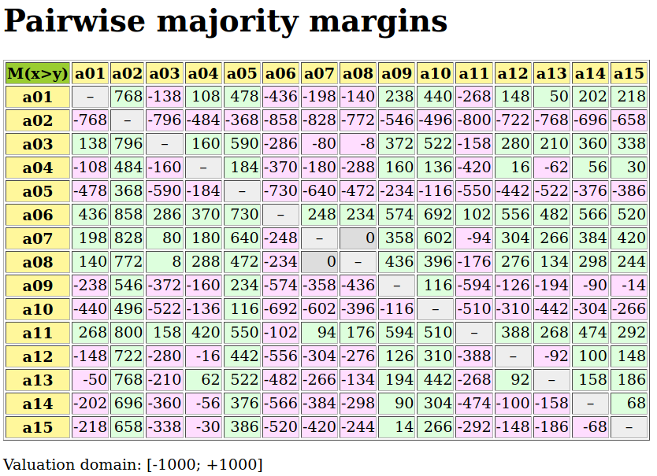

   Browsing the majority margins of a *Condorcet* digraph

In :numref:`majorityMargins`, *light green* cells contain the positive majority margins, whereas *light red* cells contain the negative majority margins. A complete *light green* row reveals hence a *Condorcet* **winner**, whereas a complete *light green* column reveals a *Condorcet* **looser**. We recover again candidate *a06* as *Condorcet* winner ([15]_), whereas the obvious *Condorcet* looser is here candidate *a02*, the candidate with the lowest support in both parties (see :numref:`linearVotingProfileWithPolls` Line 40).

With the same *bipolar* -*first ranked* and *last ranked* candidate- selection procedure, we may *weakly rank* the candidates (with possible ties) by iterating these *first ranked* and *last ranked* choices among the remaining candidates ([BIS-1999]_).

.. code-block:: pycon
   :name: rankingByChoosing
   :caption: Ranking by iterating choosing the *first* and *last* remaining candidates  
   :linenos:

    >>> cdg.showRankingByChoosing()
     Error: You must first run
      self.computeRankingByChoosing(CoDual=False(default)|True) !
    >>> cdg.computeRankingByChoosing()
     {'CoDual': False,
      'result': [
      ((Decimal('475.2857142857142857142857143'), ['a06']),
       (Decimal('682.8571428571428571428571429'), ['a02'])),
      ((Decimal('349.3333333333333333333333333'), ['a11']),
       (Decimal('415.8333333333333333333333333'), ['a05'])),
      ((Decimal('278.4444444444444444444444444'), ['a07', 'a08']),
       (Decimal('353.4'), ['a10'])),
      ((Decimal('265.4285714285714285714285714'), ['a03']),
       (Decimal('170.5714285714285714285714286'), ['a09'])),
      ((Decimal('145.2'), ['a01']),
       (Decimal('130.0'), ['a15'])),
      ((Decimal('104.0'), ['a13']),
       (Decimal('104.6666666666666666666666667'), ['a14'])),
      ((Decimal('16.0'), ['a04']),
       (Decimal('16.0'), ['a12']))]} 
    >>> cdg.showRankingByChoosing()
     Ranking by Choosing and Rejecting
      1st first ranked ['a06'] (475.29)
        2nd first ranked ['a11'] (349.33)
	  3rd first ranked ['a07', 'a08'] (278.44)
	    4th first ranked ['a03'] (265.43)
	      5th first ranked ['a01'] (145.20)
	        6th first ranked ['a13'] (104.00)
		  7th first ranked ['a04'] (16.00)
		  7th last ranked ['a12'] (16.00)
	        6th last ranked ['a14'] (104.67)
	      5th last ranked ['a15'] (130.00)
	    4th last ranked ['a09'] (170.57)
	  3rd last ranked ['a10'] (353.40)
        2nd last ranked ['a05'] (415.83)
      1st last ranked ['a02'] (682.86)

Before showing the *ranking-by-choosing* result, we have to compute the iterated bipolar selection procedure (see :numref:`rankingByChoosing` Line 2). The first selection concerns *a06* (first) and *a02* (last), followed by *a11* (first) opposed to *a05* (last), and so on, until there remains at iteration step 7 a last pair of candidates, namely *[a04, a12]* (see Lines 29-30). The bracketed numbers, following the reiterated *first ranked* and *last ranked* candidates, indicate the average majority margin with which the *i*-th *first ranked* candidate(s), respectively the *i*-th *last ranked* candidate, is beating, resp. is beaten by, the remaining candidates at step *i*.

Notice furthermore the first ranked candidates at iteration step 3 (see :numref:`rankingByChoosing` Line 25), namely the pair *[a07, a08]*. Both candidates represent indeed conjointly the *first ranked* choice. We obtain here hence a *weak ranking*, i.e. a ranking with a tie.

Let us mention that the *instant-run-off* procedure, we used before (see :numref:`uninominalWinner` Line 3), when operated with a *Comments=True* parameter setting, will deliver a more or less similar *reversed* linear *ordering-by-rejecting* result, namely [*a02*, *a10*, *a14*, *a05*, *a09*, *a13*, *a12*, *a15*, *a04*, *a01*, *a08*, *a03*, *a07*, *a11*, *a06*], ordered from the *last* to the *first* choice.

Remarkable about both these *ranking-by-choosing* or *ordering-by-rejecting* results is the fact that the random voting behaviour, simulated here with the help of two discrete random variables ([16]_), defined respectively by the two party polls, is rendering a ranking that is more or less in accordance with the simulated balance of the polls: -*Party_1* supporters : 460;  *Party_2* supporters: 436 (see :numref:`rankingByChoosing` Lines 26-40 third column). Despite a random voting behaviour per voter, the given polls apparently show a *very strong incidence* on the eventual election result. In order to avoid any manipulation of the election outcome, public media are therefore in some countries not allowed to publish polls during the last weeks before a general election.

.. note::

   Mind that the specific *ranking-by-choosing* procedure, we use here on the *Condorcet* digraph, operates the selection procedure by extracting at each step *initial* and *terminal* kernels, i.e. NP-hard operational problems (see tutorial :ref:`Kernel-Tutorial-label` and [BIS-1999]_); A technique that does not allow in general to tackle voting profiles with much more than 20 candidates. The tutorial on :ref:`Ranking-Tutorial-label` provides more adequate and efficient techniques for ranking from pairwise majority margins when a larger number of potential candidates is given.  

Back to :ref:`Content Table <Tutorial-label>`

.. _OutrankingDigraphs-Tutorial-label:

Working with the ``outrankingDigraphs`` module
----------------------------------------------

.. contents:: 
	:depth: 2
	:local:

See also the technical documentation of the :ref:`outrankingDigraphs-label`.

Outranking digraph
..................

In this *Digraph3* module, the main :py:class:`outrankingDigraphs.BipolarOutrankingDigraph` class provides a generic **bipolar-valued outranking digraph model**. A given object of this class consists in

1. a potential set of decision **actions** : a dictionary describing the potential decision actions or alternatives with 'name' and 'comment' attributes,
2. a coherent family of **criteria**: a dictionary of criteria functions used for measuring the performance of each potential decision action with respect to the preference dimension captured by each criterion,
3. the **evaluations**: a dictionary of performance evaluations for each decision action or alternative on each criterion function. 
4. the digraph **valuationdomain**, a dictionary with three entries: the *minimum* (-100, means certainly no link), the *median* (0, means missing information) and the *maximum* characteristic value (+100, means certainly a link),
5. the **outranking relation** : a double dictionary defined on the Cartesian product of the set of decision alternatives capturing the credibility of the pairwise *outranking situation* computed on the basis of the performance differences observed between couples of decision alternatives on the given family if criteria functions.   

With the help of the :py:class:`outrankingDigraphs.RandomBipolarOutrankingDigraph` class (of type :py:class:`outrankingDigraphs.BipolarOutrankingDigraph`) , let us generate for illustration a random bipolar-valued outranking digraph consisting of 7 decision actions denoted *a01*, *a02*, ..., *a07*.

.. code-block:: pycon
   :linenos:

   >>> from outrankingDigraphs import RandomBipolarOutrankingDigraph
   >>> odg = RandomBipolarOutrankingDigraph()
   >>> odg.showActions()
       *----- show digraphs actions --------------*
       key:  a01
       name:       random decision action
       comment:    RandomPerformanceTableau() generated.
       key:  a02
       name:       random decision action
       comment:    RandomPerformanceTableau() generated.
       ...
       ...
       key:  a07
       name:       random decision action
       comment:    RandomPerformanceTableau() generated.

In this example we consider furthermore a family of seven equisignificant cardinal criteria functions *g01*, *g02*, ..., *g07*, measuring the performance of each alternative on a rational scale from 0.0 to 100.00. In order to capture the evaluation's uncertainty and imprecision, each criterion function *g1* to *g7* admits three performance discrimination thresholds of 10, 20 and 80 pts for warranting respectively any indifference, preference and veto situations.

.. code-block:: pycon
   :linenos:

   >>> odg.showCriteria()
    *----  criteria -----*
    g01 'RandomPerformanceTableau() instance'
      Scale = [0.0, 100.0]
      Weight = 3.0
      Threshold pref : 20.00 + 0.00x ; percentile:  0.28
      Threshold ind : 10.00 + 0.00x ; percentile:  0.095
      Threshold veto : 80.00 + 0.00x ; percentile:  1.0
    g02 'RandomPerformanceTableau() instance'
      Scale = [0.0, 100.0]
      Weight = 3.0
      Threshold pref : 20.00 + 0.00x ; percentile:  0.33
      Threshold ind : 10.00 + 0.00x ; percentile:  0.19
      Threshold veto : 80.00 + 0.00x ; percentile:  0.95
    ...
    ...
    g07 'RandomPerformanceTableau() instance'
      Scale = [0.0, 100.0]
      Weight = 10.0
      Threshold pref : 20.00 + 0.00x ; percentile:  0.476
      Threshold ind : 10.00 + 0.00x ; percentile:  0.238
      Threshold veto : 80.00 + 0.00x ; percentile:  1.0

The performance evaluations of each decision alternative on each criterion are gathered in a *performance tableau*.

.. code-block:: pycon
   :linenos:

   >>> odg.showPerformanceTableau()
    *----  performance tableau -----*
    criteria |  'a01'   'a02'   'a03'   'a04'   'a05'   'a06'   'a07'   
    ---------|------------------------------------------------------
      'g01'  |   9.6    48.8    21.7    37.3    81.9    48.7    87.7  
      'g02'  |  90.9    11.8    96.6    41.0    34.0    53.9    46.3  
      'g03'  |  97.8    46.4    83.3    30.9    61.5    85.4    82.5  
      'g04'  |  40.5    43.6    53.2    17.5    38.6    21.5    67.6  
      'g05'  |  33.0    40.7    96.4    55.1    46.2    58.1    52.6  
      'g06'  |  47.6    19.0    92.7    55.3    51.7    26.6    40.4  
      'g07'  |  41.2    64.0    87.7    71.6    57.8    59.3    34.7

Browsing the performances
.........................

We may visualize the same performance tableau in a two-colors setting in the default system browser with the command.

.. code-block:: pycon

   >>> odg.showHTMLPerformanceTableau()

.. figure:: tutorialPerfTab.png
   :width: 400 px
   :align: center

   Visualizing a performance tableau in a browser window

It is worthwhile noticing that *green* and *red* marked evaluations indicate *best*, respectively *worst*, performances of an alternative on a criterion. In this example, we may hence notice that alternative *a03* is in fact best performing on *four* out of *seven* criteria.

We may, furthermore, rank the alternatives on the basis of the weighted marginal quintiles and visualize the same performance tableau in an even more colorful and sorted setting.

.. code-block:: pycon

   >>> odg.showHTMLPerformanceHeatmap(quantiles=5,colorLevels=5)

.. figure:: tutorialHeatmap.png
   :width: 400 px
   :align: center

   Ranked heatmap of the performance table 

There is no doubt that action *a03*, with a performance in the highest quintile in five out of seven criteria, appears definitely to be best performing. Action *a05* shows a more or less average performance on most criteria, whereas action *a02* appears to be the weakest alternative.

Valuation semantics
...................

Considering the given performance tableau, the :py:class:`outrankingDigraphs.BipolarOutrankingDigraph` class constructor computes the characteristic value :math:`r(x\,S\,y)` of a pairwise outranking relation ":math:`x\,S\,y`" (see [BIS-2013]_, [ADT-L7]_) in a default valuation domain [-100.0,+100.0] with the median value 0.0 acting as indeterminate characteristic value. The semantics of r(x S y) are the following.

    1. If :math:`r(x\,S\,y) > 0.0` it is more *True* than *False* that *x outranks y*, i.e. alternative x is at least as well performing than alternative y **and** there is no considerable negative performance difference observed in disfavour of x,
    2. If :math:`r(x\,S\,y) < 0.0` it is more *False* than *True* that *x outranks y*, i.e. alternative x is **not** at least as well performing than alternative y **and** there is no considerable positive performance difference observed in favour of x,
    3. If :math:`r(x\,S\,y) = 0.0` it is *indeterminate* whether *x outranks y or not*.

The resulting bipolar-valued outranking relation may be inspected with the following command.

.. code-block:: pycon
   :linenos:

   >>> odg.showRelationTable()
    * ---- Relation Table -----
    r(x S y)|   'a01'   'a02'   'a03'   'a04'   'a05'   'a06'   'a07'   
    --------|---------------------------------------------------------
     'a01'  |   +0.00  +29.73  -29.73  +13.51  +48.65  +40.54  +48.65  
     'a02'  |  +13.51   +0.00 -100.00  +37.84  +13.51  +43.24  -37.84  
     'a03'  |  +83.78 +100.00   +0.00  +91.89  +83.78  +83.78  +70.27  
     'a04'  |  +24.32  +48.65  -56.76   +0.00  +24.32  +51.35  +24.32  
     'a05'  |  +51.35 +100.00  -70.27  +72.97   +0.00  +51.35  +32.43  
     'a06'  |  +16.22  +72.97  -51.35  +35.14  +32.43   +0.00  +37.84  
     'a07'  |  +67.57  +45.95  -24.32  +27.03  +27.03  +45.95   +0.00  
   >>> odg.valuationdomain
    {'min': Decimal('-100.0'), 'max': Decimal('100.0'),
     'med': Decimal('0.0')}

Pairwise comparisons
....................

From above given semantics, we may consider that *a01* outranks *a02* (:math:`r(a_{01}\,S\,a_{02}) > 0.0`), but not *a03* (:math:`r(a_{01}\,S\,a_{03}) < 0.0`). In order to comprehend the characteristic values shown in the relation table above, we may furthermore have a look at the pairwise multiple criteria comparison between alternatives *a01* and *a02*.

.. code-block:: pycon
   :linenos:

   >>> odg.showPairwiseComparison('a01','a02')
    *------------  pairwise comparison ----*
    Comparing actions : (a01, a02)
    crit. wght.   g(x)  g(y)    diff  	| ind     p    concord 	|
    ------------------------------- ---------------------------------
    g01    3.00   9.56  48.84  -39.28 	| 10.00  20.00   -3.00 	| 
    g02    3.00  90.94  11.79  +79.15 	| 10.00  20.00   +3.00 	| 
    g03    6.00  97.79  46.36  +51.43 	| 10.00  20.00   +6.00 	| 
    g04    5.00  40.53  43.61   -3.08 	| 10.00  20.00   +5.00 	| 
    g05    3.00  33.04  40.67   -7.63 	| 10.00  20.00   +3.00 	| 
    g06    7.00  47.57  19.00  +28.57 	| 10.00  20.00   +7.00 	| 
    g07   10.00  41.21  63.95  -22.74 	| 10.00  20.00  -10.00  | 
    -----------------------------------------------------------------
    Valuation in range: -37.00 to +37.00; global concordance: +11.00

The outranking valuation characteristic appears as **majority margin** resulting from the difference of the weights of the criteria in favor of the statement that alternative *a01* is at least well performing as alternative *a02*. No considerable performance difference being observed, no veto or counter-veto situation is triggered in this pairwise comparison. Such a case is, however, observed for instance when we pairwise compare the performances of alternatives *a03* and *a02*.

.. code-block:: pycon
   :linenos:

   >>> odg.showPairwiseComparison('a03','a02')
    *------------  pairwise comparison ----*
    Comparing actions : (a03, a02)
    crit.  wght.  g(x)  g(y)    diff  	| ind     p    concord 	|  v  veto/counter-veto
    -----------------------------------------------------------------------------------
    g01    3.00  21.73  48.84  -27.11 	| 10.00  20.00   -3.00 	| 
    g02    3.00  96.56  11.79  +84.77 	| 10.00  20.00   +3.00 	|  80.00  +1.00
    g03    6.00  83.35  46.36  +36.99 	| 10.00  20.00   +6.00 	| 
    g04    5.00  53.22  43.61   +9.61 	| 10.00  20.00   +5.00 	| 
    g05    3.00  96.42  40.67  +55.75 	| 10.00  20.00   +3.00 	| 
    g06    7.00  92.65  19.00  +73.65 	| 10.00  20.00   +7.00 	| 
    g07   10.00  87.70  63.95  +23.75 	| 10.00  20.00  +10.00	| 
    -----------------------------------------------------------------------------------
     Valuation in range: -37.00 to +37.00; global concordance: +31.00

This time, we observe a considerable out-performance of *a03* against *a02* on criterion g02 (see second row in the relation table above). We therefore notice a positively polarized *certainly confirmed* outranking situation in this case [BIS-2013]_. 

Recoding the valuation
......................

All outranking digraphs, being of root type :py:class:`digraphs.Digraph`, inherit the methods available under this class. The characteristic valuation domain of an outranking digraph may be recoded with the :py:func:`digraphs.Digraph.recodeValutaion()` method below to the integer range [-37,+37], i.e. plus or minus the global significance of the family of criteria considered in this example instance.

.. code-block:: pycon
   :linenos:

   >>> odg.recodeValuation(-37,+37)
   >>> odg.valuationdomain['hasIntegerValuation'] = True
   >>> Digraph.showRelationTable(odg)
    * ---- Relation Table -----
    * ---- Relation Table -----
      S   | 'a01'   'a02'	'a03'  'a04'   'a05'   'a06'   'a07'	  
    -----|------------------------------------------------------------
    'a01' |    0	 +11	 -11	 +5	+17	+14	+17	 
    'a02' |   +5	   0	 -37	+13	 +5	+15	-14	 
    'a03' |  +31	 +37	   0	+34     +31	+31	+26	 
    'a04' |   +9	 +18	 -21	  0	 +9	+19	 +9	 
    'a05' |  +19	 +37	 -26	+27	  0	+19	+12	 
    'a06' |   +6	 +27	 -19	+13	+12	  0	+14	 
    'a07' |  +25	 +17	  -9	 +9	 +9	+17	  0	 
    Valuation domain:  {'hasIntegerValuation': True, 'min': Decimal('-37'), 
			'max': Decimal('37'), 'med': Decimal('0.000')}

.. note::

 Notice that the reflexive self comparison characteristic :math:`r(x S x)` is set by default to the median indeterminate valuation value 0; the reflexive terms of binary relation being generally ignored in most of the ``Digraph3`` resources. 

.. _CoDual-Digraph-label:
 
The strict outranking digraph
.............................

From the theory (see [BIS-2013]_, [ADT-L7]_ )  we know that a bipolar-valued outranking digraph is **weakly complete**, i.e. if :math:`r(x\,S\,y) < 0.0` then :math:`r(y\,S\,x) >= 0.0` . From this property follows that a bipolar-valued outranking relation verifies the **coduality** principle: the dual (strict negation - [14]_) of the converse (inverse ~) of the outranking relation corresponds to its strict outranking part. We may visualize the codual (strict) outranking digraph with a graphviz drawing [1]_.

.. code-block:: pycon
   :linenos:

   >>> cdodg = -(~odg)
   >>> cdodg.exportGraphViz('codualOdg')
    *---- exporting a dot file for GraphViz tools ---------*
    Exporting to codualOdg.dot
    dot -Grankdir=BT -Tpng codualOdg.dot -o codualOdg.png

.. figure:: codualOdg.png
   :width: 300 px
   :align: center

   Codual digraph

It becomes readily clear now from the picture above that alternative *a03* strictly outranks in fact all the other alternatives. Hence, *a03* appears as **Condorcet winner** and may be recommended as *best decision action* in this illustrative preference modelling exercise. 

XMCDA 2.0
.........

As with all Digraph instances, it is possible to store permanently a copy of the outranking digraph *odg*. As its outranking relation is automatically generated by the :py:class:`outrankingDigraphs.BipolarOutrankingDigraph` class constructor on the basis of a given performance tableau, it is sufficient to save only the latter. For this purpose we are using the `XMCDA 2.00 <https://www.decision-deck.org/xmcda/>`_ XML encoding scheme of MCDA data, as provided by the Decision Deck Project (see https://www.decision-deck.org/).

.. code-block:: pycon

   >>> PerformanceTableau.saveXMCDA2(odg,'tutorialPerfTab')
    *----- saving performance tableau in XMCDA 2.0 format  -------------*
    File: tutorialPerfTab.xml saved !

The resulting XML file may be visualized in a browser window (other than Chrome or Chromium)  with a corresponding XMCDA style sheet (`see here <_static/tutorialPerfTab.xml>`_). Hitting ``Ctrl U`` in Firefox will open a browser window showing the underlying xml encoded raw text. It is thus possible to easily edit and update as needed a given performance tableau instance. Re-instantiating again a corresponding updated *odg* object goes like follow.

.. code-block:: pycon
   :linenos:

   >>> pt = XMCDA2PerformanceTableau('tutorialPerfTab') 
   >>> odg = BipolarOutrankingDigraph(pt)
   >>> odg.showRelationTable()
    * ---- Relation Table -----
      S   |  'a01'     'a02'   'a03'   'a04'   'a05'   'a06'   'a07'   
    ------|------------------------------------------------------------
    'a01' |   +0.00   +29.73  -29.73  +13.51  +48.65  +40.54  +48.65  
    'a02' |   +13.51  +0.00  -100.00  +37.84  +13.51  +43.24  -37.84  
    'a03' |   +83.78  +100.00  +0.00  +91.89  +83.78  +83.78  +70.27  
    'a04' |   +24.32  +48.65  -56.76   +0.00  +24.32  +51.35  +24.32  
    'a05' |   +51.35  +100.00  -70.27  +72.97  +0.00  +51.35  +32.43  
    'a06' |   +16.22  +72.97  -51.35  +35.14  +32.43   +0.00  +37.84  
    'a07' |   +67.57  +45.95  -24.32  +27.03  +27.03  +45.95   +0.00  

We recover the original bipolar-valued outranking characteristics, and we may restart again the preference modelling process. 

Many more tools for exploiting bipolar-valued outranking digraphs are available in the Digraph3 resources (see the technical documentation of the :ref:`outrankingDiGraphs-label` and the :ref:`perfTabs-label`).

Back to :ref:`Content Table <Tutorial-label>`

.. _RandomPerformanceTableau-Tutorial-label:

Generating random performance tableaux
--------------------------------------

.. contents:: 
	:depth: 2
	:local:

Introduction
............

The :py:mod:`randomPerfTabs` module provides several constructors for random performance tableaux generators of different kind, mainly for the purpose of testing implemented methods and tools presented and discussed in the Algorithmic Decision Theory course at the University of Luxembourg. This tutorial concerns the four most useful generators.

    1. The simplest model, called **RandomPerformanceTableau**, generates
    a set of *n* decision actions, a set of *m* real-valued
    performance criteria, ranging by default from 0.0 to 100.0,
    associated with default discrimination thresholds: 2.5 (ind.),
    5.0 (pref.) and 60.0 (veto). The generated performances are
    Beta(2.2) distributed on each measurement scale.
       
    2. One of the most useful random generator, called
    **RandomCBPerformanceTableau**, proposes two decision objectives,
    named *Costs* (to be minimized) respectively *Benefits* (to be
    maximized) model; its purpose being to generate more or less
    contradictory performances on these two, usually opposed,
    objectives. *Low costs* will randomly be coupled with *low
    benefits*, whereas *high costs* will randomly be coupled
    with high benefits.
       
    3. Many multiple criteria decision problems concern three decision
    objectives which take into account *economical*, *societal* as well
    as *environmental* aspects. For this type of performance tableau model,
    we provide a specific generator,
    called **Random3ObjectivesPerformanceTableau**.
       
    4. In order to study aggregation of linear orders, we provide a model
    called **RandomRankPerformanceTableau** which provides linearly
    ordered performances without ties on multiple criteria for
    a given number of decision actions.
 
Generating standard random performance tableaux
...............................................
    
The :py:class:`randomPerfTabs.RandomPerformanceTableau` class, the simplest of the kind, specializes the generic :py:class:`prefTabs.PerformanceTableau` class, and takes the following parameters.

    * numberOfActions := nbr of decision actions.
    * numberOfCriteria := number performance criteria.
    * weightDistribution := 'random' (default) | 'fixed' | 'equisignificant':
      
         | If 'random', weights are uniformly selected randomly
         | from the given weight scale;
         | If 'fixed', the weightScale must provided a corresponding weights
         | distribution;
         | If 'equisignificant', all criterion weights are put to unity.
	 
    * weightScale := [Min,Max] (default =(1,numberOfCriteria).
    * IntegerWeights := True (default) | False (normalized to proportions of 1.0).
    * commonScale := [a,b]; common performance measuring scales (default = [0.0,100.0])
    * commonThresholds := [(q0,q1),(p0,p1),(v0,v1)]; common indifference(q), preference (p) and considerable performance difference discrimination thresholds. For each threshold type *x* in *{q,p,v}*, the float x0 value represents a constant percentage of the common scale and the float x1 value a proportional value of the actual performance measure. Default values are [(2.5.0,0.0),(5.0,0.0),(60.0,0,0)]. 
    * commonMode := common random distribution of random performance measurements (default = ('beta',None,(2,2)) ):
      
         | ('uniform',None,None), uniformly distributed float values on the given common scales' range [Min,Max]. 
         | ('normal',*mu*,*sigma*), truncated Gaussian distribution, by default *mu* = (*b-a*)/2 and *sigma* = (*b-a*)/4. 
         | ('triangular',*mode*,*repartition*), generalized triangular distribution with a probability repartition parameter specifying the probability mass accumulated until the mode value. By default, *mode* = (*b-a*)/2 and *repartition* = 0.5.
         | ('beta',None,(alpha,beta)), a beta generator with default alpha=2 and beta=2 parameters.
	 
    * valueDigits := <integer>, precision of performance measurements (2 decimal digits by default).
    * missingDataProbability := 0 <= float <= 1.0 ; probability of missing performance evaluation on a criterion for an alternative (default 0.025). 
  
Code example.

.. code-block:: pycon
   :name: randomPerformanceTableau
   :caption: Generating a random performance tableau
   :linenos:

   >>> from randomPerfTabs import RandomPerformanceTableau
   >>> t = RandomPerformanceTableau(numberOfActions=21,numberOfCriteria=13,seed=100)
   >>> t.actions
	{'a01': {'comment': 'RandomPerformanceTableau() generated.',
		'name': 'random decision action'},
	 'a02': { ... },
	 ...
	}
   >>> t.criteria
	{'g01': {'thresholds': {'ind' : (Decimal('10.0'), Decimal('0.0')),
			       'veto': (Decimal('80.0'), Decimal('0.0')),
			       'pref': (Decimal('20.0'), Decimal('0.0'))},
		'scale': [0.0, 100.0],
		'weight': Decimal('1'),
		'name': 'digraphs.RandomPerformanceTableau() instance',
		'comment': 'Arguments: ; weightDistribution=random;
		    weightScale=(1, 1); commonMode=None'},
	  'g02':  { ... },
	  ...
	 }
   >>> t.evaluation
	{'g01': {'a01': Decimal('15.17'),
		 'a02': Decimal('44.51'),
		 'a03': Decimal('-999'),  # missing evaluation
		 ...
		 },
	  ...
	 }
    >>> t.showHTMLPerformanceTableau()

.. figure:: randomPerfTab1.png
   :width: 500 px
   :align: center

   Browser view on random performance tableau instance

.. note::

   Missing (NA) evaluation are registered in a performance tableau as *Decimal('-999')* value (see :numref:`randomPerformanceTableau` Line 24). Best and worst performance on each criterion are marked in *light green*, respectively in *light red*.

.. _Cost-Benefit-Performance-Tableau-label:
	    
Generating random Cost-Benefit performance tableaux
...................................................

We provide the :py:class:`randomPerfTabs.RandomCBPerformanceTableau` class for generating random *Cost* versus *Benefit* organized performance tableaux following the directives below:

    * We distinguish three types of decision actions: *cheap*, *neutral* and *expensive* ones with an equal proportion of 1/3. We also distinguish two types of weighted criteria: *cost* criteria to be *minimized*, and *benefit* criteria to be *maximized*; in the proportions 1/3 respectively 2/3. 
    * Random performances on each type of criteria  are drawn, either from an ordinal scale [0;10], or from a cardinal scale [0.0;100.0], following a parametric triangular law of mode: 30\% performance for cheap, 50% for neutral, and 70% performance for expensive decision actions, with constant probability repartition 0.5 on each side of the respective mode. 
    * Cost criteria use mostly cardinal scales (3/4), whereas benefit criteria use mostly ordinal scales (2/3). 
    * The sum of weights of the cost criteria by default equals the sum weights of the benefit criteria: weighDistribution = 'equiobjectives'. 
    * On cardinal criteria, both of cost or of benefit type, we observe following constant preference discrimination quantiles: 5\% indifferent situations, 90\% strict preference situations, and 5\% veto situation. 

*Parameters*:
    * If *numberOfActions* == None, a uniform random number between 10 and 31 of cheap, neutral or advantageous actions (equal 1/3 probability each type) actions is instantiated
    * If *numberOfCriteria* == None, a uniform random number between 5 and 21 of cost or benefit criteria (1/3 respectively 2/3 probability) is instantiated
    * *weightDistribution* = {'equiobjectives'|'fixed'|'random'|'equisignificant' (default = 'equisignificant')}
    * default *weightScale* for 'random' weightDistribution is 1 - numberOfCriteria
    * All cardinal criteria are evaluated with decimals between 0.0 and 100.0 whereas ordinal criteria are evaluated with integers between 0 and 10.
    * commonThresholds is obsolete. Preference discrimination is specified as percentiles of concerned performance differences (see below).
    * commonPercentiles = {'ind':5, 'pref':10, ['weakveto':90,] 'veto':95} are expressed in percents (reversed for vetoes) and only concern cardinal criteria.

.. warning::

    Minimal number of decision actions required is 3 ! 

Example Python session

.. code-block:: pycon
   :name: randomCBPerformanceTableau
   :caption: Generating a random Cost-Benefit performance tableau
   :linenos:

   >>> from randomPerfTabs import RandomCBPerformanceTableau
   >>> t = RandomCBPerformanceTableau(
   ...          numberOfActions=7,
   ...          numberOfCriteria=5,
   ...          weightDistribution='equiobjectives',
   ...          commonPercentiles={'ind':5,'pref':10,'veto':95},
   ...          seed=100)
   >>> t.showActions()
    *----- show decision action --------------*
    key:  a1
      short name: a1
      name:       random cheap decision action
    key:  a2
      short name: a2
      name:       random neutral decision action
    ...
    key:  a7
      short name: a7
      name:       random advantageous decision action
   >>> t.showCriteria()
    *----  criteria -----*
    g1 'random ordinal benefit criterion'
      Scale = (0, 10)
      Weight = 0.167 
    g2 'random cardinal cost criterion'
      Scale = (0.0, 100.0)
      Weight = 0.250 
      Threshold ind  :  1.76 + 0.00x ; percentile:  0.095
      Threshold pref :  2.16 + 0.00x ; percentile:  0.143
      Threshold veto : 73.19 + 0.00x ; percentile:  0.952
    ...

In the example above, we may notice the three types of decision actions (:numref:`randomCBPerformanceTableau` Lines 10-19), as well as the two types (Lines 22-25) of criteria with either an **ordinal** or a **cardinal** performance measuring scale. In the latter case, by default about 5% of the random performance differences will be below the **indifference** and 10% below the **preference discriminating threshold**. About 5% will be considered as **considerably large**. More statistics about the generated performances is available as follows.

.. code-block:: pycon
   :linenos:

   >>> t.showStatistics()
    *-------- Performance tableau summary statistics -------*
    Instance name      : randomCBperftab
    #Actions           : 7
    #Criteria          : 5
    *Statistics per Criterion*
    Criterion name       : g1
      Criterion weight     : 2
      criterion scale    : 0.00 - 10.00
      mean evaluation    : 5.14
      standard deviation : 2.64
      maximal evaluation : 8.00
      quantile Q3 (x_75) : 8.00
      median evaluation  : 6.50
      quantile Q1 (x_25) : 3.50
      minimal evaluation : 1.00
      mean absolute difference      : 2.94
      standard difference deviation : 3.74
    Criterion name       : g2
      Criterion weight     : 3
      criterion scale    : -100.00 - 0.00
      mean evaluation    : -49.32
      standard deviation : 27.59
      maximal evaluation : 0.00
      quantile Q3 (x_75) : -27.51
      median evaluation  : -35.98
      quantile Q1 (x_25) : -54.02
      minimal evaluation : -91.87
      mean absolute difference      : 28.72
      standard difference deviation : 39.02
    ...

A (potentially ranked) colored heatmap with 5 color levels is also provided.
    
>>> t.showHTMLPerformanceHeatmap(colorLevels=5,Ranked=False)

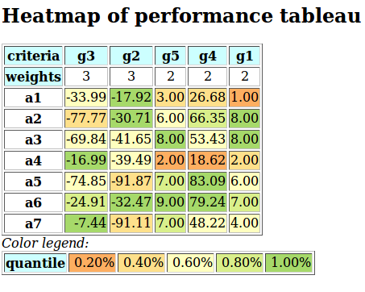

   Unranked heatmap of a random Cost-Benefit performance tableau
   
Such a performance tableau may be stored and re-accessed in the XMCDA2 encoded format.

.. code-block:: pycon

   >>> t.saveXMCDA2('temp')
    *----- saving performance tableau in XMCDA 2.0 format  -------------*
    File: temp.xml saved !
   >>> from perfTabs import XMCDA2PerformanceTableau
   >>> t = XMCDA2PerformanceTableau('temp')

If needed for instance in an R session, a CSV version of the performance tableau may be created as follows.

.. code-block:: pycon

   >>> t.saveCSV('temp')
    * --- Storing performance tableau in CSV format in file temp.csv

.. code-block:: bash

   ...$ less temp.csv
    "actions","g1","g2","g3","g4","g5"
    "a1",1.00,-17.92,-33.99,26.68,3.00
    "a2",8.00,-30.71,-77.77,66.35,6.00
    "a3",8.00,-41.65,-69.84,53.43,8.00
    "a4",2.00,-39.49,-16.99,18.62,2.00
    "a5",6.00,-91.87,-74.85,83.09,7.00
    "a6",7.00,-32.47,-24.91,79.24,9.00
    "a7",4.00,-91.11,-7.44,48.22,7.00

Back to :ref:`Content Table <Tutorial-label>`

Generating random three objectives performance tableaux
.......................................................

We provide the :py:class:`randomPerfTabs.Random3ObjectivesPerformanceTableau` class for generating random performance tableaux concerning three preferential decision objectives which take respectively into account *economical*, *societal* as well as *environmental* aspects.

Each decision action is qualified randomly as performing **weak** (-), **fair** (~) or **good** (+) on each of the three objectives. 

Generator directives are the following:

    * numberOfActions = 20 (default),
    * numberOfCriteria = 13 (default),
    * weightDistribution = 'equiobjectives' (default) | 'random' | 'equisignificant', 
    * weightScale = (1,numberOfCriteria): only used when random criterion weights are requested,
    * integerWeights = True (default): False gives normalized rational weights, 
    * commonScale = (0.0,100.0),
    * commonThresholds = [(5.0,0.0),(10.0,0.0),(60.0,0.0)]: Performance discrimination thresholds may be set for 'ind', 'pref' and 'veto',  
    * commonMode = ['triangular','variable',0.5]: random number generators of various other types ('uniform','beta') are available,
    * valueDigits = 2 (default): evaluations are encoded as Decimals,
    * missingDataProbability = 0.05 (default): random insertion of missing values with given probability,  
    * seed= None. 

.. note::

    If the mode of the **triangular** distribution is set to '*variable*',
    three modes at 0.3 (-), 0.5 (~), respectively 0.7 (+) of the common scale span are set at random for each coalition and action.
    
.. warning::

    Minimal number of decision actions required is 3 ! 

Example Python session

.. code-block:: pycon
   :name: random3ObjectivesPerformanceTableau
   :caption: Generating a random 3 Objectives performance tableau
   :linenos:
		     
   >>> from randomPerfTabs import Random3ObjectivesPerformanceTableau
   >>> t = Random3ObjectivesPerformanceTableau(
   ...           numberOfActions=31,
   ...           numberOfCriteria=13,
   ...           weightDistribution='equiobjectives',
   ...           seed=120)
   >>> t.showObjectives()
    *------ show objectives -------"
    Eco: Economical aspect
       g04 criterion of objective Eco 20
       g05 criterion of objective Eco 20
       g08 criterion of objective Eco 20
       g11 criterion of objective Eco 20
      Total weight: 80.00 (4 criteria)
    Soc: Societal aspect
       g06 criterion of objective Soc 16
       g07 criterion of objective Soc 16
       g09 criterion of objective Soc 16
       g10 criterion of objective Soc 16
       g13 criterion of objective Soc 16
      Total weight: 80.00 (5 criteria)
    Env: Environmental aspect
       g01 criterion of objective Env 20
       g02 criterion of objective Env 20
       g03 criterion of objective Env 20
       g12 criterion of objective Env 20
      Total weight: 80.00 (4 criteria)

In :numref:`random3ObjectivesPerformanceTableau` above, we notice that 5 *equisignificant* criteria (g06, g07, g09, g10, g13) evaluate for instance the performance of the decision actions from the **societal** point of view (Lines 16-21). 4 *equisignificant* criteria do the same from the **economical** (Lines 10-14), respectively the **environmental** point of view (Lines 21-27). The *equiobjectives* directive results hence in a balanced total weight (80.00) for each decision objective. 

.. code-block:: pycon
   :linenos:

   >>> t.showActions()
    key:  a01
      name:       random decision action Eco+ Soc- Env+
      profile:    {'Eco': 'good', 'Soc': 'weak', 'Env': 'good'}
    key:  a02
    ...
    key:  a26
      name:       random decision action Eco+ Soc+ Env-
      profile:    {'Eco': 'good', 'Soc': 'good', 'Env': 'weak'}
    ...
    key:  a30
      name:       random decision action Eco- Soc- Env-
      profile:    {'Eco': 'weak', 'Soc': 'weak', 'Env': 'weak'}
    ...

Variable triangular modes (0.3, 0.5 or 0.7 of the span of the measure scale) for each objective result in different performance status for each decision action with respect to the three objectives. Action *a01* , for instance, will probably show *good* performances wrt the *economical*  and environmental aspects, and *weak* performances wrt the *societal* aspect.

For testing purposes we provide a special :py:class:`perfTabs.PartialPerformanceTableau` class for extracting a **partial performance tableau** from a given tableau instance. In the example blow, we construct the partial performance tableaux corresponding to each on of the three decision objectives.

.. code-block:: pycon
   :linenos:

   >>> from perfTabs import PartialPerformanceTableau
   >>> teco = PartialPerformanceTableau(t,criteriaSubset=\
   ...                           t.objectives['Eco']['criteria'])
   >>> tsoc = PartialPerformanceTableau(t,criteriaSubset=\
   ...                           t.objectives['Soc']['criteria'])
   >>> tenv = PartialPerformanceTableau(t,criteriaSubset=\
   ...                           t.objectives['Env']['criteria'])

One may thus compute a partial bipolar-valued outranking digraph for each individual objective.

.. code-block:: pycon
   :linenos:

   >>> from outrankingDigraphs import BipolarOutrankingDigraph
   >>> geco = BipolarOutrankingDigraph(teco)
   >>> gsoc = BipolarOutrankingDigraph(tsoc)
   >>> genv = BipolarOutrankingDigraph(tenv)

The three partial digraphs: *geco*, *gsoc* and *genv*,  hence model the preferences represented in each one of the partial performance tableaux. And, we may aggregate these three outranking digraphs with an epistemic fusion operator.

.. code-block:: pycon
   :linenos:

   >>> from digraphs import FusionLDigraph
   >>> gfus = FusionLDigraph([geco,gsoc,genv])
   >>> gfus.strongComponents()
    {frozenset({'a30'}), 
     frozenset({'a10', 'a03', 'a19', 'a08', 'a07', 'a04', 'a21', 'a20', 
                'a13', 'a23', 'a16', 'a12', 'a24', 'a02', 'a31', 'a29', 
                'a05', 'a09', 'a28', 'a25', 'a17', 'a14', 'a15', 'a06', 
                'a01', 'a27', 'a11', 'a18', 'a22'}), 
     frozenset({'a26'})}
   >>> from digraphs import StrongComponentsCollapsedDigraph
   >>> scc = StrongComponentsCollapsedDigraph(gfus)
   >>> scc.showActions()
    *----- show digraphs actions --------------*
    key:  frozenset({'a30'})
      short name: Scc_1
      name:       _a30_
      comment:    collapsed strong component
    key:  frozenset({'a10', 'a03', 'a19', 'a08', 'a07', 'a04', 'a21', 'a20', 'a13', 
                     'a23', 'a16', 'a12', 'a24', 'a02', 'a31', 'a29', 'a05', 'a09', 'a28', 'a25', 
                     'a17', 'a14', 'a15', 'a06', 'a01', 'a27', 'a11', 'a18', 'a22'})
      short name: Scc_2
      name:       _a10_a03_a19_a08_a07_a04_a21_a20_a13_a23_a16_a12_a24_a02_a31_\
                   a29_a05_a09_a28_a25_a17_a14_a15_a06_a01_a27_a11_a18_a22_
      comment:    collapsed strong component
    key:  frozenset({'a26'})
      short name: Scc_3
      name:       _a26_
      comment:    collapsed strong component

A graphviz drawing illustrates the apparent preferential links between the strong components.

.. code-block:: pycon

   >>> scc.exportGraphViz('scFusionObjectives')
    *---- exporting a dot file for GraphViz tools ---------*
    Exporting to scFusionObjectives.dot
    dot -Grankdir=BT -Tpng scFusionObjectives.dot -o scFusionObjectives.png

.. figure:: sccFusionObjectives.png
   :width: 300 px
   :align: center

   Strong components digraph
	   
Decision action *a26* (Eco+ Soc+ Env-) appears dominating the other decision alternatives, whereas decision action *a30* (Eco- Soc- Env-) appears to be dominated by all the others.

Generating random linearly ranked performance tableaux
......................................................

Finally, we provide the :py:class:`randomPerfTabs.RandomRankPerformanceTableau` class for generating multiple criteria ranked performance tableaux, i.e. on each criterion, all decision action's evaluations appear linearly ordered without ties.

This type of random performance tableau is matching the :py:class:`votingProfiles.RandomLinearVotingProfile` class provided by the :py:mod:`votingProfiles` module.  
        
*Parameters*:
    * number of actions,
    * number of performance criteria,
    * weightDistribution := equisignificant | random (default, see `above <tutorial.html#the-randomperformancetableau-generator>`_ above)
    * weightScale := (1, 1 | numberOfCriteria (default when random))
    * integerWeights := Boolean (True = default) 
    * commonThresholds (default) := {
      
        | 'ind':(0,0),
        | 'pref':(1,0),
        | 'veto':(numberOfActions,0)
        | } (default)

Back to :ref:`Content Table <Tutorial-label>`

.. _Ranking-Tutorial-label:

Ranking with multiple incommensurable criteria
----------------------------------------------

.. contents:: 
	:depth: 2
	:local:

The ranking problem
...................

We need to rank without ties a set *X* of items (usually decision alternatives) that are evaluated on multiple incommensurable performance criteria; yet, for which we may know their pairwise bipolar-valued *strict outranking* characteristics, i.e. :math:`r(x\, > \, y)` for all *x*, *y* in *X* (see :ref:`CoDual-Digraph-label` and [BIS-2013]_).

Let us consider a didactic outranking digraph *g* generated from a random :ref:`Cost-Benefit performance tableau <Cost-Benefit-Performance-Tableau-label>` concerning 9 decision alternatives evaluated on 13 performance criteria. We may compute the corresponding *strict outranking digraph* with a :ref:`codual transform <Codual-Transform-label>` as follows.

.. code-block:: pycon
   :name: strictOutranking
   :caption: Random bipolar-valued strict outranking relation characteristics
   :linenos:

   >>> from outrankingDigraphs import *
   >>> t = RandomCBPerformanceTableau(numberOfActions=9,
   ...                                numberOfCriteria=13,seed=200)    
   >>> g = BipolarOutrankingDigraph(t,Normalized=True)
   >>> gcd = ~(-g) # codual digraph
   >>> gcd.showRelationTable(ReflexiveTerms=False)
    * ---- Relation Table -----
    r(>) |  'a1'  'a2'  'a3'  'a4'  'a5'  'a6'  'a7'  'a8'  'a9'   
    -----|------------------------------------------------------
    'a1' |    -   0.00 +0.10 -1.00 -0.13 -0.57 -0.23 +0.10 +0.00  
    'a2' | -1.00   -    0.00 +0.00 -0.37 -0.42 -0.28 -0.32 -0.12  
    'a3' | -0.10  0.00   -   -0.17 -0.35 -0.30 -0.17 -0.17 +0.00  
    'a4' |  0.00  0.00 -0.42   -   -0.40 -0.20 -0.60 -0.27 -0.30  
    'a5' | +0.13 +0.22 +0.10 +0.40   -   +0.03 +0.40 -0.03 -0.07  
    'a6' | -0.07 -0.22 +0.20 +0.20 -0.37   -   +0.10 -0.03 -0.07  
    'a7' | -0.20 +0.28 -0.03 -0.07 -0.40 -0.10   -   +0.27 +1.00  
    'a8' | -0.10 -0.02 -0.23 -0.13 -0.37 +0.03 -0.27   -   +0.03  
    'a9' |  0.00 +0.12 -1.00 -0.13 -0.03 -0.03 -1.00 -0.03   -   

Some ranking rules will work on the associated **Condorcet Digraph**, i.e. the corresponding *strict median cut* polarised digraph.

.. code-block:: pycon
   :name: polarisedAStrictOutranking
   :caption: Median cut polarised strict outranking relation characteristics
   :linenos:

   >>> ccd = PolarisedOutrankingDigraph(gcd,level=g.valuationdomain['med'],
   ...                                KeepValues=False,StrictCut=True)
   >>> ccd.showRelationTable(ReflexiveTerms=False,IntegerValues=True)
    *---- Relation Table -----
     r(>)_med | 'a1' 'a2' 'a3' 'a4' 'a5' 'a6' 'a7' 'a8' 'a9'   
     ---------|---------------------------------------------
        'a1'  |   -    0   +1   -1   -1   -1   -1   +1    0  
        'a2'  |  -1    -   +0    0   -1   -1   -1   -1   -1  
        'a3'  |  -1    0    -   -1   -1   -1   -1   -1    0  
        'a4'  |   0    0   -1    -   -1   -1   -1   -1   -1  
        'a5'  |  +1   +1   +1   +1    -   +1   +1   -1   -1  
        'a6'  |  -1   -1   +1   +1   -1    -   +1   -1   -1  
        'a7'  |  -1   +1   -1   -1   -1   -1    -   +1   +1  
        'a8'  |  -1   -1   -1   -1   -1   +1   -1    -   +1  
        'a9'  |   0   +1   -1   -1   -1   -1   -1   -1    -   

Unfortunately, such crisp median-cut *Condorcet* digraphs, associated with a given strict outranking digraph, present only exceptionally a linear ordering. Usually, pairwise majority comparisons do not render even a complete or, at least, a transitive partial order. There may even frequently appear *cyclic* outranking situations (see the tutorial on :ref:`LinearVoting-tutorial-label`).

To estimate how *difficult* this ranking problem here may be, we can have a look at the corresponding strict outranking digraph *graphviz* drawing ([1]_).

.. code-block:: pycon

   >>> gcd.exportGraphViz('rankingTutorial')
    *---- exporting a dot file for GraphViz tools ---------*
    Exporting to rankingTutorial.dot
    dot -Grankdir=BT -Tpng rankingTutorial.dot -o rankingTutorial.png

.. Figure:: rankingTutorial.png
   :name: rankingTutorial
   :width: 300 px
   :align: center

   The *strict outranking* digraph	   

The shown strict outranking digraph is apparently *not transitive*: for instance, alternative *a8* outranks alternative *a6* and alternative *a6* outranks *a4*, however *a8* does not outrank *a4* (see :numref:`rankingTutorial`). We may compute the transitivity degree of the outranking digraph, i.e. the ratio of the number of outranking arcs over the number of arcs of the transitive closure of the digraph *gcd*.

    >>> gcd.computeTransitivityDegree(Comments=True)
     Transitivity degree of graph
     <converse-dual_rel_randomCBperftab>: 0.46
    
The strict outranking relation is hence very far from being transitive; a serious problem when a linear ordering of the decision alternatives is looked for. Let us furthermore see if there are any cyclic outrankings.
    
.. code-block:: pycon

   >>> gcd.computeChordlessCircuits()
   >>> gcd.showChordlessCircuits()
    1 circuit(s).
    *---- Chordless circuits ----*    
    1: ['a6', 'a7', 'a8'] , credibility : 0.033

There is one chordless circuit detected in the given strict outranking digraph *gcd*, namely *a6* outranks *a7*, the latter outranks *a8*, and *a8* outranks again *a6* (see :numref:`rankingTutorial`). Any potential linear ordering of these three alternatives will, in fact, always contradict somehow the given outranking relation.

Several heuristic ranking rules have been proposed for constructing a linear ordering which is closest in some specific sense to a given outranking relation.

The Digraph3 resources provide some of the most common of these ranking rules, like *Copeland*'s, *Kemeny*'s, *Slater*'s, *Kohler*'s, *Arrow-Raynaud*'s or *Tideman*'s ranking rule.

The *Copeland* ranking
......................

*Copeland*'s rule, the most intuitive one as it works well for any strict outranking relation which models in fact a linear order, works on the median cut strict outranking digraph *ccd*. The rule computes for each alternative a score resulting from the sum of the differences between the crisp **strict outranking** characteristics :math:`r(x\, > \,y)_{>0}` and the crisp **strict outranked** characteristics :math:`r(y\, > \, x)_{>0}`  for all pairs of alternatives where *y* is different from *x*. The alternatives are ranked in decreasing order of these *Copeland* scores; ties, the case given, being resolved by a lexicographical rule. 

.. code-block:: pycon
   :name: CopelandRanking
   :caption: Computing a *Copeland* Ranking
   :linenos:

   >>> from linearOrders import CopelandOrder
   >>> cop = CopelandOrder(g,Comments=True)
    Copeland decreasing scores
     a5 : 12
     a1 : 2
     a6 : 2
     a7 : 2
     a8 : 0
     a4 : -3
     a9 : -3
     a3 : -5
     a2 : -7
    Copeland Ranking:
    ['a5', 'a1', 'a6', 'a7', 'a8', 'a4', 'a9', 'a3', 'a2']

Alternative *a5* obtains the best *Copeland* score (+12), followed by alternatives *a1*, *a6* and *a7* with same score (+2); following the lexicographic rule, *a1* is hence ranked before *a6* and *a6* before *a7*. Same situation is observed for *a4* and *a9* with a score of -3 (see :numref:`CopelandRanking` Lines 4-12).

*Copeland*'s ranking rule appears in fact **invariant** under the :ref:`codual transform <Codual-Transform-label>` and renders a same linear order indifferently from digraphs *g* or *gcd* . The resulting ranking (see :numref:`CopelandRanking` Line 14) is rather correlated (+0.463) with the given pairwise outranking relation in the ordinal *Kendall* sense (see :numref:`CopelandCorrelationIndexes`).

.. code-block:: pycon
   :name: CopelandCorrelationIndexes
   :caption: Checking the quality of the *Copeland* Ranking
   :linenos:

   >>> corr = g.computeRankingCorrelation(cop.copelandRanking)
   >>> g.showCorrelation(corr)
    Correlation indexes:
     Crisp ordinal correlation : +0.463
     Valued equivalalence      : +0.107
     Epistemic determination   :  0.230

With an epistemic determination level of 0.230, the *extended Kendall tau* index (see [BIS-2012]_) is in fact computed on 61.5% (100.0 x (1.0 + 0.23)/2) of the pairwise strict outranking comparisons. Furthermore, the bipolar-valued *relational equivalence* characteristics between the strict outranking relation and the *Copeland* ranking equals +0.107, i.e. a *majority* of 55.35% of the criteria significance supports the relational equivalence between the given strict outranking relation and the corresponding *Copeland* ranking.

The *Copeland* scores deliver actually only a unique *weak ranking*, i.e. a ranking with potential ties. This weak ranking may be constructed with the :py:class:`transitiveDigraphs.WeakCopelandOrder` class.

.. code-block:: pycon
   :name: weakCopelandRanking
   :caption: Computing a weak *Copeland* ranking
   :linenos:

   >>> from transitiveDigraphs import WeakCopelandOrder
   >>> wcop = WeakCopelandOrder(g)
   >>> wcop.showRankingByChoosing()
    Ranking by Choosing and Rejecting
     1st ranked ['a5'] (1.00)
       2nd ranked ['a1', 'a6', 'a7'] (1.00)
	 3rd ranked ['a8'] (1.00)
	 3rd last ranked ['a4', 'a9'] (1.00)
       2nd last ranked ['a3'] (1.00)
     1st last ranked ['a2'] (1.00)

We recover in :numref:`weakCopelandRanking` above, the ranking with ties delivered by the *Copeland* scores (see :numref:`CopelandRanking`). The bracketed numbers indicate that this weak ranking is certainly valid. We may draw its corresponding *Hasse* diagram (see :numref:`weakCopelandRankingDrawing`).

.. code-block:: pycon
   :name: weakCopelandRankingDrawing
   :caption: Drawing a weak *Copeland* ranking
   :linenos:

   >>> wcop.exportGraphViz(fileName='weakCopelandRanking')
    *---- exporting a dot file for GraphViz tools ---------*
    Exporting to weakCopelandRanking.dot
    0 { rank = same; a5; }
    1 { rank = same; a1; a7; a6; }
    2 { rank = same; a8; }
    3 { rank = same; a4; a9}
    4 { rank = same; a3; }
    5 { rank = same; a2; }
    dot -Grankdir=TB -Tpng weakCopelandRanking.dot\
        -o weakCopelandRanking.png

.. Figure:: weakCopelandRanking.png
   :name: weakRankingDrawing
   :width: 200 px
   :align: center

   A weak Copeland ranking 	   

Let us now consider a similar ranking rule, but working directly on the *bipolar-valued* outranking digraph.

.. _NetFlows-Ranking-label:

The *NetFlows* ranking
......................

The valued version of the *Copeland* rule, called **NetFlows** rule, computes for each alternative *x* a *net flow* score,  i.e. the sum of the differences between the **strict outranking** characteristics :math:`r(x\, > \,y)` and the **strict outranked** characteristics :math:`r(y\, > \,x)` for all pairs of alternatives where *y* is different from *x*.
  
.. code-block:: pycon
   :name: NetFlowsRanking
   :caption: Computing a *NetFlows* ranking 
   :linenos:

   >>> from linearOrders import NetFlowsOrder
   >>> nf = NetFlowsOrder(gcd,Comments=True)
    Net Flows :
    a5 : 3.600
    a7 : 2.800
    a6 : 1.300
    a3 : 0.033
    a1 : -0.400
    a8 : -0.567
    a4 : -1.283
    a9 : -2.600
    a2 : -2.883
    NetFlows Ranking:
    ['a5', 'a7', 'a6', 'a3', 'a1', 'a8', 'a4', 'a9', 'a2']
   >>> cop.copelandRanking
    ['a5', 'a1', 'a6', 'a7', 'a8', 'a4', 'a9', 'a3', 'a2']

It is worthwhile noticing again, that similar to the *Copeland* ranking rule seen before, the *NetFlows* ranking rule is also **invariant** under the :ref:`codual transform <Codual-Transform-label>` and delivers the same ranking result indifferently from digraphs *g* or *gcd* (see :numref:`NetFlowsRanking` Line 14). 

In our example here, the *NetFlows* scores deliver  a ranking *without ties* which is rather different from the one delivered by *Copeland*'s rule (see :numref:`NetFlowsRanking` Line 16). It may happen, however, that we obtain, as with the *Copeland* scores above, only a ranking with ties, which may then be resolved again by following a lexicographic rule. In such cases, it is possible to construct again a *weak ranking* with the corresponding :py:class:`transitiveDigraphs.WeakNetFlowsOrder` class.

The **NetFlows** ranking result appears to be slightly better correlated (+0.638) with the given outranking relation than its crisp cousin, the *Copeland* ranking (see :numref:`CopelandCorrelationIndexes` Lines 4-6).

.. code-block:: pycon
   :name: NetFlowsCorrelationIndexes
   :caption: Checking the quality of the *NetFlows* Ranking
   :linenos:
    
   >>> corr = gcd.computeOrdinalCorrelation(nf)
   >>> gcd.showCorrelation(corr)
    Correlation indexes:
     Extended Kendall tau       : +0.638
     Epistemic determination    :  0.230
     Bipolar-valued equivalence : +0.147

Indeed, the extended *Kendall* tau index of +0.638 leads to a bipolar-valued *relational equivalence* characteristics of +0.147, i.e. a *majority* of 57.35% of the criteria significance supports the relational equivalence between the given outranking digraphs *g* or *gcd*  and the corresponding *NetFlows* ranking. This lesser ranking performance of the *Copeland* rule stems in this example essentially from the *weakness* of the actual ranking result and our subsequent *arbitrary* lexicographic resolution of the many ties given by the *Copeland* scores (see :numref:`weakRankingDrawing`).

To appreciate now the absolute quality of both the *Copeland* and the *NetFlows* rankings, it is useful to consider *Kemeny*'s and *Slater*'s **optimal** ranking rules.

*Kemeny* rankings
.................

A **Kemeny** ranking is a linear order which is *closest*, in the sense of the ordinal *Kendall* distance (see [BIS-2012]_), to the given valued outranking digraphs *g* or *gcd*. The rule is indeed again *invariant* under the *codual* transform. As *Kemeny*'s rule proceeds by inspecting all possible permutations of the decision alternatives, it is unfortunately only computable for tiny outranking digraphs and the class constructor assumes by default that the order of the digraph does not exceed 7 (7! = 5040 permutations to inspect, see :numref:`KemenyRanking` Line 2). 

.. code-block:: pycon
   :name: KemenyRanking
   :caption: Computing a *Kemeny* ranking
   :linenos:

   >>> from linearOrders import KemenyOrder
   >>> ke = KemenyOrder(g,orderLimit=9) # default orderLimit is 7
   >>> ke.showRanking()
    ['a5', 'a6', 'a7', 'a3', 'a8', 'a9', 'a4', 'a1', 'a2']
   >>> corr = g.computeOrdinalCorrelation(ke)
   >>> g.showCorrelation(corr)
    Correlation indexes:
     Extended Kendall tau       : +0.779
     Epistemic determination    :  0.230
     Bipolar-valued equivalence : +0.179
    
So, **+0.779** represents the *highest possible* ordinal correlation (fitness) any potential ranking can achieve with the given pairwise outranking digraph (see :numref:`KemenyRanking` Lines 7-10).

A *Kemeny* ranking may not be unique, and the first one discovered in a brute permutation trying computation, is retained. In our example here, we obtain in fact two optimal *Kemeny* rankings with a same **maximal** *Kemeny* index of 12.967 .

.. code-block:: pycon
   :caption: Optimal *Kemeny* rankings
   :name: optimalKemeny
   :linenos:

   >>> ke.maximalRankings
    [['a5', 'a6', 'a7', 'a3', 'a8', 'a9', 'a4', 'a1', 'a2'],
     ['a5', 'a6', 'a7', 'a3', 'a9', 'a4', 'a1', 'a8', 'a2']]
   >>> ke.maxKemenyIndex
    Decimal('12.9166667')

We may visualize the partial order defined by the :ref:`epistemic disjunction <Epistemic-Fusion-label>` of both optimal *Kemeny* rankings by using the :py:class:`transitiveDigraphs.RankingsFusion` class as follows.

.. code-block:: pycon
   :name: KemenyRankingsFusion
   :caption: Computing the epistemic disjunction of all optimal *Kemeny* rankings
   :linenos:

   >>> from transitiveDigraphs import RankingsFusion
   >>> wke = RankingsFusion(ke,ke.maximalRankings)
   >>> wke.exportGraphViz(fileName='tutorialKemeny')
    *---- exporting a dot file for GraphViz tools ---------*
    Exporting to tutorialKemeny.dot
    0 { rank = same; a5; }
    1 { rank = same; a6; }
    2 { rank = same; a7; }
    3 { rank = same; a3; }
    4 { rank = same; a9; a8; }
    5 { rank = same; a4; }
    6 { rank = same; a1; }
    7 { rank = same; a2; }
    dot -Grankdir=TB -Tpng tutorialKemeny.dot -o tutorialKemeny.png

.. Figure:: tutorialKemeny.png
   :name: tutorialKemeny
   :width: 175pt
   :align: center

   Epistemic disjunction of optimal *Kemeny* rankings	   

It is interesting to notice in :numref:`tutorialKemeny` and :numref:`optimalKemeny`, that both *Kemeny* rankings only differ in their respective positioning of alternative *a8*; either before or after alternatives *a9*, *a4* and *a1*.

*Slater* rankings
.................

The **Slater** ranking rule is identical to *Kemeny*'s, but it is working, instead, on the *median cut polarised* digraph. *Slater*'s ranking rule is also *invariant* under the *codual* transform and delivers again indifferently on *g* or *gcd* the following results.

.. code-block:: pycon
   :name: SlaterRanking
   :caption: Computing a *Slater* ranking 
   :linenos:

   >>> from linearOrders import SlaterOrder
   >>> sl = SlaterOrder(gcd,orderLimit=9)
   #  sl = KemenyOrder(ccd,orderLimit=9)
   >>> sl.slaterRanking
    ['a5', 'a6', 'a4', 'a1', 'a3', 'a7', 'a8', 'a9', 'a2']
   >>> corr = gcd.computeOrderCorrelation(sl.slaterRanking)
   >>> sl.showCorrelation(corr)
    Correlation indexes:
     Extended Kendall tau       : +0.676
     Epistemic determination    :  0.230
     Bipolar-valued equivalence : +0.156
   >>> len(sl.maximalRankings)
    7

We notice in :numref:`SlaterRanking` Line 7 that the first *Slater* ranking is a rather good fit (+0.676), slightly better apparently than the *NetFlows* ranking result (+638). However, there are in fact 7 such potentially optimal *Slater* rankings (see :numref:`SlaterRanking` Line 11). The corresponding :ref:`epistemic disjunction <Epistemic-Fusion-label>` gives the following partial ordering.

.. code-block:: pycon
   :name: SlaterRankingsFusion
   :caption: Computing the epistemic disjunction of optimal *Slater* rankings 
   :linenos:

   >>> slw = RankingsFusion(sl,sl.maximalRankings)
   >>> slw.exportGraphViz(fileName='tutorialSlater')
    *---- exporting a dot file for GraphViz tools ---------*
    Exporting to tutorialSlater.dot
    0 { rank = same; a5; }
    1 { rank = same; a6; }
    2 { rank = same; a7; a4; }
    3 { rank = same; a1; }
    4 { rank = same; a8; a3; }
    5 { rank = same; a9; }
    6 { rank = same; a2; }
    dot -Grankdir=TB -Tpng tutorialSlater.dot -o tutorialSlater.png

.. Figure:: tutorialSlater.png
    :name: tutorialSlater
    :width: 175pt
    :align: center

    Epistemic disjunction of optimal *Slater* rankings
       
What precise ranking result should we hence adopt ? *Kemeny*'s and *Slater*'s ranking rules are furthermore computationally *difficult* problems and effective ranking results are only computable for tiny outranking digraphs (< 20 objects). 

More efficient ranking heuristics, like the *Copeland* and the *NetFlows* rules, are therefore needed in practice. Let us finally, after these *ranking-by-scoring* strategies, also present two popular *ranking-by-choosing* strategies.

*Kohler*'s ranking-by-choosing rule
...................................

**Kohler**'s *ranking-by-choosing* rule can be formulated like this. 

At step *i* (*i* goes from 1 to *n*) do the following:

1. Compute for each row of the bipolar-valued *strict* outranking relation table (see :numref:`strictOutranking`) the smallest value;
2. Select the row where this minimum is maximal. Ties are resolved in lexicographic order;
3. Put the selected decision alternative at rank *i*;
4. Delete the corresponding row and column from the relation table and restart until the table is empty.
    
.. code-block:: pycon
   :name: KohlerRanking
   :caption: Computing a *Kohler* ranking 
   :linenos:

   >>> from linearOrders import KohlerOrder
   >>> kocd = KohlerOrder(gcd)
   >>> kocd.showRanking()
    ['a5', 'a7', 'a6', 'a3', 'a9', 'a8', 'a4', 'a1', 'a2']
   >>> corr = gcd.computeOrdinalCorrelation(kocd)
   >>> gcd.showCorrelation(corr)
    Correlation indexes:
     Extended Kendall tau       : +0.747
     Epistemic determination    :  0.230
     Bipolar-valued equivalence : +0.172

With this *min-max* lexicographic *ranking-by-choosing* strategy, we find a correlation result (+0.747) that is until now clearly the nearest to an optimal *Kemeny* ranking (see :numref:`optimalKemeny`). Only two adjacent pairs: *[a6, a7]* and *[a8, a9]* are actually inverted here. Notice that *Kohler*'s ranking rule, contrary to the previously mentioned rules, is **not** *invariant* under the *codual* transform and requires to work on the *strict outranking* digraph *gcd* for a better correlation result.

.. code-block:: pycon
   :linenos:

    >>> ko = KohlerOrder(g)  
    >>> corr = g.computeOrdinalCorrelation(ko)
    >>> g.showCorrelation(corr)
     Correlation indexes:
      Crisp ordinal correlation  : +0.483
      Epistemic determination    :  0.230
      Bipolar-valued equivalence : +0.111

But *Kohler*'s ranking has a *dual* version, the prudent **Arrow-Raynaud** *ordering-by-choosing* rule, where a corresponding *max-min* strategy, when used on the *non-strict* outranking digraph *g*, for ordering the from *last* to *first* produces the same eventual ranking result (see [LAM-2009]_, [DIA-2010]_).

Noticing that the *NetFlows* score of an alternative *x* represents in fact a bipolar-valued characteristic of the assertion '**alternative x is ranked first**', we may enhance *Kohler*'s or *Arrow-Raynaud*'s rules by replacing the *min-max*, respectively the *max-min*, strategy with an **iterated** maximal, respectively its *dual* minimal, *Netflows* score selection.

For a ranking (resp. an ordering) result, at step *i* (*i* goes from 1 to *n*) do the following:

1. Compute for each row of the bipolar-valued outranking relation table (see :numref:`strictOutranking`) the corresponding :ref:`net flow score <NetFlows-Ranking-label>` ;
2. Select the row where this score is maximal (resp. minimal); ties being resolved by lexicographic order;
3. Put the corresponding decision alternative at rank (resp. order) *i*;
4. Delete the corresponding row and column from the relation table and restart until the table is empty.

A first *advantage* is that the so modified *Kohler*'s and  *Arrow-Raynaud*'s rules become **invariant** under the *codual* transform. And we may get both the *ranking-by-choosing* as well as the *ordering-by-choosing* results with the :py:class:`linearOrders.IteratedNetFlowsRanking` class constructor (see :numref:`iteratedNetFlowsRanking` Lines 12-13).

.. code-block:: pycon
   :name: iteratedNetFlowsRanking
   :caption: Ordering-by-choosing with iterated minimal *NetFlows* scores 
   :linenos:

    >>> from linearOrders import IteratedNetFlowsRanking  
    >>> inf = IteratedNetFlowsRanking(g)
    >>> inf
     *------- Digraph instance description ------*
     Instance class      : IteratedNetFlowsRanking
     Instance name       : rel_randomCBperftab_ranked
     Digraph Order       : 9
     Digraph Size        : 36
     Valuation domain    : [-1.00;1.00]
     Determinateness (%) : 100.00
     Attributes          : ['valuedRanks', 'valuedOrdering',
                            'iteratedNetFlowsRanking',
			    'iteratedNetFlowsOrdering',
			    'name', 'actions', 'order',
			    'valuationdomain', 'relation',
			    'gamma', 'notGamma']
    >>> inf.iteratedNetFlowsOrdering
     ['a2', 'a9', 'a1', 'a4', 'a3', 'a8', 'a7', 'a6', 'a5']
    >>> corr = g.computeOrderCorrelation(inf.iteratedNetFlowsOrdering)
    >>> g.showCorrelation(corr)
     Correlation indexes:
      Crisp ordinal correlation  : +0.751
      Epistemic determination    :  0.230
      Bipolar-valued equivalence : +0.173    
    >>> inf.iteratedNetFlowsRanking
     ['a5', 'a7', 'a6', 'a3', 'a4', 'a1', 'a8', 'a9', 'a2']
    >>> corr = g.computeRankingCorrelation(inf.iteratedNetFlowsRanking)
    >>> g.showCorrelation(corr)
     Correlation indexes:
      Crisp ordinal correlation  : +0.743
      Epistemic determination    :  0.230
      Bipolar-valued equivalence : +0.171

The iterated *NetFlows* ranking and its *dual*, the iterated *NetFlows* ordering, do not usually deliver both the same result (:numref:`iteratedNetFlowsRanking` Lines 18 and 26). With our example outranking digraph *g* for instance, it is the *ordering-by-choosing* result that obtains a slightly better correlation with the given outranking digraph *g* (+0.751), a result that is also slightly better than *Kohler*'s original result (+0.747, see :numref:`KohlerRanking` Line 8).

With different *ranking-by-choosing* and *ordering-by-choosing* results, it may be useful to *fuse* now, similar to what we have done before with *Kemeny*'s and *Slaters*'s optimal rankings (see :numref:`KemenyRankingsFusion` and :numref:`SlaterRankingsFusion`), both, the iterated *NetFlows* ranking and ordering into a partial ranking. But we are hence back to the practical problem of what linear ranking should we eventually adaopt ? 

Let us finally mention a Last interesting *ranking-by-choosing* approach.

*Tideman*'s ranked-pairs rule
.............................

A further *ranking-by-choosing* heuristic, the **RankedPairs** rule, working best this time on the non strict outranking digraph *g*, is based on a *prudent incremental* construction of linear orders that avoids on the fly any cycling outrankings (see [LAM-2009]_). The ranking rule may be formulated as follows:

1. Rank the ordered pairs :math:`(x,y)` of alternatives in decreasing order of the outranking characteristic values :math:`r(x\, \geq \,y)`;
2. Consider the pairs in that order (ties are resolved by a lexicographic rule):

   - if the next pair does not create a *circuit* with the pairs already blocked, block this pair;
   - if the next pair creates a *circuit* with the already blocked pairs, skip it.

With our didactic outranking digraph *g*, we get the following result.

.. code-block:: pycon
   :name: rankedPairsRanking
   :caption: Computing a *RankedPairs* ranking 
   :linenos:

   >>> from linearOrders import RankedPairsOrder
   >>> rp = RankedPairsOrder(g)
   >>> rp.showRanking()
    ['a5', 'a6', 'a7', 'a3', 'a8', 'a9', 'a4', 'a1', 'a2']

The *RankedPairs* ranking rule renders in our example here luckily one of the two optimal *Kemeny* ranking, as we may verify below.
 
.. code-block:: pycon
   :linenos:

   >>> ke.maximalRankings
    [['a5', 'a6', 'a7', 'a3', 'a8', 'a9', 'a4', 'a1', 'a2'],
     ['a5', 'a6', 'a7', 'a3', 'a9', 'a4', 'a1', 'a8', 'a2']]
   >>> corr = g.computeOrdinalCorrelation(rp)
   >>> g.computeCorrelation(corr)
    Correlation indexes:
     Extended Kendall tau       : +0.779
     Epistemic determination    :  0.230
     Bipolar-valued equivalence : +0.179

Similar to *Kohler*'s rule, the *RankedPairs* rule has also a prudent *dual* version, the **Dias-Lamboray** *ordering-by-choosing* rule, which produces, when working this time on the codual *strict outranking* digraph *gcd*, the same ranking result (see [LAM-2009]_, [DIA-2010]_).

Besides of not providing a unique linear ranking, the *ranking-by-choosing* rules, as well as their dual *ordering-by-choosing* rules, are unfortunately *not scalable* to outranking digraphs of larger orders (> 100). For such bigger outranking digraphs, with several hundred or thousands of alternatives, only the *Copeland*, the *NetFlows* ranking-by-scoring rules, with a polynomial complexity of :math:`O(n^2)`, where *n* is the order of the outranking digraph, remain in fact computationally tractable.
 
Ranking big performance tableaux
................................

However, none of the previous ranking heuristics, using essentially only the information given by the pairwise outranking characteristics, are scalable for **big outranking digraphs** gathering millions of pairwise outranking situations. We may notice, however, that a given outranking digraph -the association of a set of decision alternatives and an outranking relation- is, following the methodological requirements of the outranking approach, necessarily associated with a corresponding performance tableau. And, we may use this underlying performance data for linearly decomposing big sets of decision alternatives into **ordered quantiles equivalence classes**. This decomposition will lead to a *pre-ranked sparse* outranking digraph.

In the coding example in :numref:`PreRankedOutrankingDigraph`, we generate for instance, by using multiprocessing techniques, first (Lines 2-3), a cost benefit performance tableau of 100 decision alternatives and, secondly (Lines 4-5), we construct a **pre-ranked sparse outranking digraph** instance called *bg*. Notice by the way the *BigData* flag (Line 3) used here for generating a parsimonious performance tableau.

.. code-block:: pycon
   :name: PreRankedOutrankingDigraph
   :caption: Computing a *pre-ranked* outranking digraph 
   :linenos:

   >>> from sparseOutrankingDigraphs import PreRankedOutrankingDigraph
   >>> tp = RandomCBPerformanceTableau(numberOfActions=100,
   ...                                 BigData=True,seed=100)
   >>> bg = PreRankedOutrankingDigraph(tp,quantiles=10,LowerClosed=False,
   ...                                 minimalComponentSize=1)
   >>> bg
    *----- show short --------------*
    Instance name     : randomCBperftab_mp
    # Actions         : 100
    # Criteria        : 7
    Sorting by        : 10-Tiling
    Ordering strategy : average
    Ranking rule      : Copeland
    # Components      : 20
    Minimal order     : 1
    Maximal order     : 20
    Average order     : 5.0
    fill rate         : 10.061%
    *----  Constructor run times (in sec.) ----*
    Total time        : 0.17790
    QuantilesSorting  : 0.09019
    Preordering       : 0.00043
    Decomposing       : 0.08522
    Ordering          : 0.00000
    <class 'sparseOutrankingDigraphs.PreRankedOutrankingDigraph'> instance

The total run time of the :py:class:`sparseOutrankingDigraphs.PreRankedOutrankingDigraph` constructor is less than a fifth of a second. The corresponding multiple criteria deciles sorting leads to 20 quantiles equivalence classes. The corresponding pre-ranked decomposition may be visualized as follows.

.. code-block:: pycon
   :name: quantilesDecomposition
   :caption: Showing the quantiles decomposiion of a pre-ranked outranking digraph 
   :linenos:

   >>> bg.showDecomposition()
    *--- quantiles decomposition in decreasing order---*
    0. ]0.80-0.90] : [49, 10, 52]
    1. ]0.70-0.90] : [45]
    2. ]0.70-0.80] : [18, 84, 86, 79]
    3. ]0.60-0.80] : [41, 70]
    4. ]0.50-0.80] : [44]
    5. ]0.60-0.70] : [2, 35, 68, 37, 7, 8, 75, 12, 80, 21, 55, 90, 30, 95]
    6. ]0.50-0.70] : [19]
    7. ]0.40-0.70] : [69]
    8. ]0.50-0.60] : [96, 1, 66, 67, 38, 33, 72, 73, 71, 13, 77, 16, 82,
		      85, 22, 25, 88, 57, 87, 91]
    9. ]0.30-0.70] : [42]
    10. ]0.40-0.60] : [47]
    11. ]0.30-0.60] : [0, 32, 48]
    12. ]0.40-0.50] : [34, 5, 31, 83, 76, 78, 15, 51, 14, 54, 56, 27, 60,
		       29, 94, 63]
    13. ]0.30-0.50] : [4, 50, 92, 39]
    14. ]0.20-0.50] : [43]
    15. ]0.30-0.40] : [97, 99, 36, 6, 89, 61, 93]
    16. ]0.20-0.40] : [65, 20, 46, 62]
    17. ]0.20-0.30] : [64, 81, 3, 53, 24, 40, 74, 28, 26, 58]
    18. ]0.10-0.30] : [17, 98, 11]
    19. ]0.10-0.20] : [9, 59, 23]

The best decile (]80%-90%]) gathers decision alternatives *49*, *10*, and *52*. Worst decile (]10%-20%]) gathers alternatives *9*, *59*, and *23* (see :numref:`quantilesDecomposition` Lines 3 and 24).

Each one of these 20 ordered components may now be locally ranked by using a suitable ranking rule. Best operational results, both in run times and quality, are more or less equally given with the *Copeland* and the *NetFlows* rules. The eventually obtained linear ordering (from the worst to best) is the following.
  
.. code-block:: pycon
   :name: boostedOrder
   :caption: Showing the componentwise *Copeland* ranking
   :linenos:

   >>> bg.boostedOrder
    [59, 9, 23, 17, 11, 98, 26, 81, 40, 64, 3, 74,
    28, 53, 24, 58, 65, 62, 46, 20, 93, 89, 97, 61,
    99, 6, 36, 43, 4, 50, 39, 92, 94, 60, 14, 76, 63,
    51, 56, 34, 5, 54, 27, 78, 15, 29, 31, 83, 32, 0,
    48, 47, 42, 16, 1, 66, 72, 71, 38, 57, 33, 73, 88,
    85, 82, 22, 96, 91, 67, 87, 13, 77, 25, 69, 19, 21,
    95, 35, 80, 37, 7, 12, 68, 2, 90, 55, 30, 75, 8, 44,
    41, 70, 79, 86, 84, 18, 45, 49, 10, 52]

Alternative *52* appears *first ranked*, whereas alternative *59* is *last ranked*. The quality of this ranking result may be assessed by computing its ordinal correlation with the corresponding standard outranking relation.

.. code-block:: pycon
   :name: preRankedDigrapgCorrelationIndexes
   :caption: Quality of *Copeland*'s ranking rule for pre-ranked digraphs 

   >>> g = BipolarOutrankingDigraph(tp,Normalized=True,Threading=True)
   >>> corr = g.computeOrderCorrelation(bg.boostedOrder)
   >>> g.showCorrelation(corr)
    Correlation indexes:
     Extended Kendall tau       : +0.749
     Epistemic determination    :  0.417
     Bipolar-valued equivalence : +0.312

The Copeland as well as the NetFlows ranking heuristics are readily scalable with ad hoc HPC tuning to several millions of decision alternatives (see [BIS-2016]_).

Back to :ref:`Content Table <Tutorial-label>`

.. _HPC-Tutorial-label:

HPC ranking with big outranking digraphs
----------------------------------------

.. contents:: 
	:depth: 1
	:local:

C-compiled Python modules
.........................

The Digraph3 collection provides cythonized [6]_, i.e. C-compiled and optimised versions of the main python modules for tackling multiple criteria decision problems facing very large sets of decision alternatives ( > 10000 ). Such problems appear usually with a combinatorial organisation of the potential decision alternatives, as is frequently the case in bioinformatics for instance. If HPC facilities with nodes supporting numerous cores (> 20) and big RAM (> 50GB) are available, ranking up to several millions of alternatives (see [BIS-2016]_) becomes effectively tractable.

Four cythonized Digraph3 modules, prefixed with the letter *c* and taking a *pyx* extension, are provided with their corresponding setup tools in the *Digraph3/cython* directory, namely

    - *cRandPerfTabs.pyx*
    - *cIntegerOutrankingDigraphs.pyx*
    - *cIntegerSortingDigraphs.pyx*
    - *cSparseIntegerOutrankingDigraphs.pyx*

Their automatic compilation and installation, alongside the standard Digraph3 python3 modules, requires the *cython* compiler [6]_ ( ...$ pip3 install cython ) and a C compiler (...$ sudo apt install gcc on Ubuntu).

Big Data performance tableaux
.............................

In order to efficiently type the C variables, the :py:mod:`cRandPerfTabs` module provides the usual random performance tableau models, but, with **integer** action keys, **float** performance evaluations, **integer** criteria weights and **float** discrimination thresholds. And, to limit as much as possible memory occupation of class instances, all the usual verbose comments are dropped from the description of the *actions* and *criteria* dictionaries. 

.. code-block:: pycon
   :linenos:
   
   >>> from cRandPerfTabs import *
   >>> t = cRandomPerformanceTableau(numberOfActions=4,numberOfCriteria=2)
   >>> t
       *------- PerformanceTableau instance description ------*
       Instance class   : cRandomPerformanceTableau
       Seed             : None
       Instance name    : cRandomperftab
       # Actions        : 4
       # Criteria       : 2
       Attributes       : ['randomSeed', 'name', 'actions', 'criteria',
			   'evaluation', 'weightPreorder']
   >>> t.actions
       OrderedDict([(1, {'name': '#1'}), (2, {'name': '#2'}),
		     (3, {'name': '#3'}), (4, {'name': '#4'})])
   >>> t.criteria
       OrderedDict([
       ('g1', {'name': 'RandomPerformanceTableau() instance',
	       'comment': 'Arguments: ; weightDistribution=equisignificant;
			    weightScale=(1, 1); commonMode=None',
	       'thresholds': {'ind': (10.0, 0.0),
			       'pref': (20.0, 0.0),
			       'veto': (80.0, 0.0)},
	       'scale': (0.0, 100.0),
	       'weight': 1,
	       'preferenceDirection': 'max'}),
       ('g2', {'name': 'RandomPerformanceTableau() instance',
	       'comment': 'Arguments: ; weightDistribution=equisignificant;
			   weightScale=(1, 1); commonMode=None',
	       'thresholds': {'ind': (10.0, 0.0),
			       'pref': (20.0, 0.0),
			       'veto': (80.0, 0.0)},
	       'scale': (0.0, 100.0),
	       'weight': 1,
	       'preferenceDirection': 'max'})])
   >>> t.evaluation
	{'g1': {1: 35.17, 2: 56.4, 3: 1.94, 4: 5.51},
	 'g2': {1: 95.12, 2: 90.54, 3: 51.84, 4: 15.42}}
   >>> t.showPerformanceTableau()
	Criteria |  'g1'    'g2'   
	Actions  |    1       1    
	---------|---------------
	   '#1'  |  91.18   90.42  
	   '#2'  |  66.82   41.31  
	   '#3'  |  35.76   28.86  
	   '#4'  |   7.78   37.64  

Conversions from the Big Data model to the standard model and vice versa are provided.

.. code-block:: pycon
   :linenos:
   
   >>> t1 = t.convert2Standard()
   >>> t1.convertWeight2Decimal()
   >>> t1.convertEvaluation2Decimal()
   >>> t1
    *------- PerformanceTableau instance description ------*
    Instance class   : PerformanceTableau
    Seed             : None
    Instance name    : std_cRandomperftab
    # Actions        : 4
    # Criteria       : 2
    Attributes       : ['name', 'actions', 'criteria', 'weightPreorder',
                        'evaluation', 'randomSeed']

C-implemented integer-valued outranking digraphs
................................................

The C compiled version of the bipolar-valued digraph models takes integer relation characteristic values.

.. code-block:: pycon
   :linenos:
   
   >>> t = cRandomPerformanceTableau(numberOfActions=1000,numberOfCriteria=2)
   >>> from cIntegerOutrankingDigraphs import *
   >>> g = IntegerBipolarOutrankingDigraph(t,Threading=True,nbrCores=4)
   >>> g
      *------- Object instance description ------*
      Instance class   : IntegerBipolarOutrankingDigraph
      Instance name    : rel_cRandomperftab
      # Actions        : 1000
      # Criteria       : 2
      Size             : 465024
      Determinateness  : 56.877
      Valuation domain : {'min': -2, 'med': 0, 'max': 2,
                          'hasIntegerValuation': True}
      ----  Constructor run times (in sec.) ----
      Total time       : 4.23880
      Data input       : 0.01203
      Compute relation : 3.60788
      Gamma sets       : 0.61889
      #Threads         : 4
      Attributes       : ['name', 'actions', 'criteria', 'totalWeight',
                          'valuationdomain', 'methodData', 'evaluation',
                          'order', 'runTimes', 'nbrThreads', 'relation',
                          'gamma', 'notGamma']

On a classic intel-i7 equipped PC with four single threaded cores, the :py:class:`cIntegerOutrankingDigraphs.IntegerBipolarOutrankingDigraph` constructor takes about four seconds for computing a **million** pairwise outranking characteristic values. In a similar setting, the standard :py:class:`outrankingDigraphs.BipolarOutrankingDigraph` class constructor operates more than two times slower.

.. code-block:: pycon

   >>> from outrankingDigraphs import BipolarOutrankingDigraph
   >>> g1 = BipolarOutrankingDigraph(t1,Threading=True,nbrCores=4)
   >>> g1
      *------- Object instance description ------*
      Instance class   : BipolarOutrankingDigraph
      Instance name    : rel_std_cRandomperftab
      # Actions        : 1000
      # Criteria       : 2
      Size             : 465024
      Determinateness  : 56.817
      Valuation domain : {'min': Decimal('-100.0'),
			  'med': Decimal('0.0'),
			  'max': Decimal('100.0'),
			  'precision': Decimal('0')}
      ----  Constructor run times (in sec.) ----
      Total time       : 8.63340
      Data input       : 0.01564
      Compute relation : 7.52787
      Gamma sets       : 1.08987
      #Threads         : 4

By far, most of the run time is in each case needed for computing the individual pairwise outranking characteristic values. Notice also below the memory occupations of both outranking digraph instances. 

.. code-block:: pycon
   :linenos:

   >>> from digraphsTools import total_size
   >>> total_size(g)
    108662777
   >>> total_size(g1)
    212679272
   >>> total_size(g.relation)/total_size(g)
    0.34
   >>> total_size(g.gamma)/total_size(g)
    0.45

About 103MB for *g* and 202MB for *g1*. The standard *Decimal* valued :code:`BipolarOutrankingDigraph` instance *g1* thus nearly doubles the memory occupation of the corresponding :code:`IntegerBipolarOutrankingDigraph` *g* instance (see Line 3 and 5 above). 3/4 of this memory occupation is due to the *g.relation* (34%) and the *g.gamma* (45%) dictionaries. And these ratios quadratically grow with the digraph order. To limit the object sizes for really big outranking digraphs, we need to abandon the complete implementation of adjacency tables and gamma functions.

The sparse outranking digraph implementation
............................................

The idea is to first decompose the complete outranking relation into an ordered collection of equivalent quantile performance classes. Let us consider for this illustration a random performance tableau with 100 decision alternatives evaluated on 7 criteria.

.. code-block:: pycon

   >>> from cRandPerfTabs import *
   >>> t = cRandomPerformanceTableau(numberOfActions=100,
   ...                               numberOfCriteria=7,seed=100)

We sort the 100 decision alternatives into overlapping quartile classes and rank with respect to the average quantile limits.

.. code-block:: pycon

   >>> from cSparseIntegerOutrankingDigraphs import *
   >>> sg = SparseIntegerOutrankingDigraph(t,quantiles=4)
   >>> sg
    *----- Object instance description --------------*
    Instance class    : SparseIntegerOutrankingDigraph
    Instance name     : cRandomperftab_mp
    # Actions         : 100
    # Criteria        : 7
    Sorting by        : 4-Tiling
    Ordering strategy : average
    Ranking rule      : Copeland
    # Components      : 6
    Minimal order     : 1
    Maximal order     : 35
    Average order     : 16.7
    fill rate         : 24.970%
    *----  Constructor run times (in sec.) ----
    Nbr of threads    : 1
    Total time        : 0.08212
    QuantilesSorting  : 0.01481
    Preordering       : 0.00022
    Decomposing       : 0.06707
    Ordering          : 0.00000
    Attributes       : ['runTimes', 'name', 'actions', 'criteria',
                        'evaluation', 'order', 'dimension',
                        'sortingParameters', 'nbrOfCPUs',
                        'valuationdomain', 'profiles', 'categories',
                        'sorting', 'minimalComponentSize',
                        'decomposition', 'nbrComponents', 'nd',
                        'components', 'fillRate',
                        'maximalComponentSize', 'componentRankingRule',
                        'boostedRanking']

We obtain in this example here a decomposition into 6 linearly ordered components with a maximal component size of 35 for component *c3*.

.. code-block:: pycon
   :linenos:

   >>> sg.showDecomposition()
    *--- quantiles decomposition in decreasing order---*
    c1. ]0.75-1.00] : [3, 22, 24, 34, 41, 44, 50, 53, 56, 62, 93]
    c2. ]0.50-1.00] : [7, 29, 43, 58, 63, 81, 96]
    c3. ]0.50-0.75] : [1, 2, 5, 8, 10, 11, 20, 21, 25, 28, 30, 33,
		       35, 36, 45, 48, 57, 59, 61, 65, 66, 68, 70,
		       71, 73, 76, 82, 85, 89, 90, 91, 92, 94, 95, 97]
    c4. ]0.25-0.75] : [17, 19, 26, 27, 40, 46, 55, 64, 69, 87, 98, 100]
    c5. ]0.25-0.50] : [4, 6, 9, 12, 13, 14, 15, 16, 18, 23, 31, 32,
		       37, 38, 39, 42, 47, 49, 51, 52, 54, 60, 67, 72,
		       74, 75, 77, 78, 80, 86, 88, 99]
    c6. ]<-0.25] : [79, 83, 84]

A restricted outranking relation is stored for each component with more than one alternative. The resulting global relation map of the first ranked 75 alternatives looks as follows.

>>> sg.showRelationMap(toIndex=75)

.. figure:: sparseRelationMap.png
   :width: 450 px
   :align: center

   Sparse quartiles-sorting decomposed outranking relation (extract).

**Legend**:
   - *outranking* for certain ( **** )
   - *outranked* for certain ( **** )
   - more or less *outranking* (**+** )
   - more or less *outranked* (**-**)
   - *indeterminate* ( )

With a fill rate of 25%, the memory occupation of this sparse outranking digraph *sg* instance takes now only 769kB, compared to the 1.7MB required by a corresponding standard IntegerBipolarOutrankingDigraph instance.

    >>> print('%.0fkB' % (total_size(sg)/1024) )
    769kB

For sparse outranking digraphs, the adjacency table is implemented as a dynamic :code:`self.relation(x,y)` function instead of a double dictionary :code:`self.relation[x][y]`.

.. code-block:: python
   :linenos:

    def relation(self, int x, int y):
	"""
	*Parameters*:
	    * x (int action key),
	    * y (int action key).
	Dynamic construction of the global outranking
        characteristic function *r(x S y)*.
	"""
	cdef int Min, Med, Max, rx, ry
	Min = self.valuationdomain['min']
	Med = self.valuationdomain['med']
	Max = self.valuationdomain['max']
	if x == y:
	    return Med
	cx = self.actions[x]['component']
	cy = self.actions[y]['component']
	#print(self.components)
	rx = self.components[cx]['rank']
	ry = self.components[cy]['rank']
	if rx == ry:
	    try:
		rxpg = self.components[cx]['subGraph'].relation
		return rxpg[x][y]
	    except AttributeError:
		componentRanking = self.components[cx]['componentRanking']
		if componentRanking.index(x) < componentRanking.index(x):
		    return Max
		else:
		    return Min
	elif rx > ry:
	    return Min
	else:
	    return Max

Ranking big sets of decision alternatives
.........................................

We may now rank the complete set of 100 decision alternatives by locally ranking with the *Copeland* or the *NetFlows* rule, for instance, all these individual components.

.. code-block:: pycon
   :linenos:

   >>> sg.boostedRanking
    [22, 53, 3, 34, 56, 62, 24, 44, 50, 93, 41, 63, 29, 58,
     96, 7, 43, 81, 91, 35, 25, 76, 66, 65, 8, 10, 1, 11, 61,
     30, 48, 45, 68, 5, 89, 57, 59, 85, 82, 73, 33, 94, 70,
     97, 20, 92, 71, 90, 95, 21, 28, 2, 36, 87, 40, 98, 46, 55,
     100, 64, 17, 26, 27, 19, 69, 6, 38, 4, 37, 60, 31, 77, 78,
     47, 99, 18, 12, 80, 54, 88, 39, 9, 72, 86, 42, 13, 23, 67,
     52, 15, 32, 49, 51, 74, 16, 14, 75, 79, 83, 84]

When actually computing linear rankings of a set of alternatives, the local outranking relations are of no practical usage, and we may furthermore reduce the memory occupation of the resulting digraph by

     1. refining the ordering of the quantile classes by taking into account how well an alternative is outranking the lower limit of its quantile class, respectively the upper limit of its quantile class is *not* outranking the alternative;
     2. dropping the local outranking digraphs and keeping for each quantile class only a locally ranked list of alternatives.

We provide therefore the :py:class:`cSparseIntegerOutrankingDigraphs.cQuantilesRankingDigraph` class.

.. code-block:: pycon

   >>> qr = cQuantilesRankingDigraph(t,4)
   >>> qr
    *----- Object instance description --------------*
    Instance class    : cQuantilesRankingDigraph
    Instance name     : cRandomperftab_mp
    # Actions         : 100
    # Criteria        : 7
    Sorting by        : 4-Tiling
    Ordering strategy : optimal
    Ranking rule      : Copeland
    # Components      : 47
    Minimal order     : 1
    Maximal order     : 10
    Average order     : 2.1
    fill rate         : 2.566%
    *----  Constructor run times (in sec.) ----*
    Nbr of threads    : 1
    Total time        : 0.03702
    QuantilesSorting  : 0.01785
    Preordering       : 0.00022
    Decomposing       : 0.01892
    Ordering          : 0.00000
    Attributes       : ['runTimes', 'name', 'actions', 'order',
			'dimension', 'sortingParameters', 'nbrOfCPUs',
			'valuationdomain', 'profiles', 'categories',
			'sorting', 'minimalComponentSize',
			'decomposition', 'nbrComponents', 'nd',
			'components', 'fillRate', 'maximalComponentSize',
			'componentRankingRule', 'boostedRanking']

With this *optimised* quantile ordering strategy, we obtain now 47 performance equivalence classes.

.. code-block:: pycon
   :linenos:

   >>> qr.components
    OrderedDict([
    ('c01', {'rank': 1,
	     'lowQtileLimit': ']0.75',
	     'highQtileLimit': '1.00]',
	     'componentRanking': [53]}),
    ('c02', {'rank': 2,
	     'lowQtileLimit': ']0.75',
	     'highQtileLimit': '1.00]',
	     'componentRanking': [3, 23, 63, 50]}),
    ('c03', {'rank': 3,
	     'lowQtileLimit': ']0.75',
	     'highQtileLimit': '1.00]',
	     'componentRanking': [34, 44, 56, 24, 93, 41]}), 
    ...
    ...
    ...
    ('c45', {'rank': 45,
	     'lowQtileLimit': ']0.25',
	     'highQtileLimit': '0.50]',
	     'componentRanking': [49]}),
    ('c46', {'rank': 46,
	     'lowQtileLimit': ']0.25',
	     'highQtileLimit': '0.50]',
	     'componentRanking': [52, 16, 86]}),
    ('c47', {'rank': 47,
	     'lowQtileLimit': ']<',
	     'highQtileLimit': '0.25]',
	     'componentRanking': [79, 83, 84]})])
   >>> print('%.0fkB' % (total_size(qr)/1024) )
    208kB

We observe an even more considerably less voluminous memory occupation: 208kB compared to the 769kB of the SparseIntegerOutrankingDigraph instance. It is opportune, however, to measure the loss of quality of the resulting *Copeland* ranking when working with sparse outranking digraphs.

.. code-block:: pycon
   :linenos:

   >>> from cIntegerOutrankingDigraphs import *
   >>> ig = IntegerBipolarOutrankingDigraph(t)
   >>> print('Complete outranking : %+.4f'\
   ...     % (ig.computeOrderCorrelation(ig.computeCopelandOrder())\
   ...        ['correlation']))
    Complete outranking : +0.7474
   >>> print('Sparse 4-tiling : %+.4f'\
   ...     % (ig.computeOrderCorrelation(\
   ...        list(reversed(sg.boostedRanking)))['correlation']))
    Sparse 4-tiling          : +0.7172
   >>> print('Optimzed sparse 4-tiling: %+.4f'\
    ...     % (ig.computeOrderCorrelation(\
    ...        list(reversed(qr.boostedRanking)))['correlation']))
    Optimzed sparse 4-tiling: +0.7051

The best ranking correlation with the pairwise outranking situations (+0.75) is naturally given when we apply the *Copeland* rule to the complete outranking digraph. When we apply the same rule to the sparse 4-tiled outranking digraph, we get a correlation of +0.72, and when applying the *Copeland* rule to the optimised 4-tiled digraph, we still obtain a correlation of +0.71. These results actually depend on the number of quantiles we use as well as on the given model of random performance tableau. In case of Random3ObjectivesPerformanceTableau instances, for instance, we would get in a similar setting a complete outranking correlation of +0.86, a sparse 4-tiling correlation of +0.82, and an optimzed sparse 4-tiling correlation of +0.81.

HPC quantiles ranking records
.............................

Following from the separability property of the *q*-tiles sorting of each action into each *q*-tiles class, the *q*-sorting algorithm may be safely split into as much threads as are multiple processing cores available in parallel. Furthermore, the ranking procedure being local to each diagonal component, these procedures may as well be safely processed in parallel threads on each component restricted outrankingdigraph.

Using the HPC platform of the University of Luxembourg (https://hpc.uni.lu/), the following run times for very big ranking problems could be achieved both:

    - on Iris -skylake nodes with 28 cores [7]_, and
    - on the 3TB -bigmem Gaia-183 node with 64 cores [8]_,

by running the cythonized python modules in an Intel compiled virtual Python 3.6.5 environment [GCC Intel(R) 17.0.1 enable-optimizations c++ gcc 6.3 mode] on Debian 8 Linux.

.. figure:: rankingRecords.png
   :width: 350 px
   :align: center

   HPC-UL Ranking Performance Records (Spring 2018)

Example python session on the HPC-UL Iris-126 -skylake node [7]_

.. code-block:: bash

	(myPy365ICC) [rbisdorff@iris-126 Test]$ python
	Python 3.6.5 (default, May  9 2018, 09:54:28) 
	[GCC Intel(R) C++ gcc 6.3 mode] on linux
	Type "help", "copyright", "credits" or "license" for more information.
	>>>

.. code-block:: pycon

   >>> from cRandPerfTabs import\
   ...          cRandom3ObjectivesPerformanceTableau as cR3ObjPT
   >>> pt = cR3ObjPT(numberOfActions=1000000,
   ...          numberOfCriteria=21,
   ...          weightDistribution='equiobjectives',
   ...          commonScale = (0.0,1000.0),
   ...          commonThresholds = [(2.5,0.0),(5.0,0.0),(75.0,0.0)],
   ...          commonMode = ['beta','variable',None], 
   ...          missingDataProbability=0.05,
   ...          seed=16)
   >>> import cSparseIntegerOutrankingDigraphs as iBg
   >>> qr = iBg.cQuantilesRankingDigraph(pt,quantiles=10,
   ...            quantilesOrderingStrategy='optimal',
   ...            minimalComponentSize=1,
   ...            componentRankingRule='NetFlows',
   ...            LowerClosed=False,
   ...            Threading=True,
   ...            tempDir='/tmp',
   ...            nbrOfCPUs=28)
   >>> qr
    *----- Object instance description --------------*
    Instance class    : cQuantilesRankingDigraph
    Instance name     : random3ObjectivesPerfTab_mp
    # Actions         : 1000000
    # Criteria        : 21
    Sorting by        : 10-Tiling
    Ordering strategy : optimal
    Ranking rule      : NetFlows
    # Components      : 233645
    Minimal order     : 1
    Maximal order     : 153
    Average order     : 4.3
    fill rate         : 0.001%
    *----  Constructor run times (in sec.) ----*
    Nbr of threads    : 28
    Total time        : 177.02770
    QuantilesSorting  : 99.55377
    Preordering       : 5.17954
    Decomposing       : 72.29356

On this 2x14c Intel Xeon Gold 6132 @ 2.6 GHz equipped HPC node with 132GB RAM [7]_, deciles sorting and locally ranking a **million** decision alternatives evaluated on 21 incommensurable criteria, by balancing an economic, an environmental and a societal decision objective, takes us about **3 minutes** (see Lines 37-42 above); with 1.5 minutes for the deciles sorting and, a bit more than one minute, for the local ranking of the individual components. 

The optimised deciles sorting leads to 233645 components (see Lines 32-36 above) with a maximal order of 153. The fill rate of the adjacency table is reduced to 0.001%. Of the potential trillion (10^12) pairwise outrankings, we effectively keep only 10 millions (10^7). This high number of components results from the high number of involved performance criteria (21), leading in fact to a very refined epistemic discrimination of majority outranking margins. 

A non-optimised deciles sorting would instead give at most 110 components with inevitably very big intractable local digraph orders. Proceeding with a more detailed quantiles sorting, for reducing the induced decomposing run times, leads however quickly to intractable quantiles sorting times. A good compromise is given when the quantiles sorting and decomposing steps show somehow equivalent run times; as is the case in our example session: 99.6 versus 77.3 seconds (see Lines 40 and 42 above).     

Let us inspect the 21 marginal performances of the five best-ranked alternatives listed below. 

.. code-block:: pycon
   :linenos:

   >>> pt.showPerformanceTableau(\
   ...               actionsSubset=qr.boostedRanking[:5],\
   ...               Transposed=True)
    *----  performance tableau -----*
    criteria | weights |  #773909  #668947  #567308  #578560  #426464
    ---------|-------------------------------------------------------
     'Ec01'  |    42   |   969.81   844.71   917.00     NA     808.35  
     'So02'  |    48   |     NA     891.52   836.43     NA     899.22  
     'En03'  |    56   |   687.10     NA     503.38   873.90     NA  
     'So04'  |    48   |   455.05   845.29   866.16   800.39   956.14  
     'En05'  |    56   |   809.60   846.87   939.46   851.83   950.51  
     'Ec06'  |    42   |   919.62   802.45   717.39   832.44   974.63  
     'Ec07'  |    42   |   889.01   722.09   606.11   902.28   574.08  
     'So08'  |    48   |   862.19   699.38   907.34   571.18   943.34  
     'En09'  |    56   |   857.34   817.44   819.92   674.60   376.70  
     'Ec10'  |    42   |     NA     874.86     NA     847.75   739.94  
     'En11'  |    56   |     NA     824.24   855.76     NA     953.77  
     'Ec12'  |    42   |   802.18   871.06   488.76   841.41   599.17  
     'En13'  |    56   |   827.73   839.70   864.48   720.31   877.23  
     'So14'  |    48   |   943.31   580.69   827.45   815.18   461.04  
     'En15'  |    56   |   794.57   801.44   924.29   938.70   863.72  
     'Ec16'  |    42   |   581.15   599.87   949.84   367.34   859.70  
     'So17'  |    48   |   881.55   856.05     NA     796.10   655.37  
     'Ec18'  |    42   |   863.44   520.24   919.75   865.14   914.32  
     'So19'  |    48   |     NA       NA       NA     790.43   842.85  
     'Ec20'  |    42   |   582.52   831.93   820.92   881.68   864.81  
     'So21'  |    48   |   880.87     NA     628.96   746.67   863.82  

The given ranking problem involves 8 criteria assessing the economic performances, 7 criteria assessing the societal performances and 6 criteria assessing the environmental performances of the decision alternatives. The sum of criteria significance weights (336) is the same for all three decision objectives. The five best-ranked alternatives are, in decreasing order: #773909, #668947, #567308, #578560 and #426464.

Their random performance evaluations were obviously drawn on all criteria with a *good* (+) performance profile, i.e. a Beta(*alpha* = 5.8661, *beta* = 2.62203) law (see the tutorial :ref:`RandomPerformanceTableau-Tutorial-label`). 

.. code-block:: pycon
   :linenos:

   >>> for x in qr.boostedRanking[:5]:
   ...     print(pt.actions[x]['name'],\
   ...           pt.actions[x]['profile'])  
    #773909 {'Eco': '+', 'Soc': '+', 'Env': '+'}
    #668947 {'Eco': '+', 'Soc': '+', 'Env': '+'}
    #567308 {'Eco': '+', 'Soc': '+', 'Env': '+'}
    #578560 {'Eco': '+', 'Soc': '+', 'Env': '+'}
    #426464 {'Eco': '+', 'Soc': '+', 'Env': '+'}

We consider now a partial performance tableau *best10*, consisting only, for instance, of the **ten best-ranked alternatives**, with which we may compute a corresponding integer outranking digraph valued in the range (-1008, +1008).  

.. code-block:: pycon
   :linenos:

   >>> best10 = cPartialPerformanceTableau(pt,qr.boostedRanking[:10])
   >>> from cIntegerOutrankingDigraphs import *   
   >>> g = IntegerBipolarOutrankingDigraph(best10)
   >>> g.valuationdomain
    {'min': -1008, 'med': 0, 'max': 1008, 'hasIntegerValuation': True}
   >>> g.showRelationTable(ReflexiveTerms=False)
    * ---- Relation Table -----
     r(x>y) | #773909 #668947 #567308 #578560 #426464 #298061 #155874 #815552 #279729 #928564
    --------|-----------------------------------------------------------------------------------
    #773909 |    -      +390     +90    +270     -50    +340    +220     +60    +116    +222
    #668947 |    +78     -       +42    +250     -22    +218     +56    +172     +74     +64
    #567308 |    +70    +418     -      +180    +156    +174    +266     +78    +256    +306
    #578560 |     -4     +78     +28     -       -12    +100     -48    +154    -110     -10
    #426464 |   +202    +258    +284    +138     -      +416    +312    +382    +534    +278
    #298061 |    -48     +68    +172     +32     -42      -      +54     +48    +248    +374
    #155874 |    +72    +378    +322    +174    +274    +466     -      +212    +308    +418
    #815552 |    +78    +126    +272    +318     +54    +194    +172     -       -14     +22
    #279729 |   +240    +230    -110    +290     +72    +140    +388     +62     -      +250
    #928564 |    +22    +228     -14    +246     +36     +78     +56    +110    +318     -
    r(x>y) image range := [-1008;+1008]
   >>> g.condorcetWinners()
    [155874, 426464, 567308]
   >>> g.computeChordlessCircuits()
    []
   >>> g.computeTransitivityDegree()
    Decimal('0.78')

Three alternatives -#155874, #426464 and #567308- qualify as Condorcet winners, i.e. they each **positively outrank** all the other nine alternatives. No chordless outranking circuits are detected, yet the transitivity of the apparent outranking relation is not given. And, no clear ranking alignment hence appears when inspecting the *strict* outranking digraph (i.e. the codual ~(-*g*) of *g*) shown in :numref:`converse-dual_rel_best10`.
  
.. code-block:: pycon

   >>> (~(-g)).exportGraphViz()
    *---- exporting a dot file dor GraphViz tools ---------*
    Exporting to converse-dual_rel_best10.dot
    dot -Tpng converse-dual_rel_best10.dot -o converse-dual_rel_best10.png

.. figure:: converse-dual_rel_best10.png
   :name: converse-dual_rel_best10
   :width: 400 px
   :align: center

   Validated *strict* outranking situations between the ten best-ranked alternatives

Restricted to these ten best-ranked alternatives, the *Copeland*, the *NetFlows* as well as the *Kemeny* ranking rule will all rank alternative #426464 first and alternative #578560 last. Otherwise the three ranking rules produce in this case more or less different rankings.

.. code-block:: pycon
   :linenos:

   >>> g.computeCopelandRanking()
    [426464, 567308, 155874, 279729, 773909, 928564, 668947, 815552, 298061, 578560]
   >>> g.computeNetFlowsRanking()
    [426464, 155874, 773909, 567308, 815552, 279729, 928564, 298061, 668947, 578560]
   >>> from linearOrders import *
   >>> ke = KemenyOrder(g,orderLimit=10)
   >>> ke.kemenyRanking
    [426464, 773909, 155874, 815552, 567308, 298061, 928564, 279729, 668947, 578560]

.. note::

   It is therefore *important* to always keep in mind that, based on pairwise outranking situations, there **does not exist** any **unique optimal ranking**; especially when we face such big data problems. Changing the number of quantiles, the component ranking rule, the optimised quantile ordering strategy, all this will indeed produce, sometimes even substantially, diverse global ranking results. 

Back to :ref:`Content Table <Tutorial-label>`

.. _Rubis-Tutorial-label:

Computing a best choice recommendation
--------------------------------------

.. contents:: 
	:depth: 2
	:local:

See also the lecture 7 notes from the MICS Algorithmic Decision Theory course: [ADT-L7]_.

What site to choose ?
.....................

A SME, specialized in printing and copy services, has to move into new offices, and its CEO has gathered seven **potential office sites**.

  ====================== ==== ==================================================
   address                ID   Comment
  ====================== ==== ==================================================
   Avenue de la libert   A    High standing city center
   Bonnevoie              B    Industrial environment
   Cessange               C    Residential suburb location
   Dommeldange            D    Industrial suburb environment
   Esch-Belval            E    New and ambitious urbanization far from the city
   Fentange               F    Out in the countryside
   Avenue de la Gare      G    Main town shopping street
  ====================== ==== ==================================================

Three **decision objectives** are guiding the CEO's choice:

      1. *minimize* the yearly costs induced by the moving,
      2. *maximize* the future turnover of the SME,
      3. *maximize* the new working conditions.

The decision consequences to take into account for evaluating the potential new office sites with respect to each of the three objectives are modelled by the following **family of criteria**.

   ==================== ==== ============ =========================================
    Objective            ID   Name         Comment
   ==================== ==== ============ =========================================
    Yearly costs         C    Costs        Annual rent, charges, and cleaning
    \                    \    \            \
    Future turnover      St   Standing     Image and presentation
    Future turnover      V    Visibility   Circulation of potential customers 
    Future turnover      Pr   Proximity    Distance from town center
    \                    \    \            \
    Working conditions   W    Space        Working space
    Working conditions   Cf   Comfort      Quality of office equipment
    Working conditions   P    Parking      Available parking facilities
   ==================== ==== ============ =========================================

The evaluation of the seven potential sites on each criterion are gathered in the following **performance tableau**.

   ============= ======== ======== ======== ======== ======== ======== ======== ======== 
    Criterion     weight   A        B        C        D        E         F         G
   ============= ======== ======== ======== ======== ======== ======== ======== ========
    Costs         3.0     35.0K   17.8K   6.7K    14.1K   34.8K   18.6K   12.0K
    \             \       \        \        \        \        \        \        \
    Stan          1.0     100      10       0        30       90       70       20
    Visi          1.0     60       80       70       50       60       0        100 
    Prox          1.0     100      20       80       70       40       0        60
    \             \       \        \        \        \        \        \        \
    Wksp          1.0     75       30       0        55       100      0        50
    Wkcf          1.0     0        100      10       30       60       80       50
    Park          1.0     90       30       100      90       70       0        80
   ============= ======== ======== ======== ======== ======== ======== ======== ========

Except the *Costs* criterion, all other criteria admit for grading a qualitative satisfaction scale from 0% (worst) to 100% (best). We may thus notice that site *A* is the most expensive, but also 100% satisfying the *Proximity* as well as the  *Standing* criterion. Whereas the site *C* is the cheapest one; providing however no satisfaction at all on both the *Standing* and the *Working Space* criteria.

All qualitative criteria, supporting their respective objective, are considered to be *equi-significant* (weights = 1.0). As a consequence, the three objectives are considered *equally important* (total weight = 3.0 each).

Concerning annual costs, we notice that the CEO is indifferent up to a performance difference of 1000, and he actually prefers a site if there is at least a positive difference of 2500. The grades observed on the six qualitative criteria (measured in percentages of satisfaction) are very subjective and rather imprecise. The CEO is hence indifferent up to a satisfaction difference of 10%, and he claims a significant preference when the satisfaction difference is at least of 20%.  Furthermore, a satisfaction difference of 80% represents for him a *considerably large* performance difference, triggering a *veto* situation the case given (see [BIS-2013]_). 

In view of this performance tableau, what is now the office site we may recommend to the CEO as **best choice** ?

Performance tableau
...................

The XMCDA 2.0 encoded version of this performance tableau is available for downloading here `officeChoice.xml`_.

   .. _officeChoice.xml: _static/officeChoice.xml

We may inspect the performance tableau data with the computing resources provided by the :ref:`perfTabs-label` module.

.. code-block:: pycon
   :linenos:

   >>> from perfTabs import *
   >>> t = XMCDA2PerformanceTableau('officeChoice')
   >>> help(t) # for discovering all the methods available
   >>> t.showPerformanceTableau()
    *----  performance tableau -----*
    criteria |   weights |     'A'      'B'      'C'       'D'       'E'       'F'       'G'   
    ---------|---------------------------------------------------------------------------------
    'C'      |    3.00   | -35000.00 -17800.00 -6700.00 -14100.00 -34800.00 -18600.00 -12000.00  
    'Cf'     |    1.00   |      0.00    100.00    10.00     30.00     60.00     80.00     50.00  
    'P'      |    1.00   |     90.00     30.00   100.00     90.00     70.00      0.00     80.00  
    'Pr'     |    1.00   |    100.00     20.00    80.00     70.00     40.00      0.00     60.00  
    'St'     |    1.00   |    100.00     10.00     0.00     30.00     90.00     70.00     20.00  
    'V'      |    1.00   |     60.00     80.00    70.00     50.00     60.00      0.00    100.00  
    'W'      |    1.00   |     75.00     30.00     0.00     55.00    100.00      0.00     50.00  

We thus recover all the input data. To measure the actual preference discrimination we observe on each criterion, we may use the :py:func:`perfTabs.PerformanceTableau.showCriteria` method.

.. code-block:: pycon
   :linenos:

   >>> t.showCriteria()
    *----  criteria -----*
    C 'Costs'
    Scale = (Decimal('0.00'), Decimal('50000.00'))
    Weight = 0.333 
    Threshold ind : 1000.00 + 0.00x ; percentile:  0.095
    Threshold pref : 2500.00 + 0.00x ; percentile:  0.143
    Cf 'Comfort'
    Scale = (Decimal('0.00'), Decimal('100.00'))
    Weight = 0.111 
    Threshold ind : 10.00 + 0.00x ; percentile:  0.095
    Threshold pref : 20.00 + 0.00x ; percentile:  0.286
    Threshold veto : 80.00 + 0.00x ; percentile:  0.905
    ...

On the *Costs* criterion, 9.5% of the performance differences are considered insignificant and 14.3% below the preference discrimination threshold (lines 6-7). On the qualitative *Comfort* criterion, we observe again 9.5% of insignificant performance differences (line 11). Due to the imprecision in the subjective grading, we notice here 28.6% of performance differences below the preference discrimination threshold (Line 12). Furthermore, 100.0 - 90.5 = 9.5% of the performance differences are judged *considerably large* (Line 13); 80% and more of satisfaction differences triggering in fact a veto situation. Same information is available for all the other criteria. 
 
A colorful comparison of all the performances is shown by the **heatmap** statistics, illustrating the respective quantile class of each performance. As the set of potential alternatives is tiny, we choose here a classification into performance quintiles.

   >>> t.showHTMLPerformanceHeatmap(colorLevels=5)

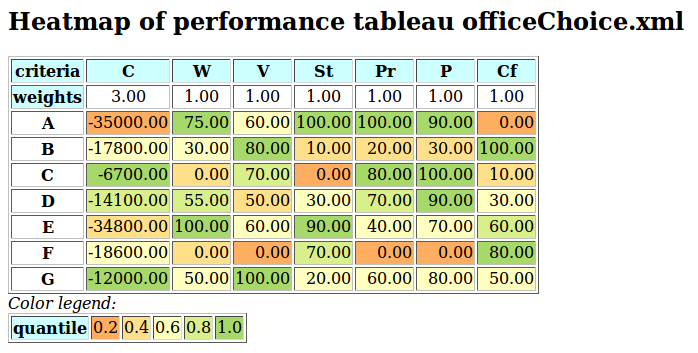

   heatmap of the office choice performance tableau
	   
Site *A* shows extreme and contradictory performances: highest *Costs* and no *Working Comfort* on one hand, and total satisfaction with respect to *Standing*, *Proximity* and *Parking facilities* on the other hand. Similar, but opposite, situation is given for site *C*: unsatisfactory *Working Space*, no *Standing* and no *Working Comfort* on the one hand, and lowest *Costs*, best *Proximity* and *Parking facilities* on the other hand. Contrary to these contradictory alternatives, we observe two appealing compromise decision alternatives: sites *D* and *G*. Finally, site *F* is clearly the less satisfactory alternative of all.

Outranking digraph
..................

To help now the CEO choosing the best site, we are going to compute pairwise outrankings (see [BIS-2013]_) on the set of potential sites. For two sites *x* and *y*, the situation "*x* outranks *y*", denoted (*x* S *y*), is given if there is:

     1. a **significant majority** of criteria concordantly supporting that site *x* is *at least as satisfactory as* site *y*, and
     2. **no considerable** counter-performance observed on any discordant criterion.

The credibility of each pairwise outranking situation (see [BIS-2013]_), denoted r(*x* S *y*), is measured in a bipolar significance valuation [-100.00, 100.00], where **positive** terms r(*x* S *y*) > 0.0 indicate a **validated**, and **negative** terms r(*x* S *y*) < 0.0 indicate a **non-validated** outrankings; whereas the **median** value r(*x* S *y*) = 0.0 represents an **indeterminate** situation (see [BIS-2004]_).   

.. figure:: officeChoiceOutranking.png
   :name: officeChoiceOutranking
   :width: 400 px
   :align: center

   The office choice outranking digraph  

For computing such a bipolar-valued outranking digraph from the given performance tableau *t*, we use the ``BipolarOutrankingDigraph`` constructor from the :ref:`outrankingDigraphs-label` module. The ``Digraph.showHTMLRelationTable`` method shows here the resulting bipolar-valued adjacency matrix in a system browser window (see :numref:`officeChoiceOutranking`).

.. code-block:: pycon

   >>> from outrankingDigraphs import BipolarOutrankingDigraph
   >>> g = BipolarOutrankingDigraph(t)
   >>> g.showHTMLRelationTable()
	   
We may notice that Alternative *D* is **positively outranking** all other potential office sites (a *Condorcet winner*). Yet, alternatives *A* (the most expensive) and *C* (the cheapest) are *not* outranked by any other site; they are in fact **weak** *Condorcet winners*.

.. code-block:: pycon

   >>> g.condorcetWinners()
    ['D']
   >>> g.weakCondorcetWinners()
    ['A', 'C', 'D']

We may get even more insight in the apparent outranking situations when looking at the Condorcet digraph (see :numref:`officeChoice`).

.. code-block:: pycon

   >>> g.exportGraphViz('officeChoice')
    *---- exporting a dot file for GraphViz tools ---------*
    Exporting to officeChoice.dot
    dot -Grankdir=BT -Tpng officeChoice.dot -o officeChoice.png

.. figure:: officeChoice.png
   :name: officeChoice	    
   :width: 300 px
   :align: center

   The office choice outranking digraph 	   

One may check that the outranking digraph *g* does not admit in fact a cyclic strict preference situation.

.. code-block:: pycon

   >>> g.computeChordlessCircuits()
    []
   >>> g.showChordlessCircuits()
    No circuits observed in this digraph.
    *---- Chordless circuits ----*
    0 circuits.

*Rubis* best choice recommendations
...................................

Following the Rubis outranking method (see [BIS-2008]_), potential best choice recommendations are determined by the outranking prekernels --weakly independent and strictly outranking choices-- of the outranking digraph (see the tutorial on :ref:`Kernel-Tutorial-label`). The case given, we previously need to break open all chordless circuits at their weakest link. As we observe no such chordless circuits here, we may directly compute the prekernels of *g*.

.. code-block:: pycon
   :linenos:

   >>> g.showPreKernels()
    *--- Computing preKernels ---*
    Dominant preKernels :
    ['D']
       independence :  100.0
       dominance    :  11.111
       absorbency   :  -100.0
       covering     :  1.000
    ['B', 'E', 'C']
       independence :  0.00
       dominance    :  11.111
       absorbency   :  -100.0
       covering     :  0.500
    ['A', 'G']
       independence :  0.00
       dominance    :  55.556
       absorbency   :  0.00
       covering     :  0.700
    Absorbent preKernels :
    ['F', 'A']
       independence :  0.00
       dominance    :  0.00
       absorbency   :  100.0
       covering     :  0.700
    *----- statistics -----
    graph name:  rel_officeChoice.xml
    number of solutions
     dominant kernels :  3
     absorbent kernels:  1
    cardinality frequency distributions
    cardinality     :  [0, 1, 2, 3, 4, 5, 6, 7]
    dominant kernel :  [0, 1, 1, 1, 0, 0, 0, 0]
    absorbent kernel:  [0, 0, 1, 0, 0, 0, 0, 0]
    Execution time  : 0.00018 sec.
    Results in sets: dompreKernels and abspreKernels.

We notice three potential best choice recommendations: the Condorcet winner *D* (Line 4), the triplet *B*, *C* and *E* (Line 9), and finally the pair *A* and *G* (Line 14). The Rubis best choice recommendation is given by the **most determined** prekernel; the one supported by the most significant criteria coalition. This result is shown with the following command.

.. code-block:: pycon
   :linenos:

   >>> g.showBestChoiceRecommendation(CoDual=False)
    *****************************************
    Rubis best choice recommendation(s) (BCR)
     (in decreasing order of determinateness)   
    Credibility domain: [-100.00,100.00]
    === >> potential best choice(s)
    * choice              : ['D']
      independence        : 100.00
      dominance           : 11.11
      absorbency          : -100.00
      covering (%)        : 100.00
      determinateness (%) : 55.56
      - most credible action(s) = { 'D': 2.07, }
    === >> potential best choice(s)
    * choice              : ['A', 'G']
      independence        : 0.00
      dominance           : 55.56
      absorbency          : 0.00
      covering (%)        : 70.00
      determinateness (%) : 50.00
      - most credible action(s) = { }
    === >> potential best choice(s)
    * choice              : ['B', 'C', 'E']
      independence        : 0.00
      dominance           : 11.11
      absorbency          : -100.00
      covering (%)        : 50.00
      determinateness (%) : 50.00
      - most credible action(s) = { }
    === >> potential worst choice(s) 
    * choice              : ['A', 'F']
      independence        : 0.00
      dominance           : 0.00
      absorbency          : 100.00
      covered (%)         : 70.00
      determinateness (%) : 50.00
      - most credible action(s) = { }
    Execution time: 0.014 seconds

We notice in Line 6 above that the most significantly supported best
choice recommendation is indeed the *Condorcet* winner *D* with a
majority of 56% of the criteria significance (see Line 12). Both other
potential best choice recommendations, as well as the potential worst
choice recommendation, are not positively validated as best,
resp. worst choices. They may or may not be considered so. Alternative *A*, with extreme contradictory performances, appears both, in a best and a worst choice recommendation (see Lines 27 and 37) and seams hence not actually comparable to its competitors.

Computing *strict best* choice recommendations
..............................................

When comparing now the performances of alternatives *D* and *G* on a
pairwise perspective (see below), we notice that, with the given preference discrimination thresholds, alternative *G* is actually **certainly** *at least as good as* alternative *D* ( r(*G* outranks *D*) = 100.0).

.. code-block:: pycon
   :linenos:

   >>> g.showPairwiseComparison('G','D')
    *------------  pairwise comparison ----*
    Comparing actions : (G, D)
    crit. wght.  g(x)      g(y)    diff.  |   ind     pref    concord 	|
    =========================================================================
    C   3.00 -12000.00 -14100.00 +2100.00 | 1000.00 2500.00   +3.00 	| 
    Cf  1.00     50.00     30.00   +20.00 |   10.00   20.00   +1.00 	| 
    P   1.00     80.00     90.00   -10.00 |   10.00   20.00   +1.00 	| 
    Pr  1.00     60.00     70.00   -10.00 |   10.00   20.00   +1.00 	| 
    St  1.00     20.00     30.00   -10.00 |   10.00   20.00   +1.00 	| 
    V   1.00    100.00     50.00   +50.00 |   10.00   20.00   +1.00 	| 
    W   1.00     50.00     55.00    -5.00 |   10.00   20.00   +1.00 	|
    =========================================================================
    Valuation in range: -9.00 to +9.00; global concordance: +9.00

However, we must as well notice that the cheapest alternative *C* is in fact **strictly outranking** alternative *G*.

.. code-block:: pycon
   :linenos:

   >>> g.showPairwiseComparison('C','G')
    *------------  pairwise comparison ----*
    Comparing actions : (C, G)/(G, C)
    crit. wght.   g(x)     g(y)      diff.  |   ind.   pref.   	(C,G)/(G,C) |
    =============================================================================
    C     3.00 -6700.00 -12000.00  +5300.00 | 1000.00 2500.00   +3.00/-3.00 | 
    Cf    1.00    10.00     50.00    -40.00 |   10.00   20.00   -1.00/+1.00 | 
    P     1.00   100.00     80.00    +20.00 |   10.00   20.00   +1.00/-1.00 | 
    Pr    1.00    80.00     60.00    +20.00 |   10.00   20.00   +1.00/-1.00 | 
    St    1.00     0.00     20.00    -20.00 |   10.00   20.00   -1.00/+1.00 | 
    V     1.00    70.00    100.00    -30.00 |   10.00   20.00   -1.00/+1.00 | 
    W     1.00     0.00     50.00    -50.00 |   10.00   20.00   -1.00/+1.00 |
    =========================================================================
    Valuation in range: -9.00 to +9.00; global concordance: +1.00/-1.00

To model these *strict outranking* situations, we may compute the Rubis best choice recommendation on the **codual**, the converse (~) of the dual (-) [14]_, of the outranking digraph instance *g* (see [BIS-2013]_), as follows.

.. code-block:: pycon
   :linenos:

   >>> g.showBestChoiceRecommendation(CoDual=True,ChoiceVector=True)
    * --- Best and worst choice recommendation(s) ---*
    (in decreasing order of determinateness)   
    Credibility domain:  {'min':-100.0, 'max': 100.0', 'med':0.0'}
    === >> potential best choice(s)
    * choice                : ['A', 'C', 'D']
      independence          : 0.00
      dominance             : 11.11
      absorbency            : 0.00
      covering (%)          : 41.67
      determinateness (%)   : 53.17
      characteristic vector :  
	 { 'D': 11.11, 'A': 0.00, 'C': 0.00, 'G': 0.00,
	   'B': -11.11, 'E': -11.11, 'F': -11.11 }
    === >> potential worst choice(s)
    * choice                : ['A', 'F']
      independence          : 0.00
      dominance             : -55.56
      absorbency            : 100.00
      covered (%)           : 50.00
      determinateness (%)   : 50.00
      characteristic vector : 
	 {'A': 0.00, 'B': 0.00, 'C': 0.00, 'D': 0.00, 
	  'E': 0.00, 'F': 0.00, 'G': 0.00, }

It is interesting to notice that the **strict best choice recommendation** consists in the set of weak Condorcet winners: 'A', 'C' and 'D' (see Line 6). In the corresponding characteristic vector (see Line 14-15), representing the bipolar credibility degree with which each alternative may indeed be considered a best choice (see [BIS-2006a]_, [BIS-2006b]_), we find confirmed that alternative *D* is the only positively validated one, whereas both extreme alternatives - *A* (the most expensive) and *C* (the cheapest) - stay in an indeterminate situation. They may be potential best choice candidates besides *D*. Notice furthermore that compromise alternative *G*, while not actually included in the crisp best choice recommendation, shows as well an indeterminate situation with respect to being or not a potential best choice candidate. 

We may also notice (see Line 17 and Line 21) that both alternatives *A* and *F* are reported as certainly outranked choices, hence a **potential worst choice recommendation** . This confirms again the global incomparability status of alternative *A*.

Weakly ordering the outranking digraph
......................................

To get a more complete insight in the overall strict outranking situations, we may use the :py:class:`transitiveDigraphs.RankingByChoosingDigraph` constructor imported from the :ref:`transitiveDigraphs-label`, for computing a **ranking-by-choosing** result from the strict outranking digraph instance *gcd*.

.. code-block:: pycon
   :linenos:

   >>> from tranditiveDigraphs import RankingByChoosingDigraph
   >>> gcd = ~(-g)
   >>> rbc = RankingByChoosingDigraph(gcd)
    Threading ...  ## multiprocessing if 2 cores are available
    Exiting computing threads
   >>> rbc.showRankingByChoosing()
    Ranking by Choosing and Rejecting
    1st ranked ['D'] (0.28)
       2nd ranked ['C', 'G'] (0.17)
       2nd last ranked ['B', 'C', 'E'] (0.22)
    1st last ranked ['A', 'F'] (0.50)
   >>> rbc.exportGraphViz('officeChoiceRanking')
    *---- exporting a dot file for GraphViz tools ---------*
    Exporting to officeChoiceRanking.dot
    0 { rank = same; A; C; D; }
    1 { rank = same; G; } 
    2 { rank = same; E; B; }
    3 { rank = same; F; }
    dot -Grankdir=TB -Tpng officeChoiceRanking.dot -o officeChoiceRanking.png

.. figure:: officeChoiceRanking.png
   :width: 200 px
   :align: center

   Ranking-by-choosing from the office choice outranking digraph
	   
In this **ranking-by-choosing** method, where we operate the *epistemic fusion* of iterated (strict) best and worst choices, compromise alternative *D* is indeed ranked before compromise alternative *G*. If the computing node supports multiple processor cores, best and worst choosing iterations are run in parallel. The overall partial ordering result shows again the important fact that the most expensive site *A*, and the cheapest site *C*, both appear incomparable with most of the other alternatives, as is apparent from the Hasse diagram (see above) of the ranking-by-choosing relation. 

The best choice recommendation appears hence depending on the very
importance the CEO is attaching to each of the three objectives he is
considering. In the setting here, where he considers all three
objectives to be **equally important** (minimize costs = 3.0, maximize
turnover = 3.0, and maximize working conditions = 3.0), site *D*
represents actually the best compromise. However, if *Costs* do not
play much a role, it would be perhaps better to decide to move to the most advantageous site *A*; or if, on the contrary, *Costs* do matter a lot, moving to the cheapest alternative *C* could definitely represent a more convincing recommendation. 

It might be worth, as an **exercise**, to modify on the one hand this importance balance in the XMCDA data file by lowering the significance of the *Costs* criterion; all criteria are considered **equi-significant** (weight = 1.0) for instance. It may as well be opportune, on the other hand, to **rank** the importance of the three objectives as follows:  *minimize costs* (weight = 9.0) **>** *maximize turnover* (weight = 3 x 2.0) **>** *maximize working conditions* (weight = 3 x 1.0). What will become the best choice recommendation under both working hypotheses?  

For further reading about the *Rubis* Best Choice on may consult the following real decision aid case study about choosing a best poster in a scientific conference [BIS-2015]_ .

Back to :ref:`Content Table <Tutorial-label>`

..
   See also the lecture 7 notes from the MICS Algorithmic Decision Theory course: [ADT-L7]_.

.. _Rating-Tutorial-label:

Rating with learned quantile norms
----------------------------------

.. contents:: 
	:depth: 2
	:local:

Introduction
............
	  
In this tutorial we address the problem of **rating multiple criteria performances** of a set of potential decision alternatives with respect to empirical order statistics, i.e. performance quantiles learned from historical performance data gathered from similar decision alternatives observed in the past (see [CPSTAT-L5]_).

To illustrate the decision problem we face, consider for a moment that, in a given decision aid study, we observe, for instance in the Table below, the multi-criteria performances of two potential decision alternatives, named *a1001* and *a1010*, marked on 7 **incommensurable** preference criteria: 2 **costs** criteria *c1* and *c2* (to **minimize**) and 6 **benefits** criteria *b1* to *b5* (to **maximize**). 

   ============= ======== ======== ======== ======== ======== ======== ======== 
     Criterion      b1       b2       b3       b4       b5       c1      c2
   ============= ======== ======== ======== ======== ======== ======== ========
       weight        2        2        2        2        2        5       5
   ------------- -------- -------- -------- -------- -------- -------- --------
      *a1001*      37.0       2        2      61.0     31.0      -4    -40.0   
      *a1010*      32.0       9        6      55.0     51.0      -4    -35.0
   ============= ======== ======== ======== ======== ======== ======== ========

The performances on *benefits* criteria *b1*, *b4* and *b5* are measured on a cardinal scale from 0.0 (worst) to 100.0 (best) whereas, the performances on the *benefits* criteria *b2* and *b3*  and on the *cost* criterion *c1* are measured on an ordinal scale from 0 (worst) to 10 (best), respectively -10 (worst) to 0 (best). The performances on the *cost* criterion *c2* are again measured on a cardinal negative scale from -100.00 (worst) to 0.0 (best).

The importance (sum of weights) of the *costs* criteria is **equal** to the importance (sum of weights) of the *benefits* criteria taken all together.
   
The non trivial decision problem we now face here, is to decide, how the multiple criteria performances of *a1001*, respectively *a1010*,  may be rated (**excellent** ? **good** ?, or **fair** ?; perhaps even, **weak** ? or **very weak** ?) in an **order statistical sense**, when compared with all potential similar multi-criteria performances one has already encountered in the past. 

To solve this *absolute* rating decision problem, first, we need to estimate multi-criteria **performance quantiles** from historical records.  

Incremental learning of historical performance quantiles
........................................................

See also the technical documentation of the :ref:`performanceQuantiles-label`.

Suppose that we see flying in random multiple criteria performances from a given model of random performance tableau (see the :py:mod:`randomPerfTabs` module). The question we address here is to estimate empirical performance quantiles on the basis of so far observed performance vectors. For this task, we are inspired by [CHAM-2006]_ and [NR3-2007]_, who present an efficient algorithm for incrementally updating a quantile-binned cumulative distribution function (CDF) with newly observed CDFs.

The :py:class:`performanceQuantiles.PerformanceQuantiles` class implements such a performance quantiles estimation based on a given performance tableau. Its main components are:

  * Ordered **objectives** and a **criteria** dictionaries from a valid performance tableau instance;
  * A list **quantileFrequencies** of quantile frequencies like *quartiles* [0.0, 0.25, 05, 0.75,1.0], *quintiles* [0.0, 0.2, 0.4, 0.6, 0.8, 1.0] or *deciles* [0.0, 0.1, 0.2, ... 1.0] for instance;
  * An ordered  dictionary **limitingQuantiles** of so far estimated *lower* (default) or *upper* quantile class limits for each frequency per criterion;
  * An ordered dictionary **historySizes** for keeping track of the number of evaluations seen so far per criterion. Missing data may make these sizes vary from criterion to criterion.

Below, an example Python session concerning 900 decision alternatives randomly generated from a *Cost-Benefit* Performance tableau model from which are also drawn the performances of alternatives *a1001* and *a1010* above.

.. code-block:: pycon
   :linenos:

   >>> from performanceQuantiles import PerformanceQuantiles
   >>> from randomPerfTabs import RandomCBPerformanceTableau
   >>> nbrActions=900
   >>> nbrCrit = 7
   >>> seed = 100
   >>> tp = RandomCBPerformanceTableau(numberOfActions=nbrActions,\
   ...               numberOfCriteria=nbrCrit,seed=seed)
   >>> pq = PerformanceQuantiles(tp,\
   ...               numberOfBins = 'quartiles',\
   ...               LowerClosed=True)
   >>> pq.__dict__.keys()
    dict_keys(['objectives', 'LowerClosed', 'name',
    'quantilesFrequencies', 'criteria', 'historySizes',
    'limitingQuantiles', ... ])

The :py:class:`performanceQuantiles.PerformanceQuantiles` class parameter *numberOfBins* (see Line 9 above), choosing the wished number of quantile frequencies, may be either **quartiles** (4 bins), **quintiles** (5 bins), **deciles** (10 bins) , **dodeciles** (20 bins) or any other integer number of quantile bins. The quantile bins may be either **lower closed** (default) or **upper-closed**.

.. code-block:: pycon
   :linenos:

   >>> # Printing out the estimated quartile limits 
   >>> pq.showLimitingQuantiles(ByObjectives=True)
    ----  Historical performance quantiles -----*
    Costs
    criteria | weights |  '0.00'   '0.25'   '0.50'   '0.75'   '1.00'   
    ---------|-------------------------------------------------------
       'c1'  |    5    |   -10      -7       -5       -3        0  
       'c2'  |    5    | -96.37   -70.65   -50.10   -30.00    -1.43  
    Benefits
    criteria | weights | '0.00'   '0.25'   '0.50'   '0.75'    '1.00'   
    ---------|-------------------------------------------------------
       'b1'  |    2    |  1.99    29.82    49,44     70.73    99.83  
       'b2'  |    2    |    0       3        5        7        10  
       'b3'  |    2    |    0       3        5        7        10  
       'b4'  |    2    |  3.27    30.10    50.82     70.89    98.05  
       'b5'  |    2    |  0.85    29.08    48.55     69.98    97.56  

Both objectives are **equi-important**; the sum of weights (10) of the *costs* criteria balance the sum of weights (10) of the *benefits* criteria (see column 2). The preference direction of the *costs* criteria *c1* and *c2* is **negative**; the lesser the costs the better it is, whereas all the *benefits* criteria *b1* to *b5* show **positive** preference directions, i.e. the higher the benefits the better it is. The columns entitled '0.0', resp. '1.0' show the *quartile* *Q0*, resp. *Q4*, i.e. the **worst**, resp. **best** performance observed so far on each criterion. Column '0.5' shows the **median** (*Q2*) observed on the criteria.  

New  decision alternatives with random multiple criteria performance vectors from the same random performance tableau model may now be generated with ad hoc random performance generators. We provide for experimental purpose, in the :py:mod:`randomPerfTabs` module, three such generators: one for the standard :py:class:`randomPerfTabs.RandomPerformanceTableau` model, one the for the two objectives :py:class:`randomPerfTabs.RandomCBPerformanceTableau` Cost-Benefit model, and one for the :py:class:`randomPerfTabs.Random3ObjectivesPerformanceTableau` model with three objectives concerning respectively  economic, environmental or social aspects.

Given a new Performance Tableau with 100 new decision alternatives, the so far estimated historical quantile limits may be updated as follows:

.. code-block:: pycon
   :linenos:

   >>> # generate 100 new random decision alternatives
   >>> from randomPerfTabs import RandomPerformanceGenerator
   >>> rpg = RandomPerformanceGenerator(tp,seed=seed)
   >>> newTab = rpg.randomPerformanceTableau(100)
   >>> # Updating the quartile norms shown above 
   >>> pq.updateQuantiles(newTab,historySize=None)

Parameter *historySize* (see Line 6) of the :py:meth:`performanceQuantiles.PerformanceQuantiles.updateQuantiles` method allows to **balance** the **new** evaluations against the **historical** ones. With **historySize = None** (the default setting), the balance in the example above is 900/1000 (90%, weight of historical data) against 100/1000 (10%, weight of the new incoming observations). Putting **historySize = 0**, for instance, will ignore all historical data (0/100 against 100/100) and restart building the quantile estimation with solely the new incoming data. The updated quantile limits may be shown in a browser view (see :numref:`examplePerfQuantiles`).

.. code-block:: pycon

   >>> # showing the updated quantile limits in a browser view
   >>> pq.showHTMLLimitingQuantiles(Transposed=True)

.. figure:: examplePerfQuantiles.png
    :name: examplePerfQuantiles
    :alt: Example limiting quantiles html show method
    :width: 400 px
    :align: center

    Showing the updated quartiles limits	    
    

Rating new performances with quantile norms
...........................................

For *absolute rating* of a newly given set of decision alternatives with the help of empirical performance quantiles estimated from historical data, we provide the :py:class:`sortingDigraphs.NormedQuantilesRatingDigraph` class, a specialisation of the :py:class:`sortingDigraphs.QuantilesSortingDigraph` class.

The constructor requires a valid :py:class:`performanceQuantiles.PerformanceQuantiles` instance.

.. note::

   It is important to notice that the :py:class:`sortingDigraphs.NormedQuantilesRatingDigraph` class, contrary to the generic :py:class:`outrankingDigraphs.OutrankingDigraph` class, does not inherit from the generic :py:class:`perfTabs.PerformanceTableau` class, but instead from the :py:class:`performanceQuantiles.PerformanceQuantiles` class. The **actions** in such a :py:class:`sortingDigraphs.NormedQuantilesRatingDigraph` class instance contain not only the newly given decision alternatives, but also the historical quantile profiles obtained from a given :py:class:`performanceQuantiles.PerformanceQuantiles` class instance, i.e. estimated quantile bins' performance limits from historical performance data.

We reconsider the :code:`PerformanceQuantiles` object instance *pq* as computed in the previous section. Let *newActions* be a list of 10 new decision alternatives generated with the same random performance tableau model and including the two decision alternatives *a1001* and *a1010* mentioned at the beginning.

.. code-block:: pycon

   >>> from sortingDigraphs import NormedQuantilesRatingDigraph
   >>> newActions = rpg.randomActions(10)
   >>> nqr = NormedQuantilesRatingDigraph(pq,newActions,rankingRule='best')
   >>> print(nqr)
    *---- Object instance description
    Instance class      : NormedQuantilesRatingDigraph
    Instance name       : normedRatingDigraph
    # Criteria          : 7
    # Quantile profiles : 4
    # New actions       : 10
    Size                : 93
    Determinateness (%)     : 52.17
    Attributes: ['runTimes','objectives','criteria',
     'LowerClosed','quantilesFrequencies','limitingQuantiles',
     'historySizes','cdf','name','newActions','evaluation',
     'categories','criteriaCategoryLimits','profiles','profileLimits',
     'hasNoVeto','actions','completeRelation','relation',
     'concordanceRelation','valuationdomain','order','gamma',
     'notGamma','rankingRule','rankingCorrelation','rankingScores',
     'actionsRanking','ratingCategories','ratingRelation',
     'relationOrig','rankingByBestChoosing']
    *---- Constructor run times (in sec.)
    #Threads         : 1
    Total time       : 0.01636
    Data input       : 0.00051
    Quantile classes : 0.00006
    Compute profiles : 0.00005
    Compute relation : 0.01420
    Compute rating   : 0.00154

Data input to the :py:class:`sortingDigraphs.NormedQuantilesRatingDigraph` class constructor (see Line 3) are a valid PerformanceQuantiles object *pq* and a compatible list *newActions* of new decision alternatives generated from the same random origin.

Let us have a look at the digraph's nodes, here called **newActions**.

.. code-block:: pycon
   :linenos:

   >>> nqr.showPerformanceTableau(actionsSubset=nqr.newActions)
    *----  performance tableau -----*
    criteria | a1001 a1002 a1003 a1004 a1005 a1006 a1007 a1008 a1009 a1010   
    ---------|-------------------------------------------------------------
       'b1'  |  37.0  27.0  24.0  16.0  42.0  33.0  39.0  64.0  42.0  32.0  
       'b2'  |   2.0   5.0   8.0   3.0   3.0   3.0   6.0   5.0   4.0   9.0  
       'b3'  |   2.0   4.0   2.0   1.0   6.0   3.0   2.0   6.0   6.0   6.0  
       'b4'  |  61.0  54.0  74.0  25.0  28.0  20.0  20.0  49.0  44.0  55.0  
       'b5'  |  31.0  63.0  61.0  48.0  30.0  39.0  16.0  96.0  57.0  51.0  
       'c1'  |  -4.0  -6.0  -8.0  -5.0  -1.0  -5.0  -1.0  -6.0  -6.0  -4.0  
       'c2'  | -40.0 -23.0 -37.0 -37.0 -24.0 -27.0 -73.0 -43.0 -94.0 -35.0  

Among the 10 new incoming decision alternatives (see below), we recognize alternatives *a1001* (see column 2) and *a1010* (see last column) we have mentioned in our introduction.

The :py:class:`NormedQuantilesRatingDigraphdigraph` instance's *actions* dictionary also contains the closed lower limits of the four quartile classes: *m1* = [0.0- [, *m2* = [0.25- [, *m3* = [0.5- [, *m4* = [0.75 - [.

.. code-block:: pycon
   :linenos:

   >>> nqr.showPerformanceTableau(actionsSubset=nqr.profiles)
    *----  Quartiles limit profiles -----*
    criteria |   'm1'   'm2'   'm3'   'm4'   
    ---------|----------------------------
       'b1'  |    2.0   28.8   49.6   75.3  
       'b2'  |    0.0    2.9    4.9    6.7  
       'b3'  |    0.0    2.9    4.9    8.0  
       'b4'  |    3.3   35.9   58.6   72.0  
       'b5'  |    0.8   32.8   48.1   69.7  
       'c1'  |  -10.0   -7.4   -5.4   -3.4  
       'c2'  |  -96.4  -72.2  -52.3  -34.0  

The main run time (see Lines 23-29 of the object description above) is spent by the class constructor in computing a bipolar-valued outranking relation on the extended actions set including both the new alternatives as well as the quartile class limits. In case of large volumes, i.e. many new decision alternatives and centile classes for instance, a multi-threading version may be used when multiple processing cores are available (see the technical description of the :py:class:`sortingDigraphs.NormedQuantilesRatingDigraph` class).

The actual rating procedure will rely on a complete ranking of the new decision alternatives as well as the quantile class limits obtained from the corresponding bipolar-valued outranking digraph. Two efficient and scalable ranking rules, the **Copeland** and its valued version, the **Netflows** rule may be used for this purpose. The *rankingRule* parameter allows to choose one of both. With *rankingRule='best'* (see Line 2 above) the :code:`NormedQuantilesRatingDigraph` constructor will choose the ranking rule that results in the highest ordinal correlation with the given outranking relation (see [BIS-2012]_).

In this rating example, the *NetFlows* rule appears to be the more appropriate ranking rule.

.. code-block:: pycon
   :linenos:

   >>> print('Ranking rule        :', nqr.rankingRule)
    Ranking rule        : NetFlows
   >>> print('Actions ranking     :', nqr.actionsRanking)
    Actions ranking     : 
    ['m4', 'a1005', 'a1010', 'a1008', 'a1002', 'a1006',
    'm3', 'a1003', 'a1001', 'a1007', 'a1004', 'a1009',
    'm2', 'm1']
   >>> print('Ranking correlation : %+.2f' %\
    ...         (nqr.rankingCorrelation['correlation']) )
    Ranking correlation : +0.938

We achieve here a linear ranking without ties (from best to worst) of the digraph's actions, i.e. including the new decision alternatives as well as the quartile limits *m1* to *m4*, which is very close in an ordinal sense (*tau* = 0.94) to the underlying valued outranking relation.

The eventual rating procedure is based on the lower quantile limits, such that we may collect the quartile classes' contents in increasing order of the *quartiles* lower limits.

.. code-block:: pycon

   >>> print('Rating categories:', nqr.ratingCategories)
    Rating categories: OrderedDict([
    ('m2', ['a1003', 'a1001', 'a1007', 'a1004', 'a1009']),
    ('m3', ['a1005', 'a1010', 'a1008', 'a1002', 'a1006'])])
    
We notice above that no new decision alternative is rated in the lowest [0.0-0.25[, respectively highest [0.75- [ quartile class. Indeed, the rating result is shown, in descending order, as follows:

.. code-block:: pycon

   >>> nqr.showQuantilesRating()
    *-------- Quartiles rating result ---------
    [0.50 - 0.75[ ['a1005', 'a1010', 'a1008', 'a1002', 'a1006']
    [0.25 - 0.50[ ['a1003', 'a1001', 'a1007', 'a1004', 'a1009']
    
The same result may even more conveniently be consulted in a browser view via a specialised rating heatmap format ( see :py:meth:`perfTabs:PerformanceTableau.showHTMLPerformanceHeatmap` method (see :numref:`heatMap1`).

.. code-block:: pycon

   >>> nqr.showHTMLRatingHeatmap(pageTitle='Heatmap of Quartiles Rating',
    ...               Correlations=True,colorLevels=5)

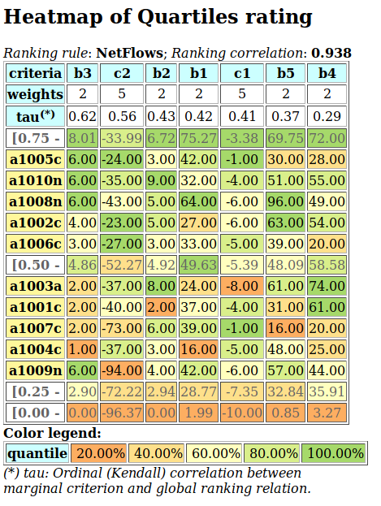

    heatmap of normed quartiles ranking 
	    
Using furthermore a specialised version of the :py:meth:`transitiveDigraphs.TransitiveDigraph.exportGraphViz` method allows drawing the same rating result in a Hasse diagram format (see :numref:`normedRatingDigraph`).

.. code-block:: pycon

   >>> nqr.exportRatingGraphViz('normedRatingDigraph')
    *---- exporting a dot file for GraphViz tools ---------*
     Exporting to normedRatingDigraph.dot
     dot -Grankdir=TB -Tpng normedRatingDigraph.dot -o normedRatingDigraph.png

.. figure:: normedRatingDigraph.png
    :name: normedRatingDigraph
    :alt: drawing of normed Quartiles Rating Digraph
    :width: 500 px
    :align: center

    Normed quartiles rating digraph

We may now answer the **normed rating decision problem** stated at the beginning. Decision alternative *a1001* is rated in quartile **Q2** and alternative *a1010* in quartile **Q3** (see Table below). Indeed, the performances of decision alternative *a1001* were generated with a triangular law at a *low* mode, i.e. low costs but also low benefits, whereas the performances of alternative *a1010* were generated with a *median* mode.   

   ============ =========== ======== ======== ======== ======== ======== ======== ========
      Rating     Criterion     b1       b2       b3       b4       b5       c1       c2    
   ============ =========== ======== ======== ======== ======== ======== ======== ========
    quartiles      weight       2        2        2        2        2        5        5     
      **Q2**       *a1001*    37.0      2        2      61.0     31.0       -4     -40.0    
      **Q3**       *a1010*    32.0      9        6      55.0     51.0       -4     -35.0 
   ============ =========== ======== ======== ======== ======== ======== ======== ========

A more precise rating result may be achieved when we use **deciles** instead of *quartiles* for estimating the historical cumulative distribution functions.

.. code-block:: pycon
   :linenos:

   >>> pq1 = PerformanceQuantiles(tp, numberOfBins = 'deciles',\
   ...              LowerClosed=True)
   >>> nqr1 = NormedQuantilesRatingDigraph(pq1,newActions,rankingRule='best')
   >>> nqr1.showQuantilesRating()
    *-------- Deciles rating result ---------
    [0.60 - 0.70[ ['a1005', 'a1010', 'a1008', 'a1002']
    [0.50 - 0.60[ ['a1006', 'a1001', 'a1003']
    [0.40 - 0.50[ ['a1007', 'a1004']
    [0.30 - 0.40[ ['a1009']

Compared with the quartiles rating result, we notice that the five alternatives (*a1002*, *a1005*, *a1006*, *a1008*, and *a1010*), rated before into the third quartile class [0.50-0.75[, are now divided up: alternatives *a1002*, *a1005*, *a1008* and *a1010* attain the 7th decile class [0.6-0.7[, whereas alternative *a1006* attains only the the 6th decile class [0.5-0.6[. Of the five *Q2* [0.25-0.50[ rated alternatives (*a1001*, *a1003*, *a1004*, *a1006* and *a1007*), alternatives *a1001* and *a1003* are now rated in the 6th decile class [0.5 - 0.6[, whereas *a1004* and *a1007* are rated the 5th decile class [0.4-0.5[ and *a1009* is lowest rated in the 4th decile class [0.3 - 0.4[.

A browser view may again more conveniently illustrate this preciser *deciles* rating result (see :numref:`heatMap2`).

.. code-block:: pycon

   >>> nqr1.showHTMLRatingHeatmap(pageTitle='Heatmap of the deciles rating',\
   ...                            colorLevels=5,Correlations=True)

.. figure:: heatMap2.png
    :name: heatMap2
    :alt: Heatmap of normed deciles rating
    :width: 400 px
    :align: center

    heatmap of mormed deciles rating 

In this preciser *deciles* rating, decision alternatives *a1001* and *a1010* are now rated in the *6th* decile (D6), respectively in the *7th* decile (D7).
    
More generally, in the case of industrial production monitoring problems, for instance, where large volumes of historical performance data may be available, it may be of interest to estimate even more precisely the marginal cumulative distribution functions with **dodeciles** or even **centiles**. Especially if **tail** rating results, i.e. distinguishing **very best**, or **very worst** multiple criteria performances, becomes a critical purpose. Similarly, the *historySize* parameter may be used for monitoring on the fly **unstable** random multiple criteria performance data.  	

Back to :ref:`Content Table <Tutorial-label>`   

.. _Graphs-Tutorial-label:

Working with the :code:`graphs` module
--------------------------------------

.. contents:: 
	:depth: 2
	:local:

See also the technical documentation of the :ref:`graphs-label`.

Structure of a ``Graph`` object
...............................

In the :py:mod:`graphs` module, the root :py:class:`graphs.Graph` class provides a generic **simple graph model**, without loops and multiple links. A given object of this class consists in:

1. the graph **vertices** : a dictionary of vertices with 'name' and 'shortName' attributes,
2. the graph **valuationDomain** , a dictionary with three entries: the minimum (-1, means certainly no link), the median (0, means missing information) and the maximum characteristic value (+1, means certainly a link),
3. the graph **edges** : a dictionary with frozensets of pairs of vertices as entries carrying a characteristic value in the range of the previous valuation domain,
4. and its associated **gamma function** : a dictionary containing the direct neighbors of each vertex, automatically added by the object constructor.

See the technical documentation of the :ref:`graphs-label`.

Example Python3 session

.. code-block:: pycon

   >>> from graphs import Graph
   >>> g = Graph(numberOfVertices=7,edgeProbability=0.5)
   >>> g.save(fileName='tutorialGraph')

The saved Graph instance named :code:`tutorialGraph.py` is encoded in python3 as follows::

.. code-block:: python

    # Graph instance saved in Python format
    vertices = {
    'v1': {'shortName': 'v1', 'name': 'random vertex'},
    'v2': {'shortName': 'v2', 'name': 'random vertex'},
    'v3': {'shortName': 'v3', 'name': 'random vertex'},
    'v4': {'shortName': 'v4', 'name': 'random vertex'},
    'v5': {'shortName': 'v5', 'name': 'random vertex'},
    'v6': {'shortName': 'v6', 'name': 'random vertex'},
    'v7': {'shortName': 'v7', 'name': 'random vertex'},
    }
    valuationDomain = {'min':-1,'med':0,'max':1}
    edges = {
    frozenset(['v1','v2']) : -1, 
    frozenset(['v1','v3']) : -1, 
    frozenset(['v1','v4']) : -1, 
    frozenset(['v1','v5']) : 1, 
    frozenset(['v1','v6']) : -1, 
    frozenset(['v1','v7']) : -1, 
    frozenset(['v2','v3']) : 1, 
    frozenset(['v2','v4']) : 1, 
    frozenset(['v2','v5']) : -1, 
    frozenset(['v2','v6']) : 1, 
    frozenset(['v2','v7']) : -1, 
    frozenset(['v3','v4']) : -1, 
    frozenset(['v3','v5']) : -1, 
    frozenset(['v3','v6']) : -1, 
    frozenset(['v3','v7']) : -1, 
    frozenset(['v4','v5']) : 1, 
    frozenset(['v4','v6']) : -1, 
    frozenset(['v4','v7']) : 1, 
    frozenset(['v5','v6']) : 1, 
    frozenset(['v5','v7']) : -1, 
    frozenset(['v6','v7']) : -1, 
    }

The stored graph can be recalled and plotted with the generic :py:func:`graphs.Graph.exportGraphViz()` [1]_ method as follows.

.. code-block:: pycon

   >>> g = Graph('tutorialGraph')
   >>> g.exportGraphViz()
    *---- exporting a dot file for GraphViz tools ---------*
    Exporting to tutorialGraph.dot
    fdp -Tpng tutorialGraph.dot -o tutorialGraph.png

.. figure:: tutorialGraph.png
   :width: 400 px
   :align: center

   Tutorial graph instance

Properties, like the gamma function and vertex degrees and neighbourhood depths may be shown with a `graphs.Graph.showShort()` method.

.. code-block:: pycon
   :linenos:

   >>> g.showShort()
    *---- short description of the graph ----*
    Name             : 'tutorialGraph'
    Vertices         :  ['v1', 'v2', 'v3', 'v4', 'v5', 'v6', 'v7']
    Valuation domain :  {'min': -1, 'med': 0, 'max': 1}
    Gamma function   : 
    v1 -> ['v5']
    v2 -> ['v6', 'v4', 'v3']
    v3 -> ['v2']
    v4 -> ['v5', 'v2', 'v7']
    v5 -> ['v1', 'v6', 'v4']
    v6 -> ['v2', 'v5']
    v7 -> ['v4']
    degrees      :  [0, 1, 2, 3, 4, 5, 6]
    distribution :  [0, 3, 1, 3, 0, 0, 0]
    nbh depths   :  [0, 1, 2, 3, 4, 5, 6, 'inf.']
    distribution :  [0, 0, 1, 4, 2, 0, 0, 0]

A ``Graph`` instance corresponds bijectively to a symmetric ``Digraph`` instance and we may easily convert from one to the other with the :py:func:`graphs.Graph.graph2Digraph()`, and vice versa with the :py:func:`digraphs.Digraph.digraph2Graph()` method. Thus, all resources of the :py:class:`digraphs.Digraph` class, suitable for symmetric digraphs, become readily available, and vice versa.

.. code-block:: pycon
   :linenos:

   >>> dg = g.graph2Digraph()
   >>> dg.showRelationTable(ndigits=0,ReflexiveTerms=False)
    * ---- Relation Table -----
      S  |  'v1'  'v2'  'v3'  'v4'  'v5'  'v6'  'v7'	  
    -----|------------------------------------------
    'v1' |    -    -1    -1    -1     1    -1    -1	 
    'v2' |   -1     -     1     1    -1     1    -1	 
    'v3' |   -1     1     -    -1    -1    -1    -1	 
    'v4' |   -1     1    -1     -     1    -1     1	 
    'v5' |    1    -1    -1     1     -     1    -1	 
    'v6' |   -1     1    -1    -1     1     -    -1	 
    'v7' |   -1    -1    -1     1    -1    -1     -
    >>> g1 = dg.digraph2Graph()
    >>> g1.showShort()
    *---- short description of the graph ----*
    Name             : 'tutorialGraph'
    Vertices         :  ['v1', 'v2', 'v3', 'v4', 'v5', 'v6', 'v7']
    Valuation domain :  {'med': 0, 'min': -1, 'max': 1}
    Gamma function   : 
    v1 -> ['v5']
    v2 -> ['v3', 'v6', 'v4']
    v3 -> ['v2']
    v4 -> ['v5', 'v7', 'v2']
    v5 -> ['v6', 'v1', 'v4']
    v6 -> ['v5', 'v2']
    v7 -> ['v4']
    degrees      :  [0, 1, 2, 3, 4, 5, 6]
    distribution :  [0, 3, 1, 3, 0, 0, 0]
    nbh depths   :  [0, 1, 2, 3, 4, 5, 6, 'inf.']
    distribution :  [0, 0, 1, 4, 2, 0, 0, 0]

q-coloring of a graph
.....................

A 3-coloring of the tutorial graph *g* may for instance be computed and plotted with the :py:class:`graphs.Q_Coloring` class as follows.

.. code-block:: pycon

   >>> from graphs import Q_Coloring
   >>> qc = Q_Coloring(g)
    Running a Gibbs Sampler for 42 step !
    The q-coloring with 3 colors is feasible !!
   >>> qc.showConfiguration()
    v5 lightblue
    v3 gold
    v7 gold
    v2 lightblue
    v4 lightcoral
    v1 gold
    v6 lightcoral
   >>> qc.exportGraphViz('tutorial-3-coloring')
    *---- exporting a dot file for GraphViz tools ---------*
    Exporting to tutorial-3-coloring.dot
    fdp -Tpng tutorial-3-coloring.dot -o tutorial-3-coloring.png

.. figure:: tutorial-3-coloring.png
   :width: 400 px
   :align: center

   3-Coloring of the tutorial graph

Actually, with the given tutorial graph instance, a 2-coloring is already feasible.

.. code-block:: pycon

   >>> qc = Q_Coloring(g,colors=['gold','coral'])
    Running a Gibbs Sampler for 42 step !
    The q-coloring with 2 colors is feasible !!
   >>> qc.showConfiguration()
    v5 gold
    v3 coral
    v7 gold
    v2 gold
    v4 coral
    v1 coral
    v6 coral
    >>> qc.exportGraphViz('tutorial-2-coloring')
    Exporting to tutorial-2-coloring.dot
    fdp -Tpng tutorial-2-coloring.dot -o tutorial-2-coloring.png

.. figure:: tutorial-2-coloring.png
   :width: 400 px
   :align: center

   2-coloring of the tutorial graph

MIS and clique enumeration
..........................

2-colorings define independent sets of vertices that are maximal in cardinality; for short called a **MIS**. Computing such MISs in a given :code:`Graph` instance may be achieved by the `graphs.Graph.showMIS()` method.

.. code-block:: pycon
   :linenos:

   >>> g = Graph('tutorialGraph')
   >>> g.showMIS()
    *---  Maximal Independent Sets ---*
    ['v2', 'v5', 'v7']
    ['v3', 'v5', 'v7']
    ['v1', 'v2', 'v7']
    ['v1', 'v3', 'v6', 'v7']
    ['v1', 'v3', 'v4', 'v6']
    number of solutions:  5
    cardinality distribution
    card.:  [0, 1, 2, 3, 4, 5, 6, 7]
    freq.:  [0, 0, 0, 3, 2, 0, 0, 0]
    execution time: 0.00032 sec.
    Results in self.misset
   >>> g.misset
    [frozenset({'v7', 'v2', 'v5'}), 
     frozenset({'v3', 'v7', 'v5'}), 
     frozenset({'v1', 'v2', 'v7'}), 
     frozenset({'v1', 'v6', 'v7', 'v3'}), 
     frozenset({'v1', 'v6', 'v4', 'v3'})]

A MIS in the dual of a graph instance *g* (its negation *-g* [14]_), corresponds to a maximal **clique**, i.e. a maximal complete subgraph in *g*. Maximal cliques may be directly enumerated with the `graphs.Graph.showCliques()` method.

.. code-block:: pycon
   :linenos:

   >>> g.showCliques()
    *---  Maximal Cliques ---*
    ['v2', 'v3']
    ['v4', 'v7']
    ['v2', 'v4']
    ['v4', 'v5']
    ['v1', 'v5']
    ['v2', 'v6']
    ['v5', 'v6']
    number of solutions:  7
    cardinality distribution
    card.:  [0, 1, 2, 3, 4, 5, 6, 7]
    freq.:  [0, 0, 7, 0, 0, 0, 0, 0]
    execution time: 0.00049 sec.
    Results in self.cliques
   >>> g.cliques
    [frozenset({'v2', 'v3'}), frozenset({'v4', 'v7'}), 
     frozenset({'v2', 'v4'}), frozenset({'v4', 'v5'}), 
     frozenset({'v1', 'v5'}), frozenset({'v6', 'v2'}), 
     frozenset({'v6', 'v5'})]

Line graphs and maximal matchings
.................................

The module also provides a :py:class:`graphs.LineGraph` constructor. A **line graph** represents the **adjacencies between edges** of the given graph instance. We may compute for instance the line graph of the 5-cycle graph.

.. code-block:: pycon

   >>> g = CycleGraph(order=5)
   >>> g
    *------- Graph instance description ------*
    Instance class   : CycleGraph
    Instance name    : cycleGraph
    Graph Order      : 5
    Graph Size       : 5
    Valuation domain : [-1.00; 1.00]
    Attributes       : ['name', 'order', 'vertices', 'valuationDomain',
			'edges', 'size', 'gamma']
   >>> lg = LineGraph(g)
   >>> lg
    *------- Graph instance description ------*
    Instance class   : LineGraph
    Instance name    : line-cycleGraph
    Graph Order      : 5
    Graph Size       : 5
    Valuation domain : [-1.00; 1.00]
    Attributes       : ['name', 'graph', 'valuationDomain', 'vertices',
			'order', 'edges', 'size', 'gamma']
   >>> lg.showShort()
    *---- short description of the graph ----*
    Name             : 'line-cycleGraph'
    Vertices         :  [frozenset({'v1', 'v2'}), frozenset({'v1', 'v5'}), frozenset({'v2', 'v3'}),
			 frozenset({'v3', 'v4'}), frozenset({'v4', 'v5'})]
    Valuation domain :  {'min': Decimal('-1'), 'med': Decimal('0'), 'max': Decimal('1')}
    Gamma function   : 
    frozenset({'v1', 'v2'}) -> [frozenset({'v2', 'v3'}), frozenset({'v1', 'v5'})]
    frozenset({'v1', 'v5'}) -> [frozenset({'v1', 'v2'}), frozenset({'v4', 'v5'})]
    frozenset({'v2', 'v3'}) -> [frozenset({'v1', 'v2'}), frozenset({'v3', 'v4'})]
    frozenset({'v3', 'v4'}) -> [frozenset({'v2', 'v3'}), frozenset({'v4', 'v5'})]
    frozenset({'v4', 'v5'}) -> [frozenset({'v4', 'v3'}), frozenset({'v1', 'v5'})]
    degrees      :  [0, 1, 2, 3, 4]
    distribution :  [0, 0, 5, 0, 0]
    nbh depths   :  [0, 1, 2, 3, 4, 'inf.']
    distribution :  [0, 0, 5, 0, 0, 0]

Iterated line graph constructions are usually expanding, except for *chordless cycles*, where the same cycle is repeated, and for *non-closed paths*, where iterated line graphs progressively reduce one by one the number of vertices and edges and become eventually an empty graph.

Notice that the MISs in the line graph provide **maximal matchings** - *maximal sets of independent edges* - of the original graph.

.. code-block:: pycon
   :linenos:

   >>> c8 = CycleGraph(order=8)
   >>> lc8 = LineGraph(c8)
   >>> lc8.showMIS()
    *---  Maximal Independent Sets ---*
    [frozenset({'v3', 'v4'}), frozenset({'v5', 'v6'}), frozenset({'v1', 'v8'})]
    [frozenset({'v2', 'v3'}), frozenset({'v5', 'v6'}), frozenset({'v1', 'v8'})]
    [frozenset({'v8', 'v7'}), frozenset({'v2', 'v3'}), frozenset({'v5', 'v6'})]
    [frozenset({'v8', 'v7'}), frozenset({'v2', 'v3'}), frozenset({'v4', 'v5'})]
    [frozenset({'v7', 'v6'}), frozenset({'v3', 'v4'}), frozenset({'v1', 'v8'})]
    [frozenset({'v2', 'v1'}), frozenset({'v8', 'v7'}), frozenset({'v4', 'v5'})]
    [frozenset({'v2', 'v1'}), frozenset({'v7', 'v6'}), frozenset({'v4', 'v5'})]
    [frozenset({'v2', 'v1'}), frozenset({'v7', 'v6'}), frozenset({'v3', 'v4'})]
    [frozenset({'v7', 'v6'}), frozenset({'v2', 'v3'}), frozenset({'v1', 'v8'}),
     frozenset({'v4', 'v5'})]
    [frozenset({'v2', 'v1'}), frozenset({'v8', 'v7'}), frozenset({'v3', 'v4'}),
     frozenset({'v5', 'v6'})]
    number of solutions:  10
    cardinality distribution
    card.:  [0, 1, 2, 3, 4, 5, 6, 7, 8]
    freq.:  [0, 0, 0, 8, 2, 0, 0, 0, 0]
    execution time: 0.00029 sec.

The two last MISs of cardinality 4 (see Lines 13-16 above) give **isomorphic perfect maximum matchings** of the 8-cycle graph. Every vertex of the cycle is adjacent to a matching edge. Odd cycle graphs do not admit any perfect matching.

.. code-block:: pycon

   >>> maxMatching = c8.computeMaximumMatching()
   >>> c8.exportGraphViz(fileName='maxMatchingcycleGraph',
   ...		      matching=maxMatching)
    *---- exporting a dot file for GraphViz tools ---------*
    Exporting to maxMatchingcyleGraph.dot
    Matching:  {frozenset({'v1', 'v2'}), frozenset({'v5', 'v6'}),
		frozenset({'v3', 'v4'}), frozenset({'v7', 'v8'}) }
    circo -Tpng maxMatchingcyleGraph.dot -o maxMatchingcyleGraph.png

.. figure:: maxMatchingcycleGraph.png
    :alt: maximum matching colored c8
    :width: 300 px
    :align: center

    A perfect maximum matching of the 8-cycle graph	    
	    
Grids and the Ising model
.........................

Special classes of graphs, like *n* x *m* **rectangular** or **triangular grids** (:py:class:`graphs.GridGraph` and :py:class:`graphs.IsingModel`) are available in the :py:mod:`graphs` module. For instance, we may use a Gibbs sampler again for simulating an **Ising Model** on such a grid.

.. code-block:: pycon

   >>> from graphs import GridGraph, IsingModel
   >>> g = GridGraph(n=15,m=15)
   >>> g.showShort()
    *----- show short --------------*
    Grid graph    :  grid-6-6
    n             :  6
    m             :  6
    order         :  36
   >>> im = IsingModel(g,beta=0.3,nSim=100000,Debug=False)
    Running a Gibbs Sampler for 100000 step !
   >>> im.exportGraphViz(colors=['lightblue','lightcoral'])
    *---- exporting a dot file for GraphViz tools ---------*
    Exporting to grid-15-15-ising.dot
    fdp -Tpng grid-15-15-ising.dot -o grid-15-15-ising.png

.. figure:: grid-15-15-ising.png
   :width: 600 px
   :align: center

   Ising model of the 15x15 grid graph	   

Simulating Metropolis random walks
..................................

Finally, we provide the :py:class:`graphs.MetropolisChain` class, a specialization of the :py:class:`graphs.Graph` class, for implementing a generic **Metropolis MCMC** (Monte Carlo Markov Chain) sampler for simulating random walks on a given graph following a given probability  :code:`probs = {v1: x, v2: y, ...}` for visiting each vertex (see Lines 14-22).

.. code-block:: pycon
   :linenos:

   >>> from graphs import MetropolisChain
   >>> g = Graph(numberOfVertices=5,edgeProbability=0.5)
   >>> g.showShort()
    *---- short description of the graph ----*
    Name             : 'randomGraph'
    Vertices         :  ['v1', 'v2', 'v3', 'v4', 'v5']
    Valuation domain :  {'max': 1, 'med': 0, 'min': -1}
    Gamma function   :
    v1 -> ['v2', 'v3', 'v4']
    v2 -> ['v1', 'v4']
    v3 -> ['v5', 'v1']
    v4 -> ['v2', 'v5', 'v1']
    v5 -> ['v3', 'v4']
   >>> probs = {}  # initialize a potential stationary probability vector 
   >>> n = g.order # for instance: probs[v_i] = n-i/Sum(1:n) for i in 1:n
   >>> i = 0
   >>> verticesList = [x for x in g.vertices]
   >>> verticesList.sort()
   >>> for v in verticesList:
   ...     probs[v] = (n - i)/(n*(n+1)/2)
   ...     i += 1
   >>> met = MetropolisChain(g,probs)
   >>> frequency = met.checkSampling(verticesList[0],nSim=30000)
   >>> for v in verticesList:
   ...     print(v,probs[v],frequency[v])
    v1 0.3333 0.3343
    v2 0.2666 0.2680
    v3 0.2    0.2030
    v4 0.1333 0.1311
    v5 0.0666 0.0635
   >>> met.showTransitionMatrix()
    * ---- Transition Matrix -----
      Pij  | 'v1'    'v2'    'v3'    'v4'    'v5'
      -----|-------------------------------------
      'v1' |  0.23   0.33    0.30    0.13    0.00
      'v2' |  0.42   0.42    0.00    0.17    0.00
      'v3' |  0.50   0.00    0.33    0.00    0.17
      'v4' |  0.33   0.33    0.00    0.08    0.25
      'v5' |  0.00   0.00    0.50    0.50    0.00

The ``checkSampling()`` method (see Line 23) generates a random walk of *nSim=30000* steps on the given graph and records by the way the observed relative frequency with which each vertex is passed by. In this example, the stationary transition probability distribution, shown by the ``showTransitionMatrix()`` method above (see Lines 31-), is quite adequately simulated.

For more technical information and more code examples, look into the technical documentation of the :ref:`graphs-label`. For the readers interested in algorithmic applications of Markov Chains we may recommend consulting O. Hggstrm's 2002 book: [FMCAA]_.

Back to :ref:`Content Table <Tutorial-label>`  

.. _IsomorphicMIS-Tutorial-label:

Computing the non isomorphic MISs of the 12-cycle graph
-------------------------------------------------------

.. contents:: 
	:depth: 1
	:local:

Introduction
............

Due to the public success of our common 2008 publication with Jean-Luc Marichal [ISOMIS-08]_ , we present in this tutorial an example Python session for computing the **non isomorphic maximal independent sets** (MISs) from the 12-cycle graph, i.e. a :py:class:`digraphs.CirculantDigraph` class instance of order 12 and symmetric circulants 1 and -1.

.. code-block:: pycon

   >>> from digraphs import CirculantDigraph
   >>> c12 = CirculantDigraph(order=12,circulants=[1,-1])
   >>> c12 # 12-cycle digraph instance
    *------- Digraph instance description ------*
    Instance class   : CirculantDigraph
    Instance name    : c12
    Digraph Order    : 12
    Digraph Size     : 24
    Valuation domain : [-1.0, 1.0]
    Determinateness  : 100.000
    Attributes       : ['name', 'order', 'circulants', 'actions',
			'valuationdomain', 'relation', 'gamma',
			'notGamma']

Such *n*-cycle graphs are also provided as undirected graph instances by the :py:class:`graphs.CycleGraph` class.

.. code-block:: pycon

   >>> from graphs import CycleGraph
   >>> cg12 = CycleGraph(order=12)
   >>> cg12
    *------- Graph instance description ------*
    Instance class   : CycleGraph
    Instance name    : cycleGraph
    Graph Order      : 12
    Graph Size       : 12
    Valuation domain : [-1.0, 1.0]
    Attributes       : ['name', 'order', 'vertices', 'valuationDomain',
			'edges', 'size', 'gamma']
   >>> cg12.exportGraphViz('cg12')

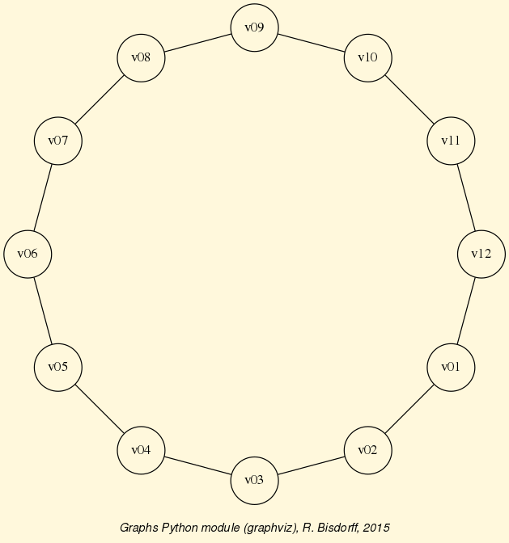

   The 12-cycle graph	 

Computing the maximal independent sets (MISs)
.............................................

A non isomorphic MIS corresponds in fact to a set of isomorphic MISs, i.e. an orbit of MISs under the automorphism group of the 12-cycle graph. We are now first computing all maximal independent sets that are detectable in the 12-cycle digraph with the :py:func:`digraphs.Digraph.showMIS` method.

.. code-block:: pycon

   >>> c12.showMIS(withListing=False)
      *---  Maximal independent choices ---*
      number of solutions:  29
      cardinality distribution
      card.:  [0, 1, 2, 3, 4,  5,  6, 7, 8, 9, 10, 11, 12]
      freq.:  [0, 0, 0, 0, 3, 24,  2, 0, 0, 0,  0,  0,  0]
      Results in c12.misset

In the 12-cycle graph, we observe 29 labelled MISs: -- 3 of cardinality 4, 24 of cardinality 5, and 2  of cardinality 6. In case of n-cycle graphs with *n* > 20, as the cardinality of the MISs becomes big, it is preferable to use the shell :code:`perrinMIS` command compiled from C and installed [3]_  along with all the Digraphs3 python modules for computing the set of MISs observed in the graph.

.. code-block:: bash
   :linenos:

    ...$ echo 12 | /usr/local/bin/perrinMIS
    # -------------------------------------- #
    # Generating MIS set of Cn with the      #
    # Perrin sequence algorithm.             #
    # Temporary files used.                  #
    # even versus odd order optimised.       #
    # RB December 2006                       #
    # Current revision Dec 2018              #
    # -------------------------------------- #
    Input cycle order ? <-- 12
    mis 1 : 100100100100
    mis 2 : 010010010010
    mis 3 : 001001001001
    ...
    ...
    ...
    mis 27 : 001001010101
    mis 28 : 101010101010
    mis 29 : 010101010101
    Cardinalities:
    0 : 0
    1 : 0
    2 : 0
    3 : 0
    4 : 3
    5 : 24
    6 : 2
    7 : 0
    8 : 0
    9 : 0
    10 : 0
    11 : 0
    12 : 0
    Total: 29
    execution time: 0 sec. and 2 millisec.

Reading in the result of the :code:`perrinMIS` shell command, stored in a file called by default :code:`curd.dat`, may be operated with the :py:func:`digraphs.Digraph.readPerrinMisset` method.

.. code-block:: pycon
   :linenos:

   >>> c12.readPerrinMisset(file='curd.dat')
   >>> c12.misset
    {frozenset({'5', '7', '10', '1', '3'}),
     frozenset({'9', '11', '5', '2', '7'}),
     frozenset({'7', '2', '4', '10', '12'}),
     ...
     ...
     ...
     frozenset({'8', '4', '10', '1', '6'}),
     frozenset({'11', '4', '1', '9', '6'}),
     frozenset({'8', '2', '4', '10', '12', '6'})
    }

Computing the automorphism group
................................

For computing the corresponding non isomorphic MISs, we actually need the automorphism group of the c12-cycle graph. The :py:class:`digraphs.Digraph` class therefore provides the :py:func:`digraphs.Digraph.automorphismGenerators` method which adds automorphism group generators to a :py:class:`digraphs.Digraph` class instance with the help of the external shell <:code:`dreadnaut`> command from the **nauty** software package [2]_.

.. code-block:: pycon
   :linenos:

   >>> c12.automorphismGenerators()
    ...
      Permutations
      {'1': '1', '2': '12', '3': '11', '4': '10', '5': 
       '9', '6': '8', '7': '7', '8': '6', '9': '5', '10': 
       '4', '11': '3', '12': '2'}
      {'1': '2', '2': '1', '3': '12', '4': '11', '5': '10', 
       '6': '9', '7': '8', '8': '7', '9': '6', '10': '5', 
       '11': '4', '12': '3'}
   >>> print('grpsize = ', c12.automorphismGroupSize)
      grpsize = 24

The 12-cycle graph automorphism group is generated with both the permutations above and has group size 24.

Computing the isomorphic MISs
.............................

The command :py:func:`digraphs.Digraph.showOrbits` renders now the labelled representatives of each of the four orbits of isomorphic MISs observed in the 12-cycle graph (see Lines 7-10).

.. code-block:: pycon
   :linenos:

   >>> c12.showOrbits(c12.misset,withListing=False)
    ...
      *---- Global result ----
      Number of MIS:  29
      Number of orbits :  4
      Labelled representatives and cardinality:
      1: ['2','4','6','8','10','12'], 2
      2: ['2','5','8','11'], 3
      3: ['2','4','6','9','11'], 12
      4: ['1','4','7','9','11'], 12
      Symmetry vector
      stabilizer size: [1, 2, 3, ..., 8, 9, ..., 12, 13, ...]
      frequency      : [0, 2, 0, ..., 1, 0, ...,  1,  0, ...]

The corresponding group stabilizers' sizes and frequencies -- orbit 1 with 12 symmetry axes, orbit 2 with 8 symmetry axes, and orbits 3 and 4 both with one symmetry axis (see Lines 11-13), are illustrated in the corresponding unlabelled graphs of :numref:`MISc12` below.

.. figure:: c12.png
    :name: MISc12
    :width: 400 px
    :align: center
    :alt: The 4 non isomorphic MIS of the 12-cycle graph

    The symmetry axes of the four non isomorphic MISs of the 12-cycle graph

The non isomorphic MISs in the 12-cycle graph represent in fact all the ways one may write the number 12 as the circular sum of '2's and '3's without distinguishing opposite directions of writing. The first orbit corresponds to writing six times a '2'; the second orbit corresponds to writing four times a '3'. The third and fourth orbit correspond to writing two times a '3' and three times a '2'. There are two non isomorphic ways to do this latter circular sum. Either separating the '3's by one and two '2's, or by zero and three '2's (see Bisdorff & Marichal [ISOMIS-08]_ ).

Back to :ref:`Content Table <Tutorial-label>`

.. _Kernel-Tutorial-label:

On computing digraph kernels
----------------------------

.. contents:: 
	:depth: 2
	:local:

What is a graph kernel ?
........................

We call **choice** in a graph, respectively a digraph, a subset of its vertices, resp. of its nodes or actions. A choice *Y* is called **internally stable** or **independent** when there exist **no links** (edges) or relations (arcs) between its members. Furthermore, a choice *Y* is called **externally stable** when for each vertex, node or action *x* not in *Y*, there exists at least a member *y* of *Y* such that *x* is linked or related to *y*. Now, an internally **and** externally stable choice is called a **kernel**.  

A first trivial example is immediately given by the maximal independent vertices sets (MISs) of the n-cycle graph (see :ref:`IsomorphicMIS-Tutorial-label`). Indeed, each MIS in the n-cycle graph is by definition independent, i.e. internally stable, and each non selected vertex in the n-cycle graph is in relation with either one or even two members of the MIS. See, for instance, the four non isomorphic MISs of the 12-cycle graph as shown in :numref:`MISc12`. 

In all graph or symmetric digraph, the *maximality condition* imposed on the internal stability is equivalent to the external stability condition. Indeed, if there would exist a vertex or node not related to any of the elements of a choice, then we may safely add this vertex or node to the given choice without violating its internal stability. All kernels must hence be maximal independent choices. In fact, in a topological sense, they correspond to maximal **holes** in the given graph.

We may illustrate this coincidence between MISs and kernels in graphs
and symmetric digraphs with the following random 3-regular graph
instance (see :numref:`random3RegularGraph`).

.. code-block:: pycon

   >>> from graphs import RandomRegularGraph
   >>> g = RandomRegularGraph(order=12,degree=3,seed=100)
   >>> g.exportGraphViz('random3RegularGraph')
    *---- exporting a dot file for GraphViz tools ---------*
    Exporting to random3RegularGraph.dot
    fdp -Tpng random3RegularGraph.dot -o random3RegularGraph.png

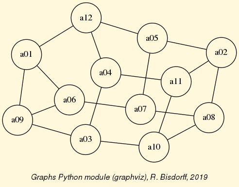

    A random 3-regular graph instance

A random MIS in this graph may be computed for instance by using the :py:class:`graphs.MISModel` class.

.. code-block:: pycon

   >>> from graphs import MISModel
   >>> mg = MISModel(g)
    Iteration:  1
    Running a Gibbs Sampler for 660 step !
    {'a06', 'a02', 'a12', 'a10'}  is maximal !
   >>> mg.exportGraphViz('random3RegularGraph_mis')
    *---- exporting a dot file for GraphViz tools ---------*
    Exporting to random3RegularGraph-mis.dot
    fdp -Tpng random3RegularGraph-mis.dot -o random3RegularGraph-mis.png

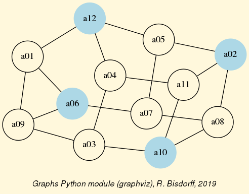

    A random MIS colored in the random 3-regular graph

It is easily verified in :numref:`random3RegularGraphMIS` above, that the computed MIS renders indeed a valid kernel of the given graph. The complete set of kernels of this 3-regular graph instance coincides hence with the set of its MISs. 

.. code-block:: pycon
   :linenos:

   >>> g.showMIS()
    *---  Maximal Independent Sets ---*
    ['a01', 'a02', 'a03', 'a07']
    ['a01', 'a04', 'a05', 'a08']
    ['a04', 'a05', 'a08', 'a09']
    ['a01', 'a04', 'a05', 'a10']
    ['a04', 'a05', 'a09', 'a10']
    ['a02', 'a03', 'a07', 'a12']
    ['a01', 'a03', 'a07', 'a11']
    ['a05', 'a08', 'a09', 'a11']
    ['a03', 'a07', 'a11', 'a12']
    ['a07', 'a09', 'a11', 'a12']
    ['a08', 'a09', 'a11', 'a12']
    ['a04', 'a05', 'a06', 'a08']
    ['a04', 'a05', 'a06', 'a10']
    ['a02', 'a04', 'a06', 'a10']
    ['a02', 'a03', 'a06', 'a12']
    ['a02', 'a06', 'a10', 'a12']
    ['a01', 'a02', 'a04', 'a07', 'a10']
    ['a02', 'a04', 'a07', 'a09', 'a10']
    ['a02', 'a07', 'a09', 'a10', 'a12']
    ['a01', 'a03', 'a05', 'a08', 'a11']
    ['a03', 'a05', 'a06', 'a08', 'a11']
    ['a03', 'a06', 'a08', 'a11', 'a12']
    number of solutions:  22
    cardinality distribution
    card.:  [0, 1, 2, 3, 4, 5, 6, 7, 8, 9, 10, 11, 12]
    freq.:  [0, 0, 0, 0, 16, 6, 0, 0, 0, 0, 0, 0, 0]
    execution time: 0.00045 sec.
    Results in self.misset
   >>> g.misset
    [frozenset({'a02', 'a01', 'a07', 'a03'}),
     frozenset({'a04', 'a01', 'a08', 'a05'}),
     frozenset({'a09', 'a04', 'a08', 'a05'}),
     ...
     ...
     frozenset({'a06', 'a02', 'a12', 'a10'}),
     frozenset({'a06', 'a11', 'a08', 'a03', 'a05'}),
     frozenset({'a03', 'a06', 'a11', 'a12', 'a08'})]

We cannot resist in looking in this 3-regular graph for non isomorphic kernels (MISs, see previous tutorial). To do so we must first, convert the given *graph* instance into a *digraph* instance. Then, compute its automorphism generators, and finally, identify the isomorphic kernel orbits.

.. code-block:: pycon
   :linenos:

   >>> dg = g.graph2Digraph()
   >>> dg.automorphismGenerators()
    *----- saving digraph in nauty dre format  -------------*
    Actions index:
    1 :  a01
    2 :  a02
    3 :  a03
    4 :  a04
    5 :  a05
    6 :  a06
    7 :  a07
    8 :  a08
    9 :  a09
    10 :  a10
    11 :  a11
    12 :  a12
    {'1': 'a01',  '2': 'a02', '3': 'a03', '4': 'a04',  '5': 'a05',
     '6': 'a06',  '7': 'a07', '8': 'a08', '9': 'a09', '10': 'a10',
    '11': 'a11', '12': 'a12'}
    # automorphisms extraction from dre file #
    # Using input file: randomRegularGraph.dre
    echo '<randomRegularGraph.dre -m p >randomRegularGraph.auto x' | dreadnaut
    # permutation = 1['1', '11', '7', '5', '4', '9', '3', '10', '6', '8', '2', '12']
   >>> dg.showOrbits(g.misset)
    *--- Isomorphic reduction of choices
    ...
    current representative:  frozenset({'a09', 'a11', 'a12', 'a08'})
    length   :  4
    number of isomorph choices 2
    isormorph choices
    ['a06', 'a02', 'a12', 'a10']  # <<== the random MIS shown above
    ['a09', 'a11', 'a12', 'a08']
    ----------------------------
    *---- Global result ----
    Number of choices:  22
    Number of orbits :  11
    Labelled representatives:
    ['a06', 'a04', 'a10', 'a05']
    ['a09', 'a07', 'a10', 'a04', 'a02']
    ['a06', 'a11', 'a12', 'a08', 'a03']
    ['a04', 'a01', 'a10', 'a05']
    ['a07', 'a02', 'a12', 'a03']
    ['a09', 'a11', 'a12', 'a07']
    ['a06', 'a04', 'a08', 'a05']
    ['a06', 'a04', 'a02', 'a10']
    ['a01', 'a11', 'a07', 'a03']
    ['a01', 'a11', 'a08', 'a03', 'a05']
    ['a09', 'a11', 'a12', 'a08']
    Symmetry vector
    stabilizer size  :  [1, 2]
    frequency        :  [11, 0]

In our random 3-regular graph instance (see :numref:`random3RegularGraph`), we may thus find eleven non isomorphic kernels with orbit sizes equal to two. We illustrate below the isomorphic twin of the random MIS example shown in :numref:`random3RegularGraphMIS` .

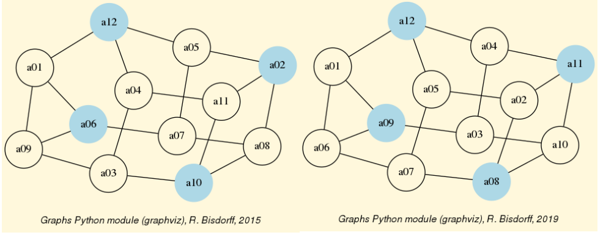

   Two isomorphic kernels of the random 3-regular graph instance

All graphs and symmetric digraphs admit MISs, hence also kernels.

It is worthwhile noticing that the **maximal matchings** of a graph correspond bijectively to its line graph's **kernels** (see the :py:class:`graphs.LineGraph` class).

.. code-block:: pycon
   :linenos:

   >>> from graphs import CycleGraph
   >>> c8 = CycleGraph(order=8)
   >>> maxMatching = c8.computeMaximumMatching()
   >>> c8.exportGraphViz(fileName='maxMatchingcycleGraph',
   ...                          matching=maxMatching)
    *---- exporting a dot file for GraphViz tools ---------*
    Exporting to maxMatchingcyleGraph.dot
    Matching:  {frozenset({'v1', 'v2'}), frozenset({'v5', 'v6'}),
		frozenset({'v3', 'v4'}), frozenset({'v7', 'v8'}) }
    circo -Tpng maxMatchingcyleGraph.dot -o maxMatchingcyleGraph.png

.. figure:: maxMatchingcycleGraph.png
   :width: 300 px
   :align: center
   :alt: Perfect maximum matching in the 8.cycle graph 

   Perfect maximum matching in the 8-cycle graph

In the context of digraphs, i.e. *oriented* graphs, the kernel concept gets much richer and separates from the symmetric MIS concept.  

Initial and terminal kernels
............................

In an oriented graph context, the internal stability condition of the kernel concept remains untouched; however, the external stability condition gets indeed split up by the *orientation* into two lateral cases:

     1. A **dominant** stability condition, where each non selected node is *dominated* by at least one member of the kernel;
     2. An **absorbent** stability condition, where each non selected node is *absorbed* by at least one member of the kernel.

A both *internally* **and** *dominant*, resp. *absorbent stable* choice is called a *dominant* or **initial**, resp. an *absorbent* or **terminal** kernel. From a topological perspective, the initial kernel concept looks from the outside of the digraph into its interior, whereas the terminal kernel looks from the interior of a digraph toward its outside. From an algebraic perspective, the initial kernel is a *prefix* operand, and the terminal kernel is a *postfix* operand in the *Berge* kernel equation systems.

Furthermore, as the kernel concept involves conjointly a **positive logical refutation** (the *internal stability*) and a **positive logical affirmation** (the *external stability*), it appeared rather quickly necessary in our operational developments to adopt a bipolar characteristic [-1,1] valuation domain, modelling *negation* by change of numerical sign and including explicitly a third **median** logical value (0) expressing logical **indeterminateness** (neither positive, nor negative, see [BIS-2000]_ and [BIS-2004]_).

In such a  bipolar-valued context, we call **prekernel** a choice which is **externally stable** and for which the **internal stability** condition is **valid or indeterminate**. We say that the independence condition is in this case only **weakly** validated. Notice that all kernels are hence prekernels, but not vice-versa.

In graphs or symmetric digraphs, where there is essentially no apparent ' *laterality* ', all kernels are *initial* **and** *terminal* at the same time. They correspond to what we call *holes* in the graph. An *universal* example is given by the **complete** digraph.

.. code-block:: pycon

   >>> from digraphs import CompleteDigraph
   >>> u = CompleteDigraph(order=5)
   >>> u
    *------- Digraph instance description ------*
    Instance class   : CompleteDigraph
    Instance name    : complete
    Digraph Order      : 5
    Digraph Size       : 20
    Valuation domain : [-1.00 ; 1.00]
    ---------------------------------
   >>> u.showPreKernels()
    *--- Computing preKernels ---*
    Dominant kernels :
    ['1'] independence: 1.0; dominance : 1.0; absorbency : 1.0
    ['2'] independence: 1.0; dominance : 1.0; absorbency : 1.0
    ['3'] independence: 1.0; dominance : 1.0; absorbency : 1.0
    ['4'] independence: 1.0; dominance : 1.0; absorbency : 1.0
    ['5'] independence: 1.0; dominance : 1.0; absorbency : 1.0
    Absorbent kernels :
    ['1'] independence: 1.0; dominance : 1.0; absorbency : 1.0
    ['2'] independence: 1.0; dominance : 1.0; absorbency : 1.0
    ['3'] independence: 1.0; dominance : 1.0; absorbency : 1.0
    ['4'] independence: 1.0; dominance : 1.0; absorbency : 1.0
    ['5'] independence: 1.0; dominance : 1.0; absorbency : 1.0
    *----- statistics -----
    graph name:  complete
    number of solutions
     dominant kernels :  5
     absorbent kernels:  5
    cardinality frequency distributions
    cardinality     :  [0, 1, 2, 3, 4, 5]
    dominant kernel :  [0, 5, 0, 0, 0, 0]
    absorbent kernel:  [0, 5, 0, 0, 0, 0]
    Execution time  : 0.00004 sec.
    Results in sets: dompreKernels and abspreKernels.

In a complete digraph, each single node is indeed both an initial and a terminal kernel candidate and there is no definite *begin* or *end* of the digraph to be detected. *Laterality* is here entirely *relative* to a specific singleton chosen as reference point of view. The same absence of laterality is apparent in two other universal digraph models, the **empty** and the **indeterminate** digraph. 

.. code-block:: pycon
   :linenos:

   >>> ed = EmptyDigraph(order=5)
   >>> ed.showPreKernels()
    *--- Computing preKernels ---*
    Dominant kernel :
    ['1', '2', '3', '4', '5']
       independence :  1.0 
       dominance    :  1.0
       absorbency   :  1.0
    Absorbent kernel :
    ['1', '2', '3', '4', '5']
       independence :  1.0 
       dominance    :  1.0
       absorbency   :  1.0
    ...

In the empty digraph, the whole set of nodes gives indeed at the same time the **unique** *initial* **and** *terminal* kernel. Similarly, for the **indeterminate** digraph.

.. code-block:: pycon
   :linenos:

   >>> from digraphs import IndeterminateDigraph
   >>> id = IndeterminateDigraph(order=5)
   >>> id.showPreKernels()
    *--- Computing preKernels ---*
    Dominant prekernel :
    ['1', '2', '3', '4', '5']
       independence :  0.0   # <<== indeterminate
       dominance    :  1.0
       absorbency   :  1.0
    Absorbent prekernel :
    ['1', '2', '3', '4', '5']
       independence :  0.0   # <<== indeterminate
       dominance    :  1.0
       absorbency   :  1.0

Both these results make sense, as in a completely empty or indeterminate digraph, there is no *interior* of the digraph defined, only a *border* which is hence at the same time an initial and terminal kernel.  Notice however, that in the latter indeterminate case, the complete set of nodes verifies only weakly the internal stability condition (see above).

Other common digraph models, although being clearly oriented, may show nevertheless no apparent laterality, like **odd chordless circuits**, i.e. *holes* surrounded by an *oriented cycle* -a circuit- of odd length. They do not admit in fact any initial or terminal kernel.

.. code-block:: pycon
   :linenos:

   >>> from digraphs import CirculantDigraph
   >>> c5 = CirculantDigraph(order=5,circulants=[1])
   >>> c5.showPreKernels()
    *----- statistics -----
    digraph name:  c5
    number of solutions
     dominant prekernels :  0
     absorbent prekernels:  0

Chordless circuits of **even** length 2 x *k*, with *k* > 1, contain however two isomorphic kernels of cardinality *k* which qualify conjointly as initial and terminal candidates.

.. code-block:: pycon
   :linenos:

   >>> c6 = CirculantDigraph(order=6,circulants=[1])
   >>> c6.showPreKernels()
    *--- Computing preKernels ---*
    Dominant preKernels :
    ['1', '3', '5'] independence: 1.0, dominance: 1.0, absorbency: 1.0
    ['2', '4', '6'] independence: 1.0, dominance: 1.0, absorbency: 1.0
    Absorbent preKernels :
    ['1', '3', '5'] independence: 1.0, dominance: 1.0, absorbency: 1.0
    ['2', '4', '6'] independence: 1.0, dominance: 1.0, absorbency: 1.0

Chordless circuits of even length may thus be indifferently oriented along two opposite directions. Notice by the way that the duals of **all** chordless circuits of *odd* **or** *even* length, i.e. *filled* circuits also called **anti-holes** (see :numref:`dualChordlessCircuit`), never contain any potential kernel candidates.

.. code-block:: pycon
   :linenos:

   >>> dc6 = -c6   # dc6 = DualDigraph(c6)
   >>> dc6.showPreKernels()
    *----- statistics -----
    graph name:  dual_c6
    number of solutions
     dominant prekernels :  0
     absorbent prekernels:  0
   >>> dc6.exportGraphViz(fileName='dualChordlessCircuit')
    *---- exporting a dot file dor GraphViz tools ---------*
    Exporting to dualChordlessCircuit.dot
    circo -Tpng dualChordlessCircuit.dot -o dualChordlessCircuit.png

.. figure:: dualChordlessCircuit.png
   :name: dualChordlessCircuit
   :width: 350 px
   :align: center
   :alt: The dual of the chordless 6-circuit

   The dual of the chordless 6-circuit

We call **weak**, a *chordless circuit* with *indeterminate inner part*. The :py:class:`digraphs.CirculantDigraph` class provides a parameter for constructing such a kind of *weak chordless* circuits. 

.. code-block:: pycon
   :linenos:

   >>> c6 = CirculantDigraph(order=6, circulants=[1],
   ...                        IndeterminateInnerPart=True)

It is worth noticing that the *dual* version ([14]_) of a *weak* circuit corresponds to its *converse* version, i.e. *-c6* = *~c6* (see :numref:`weakChordlessCircuit`).

.. code-block:: pycon
   :linenos:

   >>> (-c6).exportGraphViz()
    *---- exporting a dot file dor GraphViz tools ---------*
    Exporting to dual_c6.dot
    circo -Tpng dual_c6.dot -o dual_c6.png
   >>> (~c6).exportGraphViz()
    *---- exporting a dot file dor GraphViz tools ---------*
    Exporting to converse_c6.dot
    circo -Tpng converse_c6.dot -o converse_c6.png 

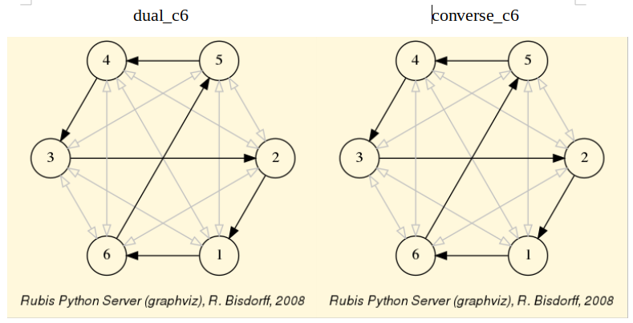

   Dual and converse of the weak 6-circuit

It immediately follows that weak chordless circuits are part of the class of digraphs that are **invariant** under the *codual* transform, *cn* = - (~ *cn* ) = ~ ( -*cn* ) [13]_. In the case, now, of an *odd* weak chordless circuit, *neither* the weak chordless circuit, *nor* its dual, converse, or codual versions will admit *any* initial or terminal prekernels. 

Kernels in lateralized digraphs
...............................

Humans do live in an apparent physical space of plain transitive **lateral orientation**, fully empowered in finite geometrical 3D models with **linear orders**, where first, resp. last ranked, nodes deliver unique initial, resp. terminal, kernels. Similarly, in finite **preorders**, the first, resp. last, equivalence classes deliver the unique initial, resp. unique terminal, kernels. More generally, in finite **partial orders**, i.e. asymmetric and transitive digraphs, topological sort algorithms will easily reveal on the first, resp. last, level all unique initial, resp. terminal, kernels.

In genuine random digraphs, however, we may need to check for each of its MISs, whether *one*, *both*, or *none* of the lateralized external stability conditions may be satisfied. Consider, for instance, the following random digraph instance of order 7 and generated with an arc probability of 30%. 

.. code-block:: pycon

   >>> from randomDigraphs import RandomDigraph
   >>> rd = RandomDigraph(order=7,arcProbability=0.3,seed=5)
   >>> rd.exportGraphViz('randomLaterality')
    *---- exporting a dot file dor GraphViz tools ---------*
    Exporting to randomLaterality.dot
    dot -Grankdir=BT -Tpng randomLaterality.dot -o randomLaterality.png

.. figure:: randomLaterality.png
   :name: randomLaterality
   :width: 300 px
   :align: center
   :alt: A random digraph instance

   A random digraph instance of order 7 and arc probability 0.3

The random digraph shown in :numref:`randomLaterality` above has no apparent special properties, except from being connected.

.. code-block:: pycon
   :linenos:

   >>> rd.showComponents()
    *--- Connected Components ---*
    1: ['a1', 'a2', 'a3', 'a4', 'a5', 'a6', 'a7']
   >>> rd.computeChordlessCircuits()
    []                 # no chordless circuits detected
   >>> print('Transitivity degree: %.2f%%' %\
   ...               (rd.computeTransitivityDegree()*100))
    Transitivity degree: 48.39%

The given digraph instance is neither asymmetric (a3 <--> a6) nor symmetric (a2 --> a1, a1 -/> a2); there are no chordless circuits (see Line 5 above); and, the digraph is not transitive (a5 -> a2 -> a1, but a5 -/> a1). More than half of the required transitive closures are missing (see Line 8).

Now, we know that its potential prekernels must be among its set of maximal independent choices. 

.. code-block:: pycon
   :linenos:

   >>> rd.showMIS()
    *---  Maximal independent choices ---*
    ['a2', 'a4', 'a6']
    ['a6', 'a1']
    ['a5', 'a1']
    ['a3', 'a1']
    ['a4', 'a3']
    ['a7']
    ------
   >>> rd.showPreKernels()
    *--- Computing preKernels ---*
    Dominant preKernels :
    ['a2', 'a4', 'a6']
       independence :  1.0
       dominance    :  1.0
       absorbency   :  -1.0
       covering     :  0.500
    ['a4', 'a3']
       independence :  1.0
       dominance    :  1.0
       absorbency   :  -1.0
       covering     :  0.600  # <<==
    Absorbent preKernels :
    ['a3', 'a1']
       independence :  1.0
       dominance    :  -1.0
       absorbency   :  1.0
       covering     :  0.500
    ['a6', 'a1']
       independence :  1.0
       dominance    :  -1.0
       absorbency   :  1.0
       covering     :  0.600  # <<==
    ...

Among the six MISs contained in this random digraph (see above Lines 3-8) we discover two initial and two terminal kernels (Lines 12-34). Notice by the way the covering values (between 0.0 and 1.0) shown by the :py:func:`digraphs.Digraph.showPreKernels` method (Lines 17, 22, 28 and 33). The higher this value, the more the corresponding kernel candidate makes apparent the digraph's *laterality*. We may hence redraw the same digraph in :numref:`orientedLaterality` by looking into its interior via the *best covering* initial kernel candidate: the dominant choice {'a3','4a'} (coloured in yellow), and looking out of it via the *best covered* terminal kernel candidate: the absorbent choice {'a1','a6'} (coloured in blue).

.. code-block:: pycon

   >>> rd.exportGraphViz(fileName='orientedLaterality',\
   ...                   bestChoice=set(['a3', 'a4']),\
   ...                   worstChoice=set(['a1', 'a6']))
    *---- exporting a dot file dor GraphViz tools ---------*
    Exporting to orientedLaterality.dot
    dot -Grankdir=BT -Tpng orientedLaterality.dot -o orientedLaterality.png

.. figure:: orientedLaterality.png
   :name: orientedLaterality
   :width: 300 px
   :align: center
   :alt: A random digraph oriented by best covering initial and terminal kernels  

   A random digraph oriented by best covering initial and
   best covered terminal kernel

In algorithmic decision theory, initial and terminal prekernels may provide convincing best, resp. worst, choice recommendations (see :ref:`Rubis-Tutorial-label`).

Computing good and bad choice recommendations
.............................................

To illustrate this idea, let us finally compute good and bad choice recommendations in the following random bipolar-valued **outranking** digraph.

.. code-block:: pycon

   >>> from outrankingDigraphs import *
   >>> g = RandomBipolarOutrankingDigraph(seed=5)
   >>> g
    *------- Object instance description ------*
    Instance class   : RandomBipolarOutrankingDigraph
    Instance name    : randomOutranking
    # Actions        : 7
    # Criteria       : 7
    Size             : 26
    Determinateness  : 34.275
    Valuation domain : {'min': -100.0, 'med': 0.0, 'max': 100.0}
   >>> g.showHTMLPerformanceTableau()

.. figure:: randomOutranking.png
   :name: randomOutranking
   :width: 550 px
   :align: center
   :alt: A random performance tableau

   The performance tableau of a random outranking digraph instance

The underlying random performance tableau (see :numref:`randomOutranking`) shows the performance grading of 7 potential decision actions with respect to 7 decision criteria supporting each an increasing performance scale from 0 to 100. Notice the missing performance data concerning decision actions 'a2' and 'a5'. The resulting **strict outranking** - i.e. a weighted majority supported - *better than without considerable counter-performance* - digraph is shown in :numref:`tutOutranking` below.

.. code-block:: pycon

   >>> gcd = ~(-g)  # Codual: the converse of the negation
   >>> gcd.exportGraphViz(fileName='tutOutRanking')
    *---- exporting a dot file dor GraphViz tools ---------*
    Exporting to tutOutranking.dot
    dot -Grankdir=BT -Tpng tutOutranking.dot -o tutOutranking.png

.. figure:: tutOutranking.png
   :name: tutOutranking
   :width: 300 px
   :align: center
   :alt: A random performance tableau

   A random strict outranking digraph instance

All decision actions appear strictly better performing than action 'a7'. We call it a **Condorcet looser** and it is an evident terminal prekernel candidate. On the other side, three actions: 'a1', 'a2' and 'a4' are not dominated. They give together an initial prekernel candidate. 

.. code-block:: pycon
   :linenos:
      
   >>> gcd.showPreKernels()
    *--- Computing preKernels ---*
    Dominant preKernels :
    ['a1', 'a2', 'a4']
       independence :  0.00
       dominance    :  6.98
       absorbency   :  -48.84
       covering     :  0.667
    Absorbent preKernels :
    ['a3', 'a7']
       independence :  0.00
       dominance    :  -74.42
       absorbency   :  16.28
       covered      :  0.800

With such unique disjoint initial and terminal prekernels (see Line 4 and 10), the given digraph instance is hence clearly *lateralized*. Indeed, these initial and terminal prekernels of the codual outranking digraph reveal best, resp. worst, choice recommendations one may formulate on the basis of a given outranking digraph instance.

.. code-block:: pycon
   :linenos:

   >>> g.showBestChoiceRecommendation()
    ***********************
    Rubis best choice recommendation(s) (BCR)
     (in decreasing order of determinateness)   
    Credibility domain: [-100.00,100.00]
     === >> potential best choice(s)
    * choice              : ['a1', 'a2', 'a4']
      independence        : 0.00
      dominance           : 6.98
      absorbency          : -48.84
      covering (%)        : 66.67
      determinateness (%) : 57.97
      - most credible action(s) = { 'a4': 20.93, 'a2': 20.93, }
     === >> potential worst choice(s) 
    * choice              : ['a3', 'a7']
      independence        : 0.00
      dominance           : -74.42
      absorbency          : 16.28
      covered (%)         : 80.00
      determinateness (%) : 64.62
      - most credible action(s) = { 'a7': 48.84, }

Notice that solving the valued *Berge* kernel equations (see the Pearls of bipolar-valued epistemic logic) provides furthermore a positive characterization of the most credible decision actions in each respective choice recommendation (see Lines 14 and 23 above). Actions 'a2' and 'a4' are equivalent candidates for a unique best choice, and action 'a7' is clearly confirmed as the worst choice.

In :numref:`bestWorstOrientation` below, we orient the drawing of the strict outranking digraph instance with the help of these best and worst choice recommendations. 

.. code-block:: pycon

   >>> gcd.exportGraphViz(fileName='bestWorstOrientation',
   ...       bestChoice=['a2','a4'], worstChoice=['a7'])
    *---- exporting a dot file dor GraphViz tools ---------*
    Exporting to bestWorstOrientation.dot
    dot -Grankdir=BT -Tpng bestWorstOrientation.dot -o bestWorstOrientation.png

.. figure:: bestWorstOrientation.png
   :name: bestWorstOrientation
   :width: 300 px
   :align: center
   :alt: The random outranking digraph oriented by its initial and terminal prekernels

   The strict outranking digraph oriented by its best and worst choice recommendations

The gray arrows in :numref:`bestWorstOrientation`, like the one between actions 'a4' and 'a1', represent indeterminate preferential situations. Action 'a1' appears hence to be rather incomparable to all the other, except action 'a7'. It may be interesting to compare this result with a *Copeland* ranking of the underlying performance tableau (see :ref:`Ranking-Tutorial-label`).

.. code-block:: pycon

   >>> g.showHTMLPerformanceHeatmap(colorLevels=5, ndigits=0,
   ...          Correlations=True, rankingRule='Copeland')

.. figure:: outrankingResult.png
   :name: outrankingResult
   :width: 550 px
   :align: center
   :alt: Copeland ranking of the random outranking digraph instance

   heatmap with Copeland ranking of the performance tableau

In the resulting linear ranking (see :numref:`outrankingResult`), action 'a4' is set at first rank, followed by action 'a2'. This makes sense as 'a4' shows three performances in the first quintile, whereas 'a2' is only partially evaluated and shows only two such excellent performances. But 'a4' also shows a very weak performance in the first quintile. Both decision actions, hence, don't show eventually a performance profile that would make apparent a clear preference situation in favour of one or the other. In this sense, the prekernels based best choice recommendations may appear more faithful with respect to the actually definite strict outranking relation than any 'forced' linear ranking result as shown in :numref:`outrankingResult` above.

Tractability
............

Finally, let us give some hints on the **tractability** of kernel computations. Detecting all (pre)kernels in a digraph is a famously NP-hard computational problem. Checking external stability conditions for an independent choice is equivalent to checking its maximality and may be done in the linear complexity of the order of the digraph. However, checking all independent choices contained in a digraph may get hard already for tiny sparse digraphs of order *n* > 20 (see [BIS-2006b]_). Indeed, the worst case is given by an empty or indeterminate digraph where the set of all potential independent choices to check is in fact the power set of the vertices.

.. code-block:: pycon
   :linenos:

   >>> e = EmptyDigraph(order=20)
   >>> e.showMIS()   # by visiting all 2^20 independent choices
    *---  Maximal independent choices ---*
    [ '1',  '2',  '3',  '4',  '5',  '6',  '7',  '8',  '9', '10',
     '11', '12', '13', '14', '15', '16', '17', '18', '19', '20']
    number of solutions:  1
    execution time: 1.47640 sec.  # <<== !!!
   >>> 2**20
    1048576

Now, there exist more efficient specialized algorithms for directly enumerating MISs and dominant or absorbent kernels contained in specific digraph models without visiting all independent choices (see [BIS-2006b]_). Alain Hertz provided kindly such a MISs enumeration algorithm for the Digraph3 project (see :py:func:`digraphs.Digraph.showMIS_AH`). When the number of independent choices is big compared to the actual number of MISs, like in very sparse or empty digraphs, the performance difference may be dramatic (see Line 7 above and Line 15 below).

.. code-block:: pycon
   :linenos:

   >>> e.showMIS_AH()  # by visiting only maximal independent choices
    *-----------------------------------*
    * Python implementation of Hertz's  *
    * algorithm for generating all MISs *
    * R.B. version 7(6)-25-Apr-2006     *
    *-----------------------------------*
    ===>>> Initial solution :
    [ '1',  '2',  '3',  '4',  '5',  '6',  '7',  '8',  '9', '10',
     '11', '12', '13', '14', '15', '16', '17', '18', '19', '20']
    *---- results ----*
    [ '1',  '2',  '3',  '4',  '5',  '6',  '7',  '8',  '9', '10',
     '11', '12', '13', '14', '15', '16', '17', '18', '19', '20']
    *---- statistics ----*
    mis solutions    :  1
    execution time   : 0.00026 sec. # <<== !!!
    iteration history:  1

For more or less dense strict outranking digraphs of modest order, as facing usually in algorithmic decision theory applications, enumerating all independent choices remains however in most cases tractable, especially by using a very efficient Python generator (see :py:func:`digraphs.Digraph.independentChoices` below).

.. code-block:: python
   :linenos:

    def independentChoices(self,U):
        """
        Generator for all independent choices with associated
	dominated, absorbed and independent neighborhoods
	of digraph instance self.
	Initiate with U = self.singletons().
	Yields [(independent choice, domnb, absnb, indnb)].
        """
        if U == []:
            yield [(frozenset(),set(),set(),set(self.actions))]
        else:
            x = list(U.pop())
            for S in self.independentChoices(U):
                yield S
                if x[0] <=  S[0][3]:
                    Sxgamdom = S[0][1] | x[1]
                    Sxgamabs = S[0][2] | x[2]
                    Sxindep = S[0][3] &  x[3]
                    Sxchoice = S[0][0] | x[0]
                    Sx = [(Sxchoice,Sxgamdom,Sxgamabs,Sxindep)]
                    yield Sx

And, checking maximality of independent choices via the external stability conditions during their enumeration (see :py:func:`digraphs.Digraph.computePreKernels` below) provides the effective advantage of computing all initial **and** terminal prekernels in a single loop (see Line 10 and [BIS-2006b]_).

.. code-block:: python
   :linenos:

    def computePreKernels(self):
        """
        computing dominant and absorbent preKernels:
        Result in self.dompreKernels and self.abspreKernels
        """
        actions = set(self.actions)
        n = len(actions)
        dompreKernels = set()
        abspreKernels = set()
        for choice in self.independentChoices(self.singletons()):
            restactions = actions - choice[0][0]
            if restactions <= choice[0][1]:
                dompreKernels.add(choice[0][0])
            if restactions <= choice[0][2]:
                abspreKernels.add(choice[0][0])
        self.dompreKernels = dompreKernels
        self.abspreKernels = abspreKernels

Back to :ref:`Content Table <Tutorial-label>`

.. _Permutation-Tutorial-label:

About split, interval and permutation graphs
--------------------------------------------

.. contents:: 
	:depth: 2
	:local:

A multiply *perfect* graph
..........................

Following Martin Golumbic (see [GOL-2004]_ p. 149), we call a given graph *g*:

    * **Comparability graph** when *g*  is *transitively orientable*;
    * **Triangulated graph** when *g* does not contain any *chordless cycle* of length 4 and more;
    * **Interval graph** when *g* is *triangulated* and its dual *-g* is a *comparability* graph;
    * **Permutation graph** when *g* and its dual *-g* are both *comparability* graphs;
    * **Split graph** when *g* and its dual *-g* are both *triangulated* graphs.

To illustrate these *perfect* graph classes, we will generate from 8 intervals, randomly chosen in the default integer range [0,10], a :py:class:`graphs.RandomIntervalIntersectionsGraph` instance *g* (see Line 2 below). 

.. code-block:: pycon

   >>> from graphs import RandomIntervalIntersectionsGraph
   >>> g = RandomIntervalIntersectionsGraph(order=8,seed=100)
   >>> g
    *------- Graph instance description ------*
    Instance class   : RandomIntervalIntersectionsGraph
    Instance name    : randIntervalIntersections
    Seed             : 100
    Graph Order      : 8
    Graph Size       : 23
    Valuation domain : [-1.0; 1.0]
    Attributes       : ['seed', 'name', 'order', 'intervals',
			'vertices', 'valuationDomain',
			'edges', 'size', 'gamma']
    >>> print(g.intervals)
    [(2, 7), (2, 7), (5, 6), (6, 8), (1, 8), (1, 1), (4, 7), (0, 10)]

With seed = 100, we obtain here an *interval* graph, in fact a **perfect graph**, which is **conjointly** a *triangulated*, a *comparability*, a *split* and a *permutation* graph.

.. code-block:: pycon
   :linenos:
      
   >>> g.isPerfectGraph(Comments=True)
    Graph randIntervalIntersections is perfect !
   >>> g.isIntervalGraph(Comments=True)
    Graph 'randIntervalIntersections' is triangulated.
    Graph 'dual_randIntervalIntersections' is transitively orientable.
    => Graph 'randIntervalIntersections' is an interval graph.
   >>> g.isSplitGraph(Comments=True)
    Graph 'randIntervalIntersections' is triangulated.
    Graph 'dual_randIntervalIntersections' is triangulated.
    => Graph 'randIntervalIntersections' is a split graph.
   >>> g.isPermutationGraph(Comments=True)
    Graph 'randIntervalIntersections' is transitively orientable.
    Graph 'dual_randIntervalIntersections' is transitively orientable.
    => Graph 'randIntervalIntersections' is a permutation graph.
   >>> print(g.computePermutation())
    ['v5', 'v6', 'v4', 'v2', 'v1', 'v3', 'v7', 'v8']
    ['v8', 'v6', 'v1', 'v2', 'v3', 'v4', 'v7', 'v5']
    [8, 2, 6, 5, 7, 4, 3, 1]
   >>> g.exportGraphViz('randomSplitGraph')
    *---- exporting a dot file for GraphViz tools ---------*
    Exporting to randomSplitGraph.dot
    fdp -Tpng randomSplitGraph.dot -o randomSplitGraph.png

.. Figure:: randomSplitGraph.png
    :name: randomSplitGraph
    :alt: Random split graph
    :width: 350 px
    :align: center

    A conjointly triangulated, comparability, interval, permutation and split graph

In :numref:`randomSplitGraph` we may readily recognize the essential characteristic of **split graphs**, namely being always splitable into two disjoint sub-graphs: an *independent choice* (*v6*) and a *clique* (*v1*, *v2*, *v3*, *v4*, *v5*, *v7*, *v8*); which explains their name.

Notice however that the four properties:

    #. *g* is a *comparability* graph;
    #. *g* is a *cocomparability* graph, i.e. *-g* is a *comparability* graph;
    #. *g* is a *triangulated* graph;
    #. *g* is a *cotriangulated* graph, i.e. *-g* is a *comparability* graph;

are *independent* of one another (see [GOL-2004]_ p. 275).

Who is the liar ?
.................

*Claude Berge*'s famous mystery story (see [GOL-2004]_ p.20) may well illustrate the importance of being an **interval graph**.

Suppose that the file ``berge.py`` contains the following :py:class:`graphs.Graph` instance data::

    vertices = {
    'A': {'name': 'Abe', 'shortName': 'A'},
    'B': {'name': 'Burt', 'shortName': 'B'},
    'C': {'name': 'Charlotte', 'shortName': 'C'},
    'D': {'name': 'Desmond', 'shortName': 'D'},
    'E': {'name': 'Eddie', 'shortName': 'E'},
    'I': {'name': 'Ida', 'shortName': 'I'},
    }
    valuationDomain = {'min':-1,'med':0,'max':1}
    edges = {
    frozenset(['A','B']) : 1, 
    frozenset(['A','C']) : -1, 
    frozenset(['A','D']) : 1, 
    frozenset(['A','E']) : 1, 
    frozenset(['A','I']) : -1, 
    frozenset(['B','C']) : -1, 
    frozenset(['B','D']) : -1, 
    frozenset(['B','E']) : 1, 
    frozenset(['B','I']) : 1, 
    frozenset(['C','D']) : 1, 
    frozenset(['C','E']) : 1, 
    frozenset(['C','I']) : 1, 
    frozenset(['D','E']) : -1, 
    frozenset(['D','I']) : 1, 
    frozenset(['E','I']) : 1, 
    }

Six professors (labeled *A*, *B*, *C*, *D*, *E* and *I*) had been to the library on the day that a rare tractate was stolen. Each entered once, stayed for some time, and then left. If two professors were in the library at the same time, then at least one of them saw the other. Detectives questioned the professors and gathered the testimonies that *A* saw *B* and *E*; *B* saw *A* and *I*; *C* saw *D* and *I*; *D* saw *A* and *I*; *E* saw *B* and *I*; and *I* saw *C* and *E*. This data is gathered in the previous file, where each positive edge :math:`\{x,y\}` models the testimony that, either *x* saw *y*, or *y* saw *x*.

.. code-block:: pycon
   :linenos:

   >>> from graphs import Graph
   >>> g = Graph('berge')
   >>> g.showShort()
    *---- short description of the graph ----*
    Name             : 'berge'
    Vertices         :  ['A', 'B', 'C', 'D', 'E', 'I']
    Valuation domain :  {'min': -1, 'med': 0, 'max': 1}
    Gamma function   : 
    A -> ['D', 'B', 'E']
    B -> ['E', 'I', 'A']
    C -> ['E', 'D', 'I']
    D -> ['C', 'I', 'A']
    E -> ['C', 'B', 'I', 'A']
    I -> ['C', 'E', 'B', 'D']
   >>> g.exportGraphViz('berge1')
    *---- exporting a dot file for GraphViz tools ---------*
    Exporting to berge1.dot
    fdp -Tpng berge1.dot -o berge1.png

.. figure:: berge1.png
   :width: 400 px
   :align: center

   Graph representation of the testimonies of the professors	   

From graph theory we know that time interval intersections graphs must in fact be interval graphs, i.e. *triangulated* and *co-comparative* graphs. The testimonies graph should therefore not contain any chordless cycle of four and more vertices. Now, the presence or not of such chordless cycles in the testimonies graph may be checked as follows.

.. code-block:: pycon
   :linenos:

   >>> g.computeChordlessCycles()
    Chordless cycle certificate -->>>  ['D', 'C', 'E', 'A', 'D']
    Chordless cycle certificate -->>>  ['D', 'I', 'E', 'A', 'D']
    Chordless cycle certificate -->>>  ['D', 'I', 'B', 'A', 'D']
    [(['D', 'C', 'E', 'A', 'D'], frozenset({'C', 'D', 'E', 'A'})),
    (['D', 'I', 'E', 'A', 'D'], frozenset({'D', 'E', 'I', 'A'})), 
    (['D', 'I', 'B', 'A', 'D'], frozenset({'D', 'B', 'I', 'A'}))]

We see three intersection cycles of length 4, which is impossible to occur on the linear time line. Obviously one professor lied!

And it is *D* ; if we put to doubt his testimony that he saw *A* (see Line 1 below), we obtain indeed a *triangulated* graph instance whose dual is a *comparability* graph.

.. code-block:: pycon
   :linenos:

   >>> g.setEdgeValue( ('D','A'), 0)
   >>> g.showShort()
    *---- short description of the graph ----*
    Name             : 'berge'
    Vertices         :  ['A', 'B', 'C', 'D', 'E', 'I']
    Valuation domain :  {'med': 0, 'min': -1, 'max': 1}
    Gamma function   : 
    A -> ['B', 'E']
    B -> ['A', 'I', 'E']
    C -> ['I', 'E', 'D']
    D -> ['I', 'C']
    E -> ['A', 'I', 'B', 'C']
    I -> ['B', 'E', 'D', 'C']
   >>> g.isIntervalGraph(Comments=True)
    Graph 'berge' is triangulated.
    Graph 'dual_berge' is transitively orientable.
    => Graph 'berge' is an interval graph.
   >>> g.exportGraphViz('berge2')
    *---- exporting a dot file for GraphViz tools ---------*
    Exporting to berge2.dot
    fdp -Tpng berge2.dot -o berge2.png

.. figure:: berge2.png
   :width: 400 px
   :align: center

   The triangulated testimonies graph	   

Generating permutation graphs
.............................

A graph is called a **permutation** or *inversion* graph if there exists a permutation of its list of vertices such that the graph is isomorphic to the inversions operated by the permutation in this list (see [GOL-2004]_ Chapter 7, pp 157-170). This kind is also part of the class of perfect graphs.

.. code-block:: pycon

   >>> from graphs import PermutationGraph
   >>> g = PermutationGraph(permutation = [4, 3, 6, 1, 5, 2])
   >>> g
    *------- Graph instance description ------*
    Instance class   : PermutationGraph
    Instance name    : permutationGraph
    Graph Order      : 6
    Permutation      : [4, 3, 6, 1, 5, 2]
    Graph Size       : 9
    Valuation domain : [-1.00; 1.00]
    Attributes       : ['name', 'vertices', 'order', 'permutation',
			'valuationDomain', 'edges', 'size', 'gamma']
   >>> g.isPerfectGraph()
    True
   >>> g.exportGraphViz()
    *---- exporting a dot file for GraphViz tools ---------*
    Exporting to permutationGraph.dot
    fdp -Tpng permutationGraph.dot -o permutationGraph.png

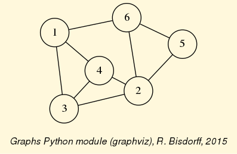

    The default permutation graph

By using color sorting queues, the minimal vertex coloring for a permutation graph is computable in :math:`O(n log(n))` (see [GOL-2004]_).

.. code-block:: pycon
   :linenos:

   >>> g.computeMinimalVertexColoring(Comments=True)
    vertex 1: lightcoral
    vertex 2: lightcoral
    vertex 3: lightblue
    vertex 4: gold
    vertex 5: lightblue
    vertex 6: gold
   >>> g.exportGraphViz(fileName='coloredPermutationGraph',\
   ...                  WithVertexColoring=True) 
    *---- exporting a dot file for GraphViz tools ---------*
    Exporting to coloredPermutationGraph.dot
    fdp -Tpng coloredPermutationGraph.dot -o coloredPermutationGraph.png

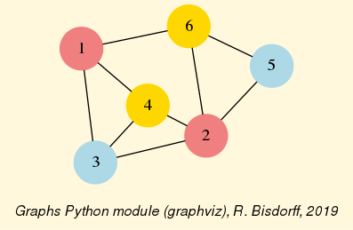
	    
    Minimal vertex coloring of the permutation graph

The correspondingly colored **matching diagram** of the nine **inversions** -the actual *edges* of the permutation graph-, which are induced by the given permutation [4, 3, 6, 1, 5, 2], may as well be drawn with the graphviz *neato* layout and explicitly positioned horizontal lists of vertices (see :numref:`perm_permutationGraph`).

.. code-block:: pycon

   >>> g.exportPermutationGraphViz(WithEdgeColoring=True)
    *---- exporting a dot file for GraphViz tools ---------*
    Exporting to perm_permutationGraph.dot
    neato -n -Tpng perm_permutationGraph.dot -o perm_permutationGraph.png

.. figure:: perm_permutationGraph.png
    :name: perm_permutationGraph
    :alt: The inversions of the permutation [4, 3, 6, 1, 5, 2]
    :width: 400 px
    :align: center

    Colored matching diagram of the permutation [4, 3, 6, 1, 5, 2]

As mentioned before, a permutation graph and its dual are **transitively orientable**. The :py:func:`graphs.PermutationGraph.transitiveOrientation` method constructs from a given permutation graph a digraph where each edge of the permutation graph is converted into an arc oriented in increasing alphabetic order of the adjacent vertices' keys (see [GOL-2004]_). This orientation of the edges of a permutation graph is always transitive and delivers a *transitive ordering* of the vertices.
    
.. code-block:: pycon

   >>> dg = g.transitiveOrientation()
   >>> dg
    *------- Digraph instance description ------*
    Instance class   : TransitiveDigraph
    Instance name    : oriented_permutationGraph
    Digraph Order      : 6
    Digraph Size       : 9
    Valuation domain : [-1.00; 1.00]
    Determinateness  : 100.000
    Attributes       : ['name', 'order', 'actions', 'valuationdomain',
			'relation', 'gamma', 'notGamma', 'size']
   >>> print('Transitivity degree: %.3f' % dg.computeTransitivityDegree() ) 
    Transitivity degree: 1.000
   >>> dg.exportGraphViz()
    *---- exporting a dot file for GraphViz tools ---------*
    Exporting to oriented_permutationGraph.dot
    0 { rank = same; 1; 2; }
    1 { rank = same; 5; 3; }
    2 { rank = same; 4; 6; }
    dot -Grankdir=TB -Tpng oriented_permutationGraph.dot -o oriented_permutationGraph.png

.. figure:: oriented_permutationGraph.png
    :alt: Hasse diagram of the orientationofof a permutation graph
    :width: 200 px
    :align: center
	    
    Hasse diagram of the transitive orientation of the permutation graph

The dual of a permutation graph is *again* a permutation graph and as such also transitively orientable.

.. code-block:: pycon

   >>> dgd = (-g).transitiveOrientation()
   >>> print('Dual transitivity degree: %.3f' %\
   ...             dgd.computeTransitivityDegree() ) 
    Dual transitivity degree: 1.000

Recognizing permutation graphs
..............................

Now, a given graph *g* is a **permutation** graph **if and only if** both *g* **and** *-g* are *transitively orientable*. This  property gives a polynomial test procedure (in :math:`O(n^3)` due to the transitivity check) for recognizing permutation graphs.

Let us consider, for instance, the following random graph of *order* 8 generated with an *edge probability* of 40% and a *random seed* equal to 4335.

.. code-block:: pycon

   >>> from graphs import *
   >>> g = RandomGraph(order=8,edgeProbability=0.4,seed=4335)
   >>> g
    *------- Graph instance description ------*
    Instance class   : RandomGraph
    Instance name    : randomGraph
    Seed             : 4335
    Edge probability : 0.4
    Graph Order      : 8
    Graph Size       : 10
    Valuation domain : [-1.00; 1.00]
    Attributes       : ['name', 'order', 'vertices', 'valuationDomain',
                        'seed', 'edges', 'size',
			'gamma', 'edgeProbability']
   >>> g.isPerfectGraph()
    True
   >>> g.exportGraphViz()
		    
.. Figure:: randomGraph4335.png
    :name: randomGraph4335
    :alt: Random graph
    :width: 400 px
    :align: center

    Random graph of order 8 generated with edge probability 0.4

If the random perfect graph instance *g* (see :numref:`randomGraph4335`) is indeed a permutation graph, *g* and its dual *-g* should be *transitively orientable*, i.e. **comparability graphs** (see [GOL-2004]_). With the :py:func:`graphs.Graph.isComparabilityGraph` test, we may easily check this fact. This method proceeds indeed by trying to construct a transitive neighbourhood decomposition of a given graph instance and, if successful, stores the resulting edge orientations into a *self.edgeOrientations* attribute (see [GOL-2004]_ p.129-132).

.. code-block:: pycon
   :linenos:

   >>> if g.isComparabilityGraph():
   ...     print(g.edgeOrientations)
    {('v1', 'v1'): 0, ('v1', 'v2'): 1, ('v2', 'v1'): -1, ('v1', 'v3'): 1,
     ('v3', 'v1'): -1, ('v1', 'v4'): 1, ('v4', 'v1'): -1, ('v1', 'v5'): 0,
     ('v5', 'v1'): 0, ('v1', 'v6'): 1, ('v6', 'v1'): -1, ('v1', 'v7'): 0,
     ('v7', 'v1'): 0, ('v1', 'v8'): 1, ('v8', 'v1'): -1, ('v2', 'v2'): 0,
     ('v2', 'v3'): 0, ('v3', 'v2'): 0, ('v2', 'v4'): 0, ('v4', 'v2'): 0,
     ('v2', 'v5'): 0, ('v5', 'v2'): 0, ('v2', 'v6'): 0, ('v6', 'v2'): 0,
     ('v2', 'v7'): 0, ('v7', 'v2'): 0, ('v2', 'v8'): 0, ('v8', 'v2'): 0,
     ('v3', 'v3'): 0, ('v3', 'v4'): 0, ('v4', 'v3'): 0, ('v3', 'v5'): 0,
     ('v5', 'v3'): 0, ('v3', 'v6'): 0, ('v6', 'v3'): 0, ('v3', 'v7'): 0,
     ('v7', 'v3'): 0, ('v3', 'v8'): 0, ('v8', 'v3'): 0, ('v4', 'v4'): 0,
     ('v4', 'v5'): 0, ('v5', 'v4'): 0, ('v4', 'v6'): 0, ('v6', 'v4'): 0,
     ('v4', 'v7'): 0, ('v7', 'v4'): 0, ('v4', 'v8'): 0, ('v8', 'v4'): 0,
     ('v5', 'v5'): 0, ('v5', 'v6'): 1, ('v6', 'v5'): -1, ('v5', 'v7'): 1,
     ('v7', 'v5'): -1, ('v5', 'v8'): 1, ('v8', 'v5'): -1, ('v6', 'v6'): 0,
     ('v6', 'v7'): 0, ('v7', 'v6'): 0, ('v6', 'v8'): 1, ('v8', 'v6'): -1,
     ('v7', 'v7'): 0, ('v7', 'v8'): 1, ('v8', 'v7'): -1, ('v8', 'v8'): 0}

.. Figure:: transOrientGraph.png
    :name: transOrientGraph
    :alt: transitive orientation of a graph
    :width: 400 px
    :align: center
	    
    Transitive neighbourhoods of the graph *g*

The resulting orientation of the edges of *g* (see :numref:`transOrientGraph`) is indeed transitive. The same procedure applied to the dual graph *gd = -g* gives a transitive orientation to the edges of *-g*.

.. code-block:: pycon
   :linenos:

   >>> gd = -g
   >>> if gd.isComparabilityGraph():
   ...     print(gd.edgeOrientations)
    {('v1', 'v1'): 0, ('v1', 'v2'): 0, ('v2', 'v1'): 0, ('v1', 'v3'): 0,
     ('v3', 'v1'): 0, ('v1', 'v4'): 0, ('v4', 'v1'): 0, ('v1', 'v5'): 1,
     ('v5', 'v1'): -1, ('v1', 'v6'): 0, ('v6', 'v1'): 0, ('v1', 'v7'): 1,
     ('v7', 'v1'): -1, ('v1', 'v8'): 0, ('v8', 'v1'): 0, ('v2', 'v2'): 0,
     ('v2', 'v3'): -2, ('v3', 'v2'): 2, ('v2', 'v4'): -3, ('v4', 'v2'): 3,
     ('v2', 'v5'): 1, ('v5', 'v2'): -1, ('v2', 'v6'): 1, ('v6', 'v2'): -1,
     ('v2', 'v7'): 1, ('v7', 'v2'): -1, ('v2', 'v8'): 1, ('v8', 'v2'): -1,
     ('v3', 'v3'): 0, ('v3', 'v4'): -3, ('v4', 'v3'): 3, ('v3', 'v5'): 1,
     ('v5', 'v3'): -1, ('v3', 'v6'): 1, ('v6', 'v3'): -1, ('v3', 'v7'): 1,
     ('v7', 'v3'): -1, ('v3', 'v8'): 1, ('v8', 'v3'): -1, ('v4', 'v4'): 0,
     ('v4', 'v5'): 1, ('v5', 'v4'): -1, ('v4', 'v6'): 1, ('v6', 'v4'): -1,
     ('v4', 'v7'): 1, ('v7', 'v4'): -1, ('v4', 'v8'): 1, ('v8', 'v4'): -1,
     ('v5', 'v5'): 0, ('v5', 'v6'): 0, ('v6', 'v5'): 0, ('v5', 'v7'): 0,
     ('v7', 'v5'): 0, ('v5', 'v8'): 0, ('v8', 'v5'): 0, ('v6', 'v6'): 0,
     ('v6', 'v7'): 1, ('v7', 'v6'): -1, ('v6', 'v8'): 0, ('v8', 'v6'): 0,
     ('v7', 'v7'): 0, ('v7', 'v8'): 0, ('v8', 'v7'): 0, ('v8', 'v8'): 0}

.. Figure:: transOrientDualGraph.png
    :name: transOrientDualGraph
    :alt: transitive orientation of the dual graph
    :width: 400 px
    :align: center
	    
    Transitive neighbourhoods of the dual graph *-g*
 
It is worthwhile noticing that the orientation of *g* is achieved with a *single neighbourhood* decomposition, covering all the vertices. Whereas, the orientation of the dual *-g* needs a decomposition into *three subsequent neighbourhoods* marked in black, red and blue (see :numref:`transOrientDualGraph`).

Let us recheck these facts by explicitly constructing transitively oriented digraph instances with the :py:func:`graphs.Graph.computeTransitivelyOrientedDigraph` method. 

.. code-block:: pycon

   >>> og = g.computeTransitivelyOrientedDigraph(PartiallyDetermined=True)
   >>> print('Transitivity degree: %.3f' % (og.transitivityDegree)) 
    Transitivity degree: 1.000
   >>> ogd = (-g).computeTransitivelyOrientedDigraph(PartiallyDetermined=True)
   >>> print('Transitivity degree: %.3f' % (ogd.transitivityDegree)) 
    Transitivity degree: 1.000

The :code:`PartiallyDetermined=True` flag (see Lines 1 and 5) is required here in order to orient *only* the actual edges of the graphs. Relations between vertices not linked by an edge will be put to the *indeterminate* characteristic value 0. This will allow us to compute, later on, convenient *disjunctive digraph fusions*.

As both graphs are indeed *transitively orientable* (see Lines 3 and 6 above), we may conclude that the given random graph *g* is actually a *permutation graph* instance. Yet, we still need to find now its corresponding *permutation*. We therefore implement a recipee given by Martin Golumbic [GOL-2004]_ p.159.

We will first **fuse** both *og* and *ogd* orientations above with an **epistemic disjunction** (see the :py:func:`digraphsTools.omax` operator), hence, the partially determined orientations requested above.

.. code-block:: pycon

   >>> from digraphs import FusionDigraph
   >>> f1 = FusionDigraph(og,ogd,operator='o-max')
   >>> s1 = f1.computeCopelandRanking()
   >>> print(s1)
    ['v5', 'v7', 'v1', 'v6', 'v8', 'v4', 'v3', 'v2']

We obtain by the *Copeland* ranking rule (see :ref:`Ranking-Tutorial-label` and the :py:func:`digraphs.Digraph.computeCopelandRanking` method) a linear ordering of the vertices (see Line 5 above).

We reverse now the orientation of the edges in *og* (see *-og* in Line 1 below) in order to generate, again by *disjunctive fusion*, the *inversions* that are produced by the permutation we are looking for. Computing again a ranking with the *Copeland* rule, will show the correspondingly permuted list of vertices (see Line 4 below).

.. code-block:: pycon

   >>> f2 = FusionDigraph((-og),ogd,operator='o-max')
   >>> s2 = f2.computeCopelandRanking()
   >>> print(s2)
    ['v8', 'v7', 'v6', 'v5', 'v4', 'v3', 'v2', 'v1']

Vertex *v8* is put from position 5 to position 1, vertex *v7* is put from position 2 to position 2, vertex *v6* from position 4 to position 3, 'vertex *v5* from position 1 to position 4, etc ... . We generate these position swaps for all vertices and obtain thus the required permutation (see Line 5 below).

.. code-block:: pycon

   >>> permutation = [0 for j in range(g.order)]
   >>> for j in range(g.order):
   ...     permutation[s2.index(s1[j])] = j+1
   >>> print(permutation)
    [5, 2, 4, 1, 6, 7, 8, 3]

It is worthwhile noticing by the way that *transitive orientations* of a given graph and its dual are usually **not unique** and, so may also be the resulting permutations. However, they all correspond to isomorphic graphs (see [GOL-2004]_). In our case here, we observe two different permutations and their reverses::

    s1: ['v1', 'v4', 'v3', 'v2', 'v5', 'v6', 'v7', 'v8']
    s2: ['v4', 'v3', 'v2', 'v8', 'v6', 'v1', 'v7', 'v5']
    (s1 -> s2): [2, 3, 4, 8, 6, 1, 7, 5]
    (s2 -> s1): [6, 1, 2, 3, 8, 5, 7, 4]

And::
  
    s3: ['v5', 'v7', 'v1', 'v6', 'v8', 'v4', 'v3', 'v2']
    s4: ['v8', 'v7', 'v6', 'v5', 'v4', 'v3', 'v2', 'v1']
    (s3 -> s4): [5, 2, 4, 1, 6, 7, 8, 3]
    (s4 -> s3) = [4, 2, 8, 3, 1, 5, 6, 7]

The :py:func:`graphs.Graph.computePermutation` method does directly operate all these steps: - computing transitive orientations, - ranking their epistemic fusion and, - delivering a corresponding permutation.

.. code-block:: pycon

   >>> g.computePermutation(Comments=True)
    ['v1', 'v2', 'v3', 'v4', 'v5', 'v6', 'v7', 'v8']
    ['v2', 'v3', 'v4', 'v8', 'v6', 'v1', 'v7', 'v5']
    [2, 3, 4, 8, 6, 1, 7, 5]

We may finally check that, for instance, the two permutations [2, 3, 4, 8, 6, 1, 7, 5] and [4, 2, 8, 3, 1, 5, 6, 7] observed above, will correctly generate corresponding *isomorphic permutation* graphs.

.. code-block:: pycon

   >>> gtesta = PermutationGraph(permutation=[2, 3, 4, 8, 6, 1, 7, 5])
   >>> gtestb = PermutationGraph(permutation=[4, 2, 8, 3, 1, 5, 6, 7])
   >>> gtesta.exportGraphViz('gtesta')
   >>> gtestb.exportGraphViz('gtestb')

.. Figure:: isomorphicPerms.png
    :alt: Isomorphic permutation graphs
    :name: isomorphicPermGraphs
    :width: 700 px
    :align: center

    Isomorphic permutation graphs

And, we recover indeed two *isomorphic copies* of the original random graph (compare :numref:`isomorphicPermGraphs` with :numref:`randomGraph4335`).

Back to :ref:`Content Table <Tutorial-label>`

.. _Trees-Tutorial-label:

On tree graphs and graph forests
--------------------------------

.. contents:: 
	:depth: 2
	:local:

Generating random tree graphs
.............................

Using the :py:class:`graphs.RandomTree` class, we may, for instance, generate a random tree graph with 9 vertices.

.. code-block:: pycon

   >>> t = RandomTree(order=9,seed=100)
   >>> t
    *------- Graph instance description ------*
    Instance class   : RandomTree
    Instance name    : randomTree
    Graph Order      : 9
    Graph Size       : 8
    Valuation domain : [-1.00; 1.00]
    Attributes       : ['name', 'order', 'vertices', 'valuationDomain',
			'edges', 'prueferCode', 'size', 'gamma']
    *---- RandomTree specific data ----*
    Prfer code  : ['v3', 'v8', 'v8', 'v3', 'v7', 'v6', 'v7']
   >>> t.exportGraphViz('tutRandomTree')
    *---- exporting a dot file for GraphViz tools ---------*
    Exporting to tutRandomTree.dot
    neato -Tpng tutRandomTree.dot -o tutRandomTree.png

.. Figure:: tutRandomTree.png
    :alt: Random tree instance
    :width: 300 px
    :align: center

    Random Tree instance of order 9

A tree graph of order *n* contains *n-1* edges (see Line 8 and 9) and we may distinguish vertices like *v1*, *v2*, *v4*, *v5* or *v9*  of degree 1, called the **leaves** of the tree, and vertices like *v3*, *v6*, *v7* or *v8* of degree 2 or more, called the **nodes** of the tree.

The structure of a tree of order :math:`n > 2` is entirely characterised by a corresponding *Prfer* **code** -i.e. a *list of vertices keys*- of length *n-2*. See, for instance in Line 12 the code ['v3', 'v8', 'v8', 'v3', 'v7', 'v6', 'v7'] corresponding to our sample tree graph *t*.

Each position of the code indicates the parent of the remaining leaf with the smallest vertex label. Vertex *v3* is thus the parent of *v1* and we drop leaf *v1*, *v8* is now the parent of leaf *v2* and we drop *v2*, vertex *v8* is again the parent of leaf *v4* and we drop *v4*, vertex *v3* is the parent of leaf *v5* and we drop *v5*, *v7* is now the parent of leaf *v3* and we may drop *v3*, *v6* becomes the parent of leaf *v8* and we drop *v8*, *v7* becomes now the parent of leaf *v6* and we may drop *v6*. The two eventually remaining vertices, *v7* and *v9*, give the last link in the reconstructed tree (see [BAR-1991]_).  

It is as well possible to first, generate a random *Prfer* code of length *n-2* from a set of *n* vertices and then, construct the corresponding tree of order *n* by reversing the procedure illustrated above (see [BAR-1991]_).

.. code-block:: pycon

   >>> verticesList = ['v1','v2','v3','v4','v5','v6','v7']
   >>> n = len(verticesList)
   >>> from random import seed, choice
   >>> seed(101)
   >>> code = []
   >>> for k in range(n-2):
   ...     code.append( choice(verticesList) )
   >>> print(code)
    ['v5', 'v7', 'v2', 'v5', 'v3']
   >>> t = RandomTree(prueferCode=['v5', 'v7', 'v2', 'v5', 'v3'])
   >>> t
    *------- Graph instance description ------*
    Instance class   : RandomTree
    Instance name    : randomTree
    Graph Order      : 7
    Graph Size       : 6
    Valuation domain : [-1.00; 1.00]
    Attributes       : ['name', 'order', 'vertices', 'valuationDomain',
			'edges', 'prueferCode', 'size', 'gamma']
    *---- RandomTree specific data ----*
    Prfer code  : ['v5', 'v7', 'v2', 'v5', 'v3']
   >>> t.exportGraphViz('tutPruefTree')
    *---- exporting a dot file for GraphViz tools ---------*
    Exporting to tutPruefTree.dot
    neato -Tpng tutPruefTree.dot -o tutPruefTree.png

.. Figure:: tutPruefTree.png
    :alt: Tree instance from a random Prfer code
    :width: 350 px
    :align: center

    Tree instance from a random Prfer code

Following from the bijection between a labelled tree and its *Prfer* code, we actually know that there exist :math:`n^{n-2}` different tree graphs with the same *n* vertices.

Given a genuine graph, how can we recognize that it is in fact a tree instance ?

Recognizing tree graphs
.......................

Given a graph *g* of order *n* and size *s*, the following 5 assertions *A1*, *A2*, *A3*, *A4* and *A5* are all equivalent (see [BAR-1991]_):

    - *A1*: *g* is a tree;
    - *A2*: *g* is without (chordless) cycles and :math:`n \,=\, s + 1`;
    - *A3*: *g* is connected and :math:`n \,=\, s + 1`;
    - *A4*: Any two vertices of *g* are always connected by a *unique path*;
    - *A5*: *g* is connected and *dropping* any single edge will always disconnect *g*.

Assertion *A3*, for instance, gives a simple test for recognizing a tree graph. In case of a *lazy evaluation* of the test in Line 3 below, it is opportune, from a computational complexity perspective, to first, check the order and size of the graph, before checking its potential connectedness.

.. code-block:: pycon

   >>> from graphs import RandomGraph
   >>> g = RandomGraph(order=6,edgeProbability=0.3,seed=62)
   >>> if g.order == (g.size +1) and g.isConnected():
   ...     print('The graph is a tree ?', True)
   ... else:
   ...     print('The graph is a tree ?',False)
    The graph is a tree ? True

The random graph of order 6 and edge probability 30%, generated with seed 62, is actually a tree graph instance, as we may readily confirm from its *graphviz* drawing in :numref:`test62Tree` (see also the :py:func:`graphs.Graph.isTree` method for an implemented alternative test).

>>> g.exportGraphViz(
*---- exporting a dot file for GraphViz tools ---------*
Exporting to test62.dot
fdp -Tpng test62.dot -o test62.png

.. Figure:: test62.png
    :name: test62Tree
    :alt: Recognizing a tree
    :width: 350 px
    :align: center

    Recognizing a tree instance

Yet, we still have to recover its corresponding *Prfer* code. Therefore, we may use the :py:func:`graphs.RandomTree.tree2Pruefer` method.

>>> from graphs import RandomTree
>>> RandomTree.tree2Pruefer(g)
['v6', 'v1', 'v2', 'v1', 'v2', 'v5']

Let us now turn toward a major application of tree graphs, namely *spanning trees* and *forests* related to graph traversals.

Spanning trees and forests
..........................

With the :py:class:`graphs.RandomSpanningTree` class we may generate, from a given **connected** graph *g* instance, **uniform random** instances of a **spanning tree** by using *Wilson*'s algorithm [WIL-1996]_  

.. Note::

         Wilson's algorithm *only* works for connected graphs [4]_.

.. code-block:: pycon

   >>> from graphs import *
   >>> g = RandomGraph(order=9,edgeProbability=0.4,seed=100)
   >>> spt = RandomSpanningTree(g)
   >>> spt
    *------- Graph instance description ------*
    Instance class   : RandomSpanningTree
    Instance name    : randomGraph_randomSpanningTree
    Graph Order      : 9
    Graph Size       : 8
    Valuation domain : [-1.00; 1.00]
    Attributes       : ['name','vertices','order','valuationDomain',
                        'edges','size','gamma','dfs','date',
			'dfsx','prueferCode']
    *---- RandomTree specific data ----*
    Prfer code  : ['v7', 'v9', 'v5', 'v1', 'v8', 'v4', 'v9']
   >>> spt.exportGraphViz(fileName='randomSpanningTree',\
    ...                    WithSpanningTree=True)
    *---- exporting a dot file for GraphViz tools ---------*
    Exporting to randomSpanningTree.dot
    [['v1', 'v5', 'v6', 'v5', 'v1', 'v8', 'v9', 'v3', 'v9', 'v4',
      'v7', 'v2', 'v7', 'v4', 'v9', 'v8', 'v1']]
    neato -Tpng randomSpanningTree.dot -o randomSpanningTree.png

.. figure:: randomSpanningTree.png
     :alt: randomSpanningTree instance
     :width: 300 px
     :align: center

     Random spanning tree

More general, and in case of a not connected graph, we may generate with the :py:class:`graphs.RandomSpanningForest` class a *not necessarily uniform* random instance of a **spanning forest** -one or more random tree graphs- generated from a **random depth first search** of the graph components' traversals.

.. code-block:: pycon
   :linenos:

   >>> g = RandomGraph(order=15,edgeProbability=0.1,seed=140)
   >>> g.computeComponents()
    [{'v12', 'v01', 'v13'}, {'v02', 'v06'},
     {'v08', 'v03', 'v07'}, {'v15', 'v11', 'v10', 'v04', 'v05'},
     {'v09', 'v14'}]
   >>> spf = RandomSpanningForest(g,seed=100)
   >>> spf.exportGraphViz(fileName='spanningForest',WithSpanningTree=True)
    *---- exporting a dot file for GraphViz tools ---------*
    Exporting to spanningForest.dot
    [['v03', 'v07', 'v08', 'v07', 'v03'],
     ['v13', 'v12', 'v13', 'v01', 'v13'],
     ['v02', 'v06', 'v02'],
     ['v15', 'v11', 'v04', 'v11', 'v15', 'v10', 'v05', 'v10', 'v15'],
     ['v09', 'v14', 'v09']]
    neato -Tpng spanningForest.dot -o spanningForest.png

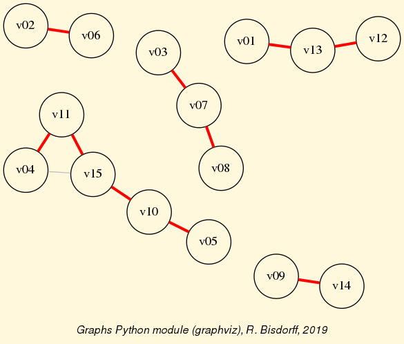

     Random spanning forest instance

Maximum determined spanning forests
...................................

In case of valued graphs supporting weighted edges, we may finally construct a **most determined** spanning tree (or forest if not connected) using *Kruskal*'s *greedy* **minimum-spanning-tree algorithm** [5]_ on the *dual* valuation of the graph [KRU-1956]_.

We consider, for instance, a randomly valued graph with five vertices and seven edges bipolar-valued in [-1.0; 1.0]. 

.. code-block:: pycon

   >>> from graphs import *
   >>> g = RandomValuationGraph(seed=2)
   >>> print(g)
    *------- Graph instance description ------*
    Instance class   : RandomValuationGraph
    Instance name    : randomGraph
    Graph Order      : 5
    Graph Size       : 7
    Valuation domain : [-1.00; 1.00]
    Attributes       : ['name', 'order', 'vertices', 'valuationDomain',
			'edges', 'size', 'gamma']

To inspect the edges' actual weights, we first transform the graph into a corresponding digraph (see Line 1 below) and use the :py:func:`digraphs.Digraph.showRelationTable` method (see Line 2 below) for printing its **symmetric adjacency matrix**. 

.. code-block:: pycon
   :linenos:

   >>> dg = g.graph2Digraph()
   >>> dg.showRelationTable()
    * ---- Relation Table -----
      S   |  'v1'	  'v2'	  'v3'	  'v4'	  'v5'	  
    ------|-------------------------------------------
     'v1' |  0.00	 0.91	 0.90	 -0.89	 -0.83	 
     'v2' |  0.91	 0.00	 0.67	  0.47	  0.34	 
     'v3' |  0.90	 0.67	 0.00	 -0.38	  0.21	 
     'v4' | -0.89	 0.47	-0.38	  0.00	  0.21	 
     'v5' | -0.83	 0.34	 0.21	  0.21	  0.00	 
    Valuation domain: [-1.00;1.00]

To compute the most determined spanning tree or forest, we may use the :py:class:`graphs.BestDeterminedSpanningForest` class constructor.

.. code-block:: pycon

   >>> mt = BestDeterminedSpanningForest(g)
   >>> print(mt)
    *------- Graph instance description ------*
    Instance class   : BestDeterminedSpanningForest
    Instance name    : randomGraph_randomSpanningForest
    Graph Order      : 5
    Graph Size       : 4
    Valuation domain : [-1.00; 1.00]
    Attributes       : ['name','vertices','order','valuationDomain',
                        'edges','size','gamma','dfs',
			'date', 'averageTreeDetermination']
    *---- best determined spanning tree specific data ----*
    Depth first search path(s) :
    [['v1', 'v2', 'v4', 'v2', 'v5', 'v2', 'v1', 'v3', 'v1']]
    Average determination(s) : [Decimal('0.655')]

The given graph is connected and, hence, admits a single spanning tree (see :numref:`bestDeterminedSpanningTree`) of **maximum mean determination** = (0.47 + 0.91 + 0.90 + 0.34)/4 = **0.655** (see Lines 9, 6 and 10 in the relation table above).

.. code-block:: pycon
   :linenos:

   >>> mt.exportGraphViz(fileName='bestDeterminedspanningTree',\
   ...                   WithSpanningTree=True)
    *---- exporting a dot file for GraphViz tools ---------*
    Exporting to spanningTree.dot
    [['v4', 'v2', 'v1', 'v3', 'v1', 'v2', 'v5', 'v2', 'v4']]
    neato -Tpng bestDeterminedSpanningTree.dot -o bestDeterminedSpanningTree.png

.. Figure:: bestDeterminedSpanningTree.png
   :name: bestDeterminedSpanningTree
   :alt: Best determined spanning tree
   :width: 350 px
   :align: center

   Best determined spanning tree

One may easily verify that all other potential spanning trees, including instead the edges {*v3*, *v5*} and/or {*v4*, *v5*} - will show a lower average determination.

Back to :ref:`Content Table <Tutorial-label>`
	   	  
Bibliography
------------

.. [CPSTAT-L5] Bisdorff R. (2017) "Simulating from abitrary empirical random distributions". MICS *Computational Statistics* course, Lecture 5. FSTC/ILIAS University of Luxembourg, Winter Semester 2017 (see http://hdl.handle.net/10993/37933).

.. [BIS-2016] Bisdorff R. (2016). "Computing linear rankings from trillions of pairwise outranking situations". In Proceedings of DA2PL'2016 *From Multiple Criteria Decision Aid to Preference Learning*, R. Busa-Fekete, E. Hllermeier, V. Mousseau and K. Pfannschmidt (Eds.), University of Paderborn (Germany), Nov. 7-8 2016: 1-6 (downloadable `PDF file 451.4 kB <http://hdl.handle.net/10993/28613>`_)
	      
.. [BIS-2015] Bisdorff R. (2015). "The EURO 2004 Best Poster Award: Choosing the Best Poster in a Scientific Conference". Chapter 5 in R. Bisdorff, L. Dias, P. Meyer, V. Mousseau, and M. Pirlot (Eds.), *Evaluation and Decision Models with Multiple Criteria: Case Studies.* Springer-Verlag Berlin Heidelberg, International Handbooks on Information Systems, DOI 10.1007/978-3-662-46816-6_1, pp. 117-166 (downloadable `PDF file 754.7 kB <http://hdl.handle.net/10993/23714>`_).
	      
.. [ADT-L2] Bisdorff R. (2014)  "Who wins the election?" MICS *Algorithmic Decision Theory* course, Lecture 2. FSTC/ILIAS University of Luxembourg, Summer Semester 2014 ( see http://hdl.handle.net/10993/37933).

.. [ADT-L7] Bisdorff R.(2014)  "Best multiple criteria choice: the Rubis outranking method". MICS *Algorithmic Decision Theory* course, Lecture 7. FSTC/ILIAS University of Luxembourg, Summer Semester 2014 (see http://hdl.handle.net/10993/37933).

.. [BIS-2013] Bisdorff R. (2013) "On Polarizing Outranking Relations with Large Performance Differences" *Journal of Multi-Criteria Decision Analysis* (Wiley) **20**:3-12 (downloadable preprint `PDF file 403.5 Kb <http://hdl.handle.net/10993/245>`_).

.. [BIS-2012] Bisdorff R. (2012). "On measuring and testing the ordinal correlation between bipolar outranking relations". In Proceedings of DA2PL2012 *From Multiple Criteria Decision Aid to Preference Learning*, University of Mons 91-100. (downloadable preliminary version `PDF file 408.5 kB <http://hdl.handle.net/10993/23909>`_ ).

.. [DIA-2010] Dias L.C. and Lamboray C. (2010). "Extensions of the prudence principle to exploit a valued outranking relation". *European Journal of Operational Research* Volume 201 Number 3 pp. 828-837.

.. [LAM-2009] Lamboray C. (2009) "A prudent characterization of the Ranked Pairs Rule". *Social Choice and Welfare* 32 pp. 129-155.

.. [BIS-2008] Bisdorff R., Meyer P. and Roubens M.(2008) "RUBIS: a bipolar-valued outranking method for the choice problem". 4OR, *A Quarterly Journal of Operations Research* Springer-Verlag, Volume 6,  Number 2 pp. 143-165. (Online) Electronic version: DOI: 10.1007/s10288-007-0045-5 (downloadable preliminary version `PDF file 271.5Kb <http://hdl.handle.net/10993/23716>`_).

.. [ISOMIS-08] Bisdorff R. and Marichal J.-L. (2008). "Counting non-isomorphic maximal independent sets of the n-cycle graph". *Journal of Integer Sequences*, Vol. 11 Article 08.5.7 (`openly accessible here <https://cs.uwaterloo.ca/journals/JIS/VOL11/Marichal/marichal.html>`_).

.. [NR3-2007] Press W.H., Teukolsky S.A., Vetterling W.T. and Flannery B.P. (2007) "Single-Pass Estimation of Arbitrary Quantiles" Section 5.8.2 in *Numerical Recipes: The Art of Scientific Computing 3rd Ed.*, Cambridge University Press, pp 435-438.

.. [CHAM-2006] Chambers J.M., James D.A., Lambert D. and Vander Wiel S. (2006) "Monitoring Networked Applications with Incremental Quantile Estimation". *Statistical Science*, Vol. 21, No.4, pp.463-475. DOI: 10 12140/088342306000000583.

.. [BIS-2006a] Bisdorff R., Pirlot M. and Roubens M. (2006). "Choices and kernels from bipolar valued digraphs". *European Journal of Operational Research*, 175 (2006) 155-170. (Online) Electronic version: DOI:10.1016/j.ejor.2005.05.004 (downloadable preliminary version `PDF file 257.3Kb <http://hdl.handle.net/10993/23720>`_).

.. [BIS-2006b] Bisdorff R. (2006). "On enumerating the kernels in a bipolar-valued digraph". Annales du Lamsade 6, Octobre 2006, pp. 1 - 38. Universit Paris-Dauphine. ISSN 1762-455X (downloadable version `PDF file 532.2 Kb <http://hdl.handle.net/10993/38741>`_).

.. [BIS-2004] Bisdorff R. (2004) "On a natural fuzzification of Boolean logic". In Erich Peter Klement and Endre Pap (editors), Proceedings of the 25th Linz Seminar on *Fuzzy Set Theory, Mathematics of Fuzzy Systems*. Bildungszentrum St. Magdalena, Linz (Austria), February 2004. pp. 20-26 (PDF file (133.4 Kb) for `downloading <http://hdl.handle.net/10993/38740>`_)

.. [GOL-2004] Golumbic M.Ch. (2004), *Agorithmic Graph Theory and Perfect Graphs* 2nd Ed., Annals of Discrete Mathematics 57, Elsevier.

.. [FMCAA] Hggstrm O. (2002) *Finite Markov Chains and Algorithmic Applications*. Cambridge University Press.

.. [BIS-2000] Bisdorff R. (2000), "Logical foundation of fuzzy preferential systems with application to the ELECTRE decision aid methods", *Computers and Operations Research*, 27:673-687 (downloadable version `PDF file 159.1Kb <http://hdl.handle.net/10993/23724>`_).

.. [BIS-1999] Bisdorff R. (1999), "Bipolar ranking from pairwise fuzzy outrankings", JORBEL *Belgian Journal of Operations Research, Statistics and Computer Science*, Vol. 37 (4) 97 379-387. (PDF file (351.7 Kb) `for downloading <http://hdl.handle.net/10993/38738>`_)

.. [WIL-1996] Wilson D.B. (1996), *Generating random spanning trees more quickly than the cover time*, Proceedings of the Twenty-eighth Annual ACM *Symposium on the Theory of Computing* (Philadelphia, PA, 1996), 296-303, ACM, New York, 1996.

.. [BAR-1991] Barthlemy J.-P. and Guenoche A. (1991), *Trees and Proximities Representations*, Wiley, ISBN: 978-0471922636.

.. [KRU-1956] Kruskal J.B. (1956), *On the shortest spanning subtree of a graph and the traveling salesman problem*, Proceedings of the American Mathematical Society. 7: 4850.
	    

.. |location_link4| raw:: html

   <a href="https://orbilu.uni.lu/handle/10993/37933" target="_blank">on Algorithmic Decision Theory</a>

.. |location_linkLatex4| raw:: latex

   on \emph{Algorithmic Decision Theory} (https://orbilu.uni.lu/handle/10993/37933)

	      
.. only:: html

    Appendices
    ----------

    
.. only:: html
	  
    Documents
    .........
     
    * `Introduction <index.html>`_
    * `Reference manual <techDoc.html>`_
    * `Tutorial <tutorial.html>`_

.. only:: html

    Indices and tables
    ..................

    * :ref:`genindex`
    * :ref:`modindex`
    * :ref:`search`
	  

.. only:: html

    Footnotes
    .........

.. [1] The ``exportGraphViz`` method is depending on drawing tools from `graphviz <https://graphviz.org/>`_. On Linux Ubuntu or Debian you may try ``sudo apt-get install graphviz`` to install them. There are ready ``dmg`` installers for Mac OSX. 

.. [2] Dependency: The :py:func:`digraphs.Digraph.automorphismGenerators` method uses the shell :code:`dreadnaut` command from the nauty software package. See https://www3.cs.stonybrook.edu/~algorith/implement/nauty/implement.shtml . On Mac OS there exist dmg installers and on Ubuntu Linux or Debian, one may easily install it with :code:`...$ sudo apt-get install nauty`.

.. [3] The :code:`perrinMIS` shell command may be installed system wide with the command :code:`.../Digraph3$ make installPerrin` from the main Digraph3 directory. It is stored by default into :code:`</usr/local/bin/>`. This may be changed with the :code:`INSTALLDIR` flag. The command :code:`.../Digraph3$ make installPerrinUser` installs it instead without sudo into the user's private :code:`<$Home/.bin>` directory.

.. [4] *Wilson*'s algorithm uses *loop-erased random walks*. See https://en.wikipedia.org/wiki/Loop-erased_random_walk .

.. [5] *Kruskal*'s algorithm is a *minimum-spanning-tree* algorithm which finds an edge of the least possible weight that connects any two trees in the forest.  See https://en.wikipedia.org/wiki/Kruskal%27s_algorithm .

.. [6] See https://cython.org/

.. [7] See https://hpc.uni.lu/systems/iris/

.. [8] See https://hpc.uni.lu/systems/gaia/

.. [13] The class of *self-codual* bipolar-valued digraphs consists of all *weakly asymmetric* digraphs, i.e. digraphs containing only *asymmetric* and/or *indeterminate* links. Limit cases consists of, on the one side, *full tournaments* with *indeterminate reflexive links*, and, on the other side, *fully indeterminate* digraphs. In this class, the *converse* (inverse ~ ) operator is indeed identical to the *dual* (negation - ) one.

.. [14] Not to be confused with the *dual graph* of a plane graph *g* that has a vertex for each face of *g*. Here we mean the *less than* (strict converse) relation corresponding to a *greater or equal* relation, or the *less than or equal* relation corresponding to a (strict) *better than* relation.

.. [15] The concept of *Condorcet* winner -a generalization of absolute majority winners- proposed by *Condorcet* in 1785, is an early historical example of *initial* digraph kernel (see the tutorial :ref:`Kernel-Tutorial-label`).                
.. [16] Discrete random variables with a given empirical probability law (here the polls) are provided in the :py:mod:`randomNumbers` module by the :py:class:`randomNumbers.DiscreteRandomVariable` class.

..  LocalWords:  randomDigraph Determinateness valuationdomain py png
..  LocalWords:  notGamma tutorialDigraph shortName func irreflexive
..  LocalWords:  hasIntegerValuation showAll tutorialdigraph graphviz
..  LocalWords:  exportGraphViz GraphViz Grankdir BT Tpng outdegrees
..  LocalWords:  showStatistics determinateness indegrees outdegree
..  LocalWords:  indegree symdegrees neighbourhood CompleteDigraph dg
..  LocalWords:  EmptyDigraph GridDigraph hasMedianSplitOrientation
..  LocalWords:  tutorialGrid modelling randomDigraphs showShort xSy
..  LocalWords:  RandomValuationDigraph tutRandValDigraph px asymDg
..  LocalWords:  showRelationTable showNeighborhoods ReflexiveTerms
..  LocalWords:  randomValuationDigraph randomdomValuation symDG elif
..  LocalWords:  AsymmetricPartialDigraph SymmetricPartialDigraph CSV
..  LocalWords:  symDg asymSymParts constructRelation relationIn csv
..  LocalWords:  relationOut disjunction FusionDigraph codual saveCSV
..  LocalWords:  DualDigraph ConverseDigraph CoDualDigraph frozenset
..  LocalWords:  closeSymmetric closeTransitive strongComponents de
..  LocalWords:  StrongComponentsCollapsedDigraph votingProfiles pts
..  LocalWords:  LinearVotingProfile OrderedDict linearBallot Borda
..  LocalWords:  RandomLinearVotingProfile numberOfVoters candi XMCDA
..  LocalWords:  numberOfCandidates votersWeights showLinearBallots
..  LocalWords:  tutorialLinearVotingProfile computeUninominalVotes
..  LocalWords:  computeSimpleMajorityWinner computeRankAnalysis MCDA
..  LocalWords:  computeInstantRunoffWinner computeBordaScores favour
..  LocalWords:  computeBordaWinners showRankAnalysisTable chordless
..  LocalWords:  CondorcetDigraph computeChordlessCircuits quintiles
..  LocalWords:  outrankingDigraphs BipolarOutrankingDigraph quintile
..  LocalWords:  RandomBipolarOutrankingDigraph showActions quantiles
..  LocalWords:  RandomPerformanceTableau equisignificant colorLevels
..  LocalWords:  showCriteria showPerformanceTableau tutorialHeatmap
..  LocalWords:  showHTMLPerformanceTableau disfavour Recoding
..  LocalWords:  recoded coduality PerformanceTableau quantile
..  LocalWords:  showHTMLPerformanceHeatmap randomCBHeatmap saveXMCDA

.. raw:: latex

   \endgroup

